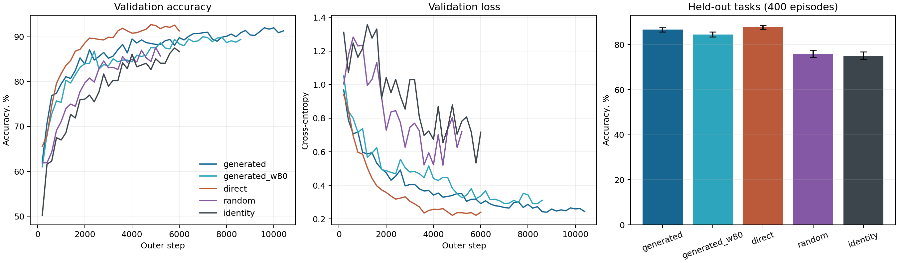

# Генератор общей U на Aug-Omniglot

Результаты после подбора настроек: [TUNING.md](TUNING.md). Ниже сохранён
первый запуск для сравнения.

**Вопрос.** Может ли генератор построить общую для множества задач матрицу U,
которая помогает быстро подстроить параметры v к новым символам? Сравнили его
с прямым обучением U и с фиксированными U. Роутера и MoE здесь нет.

**Что делает модель.** Для каждого из четырёх свёрточных слоёв получаем веса
`W` из параметров `v` и трёх матриц `U`, действующих на выходные каналы,
входные каналы и позиции фильтра 3×3. Генератор получает номер слоя, номер
матрицы и координаты её элемента; он возвращает элементы U. Он не получает
изображение, номер задачи или обучаемый латент `z`. Все U общие для задач.
Перед каждой новой задачей v и классификатор начинают с общих обученных
начальных значений; один или три шага по её размеченным примерам создают
**свои v именно для этой задачи**. Между задачами обучаются U или генератор,
а также начальные значения v и классификатора.

**Данные и проверка.** Официальные изображения Omniglot: 790 символов для
обучения, 174 для валидации, 659 из отдельного набора алфавитов для теста.
Задача содержит пять случайных символов, по одному исходному изображению
каждого для подстройки и по пять других изображений каждого для проверки.
Только проверочные изображения случайно обрезали, отражали и поворачивали
не более чем на 30°. Все варианты видели одни и те же задачи и преобразования.
Один seed 42; на тесте 400 новых задач. Состояние модели выбирали по
валидационной ошибке; если возле лимита шагов она ещё не выходила на плато,
обучение продолжали.

| Общая U | Параметры U / генератора | Лучший шаг | Точность на тесте ↑ | Ошибка на тесте ↓ |
|---|---:|---:|---:|---:|
| Прямое обучение U | 7 493 | 4 800 | **87,79%** | **0,335** |
| Генератор, ширина 64 | 4 993 | 8 800 | 86,66% | 0,395 |
| Генератор, ширина 80 | 7 521 | 7 000 | 84,50% | 0,485 |
| Фиксированная случайная U | 0 | 3 600 | 75,93% | 1,162 |
| Фиксированная единичная U | 0 | 5 800 | 75,11% | 1,362 |

**Вывод.** Генератор ширины 64 даёт **+10,73 процентного пункта** к
фиксированной случайной U и **+11,55 пункта** к единичной. Прямая обучаемая
U всё же лучше генератора на **1,13 пункта**. На одних и тех же 400 задачах
95% интервалы для этих разностей составляют соответственно **[9,33; 12,11]**,
**[9,97; 13,18]** и **[0,37; 1,84]** пункта. Расширение генератора до того
же числа параметров, что у прямой U, не помогло: точность упала до 84,50%.
Следовательно, в этой постановке общую U полезно обучать, а проверенный
генератор её частично находит, но преимущества перед прямой параметризацией
Кронекера **не показал**.

Интервалы описывают разброс **по тестовым задачам при одном seed**, а не
надёжность вывода по разным инициализациям. Это один режим 5-way 1-shot.
Наш генератор — координатная MLP для квадратных факторов U; это отдельная
реализация идеи Gψ, а не точная копия генераторов из прежних опытов.

**Настройки не оптимизировали.** Проверили одну внешнюю скорость обучения
`0,001`, один размер пакета задач `4` и только две ширины генератора.
Скорости подстройки v обучаются, но код ограничивает их интервалом
`[0,001; 1]`. В лучших состояниях обоих обучаемых U параметры скоростей
первых трёх свёрточных слоёв ушли ниже нижней границы, а четвёртого — выше
верхней; фактические скорости оказались на границах и их градиенты через
`clamp` равны нулю. Поэтому разрыв **1,13 пункта** относится к этим общим
настройкам и не доказывает, что хорошо настроенный генератор уступит прямой U.

Для масштаба: [Zhou, Knowles и Finn, MSR](https://arxiv.org/pdf/2007.02933)
сообщают **95,3 ± 0,3%** на Aug-Omniglot 5-way 1-shot. Их число нельзя
напрямую сопоставлять с таблицей: здесь другая разбивка алфавитов и
приближённая реализация аугментации, меньше задач на шаг и шагов обучения;
кроме того, классификатор подстраивается напрямую, без собственного U.

Код и воспроизведение — [README](README.md), численные результаты и парные
интервалы — [JSON](results/paired_comparison.json).
