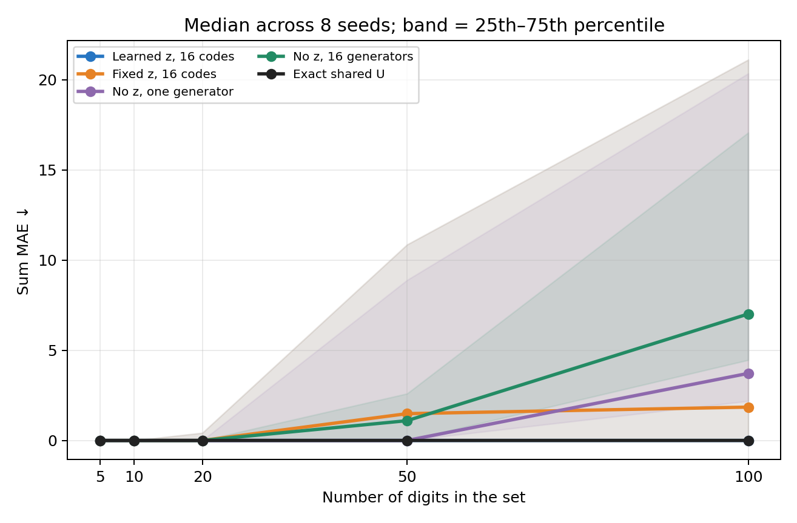
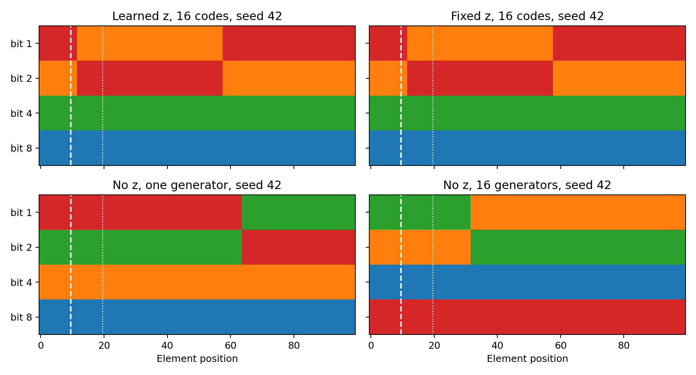

# Проверка роли `z` на задаче Deep Sets

## Что проверили

Взяли **сумму цифр в множестве**, как в [эксперименте Deep Sets](https://papers.nips.cc/paper_files/paper/2017/file/f22e4747da1aa27e363d86d40ff442fe-Paper.pdf). Это контролируемый **текстовый вариант**, а не MNIST8m: каждая цифра 0–9 подана четырьмя двоичными разрядами. Обучающие множества содержат 1–10 цифр; тестовые — 5, 10, 20, 50 и 100. Цель — предсказать их сумму. В качестве целевой метки используется только общая сумма множества.

Наш `G_ψ` получает глобальный четырёхмерный `z`, координату элемента и номер разряда. Он выдаёт `U`: для каждого элемента связывает четыре входных разряда с четырьмя общими весами `v`. Предсказание — сумма вкладов элементов, то есть `W = Uv` и линейный частный случай Deep Sets. `v` заново подбирается на обучающих множествах для каждой кандидатной `U`; генератор обучается на отдельных пакетах примеров. Контрольная аналитическая `U` использует одно и то же соответствие разрядов во всех позициях.

Сравнили обучаемые 16 кодов `z`, фиксированные 16 кодов `z`, один генератор без `z`, 16 независимых генераторов без `z` и аналитическую `U`. Вариант без `z` стартует из **той же функции**, что соответствующий вариант с кодом: начальное значение кода перенесено в смещение первого слоя. Все варианты получили одни и те же данные и 500 шагов; модель и код выбирались только по независимой валидации. Восемь повторов: seeds 42–49. На каждый повтор: 12 000 обучающих, 2 000 валидационных и по 2 000 тестовых множеств каждой длины. Основная валидация использует длины 1–10. Отдельно сохранён результат выбора по новым множествам длины 20; тест при этом не менялся.

## Результат

Основной протокол случайно размещает цифры среди 100 позиций даже при обучении на множествах длины до 10. Так все координаты доступны при обучении, а перенос на 100 элементов проверяет именно размер множества. Дополнительно прогнали вариант, где влияние координаты позиции на вход генератора усилено в 10 раз.

| Вариант | MAE суммы при длине 100 | Точная сумма после округления | Одна `U` для всех 100 позиций | Обучение, с |
|---|---:|---:|---:|---:|
| Обучаемый `z`, 16 кодов | 0,001180 | 100% | 8/8 повторов | 2,47 |
| Фиксированный `z`, 16 кодов | 0,001177 | 100% | 8/8 | 2,16 |
| Без `z`, один генератор | 0,001172 | 100% | 8/8 | 2,25 |
| Без `z`, 16 генераторов | 0,001181 | 100% | 8/8 | 2,32 |
| Аналитическая `U` | 0,001177 | 100% | 8/8 | — |

Это среднее по восьми повторам. Шестнадцать генераторов без `z` обучались параллельно одним пакетом на GPU, поэтому их время нельзя сравнивать с суммой шестнадцати последовательных запусков. Ошибка порядка 0,0012 есть и у аналитической `U`: её дают численное решение и слабая регуляризация при подборе `v`. **В данном опыте обучаемый `z` не улучшил качество**: даже один генератор без него достиг того же уровня. При усиленной координате позиции все четыре обучаемых варианта также получили 100% точных сумм на длине 100 в каждом повторе.


Проверили и более жёсткий протокол: при обучении цифры всегда занимают только первые 10 позиций. Все модели почти безошибочны на длине 10, но на длине 100 результаты неустойчивы. Средняя MAE: 27,8 с обучаемым `z`, 28,3 с фиксированным `z`, 27,8 с одним запуском без `z`, 18,1 с 16 запусками без `z`. Разброс между seeds велик; аналитическая `U` сохраняет MAE 0,0012. Это прежде всего провал переноса на **невиданные координаты**: в основном протоколе он исчезает у всех вариантов. Отбор по отдельной валидации на длине 20 улучшает некоторые результаты, но не устраняет неустойчивость на длине 100.





**Предел вывода.** Цифры уже раскодированы во входных четырёх битах, и у всех примеров одна правильная симметрия. Поэтому опыт показывает, что `z` не нужен для *этой упрощённой задачи суммы*, но не отвечает, нужен ли он для изображений, более сложного `φ` или семейства задач с разной правильной структурой `U`. На случайных позициях правильное разделение весов оказывается лёгким даже для генератора без `z`.

## Файлы и повторение

- [Числа по каждому seed](summary_random/summary.json), [строгий протокол](summary_prefix/summary.json), [усиленная координата](summary_position_stress/summary.json).
- `results*/` содержит результат каждого отдельного прогона; `run.py` и `summarize.py` полностью воспроизводят данные и графики.
- Использовано исследовательское окружение `ras` и свободные на момент запуска GPU; состояние памяти карт не использовалось для выбора.

```bash
conda run -n ras python -m deepsets_z.run --device cuda:0 --placement prefix --output deepsets_z/results
conda run -n ras python -m deepsets_z.run --device cuda:0 --placement random --output deepsets_z/results_random
conda run -n ras python -m deepsets_z.run --device cuda:0 --placement random --position-scale 10 --output deepsets_z/results_position_stress
conda run -n ras python -m deepsets_z.summarize --results deepsets_z/results --output deepsets_z/summary_prefix --plots all
conda run -n ras python -m deepsets_z.summarize --results deepsets_z/results_random --output deepsets_z/summary_random
conda run -n ras python -m deepsets_z.summarize --results deepsets_z/results_position_stress --output deepsets_z/summary_position_stress
conda run -n ras python -m deepsets_z.compare_protocols
```
