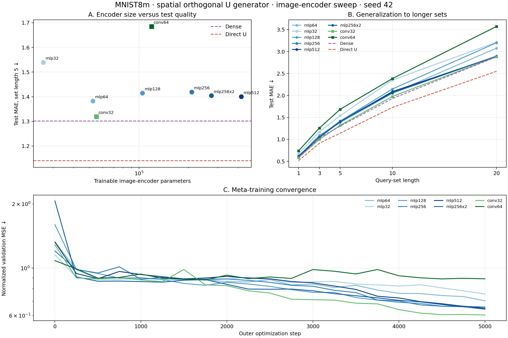

# Энкодер изображения для v: MNIST8m, seed 42

Энкодер получает изображение x и выдаёт 32 коэффициента g(x). Первый слой использует U(v_task ⊙ g(x)); v_task адаптируется по размеченным наборам новой задачи. Во всех запусках одинаковые пространственный генератор ортогональной U, данные, задачи и 5000 внешних шагов. Меняется только энкодер изображения. Тест — 64 новые задачи на каждой длине набора; ошибка MAE по сумме, меньше лучше.

| Энкодер | Его параметры | MAE, длина 5 | MAE, длина 20 |
|---|---:|---:|---:|
| Свёрточный, 32 канала | 55 008 | **1,319** | **2,883** |
| MLP, 64 нейрона (прежний) | 52 320 | 1,383 | 3,079 |
| MLP, 512 нейронов | 418 336 | 1,400 | 2,891 |
| MLP, два слоя по 256 | 274 976 | 1,404 | 2,895 |
| MLP, 128 нейронов | 104 608 | 1,415 | 3,201 |
| MLP, 256 нейронов | 209 184 | 1,419 | 2,897 |
| MLP, 32 нейрона | 26 176 | 1,539 | 3,213 |
| Свёрточный, 64 канала | 119 200 | 1,685 | 3,573 |
| Плотный первый слой, без кода | — | 1,302 | 2,879 |
| Прямо обучаемая U, без кода | — | 1,141 | 2,551 |

Свёрточный энкодер на 32 канала обошёл прежний MLP близкого размера на **0,064 MAE** при длине 5. Описательный 95% интервал парной разницы по 64 общим тестовым задачам: от −0,119 до −0,008. С dense разница составляет **+0,018 MAE** (интервал от −0,040 до +0,074), то есть на этих задачах качество близко. На длине 20 разница с dense всего **+0,004 MAE**. Прямо обучаемая U остаётся лучше: разница +0,179 MAE на длине 5 (интервал от +0,116 до +0,242).

Простое увеличение MLP с 64 до 128–512 нейронов не улучшило качество на длине 5. Однако сравнение проведено на **одном seed**, а лучшие значения валидации у большинства вариантов пришлись на последний шаг; более длинное обучение не проверялось. Провал conv64 также нельзя объяснить одной лишь шириной: его лучший checkpoint пришёлся на шаг 1750, а валидация к концу обучения осталась заметно хуже conv32. Интервалы выше учитывают разброс тестовых задач при фиксированных обученных моделях, но не разброс между запусками обучения.

Следующие проверки должны разделить ограничения энкодера и генератора U: сравнить conv32 с прямо обучаемой U при том же энкодере и отдельно менять мощность координатного генератора, сохраняя conv32. Вариант с отдельными прототипами v для цифр потребует маршрутизатора по изображению: настоящая цифра на тесте модели не сообщается. Для новых задач с произвольной стоимостью каждой цифры также нужны параметры задачи, адаптируемые по размеченным наборам.

[Сводные числа](meta_u_first_encoder_summary.json), [результаты по энкодерам](meta_u_first_encoder_results/), [запуск](encoder_sweep.py), [построение графика](summarize_encoder_sweep.py).
