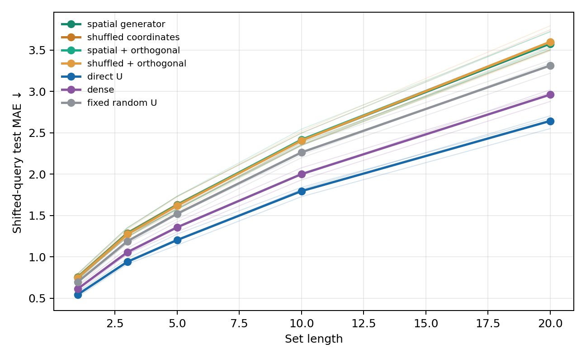
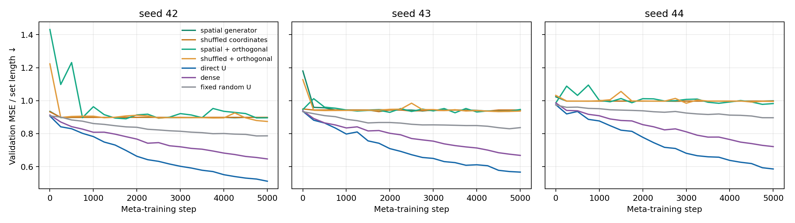
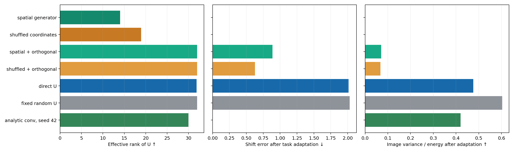

# Генератор U в первом слое MNIST8m

**Вопрос.** Улучшит ли генератор качество первого слоя `W = Uv` и найдёт ли
пространственную закономерность, которую не показало прямое обучение `U`?

**Что получает генератор.** Для каждого веса первого слоя — координаты
входного пикселя, координаты выходного нейрона на карте `3×10×10`, номер
канала и признак bias. Четыре пространственные координаты дополнены синусами
и косинусами частот 1 и 3. MLP `24 → 64 → 64 → 32` выдаёт **строку** общей
матрицы `U: 235500 × 32`. Генератор не получает изображение, метку задачи,
позицию изображения в наборе или `z`. Для новой задачи после пяти шагов
адаптации меняются `v: 32` и выходной вектор из 31 числа; генератор остаётся
общим. В нём **7840 обучаемых чисел**, во всей модели — **41 033** против
7 569 193 при прямом обучении `U`.

**Протокол.** Как в [опыте с прямой U](META_U_FIRST_RESULTS.md), каждая задача
назначает десяти цифрам новые вещественные стоимости, а метка набора — их
сумма. Адаптация использует 32 размеченных набора из 1–5 изображений.
Изображения тестового набора сдвинуты на три пикселя. MNIST8m разделён на
непересекающиеся пулы 30 000 / 10 000 / 10 000 изображений для обучения,
валидации и теста. Три парных seed `42–44`, 5000 внешних шагов, два задания
на шаг, 64 новые тестовые задачи на seed; лучший checkpoint выбран по
валидации. Сравниваются:

- генератор с правильными пространственными координатами;
- тот же генератор с **перемешанными между весами координатами**;
- обе версии после ортогонализации столбцов выданной `U`, чтобы проверить,
  не мешает ли их похожесть адаптации `v`.

Все четыре генератора имеют одинаковое число обучаемых параметров. Остальные
слои, начальные `v`, задачи и бюджет обучения совпадают в парных запусках.
Контроли с прямой `U`, плотным первым слоем и фиксированной случайной `U`
взяты из того же протокола.

## Результат

Средняя по трём seed абсолютная ошибка на новых задачах после адаптации;
меньше — лучше:

| Первый слой | Длина 5 | Длина 10 | Длина 20 |
|---|---:|---:|---:|
| Генератор, координаты | 1,629 | 2,408 | 3,578 |
| Генератор, координаты перемешаны | 1,631 | 2,412 | 3,598 |
| Генератор, ортогональная U | 1,626 | 2,417 | 3,593 |
| Генератор, перемешанная ортогональная U | 1,618 | 2,406 | 3,600 |
| Фиксированная случайная U | 1,521 | 2,262 | 3,313 |
| Плотный слой | 1,357 | 2,000 | 2,962 |
| **Прямо обучаемая U** | **1,203** | **1,795** | **2,643** |

На длине 5 по seed `42/43/44`: пространственный генератор
`1,573/1,731/1,583`, перемешанный `1,575/1,730/1,589`. Разница между
правильными и перемешанными координатами мала и меняет знак между seed.
Ортогонализация не закрыла разрыв с контролями.





## Проверка структуры

У обычного генератора эффективный ранг `U` составляет около **14 из 32**;
у перемешанного — около **19**. Ортогонализация поднимает его почти до 32,
но тестовая ошибка практически не меняется. Таким образом, похожесть
столбцов не объясняет весь провал.

После пяти шагов адаптации `v` мы также измерили, насколько признаки первого
слоя меняются между разными изображениями и сдвигаются вместе с изображением.
У обычного генератора доля вариации признаков, обусловленной изображением,
составила около `0,000002` от их средней энергии; у перемешанного —
`0,0000002`. Поэтому их почти нулевая ошибка сдвига **обманчива**: признаки
почти постоянны. У ортогонализованного генератора эта доля около `0,070`,
но у прямо обученной `U` — `0,476`; ошибка сдвига у него `0,89` против
практически нуля у аналитической свёртки. Перемешанный ортогональный контроль
даёт близкие значения (`0,068` и `0,63`). Надёжного свидетельства, что
правильные координаты помогли найти свёртку, нет.



**Вывод.** Этот небольшой координатный генератор сжимает представление `U`,
но на данных задачах обучается хуже прямой `U`, плотного слоя и даже
фиксированной случайной `U`. Эксперимент не опровергает идею генератора в
первом слое: проверены одна ширина MLP, один способ задания выходной карты
и один бюджет обучения. Карта `3×10×10` оставляет лишь три пространственных
фильтра; аналитическая трёхфильтровая свёртка тоже уступила лучшим контролям
в [предыдущем опыте](META_U_FIRST_RESULTS.md). Улучшение генератора на
[meta-pattern](../../meta_pattern/README.md) само по себе не было строгим
доказательством восстановления теплицевой структуры и не переносится
автоматически на изображения.

[Сводка](meta_u_first_generator_summary.json),
[результаты по seed](meta_u_first_results/),
[диагностика](meta_u_first_diagnostics.json); код:
[`meta_u_first.py`](meta_u_first.py),
[`diagnose_meta_u_first.py`](diagnose_meta_u_first.py),
[`summarize_meta_u_first_generator.py`](summarize_meta_u_first_generator.py).

Пример воспроизведения одного запуска после подготовки `datasets/mnist8m`:

```bash
python -m deepsets_z.mnist8m.meta_u_first --arm generated --seed 42 \
  --device cuda:0 --steps 5000 --lr-v1 0.1 --lr-readout 0.03 \
  --eval-every 250 --val-tasks 16 --test-tasks 64
```

Остальные варианты задаются через `--arm generated_shuffled`,
`generated_ortho` или `generated_shuffled_ortho`. Точные настройки всех
запусков сохранены в JSON.
