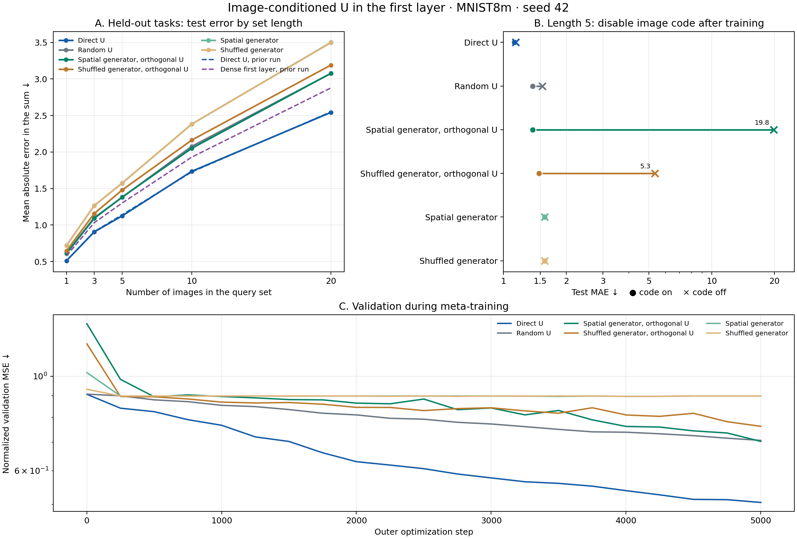

# Код изображения для U первого слоя: seed 42

**Вопрос.** Помогает ли генератору первого слоя видеть само изображение? Проверили один seed 42; остальные seed в эту сводку не входят.

Для каждого изображения x маленький энкодер выдаёт 32 числа g(x) = 1 + tanh(E(x)). Первый слой использует W(x) = reshape(U(v ⊙ g(x))). Матрица U и энкодер общие для всех задач; 32-мерный v и выходной вектор адаптируются за пять шагов по размеченным наборам новой задачи. Генератор U по-прежнему получает координаты весов; изображение поступает в отдельный энкодер. Код не содержит позицию изображения в наборе.

**Протокол.** MNIST8m, задачи на сумму назначенных цифрам вещественных стоимостей. У каждой новой задачи 32 размеченных набора для адаптации и 32 набора для проверки; изображения в тестовых наборах сдвинуты на три пикселя. Длина тестового набора — 1, 3, 5, 10 или 20. Пулы изображений для обучения, валидации и теста не пересекаются. Для каждой длины оценены 64 новые задачи, все варианты обучались 5000 внешних шагов с одинаковыми настройками. Показана средняя абсолютная ошибка суммы (MAE; меньше лучше).

| Первый слой | С кодом, длина 5 | Код выключен после обучения | Отдельно обучен без кода | С кодом, длина 20 |
| --- | ---: | ---: | ---: | ---: |
| Прямо обучаемая U | **1,126** | 1,142 | 1,141 | **2,544** |
| Фиксированная случайная U | 1,379 | 1,537 | 1,455 | 3,077 |
| Пространственный генератор, ортогональная U | 1,383 | 19,837 | 1,575 | 3,078 |
| Генератор с перемешанными координатами, ортогональная U | 1,480 | 5,338 | 1,546 | 3,191 |
| Пространственный генератор | 1,574 | 1,574 | 1,573 | 3,502 |
| Генератор с перемешанными координатами | 1,575 | 1,575 | 1,575 | 3,498 |
| Плотный слой, без генератора и кода | — | — | 1,302 | — |

**Интерпретация.** Код помогает фиксированной случайной U: MAE 1,379 против 1,455 у отдельно обученного варианта без кода. С ортогональной U пространственный генератор улучшился с 1,575 до 1,383, но не догнал ни плотный слой (1,302), ни прямо обучаемую U (1,126). Генератор без ортогонализации остался практически на прежнем уровне; отключение кода не меняет его ответов. После обучения ортогональных вариантов выключение кода резко портит предсказания, но это проверка зависимости обученной модели от кода, а не корректная замена обучения без него. Значения в соседнем столбце дают именно такую отдельно обученную проверку.

Один seed показывает возможность улучшения от изображения в этой архитектуре, но не позволяет оценить устойчивость эффекта и не доказывает, что генератор нашёл свёрточную структуру. Пространственный генератор с ортогонализацией на этом seed лучше версии с перемешанными координатами; для вывода о роли координат нужны повторения.

[Числовая сводка](meta_u_first_image_code_seed42_summary.json), [результаты шести запусков](meta_u_first_image_code_results/), [код опыта](meta_u_first_image_code.py), [построение графика](summarize_meta_u_first_image_code.py).
