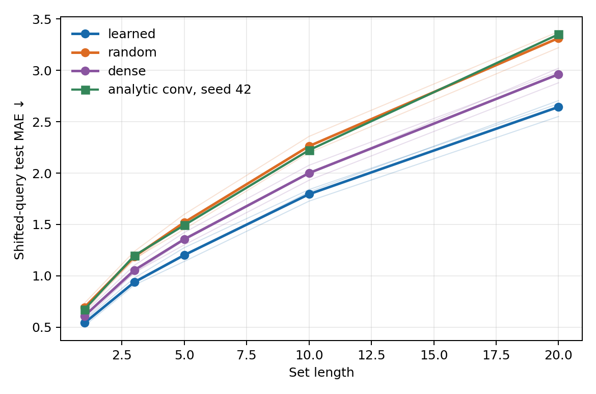
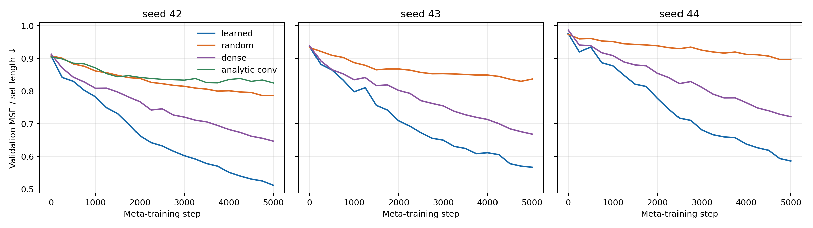

# Общая U в первом слое MNIST8m

**Вопрос.** Помогает ли искать общую для задач матрицу `U` там, где ещё видна
сетка пикселей, и приобретает ли она свойство свёртки? Это опыт с **прямо
обучаемой `U`**, без генератора и без `z`.

**Задача.** В каждой новой задаче десяти цифрам назначаются новые вещественные
стоимости. Нужно по набору изображений предсказать сумму стоимостей цифр.
Для адаптации даны 32 размеченных набора из 1–5 изображений. В тестовых наборах
изображения сдвинуты на три пикселя вверх, вниз, вправо или влево; изображения
для адаптации не сдвинуты. Истинные классы цифр служат только для создания
ответов. Пулы изображений MNIST8m для обучения, выбора весов и теста не
пересекаются: 30 000 / 10 000 / 10 000 изображений.

**Модель.** Общие слои `784 → 300 → 100 → 30`, `tanh`, затем сумма вкладов
картинок. У первого слоя вместе со смещением 235 500 весов. В основном
варианте они равны `reshape(Uv)`, `U: 235500 × 32`. Общая `U` обучается на
многих задачах; для новой задачи `v: 32` и выходной вектор из 31 числа
дообучаются за пять шагов. Сравниваются:

- та же архитектура с фиксированной случайной `U`, от которой стартовал
  обучаемый вариант;
- обычный плотный первый слой, начинающий с **точно той же матрицы весов**;
  для новой задачи дообучается только выходной вектор;
- фиксированная аналитическая `U`, точно задающая три свёрточных фильтра
  `3×3` с шагом 3 и карту признаков `3×10×10`; для неё проведён один seed.

Три парных seed `42–44`, 5000 внешних шагов, два задания на шаг, 64 новых
тестовых задачи на seed. В каждом варианте остальные слои обучаются. Лучшие
веса выбраны по отдельной валидации. `U` с 32 столбцами добавляет **7 536 000
обучаемых чисел** против обычного плотного слоя; поэтому различие с ним нельзя
сразу приписать правильной симметрии.

## Качество

Средняя абсолютная ошибка на новых задачах после пяти шагов адаптации;
меньше — лучше:

| Длина набора | Обучаемая U | Плотный слой | Случайная U | Свёрточная U, seed 42 |
|---:|---:|---:|---:|---:|
| 5 | **1,203** | 1,357 | 1,521 | 1,493 |
| 10 | **1,795** | 2,000 | 2,262 | 2,223 |
| 20 | **2,643** | 2,962 | 3,313 | 3,350 |

На длине 5 по отдельным seed: обучаемая `U` — `1,141 / 1,274 / 1,193`,
плотный слой — `1,302 / 1,422 / 1,347`, случайная `U` —
`1,455 / 1,599 / 1,509`. Обучаемая `U` лучше обоих контролей на всех трёх
seed. Относительно плотного слоя ошибка ниже примерно на **11%**, относительно
фиксированной случайной `U` — на **21%**. На длинах 10 и 20 порядок тот же.





## Что дало улучшение

Если после обучения **запретить менять `v` первого слоя** на новой задаче,
оставив пять шагов адаптации выходного вектора, ошибка обучаемого варианта
на длине 5 становится `1,259` вместо `1,203`; на длинах 10 и 20 — `1,773`
и `2,630` вместо `1,795` и `2,643`. Это проверка уже обученной модели, а не
отдельное обучение без адаптации `v`. Она показывает, что большую часть
преимущества здесь даёт обученное общее представление; эффект адаптации
первого `v` мал и неустойчив по длине.

Свёрточность проверена двумя способами. Проекция столбцов обученной `U` на
пространство точной свёртки в **заранее заданной** карте `3×10×10` равна
`0,000130–0,000138`, практически как у случайной `U` (`0,000130–0,000136`);
у аналитической `U` она равна `1`. Если сдвинуть картинку на три пикселя вниз
и сравнить внутренние строки карты признаков первого слоя, нормированная
ошибка сдвига равна `1,96–2,06` у обучаемой `U`, около `2` у случайной и
примерно `10⁻¹⁵` у аналитической свёртки. Метрика исключает строку,
затронутую границей изображения. Значит, выученная карта в этом заданном
порядке нейронов **не ведёт себя как свёрточная**. Проверка не исключает
свёрточную структуру после перестановки скрытых нейронов или иного базиса.

**Вывод.** Перенос `U` на первый слой улучшил качество в этом опыте, но
пока нет свидетельства, что модель нашла теплицеву матрицу или что именно
пространственный inductive bias вызвал выигрыш. У обучаемой `U` намного больше
параметров, а аналитический контроль содержит всего три фильтра. Кривые ещё
снижаются к 5000-му шагу. Этот опыт отличается от [опыта на последнем слое](META_U_RESULTS.md)
сдвигом тестовых изображений, рангом и числом шагов, поэтому величины
выигрыша между слоями напрямую не сравниваются.

[Сводка](meta_u_first_summary.json), [диагностика](meta_u_first_diagnostics.json),
[результаты по seed](meta_u_first_results/); код:
[`meta_u_first.py`](meta_u_first.py),
[`diagnose_meta_u_first.py`](diagnose_meta_u_first.py),
[`summarize_meta_u_first.py`](summarize_meta_u_first.py).

Пример воспроизведения одного запуска после подготовки `datasets/mnist8m`:

```bash
python -m deepsets_z.mnist8m.meta_u_first --arm learned --seed 42 \
  --device cuda:0 --steps 5000 --lr-v1 0.1 --lr-readout 0.03 \
  --eval-every 250 --val-tasks 16 --test-tasks 64
```

Для остальных запусков заменить `--arm` на `random`, `dense` или
`convolution` и повторить с seed `42–44`; свёрточный контроль проведён только
с seed 42. Точные аргументы каждого запуска записаны в JSON результатов.
