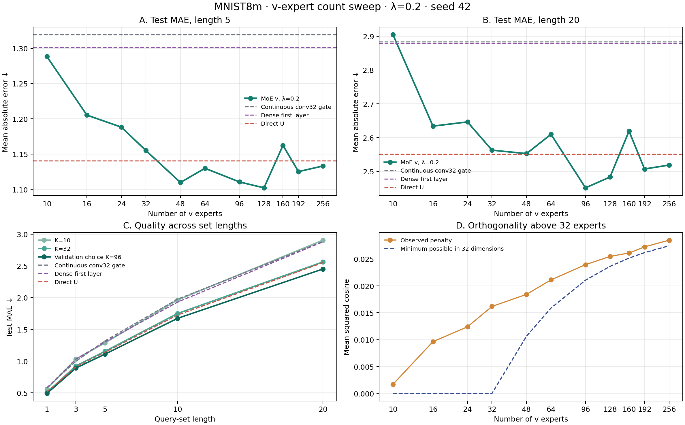

# Сколько нужно экспертов v: MNIST8m, seed 42

**Вопрос.** В [предыдущем опыте](META_U_FIRST_V_MOE_RESULTS.md) K = 32 был лучшим из проверенных K = 1, 10, 32. Проверили, продолжается ли выигрыш при большем числе экспертов. Штраф за сходство направлений оставили **λ = 0,2**.

**Модель и данные.** Генератор по координатам весов строит общую матрицу U первого слоя. Для изображения x свёрточный роутер получает только его 28×28 пикселей и выдаёт вероятности q_j(x) для K обучаемых векторов v_j размерности 32. Первый слой использует вектор √K Σ_j q_j(x) a_j v_j. Для новой задачи по 32 размеченным наборам адаптируются K коэффициентов a_j и 31 параметр выходного слоя. Метки цифр нужны для составления целевой суммы и для анализа маршрутов **после** обучения; роутеру они не передаются.

Данные — непересекающиеся пулы MNIST8m для обучения, валидации и теста. Каждая задача назначает цифрам новые случайные стоимости, цель — сумма стоимостей цифр на изображениях набора. Тестовые изображения сдвинуты на три пикселя. У всех K: seed 42, 5000 внешних шагов, пять шагов адаптации, 64 общие тестовые задачи для каждой длины. Checkpoint каждого запуска выбран по валидации; на тесте измерена MAE, меньше лучше. Значения K = 10 и 32 взяты из прежнего запуска с тем же протоколом.

| K | Параметры модели | Адаптируемые числа | Валидационный критерий ↓ | MAE, длина 5 ↓ | MAE, длина 20 ↓ |
|---:|---:|---:|---:|---:|---:|
| 10 | 61 821 | 41 | 0,6222 | 1,2883 | 2,9047 |
| 16 | 71 433 | 47 | 0,5440 | 1,2053 | 2,6338 |
| 24 | 84 249 | 55 | 0,5631 | 1,1881 | 2,6462 |
| 32 | 97 065 | 63 | 0,5115 | 1,1550 | 2,5626 |
| 48 | 122 697 | 79 | 0,5025 | 1,1098 | 2,5524 |
| 64 | 148 329 | 95 | 0,5160 | 1,1299 | 2,6095 |
| **96** | **199 593** | **127** | **0,4724** | **1,1105** | **2,4511** |
| 128 | 250 857 | 159 | 0,4851 | **1,1022** | 2,4831 |
| 160 | 302 121 | 191 | 0,5421 | 1,1623 | 2,6189 |
| 192 | 353 385 | 223 | 0,5084 | 1,1252 | 2,5069 |
| 256 | 455 913 | 287 | 0,5146 | 1,1331 | 2,5185 |

**Выбор.** Среди этих запусков K = 96 имеет лучший валидационный критерий и лучшую тестовую MAE на длине 20. На длине 5 K = 128 лучше на 0,0083 MAE, но использует на 51 264 больше параметров и на 32 больше адаптируемых числа. Парный описательный 95% bootstrap-интервал разницы MAE «K = 96 минус K = 128» по 64 тестовым задачам: от −0,013 до +0,030 на длине 5 и от −0,105 до +0,035 на длине 20. Различие этих двух вариантов неубедительно. Практический выбор — **K ≈ 96**; если важна экономия параметров и короткие наборы, K = 48 даёт практически ту же MAE на длине 5 (1,1098) при 122 697 параметрах, но хуже на длине 20 (2,5524).

Для ориентира, прямо обучаемая U без кода изображения дала MAE 1,1406 / 2,5507 на длинах 5 / 20. K = 96 лучше на 0,0301 / 0,0996; парные описательные 95% интервалы разницы — от −0,057 до −0,003 и от −0,179 до −0,024. Этот контроль **не совпадает по архитектуре и числу параметров**: он не использует роутер, а K = 96 адаптирует 127 чисел вместо 63. Поэтому сравнение показывает качество конфигураций, но не изолирует пользу генератора U, роутера или числа экспертов. При перемешивании маршрутов между изображениями MAE K = 96 на длине 5 растёт с 1,1105 до 1,6373: обученная модель использует связь маршрута с конкретным изображением.

**Ограничения.** Число экспертов и число коэффициентов, которые адаптируются к новой задаче, растут вместе; это главный источник смешения эффектов. Свёрточный роутер может научиться распознавать цифры из пикселей — это допустимый путь решения задачи, но он мешает приписать весь выигрыш генератору U. Чтобы отделить эти причины, нужен контроль с тем же роутером и K, но с прямо обучаемой или фиксированной U, и контроль с фиксированным числом адаптируемых параметров. При K > 32 все 32-мерные векторы не могут быть попарно ортогональны; средний квадрат косинуса при K = 96 равен 0,0239 против математического нижнего предела 0,0211. Здесь только один seed и 16 валидационных задач; «оптимум 96» означает лучший из проверенных запусков, а не устойчивый архитектурный закон. Интервалы отражают разброс тестовых задач при уже обученных моделях, но не разброс от повторного обучения или подбора K.

У K = 96 среднюю долю маршрута более 1% получили 34 эксперта из 96; у K = 128 — 33 из 128. Это не означает, что остальные никогда не используются на отдельных изображениях, но показывает, что фактическое распределение нагрузки далеко от равномерного.

[Сводные числа](meta_u_first_v_moe_count_summary.json), [JSON девяти новых запусков](meta_u_first_v_moe_count_results/), [модель](meta_u_first_v_moe.py), [скрипт запуска](v_moe_sweep.py), [построение графика](summarize_v_moe_count_sweep.py).
