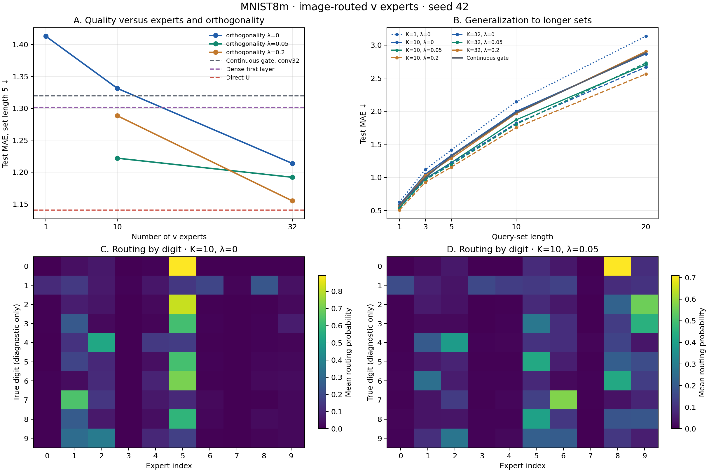
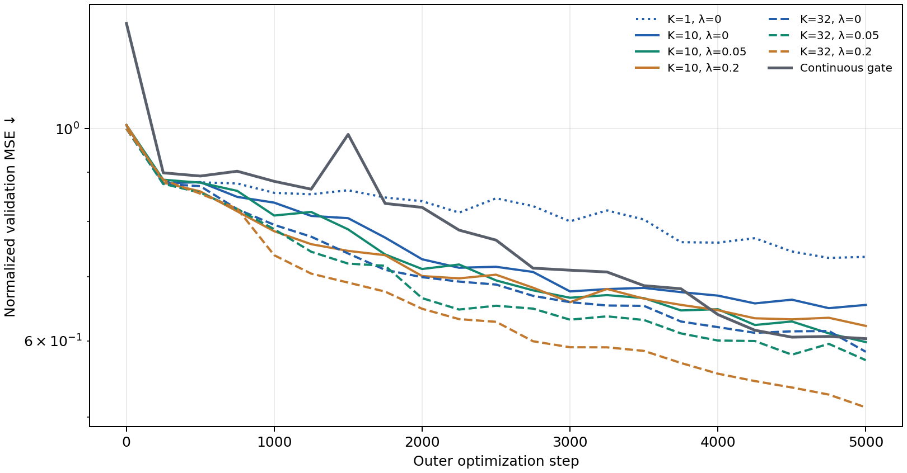

# Смесь векторов v для первого слоя: MNIST8m, seed 42

**Что проверяли.** Вместо непрерывного 32-мерного множителя от картинки свёрточный маршрутизатор выбирает смесь из K общих обучаемых векторов v_j размерности 32. Для новой задачи по размеченным наборам адаптируются K скалярных коэффициентов a_j и выходной вектор. Эффективный вектор для изображения x равен √K Σ_j q_j(x) a_j v_j, где q(x) — вероятности экспертов. Масштаб √K и начальные a_j = 1/√K дают тот же начальный эффективный v при равномерном маршруте для любого K. Генератор ортогональной U и остальная сеть одинаковы.

**Ортогональность.** Проверены λ = 0, 0,05 и 0,2 при K = 10 и 32; K = 1 служит контролем без маршрутизатора. К ошибке на задачах добавляли λ, умноженное на средний квадрат скалярных произведений **нормированных** разных v_j. Это уменьшает сходство направлений, не фиксируя длины векторов. Равенство экспертов цифрам не навязывалось.

**На чём проверяли.** MNIST8m, задачи на суммы случайно назначенных цифрам стоимостей. Адаптация: 32 размеченных набора и пять шагов. Тестовые изображения сдвинуты на три пикселя, а 64 новые задачи на каждую длину общие для всех вариантов. Один seed 42, 5000 внешних шагов, лучший checkpoint по валидации. Ошибка — MAE суммы; меньше лучше. Цифровые метки отдельных изображений не поступают модели и используются только при анализе маршрутов.

| Эксперты K | Штраф λ | MAE, длина 5 | MAE, длина 20 | Маршруты перемешаны, длина 5 | Сходство направлений² |
|---:|---:|---:|---:|---:|---:|
| 1 | 0 | 1,413 | 3,134 | 1,413 | — |
| 10 | 0 | 1,331 | 2,867 | 1,611 | 0,226 |
| 10 | 0,05 | 1,222 | 2,703 | 1,622 | 0,015 |
| 10 | 0,2 | 1,288 | 2,905 | 1,606 | 0,002 |
| 32 | 0 | 1,214 | 2,667 | 1,626 | 0,234 |
| 32 | 0,05 | 1,192 | 2,729 | 1,629 | 0,025 |
| **32** | **0,2** | **1,155** | **2,563** | 1,625 | 0,016 |
| Прежний непрерывный код conv32 | — | 1,319 | 2,883 | — | — |
| Плотный первый слой | — | 1,302 | 2,879 | — | — |
| Прямо обучаемая U без кода | — | 1,141 | 2,551 | — | — |

² Средний квадрат скалярного произведения нормированных разных экспертов; ноль означает ортогональность. В колонке с перемешиванием маршруты переставлены между активными изображениями внутри каждого support/query эпизода. Набор вероятностей экспертов сохраняется, связь конкретного изображения со смесью нарушается; модель повторно адаптирует коэффициенты на support.

**Вывод.** В этом запуске MoE из v улучшил результат при почти той же общей мощности: K = 32 имеет 97 065 обучаемых параметров и 63 адаптируемых числа против 96 041 и 63 у прежнего conv32-кода. Лучший MoE дал MAE 1,155 против 1,319 у него и 1,302 у плотного слоя. От прямо обучаемой U остаётся 0,014 MAE на длине 5 и 0,012 на длине 20.

Штраф помог, но его вес важен: при K = 10 лучше λ = 0,05, при K = 32 — λ = 0,2. Для K = 32 последний вариант лучше λ = 0 на 0,059 MAE при длине 5. Описательный 95% интервал парной разницы по 64 тестовым задачам — от −0,092 до −0,027. Относительно плотного слоя разница −0,147 (от −0,184 до −0,110); относительно прямой U +0,014 (от −0,014 до +0,044). Интервалы описывают разброс задач **при фиксированных обученных моделях**, не учитывают подбор варианта по этим результатам и не заменяют повторений обучения.

Маршрутизатор действительно использует изображение: перемешивание маршрутов поднимает MAE лучшего варианта с 1,155 до 1,625. Штраф распределил использование экспертов ровнее: у K = 32 заметную среднюю долю (>1%) получили 24 эксперта против 15 без штрафа. На тепловых картах есть зависимость маршрута от цифры, но нет разделения «одна цифра — один эксперт». У пяти из семи вариантов лучший checkpoint пришёлся на последний шаг, поэтому более длительное обучение остаётся открытой проверкой. Пока эксперимент проведён только на одном seed.

[Числовая сводка](meta_u_first_v_moe_summary.json), [результаты семи запусков](meta_u_first_v_moe_results/), [модель](meta_u_first_v_moe.py), [запуск](v_moe_sweep.py), [диагностика маршрутов](diagnose_v_moe_routing.py).
