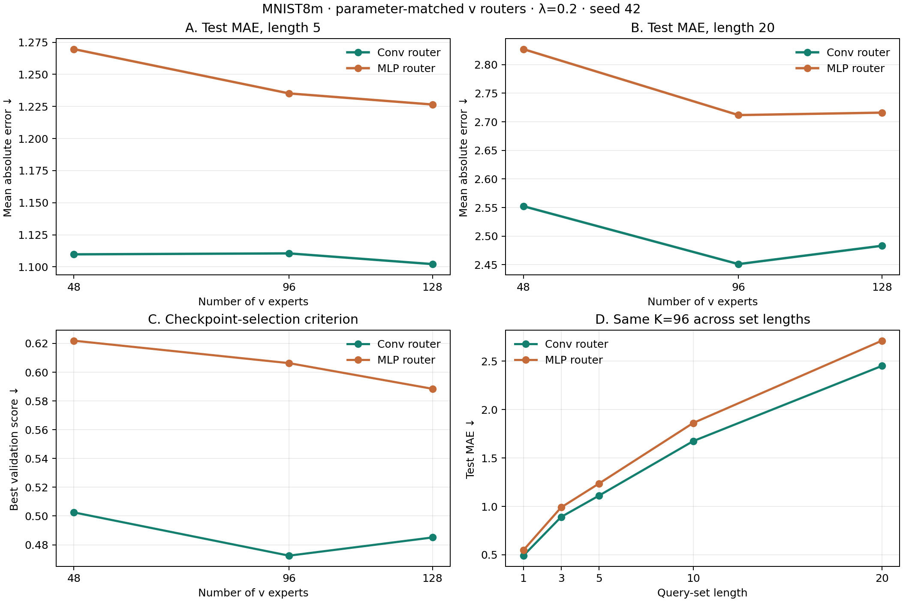
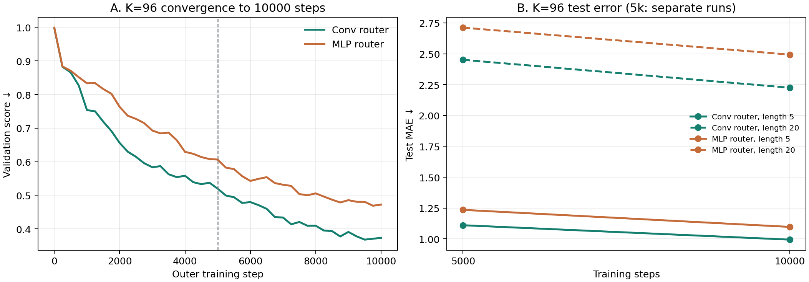
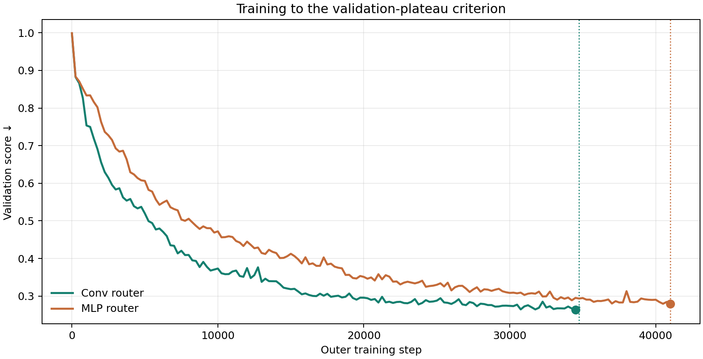
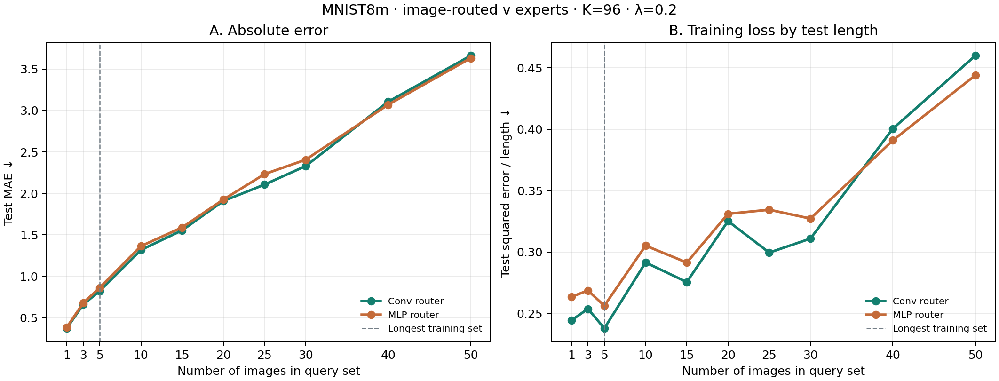

# Свёртка или MLP для выбора экспертов v: MNIST8m, seed 42

**Что проверяли.** В [поиске числа экспертов](META_U_FIRST_V_MOE_COUNT_RESULTS.md) роутер был свёрточной сетью. Она видит только пиксели изображения, но заранее использует пространственную структуру цифры. Заменили её на MLP с тем же входом и почти тем же числом параметров, чтобы измерить вклад этой архитектуры. Остальное одинаково: координатный генератор U первого слоя, K общих векторов v размерности 32, адаптация K коэффициентов по 32 размеченным наборам и штраф за сходство экспертов λ = 0,2.

**На чём проверяли.** MNIST8m, суммы новых случайных стоимостей цифр. Для каждого K ∈ {48, 96, 128} обе модели получили одни и те же пулы изображений и последовательность тренировочных задач. На тесте — 64 новые задачи на каждую длину набора, изображения сдвинуты на три пикселя. Один seed 42, 5000 внешних шагов и пять шагов адаптации. Checkpoint выбран по валидации; ошибка — MAE суммы. MLP имеет один скрытый слой `784 → width → K` с `tanh`; width подобран по числу параметров свёрточного роутера `conv32` отдельно для каждого K.

| K | Параметры роутера: conv / MLP | MAE 5: conv / MLP ↓ | MAE 20: conv / MLP ↓ | Критерий валидации: conv / MLP ↓ |
|---:|---:|---:|---:|---:|
| 48 | 80 112 / 80 016 | 1,110 / 1,270 | 2,552 / 2,827 | 0,503 / 0,622 |
| 96 | 155 424 / 155 152 | 1,111 / 1,235 | 2,451 / 2,712 | 0,472 / 0,606 |
| 128 | 205 632 / 205 553 | 1,102 / 1,227 | 2,483 / 2,716 | 0,485 / 0,588 |

На K = 96 разница «MLP минус conv» составляет **+0,125 MAE** на длине 5 и **+0,261** на длине 20. Описательные парные 95% bootstrap-интервалы по 64 тестовым задачам: +0,094…+0,155 и +0,168…+0,356. На K = 48 и 128 преимущество свёртки также сохраняется. Перемешивание маршрутов между изображениями ухудшает MLP при K = 96 с 1,235 до 1,607: MLP тоже учится использовать изображение.

**Проверка более долгого обучения.** Поскольку у MLP на 5000 шагах лучший checkpoint был последним, отдельно обучили оба роутера с K = 96 до 10 000 шагов. Данные, задачи и остальные настройки прежние. Эти запуски стартовали заново; повтор свёрточного варианта на другой карте уже к 5000 шагам несколько отличался от исходного запуска, поэтому значения двух столбцов «5000» ниже взяты из исходного сравнения, а «10 000» — из новых запусков.

| Шаги | Роутер | MAE, длина 5 ↓ | MAE, длина 20 ↓ | Лучший валидационный критерий ↓ |
|---:|---|---:|---:|---:|
| 5000 | Свёртка | 1,111 | 2,451 | 0,472 |
| 5000 | MLP | 1,235 | 2,712 | 0,606 |
| 10 000 | Свёртка | **0,994** | **2,225** | **0,368** |
| 10 000 | MLP | 1,097 | 2,493 | 0,469 |

При равных 10 000 шагах MLP уступает на **0,103 / 0,269 MAE** для длин 5 / 20. Парные описательные 95% интервалы разницы: +0,076…+0,131 и +0,180…+0,358. При этом MLP за 10 000 шагов почти достигает качества свёртки за 5000: 1,097 против 1,111 на длине 5 и 2,493 против 2,451 на длине 20. Свёртка помогает быстрее обучаться; сохраняется и выигрыш при одинаковом числе шагов.

## До плато валидации и наборы длиной до 50

Оба запуска K = 96 продолжили **из checkpoint 10 000 шагов**. Проверка каждые 250 шагов шла на прежних 16 валидационных задачах с длинами 1, 3, 5. После шага 12 000 модель останавливалась, если 16 проверок подряд не давали улучшения хотя бы на 0,002 относительно последнего существенного минимума. Это операционное плато валидации, а не математическая сходимость параметров. Лучший checkpoint выбирался по самой низкой валидационной ошибке.

| Роутер | Остановка | Лучший checkpoint | Валидация ↓ | MAE 5 ↓ | MAE 20 ↓ |
|---|---:|---:|---:|---:|---:|
| Свёртка | 34 750 | 34 500 | **0,263** | **0,823** | **1,907** |
| MLP | 41 000 | 41 000 | 0,280 | 0,862 | 1,925 |

Далее лучшие модели проверены на **64 одинаковых новых задачах для каждой длины**. Во время обучения query-наборы имели длину не больше 5; значения 10–50 проверяют перенос. Тестовые изображения сдвинуты на три пикселя, как и раньше.

| Длина набора | Свёртка: MAE ↓ | MLP: MAE ↓ | MLP − свёртка |
|---:|---:|---:|---:|
| 5 | **0,823** | 0,862 | +0,039 |
| 10 | **1,317** | 1,363 | +0,046 |
| 20 | **1,907** | 1,925 | +0,017 |
| 25 | **2,106** | 2,232 | +0,126 |
| 30 | **2,330** | 2,406 | +0,076 |
| 40 | 3,106 | **3,070** | −0,036 |
| 50 | 3,661 | **3,631** | −0,030 |

Разница на длине 5 сохраняется: описательный парный 95% bootstrap-интервал «MLP − свёртка» по 64 задачам **+0,017…+0,061**. На длине 20 интервал **−0,041…+0,074**, на длине 50 **−0,177…+0,110**: преимущества одного роутера там не видно. У MLP на длине 50 MAE на 0,030 меньше, но эта разница мала относительно разброса задач.

На длине 50 средняя квадратичная ошибка, делённая на длину набора — та же нормировка, что в обучающей потере, — выросла с **0,238 до 0,460** у свёртки и с **0,256 до 0,444** у MLP относительно длины 5. Это показывает ухудшение выбранной метрики на длинных наборах. По одной ошибке суммы нельзя отделить ошибки распознавания цифр от смещения, накапливающегося при сложении; абсолютная MAE также естественно растёт с размером суммы.

**Общий вывод.** Свёртка не является утечкой данных: роутер получает только пиксели. На раннем этапе она заметно ускоряет обучение; после остановки обоих вариантов по валидации MLP в основном догоняет её. Небольшой выигрыш свёртки на коротких наборах остаётся, на длинах 20 и 50 убедительного различия нет. Поэтому преимущество свёртки на 5000–10 000 шагах нельзя трактовать как доказательство её более высокого предельного качества. Сравнение проведено на одном seed и одном MLP; условные интервалы по тестовым задачам не учитывают разброс повторного обучения.

Сам факт, что обе модели получают хорошие результаты, не изолирует вклад генератора U. Для этого нужен одинаковый роутер при генерируемой, фиксированной и прямо обучаемой U. При сопоставлении с MLP-архитектурой другой работы свёртка является дополнительным архитектурным различием.

[Сводные числа на длинах до 50](meta_u_first_v_moe_router_lengths_to50.json), [числа на 5000–10 000 шагах](meta_u_first_v_moe_router_summary.json), [JSON запусков](meta_u_first_v_moe_router_results/), [модель](meta_u_first_v_moe.py), [оценка длин](evaluate_v_moe_router_lengths.py), [построение прежних графиков](summarize_v_moe_router_comparison.py).
