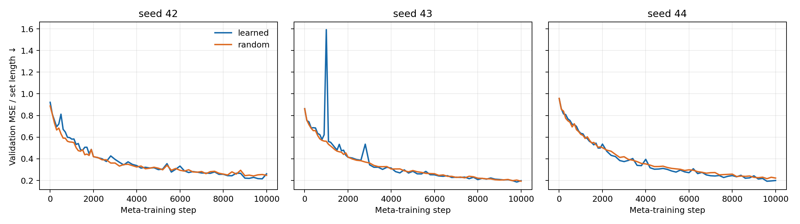
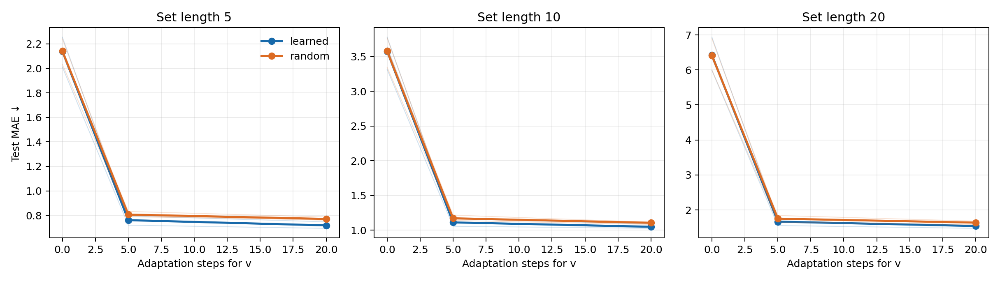

# Прямое обучение U на последнем слое MNIST8m

**Вопрос.** Помогает ли обучать общую матрицу `U`, если для новой задачи
от общей метаобученной инициализации дообучается короткий вектор `v`? Это проверка принципа из
[Meta-Learning Symmetries by Reparameterization](https://arxiv.org/abs/2007.02933),
пока без генератора и без `z`.

**Задачи и данные.** Каждая задача назначает десяти цифрам десять новых
вещественных стоимостей. Метка набора картинок — сумма стоимостей изображённых
цифр. Модель видит картинки и метки целых наборов; истинные цифры используются
только для создания меток. Это семейство задач, отличное от исходного
суммирования значений цифр в статье Deep Sets. Взяты изображения MNIST8m:
30 000 для метаобучения из первого блока, 10 000 для выбора модели из второго,
10 000 для финального теста из третьего. В каждом пуле поровну картинок
каждой цифры. Картинки support и query внутри одной задачи не пересекаются.

**Модель и сравнение.** Общий для задач энкодер `784 → 300 → 100`, затем
последний слой `100 → 30` с `tanh`, сумма по картинкам и общий линейный выход.
Вес последнего слоя, включая bias, равен `reshape(Uv)`, где
`U: 3030 × 16`, `v: 16`. Для каждой новой задачи `v` дообучается на 32
размеченных наборах. Варианты начинают с одной и той же `U`:

- **Обучаемая U:** обновляется по ошибке query после адаптации `v`.
- **Случайная U:** остаётся фиксированной; энкодер, общий выход и начальный `v`
  обучаются в обоих вариантах.

Три парных seed (`42–44`), по 10 000 внешних шагов, два задания на шаг, пять
внутренних SGD-шагов для `v`. Обучающие наборы содержат 1–5 картинок.
На финальном тесте — 64 новые задачи на seed, длины наборов 1, 3, 5, 10 и 20.
Checkpoint выбран только по валидационным задачам и изображениям.

## Результат

Средняя абсолютная ошибка на новых задачах **после пяти шагов адаптации `v`**;
меньше — лучше:

| Длина набора | Обучаемая U | Случайная U | Снижение ошибки |
|---:|---:|---:|---:|
| 5  | **0,760** | 0,806 | 5,7% |
| 10 | **1,113** | 1,172 | 5,1% |
| 20 | **1,667** | 1,753 | 4,9% |

На длине 5 по отдельным seed: `42`: **0,719** против 0,788;
`43`: **0,795** против 0,831; `44`: **0,767** против 0,799.
На длинах 10 и 20 направление разницы то же на всех трёх seed.
При нуле шагов адаптации варианты дают почти одинаковую ошибку;
преимущество возникает после обучения `v`. После 20 шагов оно сохраняется:
на длине 5 — 0,718 против 0,770; на длине 20 — 1,542 против 1,639.

**Вывод.** В этой постановке прямое обучение `U` помогает адаптировать `v`
на новой задаче, но выигрыш умеренный. Случайная фиксированная `U` тоже работает:
общий энкодер может под неё подстраиваться. Этот опыт не проверяет, научилась
ли `U` свёртке: у 100 входных признаков последнего слоя нет пиксельной сетки.
Обучаемая `U` добавляет 48 480 обучаемых параметров к контролю; результат
сам по себе не доказывает, что найден именно пространственный inductive bias
или что генератор улучшит качество. На 10 000 шагов валидационные кривые ещё
снижались, поэтому сравнение относится к данному вычислительному бюджету.

Для проверки теплицевости нужен отдельный опыт на первом слое: назначить
выходным нейронам пространственные позиции, сравнить обученную `U` с
аналитической свёрточной `U` и измерить поведение при сдвиге изображений.

[Исходные метрики и конфигурации](meta_u_summary.json),
[результаты отдельных запусков](meta_u_results/); воспроизведение:
[`meta_u.py`](meta_u.py) и [`summarize_meta_u.py`](summarize_meta_u.py).
