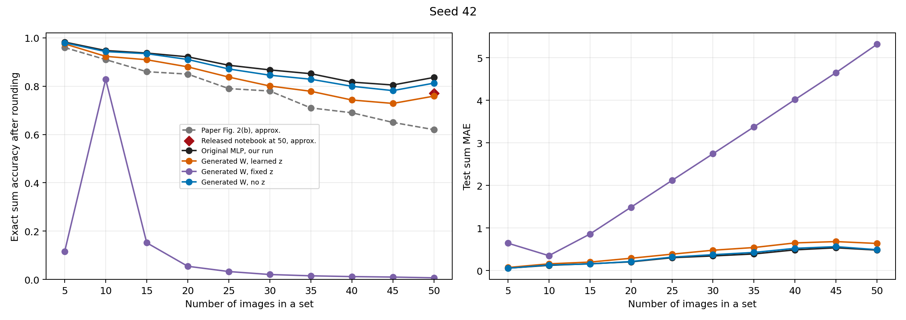
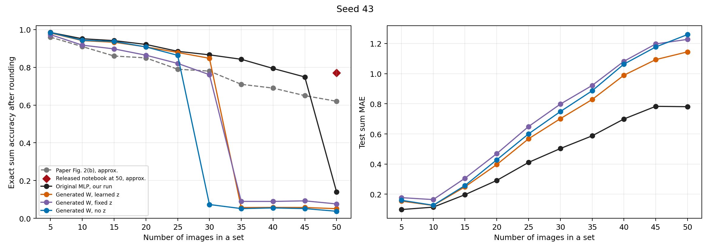
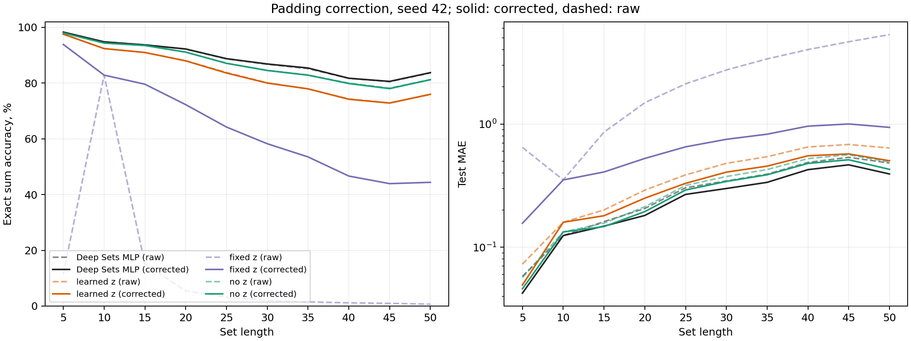
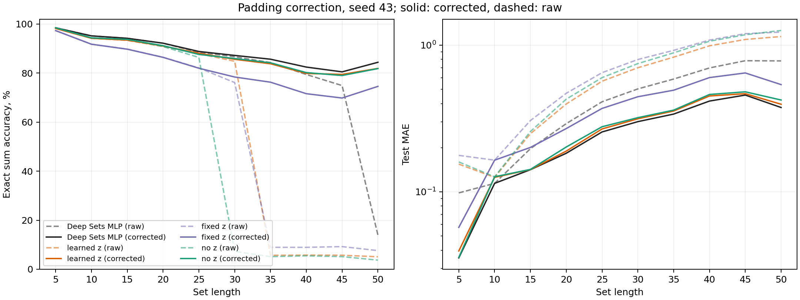
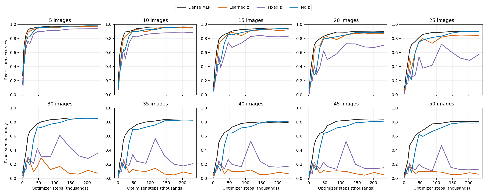
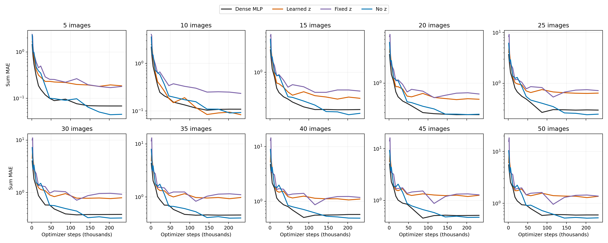
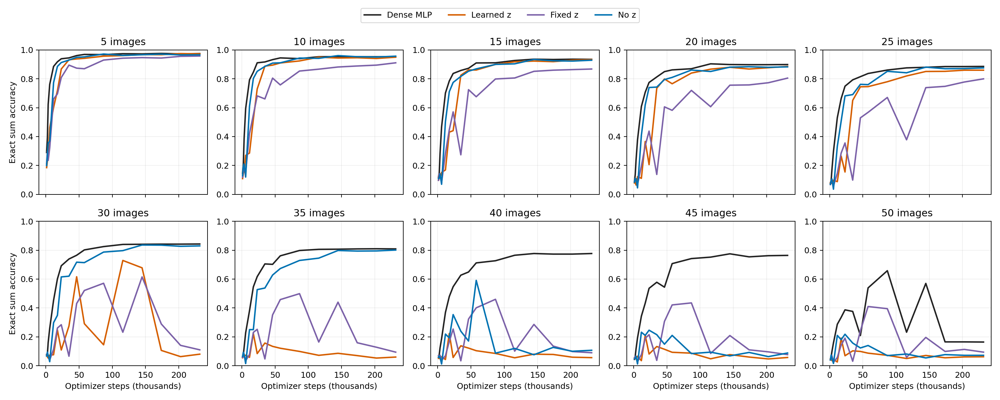
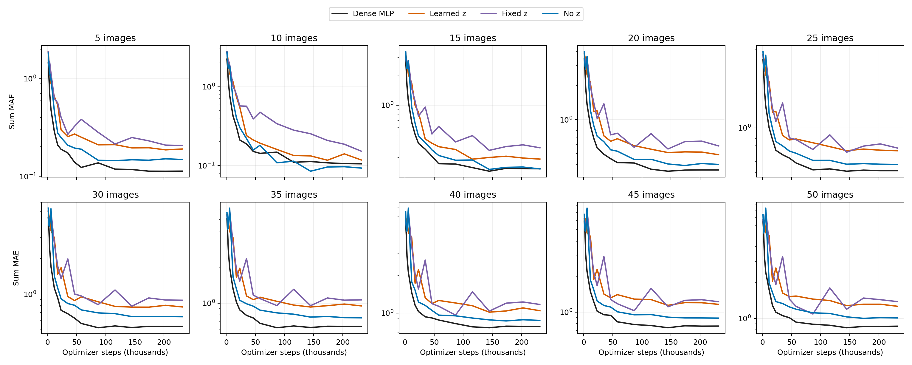
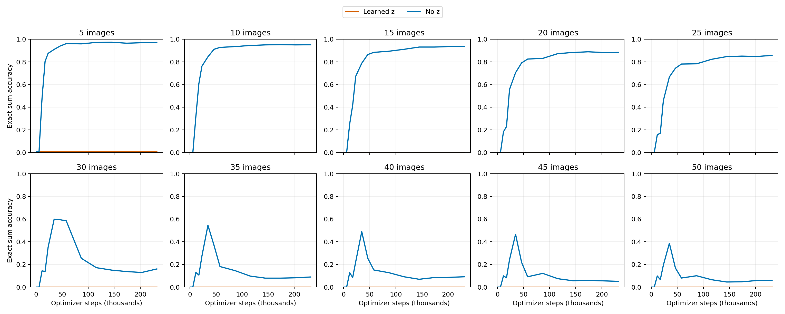
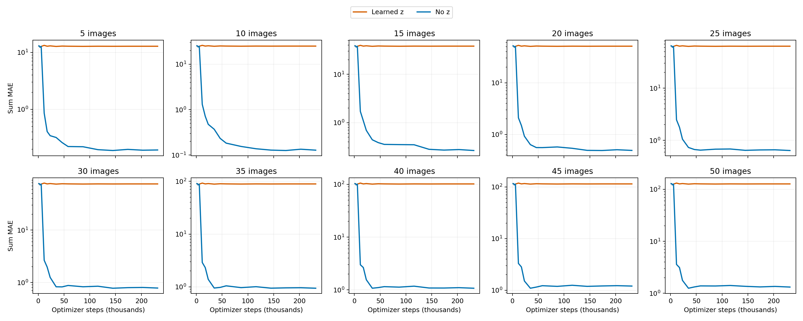

# Сумма цифр на MNIST8m

## Задача и сравнение

Модель получает набор изображений цифр и предсказывает **одно число — сумму цифр**. При обучении ей не показывают метку отдельного изображения: классы используются только при подготовке целевой суммы. Точность на тесте — доля наборов, для которых предсказание после округления в точности равно сумме.

Контроль повторяет модель из [открытого ноутбука авторов Deep Sets](https://github.com/manzilzaheer/DeepSets/blob/master/DigitSum/image_sum.ipynb): для каждого изображения `784 → 300 → 100 → 30` с `tanh`, затем сумма 30-мерных векторов по набору и линейный выход. В нашем варианте только матрица слоя `100 → 30` задаётся как `W = Uv`: генератор по **координатам веса** и, в двух вариантах, общему четырёхмерному `z` выбирает для каждого из 3000 весов одно из 16 общих значений `v`. И `U`, и `v` обучаются общими для всех наборов, отдельный `v` для каждой последовательности не нужен. Ни изображение, ни позиция изображения в наборе в генератор не поступают. Остальная сеть и целевая функция одинаковы.

Всего обучаемых параметров: 268 661 у контрольной сети, 266 465 с обучаемым `z`, 266 461 с фиксированным `z` и 266 397 без `z`. Основную часть параметров во всех вариантах составляет общий первый слой обработки изображения; замена касается только матрицы из 3000 весов.

Сравниваются контрольная сеть, обучаемый `z`, один фиксированный `z` и отсутствие `z`. При одном seed все три генерируемых варианта начинают с одинаковых `U` и предсказаний. Более того, любое **одно общее** значение `z` можно точно включить в смещение первого слоя генератора: если первый слой равен `Ac + Bz + b`, то без `z` он равен `Ac + (Bz+b)`. Поэтому эксперимент проверяет, помогает ли обучение `z` найти хорошее решение, а не добавляет ли оно новые представимые матрицы `U`.

## Данные и протокол

Использован [зеркальный MNIST8m](https://huggingface.co/datasets/MarveenLee/MNIST8M): 8,1 млн изображений `28×28`, пиксели `uint8` от 0 до 255. Архитектура, формирование наборов и обучение следуют [коду авторов](https://github.com/manzilzaheer/DeepSets/blob/master/DigitSum/image_sum.ipynb): первый из восьми блоков изображений идёт на обучение, остальные — на тест; 150 000 наборов до деления на 148 148 обучающих и 1 852 валидационных; длины обучения **1–9** (верхняя граница `randint` не включена); по 10 000 тестовых наборов каждой длины 5, 10, ..., 50. Как в ноутбуке, изображения цифры 0 пропускаются из-за зарезервированного индекса дополнения. Источники изображений для обучения и теста не пересекаются.

Оптимизатор — Adam с шагом `0.001` и `epsilon=0.001`, пакет 128, ошибка MAE, 500 эпох, снижение шага при плато валидации. Тестируются **последние** веса после 500-й эпохи, как в ноутбуке. Мы инициализируем обычные плотные слои схемой Glorot uniform, как Keras. Основной запуск также воспроизводит поведение авторской `Lambda(K.sum)`: дополненные позиции получают изображение по индексу 0, проходят через плотные слои и входят в сумму. Отдельно проведён контроль с явной маской, который исключает эти позиции. Пиксели делятся на 255: в опубликованном ноутбуке такой строки нет, но на доступном зеркале с пикселями 0–255 без деления ошибка контроля после 10 эпох была 1,395 против примерно 0,276 в ноутбуке; с делением — 0,237. Более того, README авторов описывает их бинарные пиксели как `int32`, тогда как загрузчик ноутбука читает их через `np.fromfile` без указания типа. Поэтому точная обработка исходных авторских файлов не восстановлена, а численное сравнение со статьёй ориентировочное.

Точки Deep Sets на графике взяты **приблизительно** из [рис. 2(b) статьи](https://papers.neurips.cc/paper_files/paper/2017/file/f22e4747da1aa27e363d86d40ff442fe-Paper.pdf): таблицы точных значений в статье нет. Для 50 изображений статья показывает около **62%**, а [график в выпущенном авторами ноутбуке](https://github.com/manzilzaheer/DeepSets/blob/master/DigitSum/image_sum.ipynb) — около **77%**. Эти два ориентира нельзя смешивать. Ноутбук также отличается от текстового описания статьи числом наборов и фактическими длинами обучения; здесь выбран именно опубликованный код.

## Результаты

Основной опыт повторяет дополнение наборов из ноутбука. Ниже — **результаты каждого seed отдельно** после 500 эпох на 10 000 тестовых наборов длины 50. Точность означает точное совпадение суммы после округления; MAE измеряется в единицах суммы.

| Seed | Модель | Точность ↑ | MAE ↓ |
| --- | --- | ---: | ---: |
| 42 | Deep Sets, плотный слой | 83,62% | 0,482 |
| 42 | Генератор, обучаемый `z` | 75,88% | 0,638 |
| 42 | Генератор, фиксированный `z` | 0,66% | 5,316 |
| 42 | Генератор без `z` | **81,26%** | **0,491** |
| 43 | Deep Sets, плотный слой | 13,92% | 0,781 |
| 43 | Генератор, обучаемый `z` | 5,09% | **1,145** |
| 43 | Генератор, фиксированный `z` | **7,61%** | 1,228 |
| 43 | Генератор без `z` | 3,72% | 1,259 |

Жирным выделен лучший результат генератора по каждому столбцу на данном seed. На seed 42 отсутствие `z` лучше обучаемого `z`; на seed 43 обучаемый `z` даёт немного меньшую MAE, но **все** варианты плохо переносятся с обучающих длин 1–9 на длину 50. Даже плотный контроль на seed 43 даёт только 13,92% точных сумм. При этом точность на короткой валидации у всех вариантов, кроме фиксированного `z` на seed 42, превышает 94%. Поэтому короткая валидация не обнаруживает провал на длинных наборах. MAE нужен вместе с точностью: небольшой систематический сдвиг предсказаний через порог округления может резко изменить долю точных ответов.

Для ориентира: на длине 50 [статья Deep Sets](https://papers.neurips.cc/paper_files/paper/2017/file/f22e4747da1aa27e363d86d40ff442fe-Paper.pdf) показывает около 62% точных сумм, а [выложенный ноутбук](https://github.com/manzilzaheer/DeepSets/blob/master/DigitSum/image_sum.ipynb) — около 77%. Это приближённые значения с графиков. Из-за различий в доступных данных и обработки пикселей наши числа нельзя трактовать как строгое превосходство над статьёй.





Контроль с **явной маской** дополнения даёт более устойчивые результаты: на длине 50 у генератора без `z` точность 83,51% и 84,79% для seeds 42 и 43, с обучаемым `z` — 76,68% и 82,35%. Плотный контроль получает 83,72% и 85,30%; фиксированный `z` на единственном seed 42 — 81,54%. Это другой способ обработки дополнения, поэтому его результаты нельзя объединять с основной таблицей. [Числа](summary_masked.json), [график seed 42](summary_masked_seed42.png), [график seed 43](summary_masked_seed43.png). Полные данные основного опыта: [сводка](summary_notebook_padding.json) и [результаты запусков](results_notebook_padding/).

**Вывод:** в этих опытах обучаемый общий `z` не даёт воспроизводимого выигрыша относительно его отсутствия. Большие провалы фиксированного `z` и других вариантов в основном опыте связаны также с обработкой дополнения, описанной ниже; по ним нельзя судить о представительной способности `z`. Оценка всего на двух seeds после 500 эпох не позволяет утверждать, что `z` бесполезен в любой архитектуре или задаче.

### Почему результаты зависят от seed

Гиперпараметры и данные у seeds 42 и 43 одинаковы: Adam `0.001`, `epsilon=0.001`, пакет 128, MAE, 500 эпох и один набор обучающих и тестовых примеров. Плотная сеть на обоих seeds достигает MAE около `0.010` на обучении и `0.067` на короткой валидации. Значит, её результат на длине 50 — не провал обучения на коротких наборах.

В буквальном варианте ноутбука каждый обучающий набор дополнен до **10 мест** одним и тем же изображением с индексом 0. Пусть `s(x)` — вклад изображения в выход после всех слоёв, `s₀` — вклад дополняющего изображения, `b` — смещение выходного слоя, `L` — число настоящих изображений. Обучающая сеть выдаёт `Σs(x) + (10−L)s₀ + b`. На обоих seeds она выучила `b ≈ −10s₀`, поэтому вклад дополнения почти взаимно уничтожается. Но тестовый набор длины 50 уже не имеет дополнения: относительно представления `Σ(s(x)−s₀)` остаётся сдвиг `b + 50s₀`.

| Плотная сеть | `s₀` | `b + 50s₀` | Медианная ошибка на первых 1000 наборах длины 50 |
| --- | ---: | ---: | ---: |
| Seed 42 | −0,00341 | −0,13646 | −0,1369 |
| Seed 43 | −0,01321 | −0,52847 | −0,5287 |

Медианы совпадают с предсказанным сдвигом. При округлении ошибка около `−0,53` пересекает границу `−0,5`: поэтому точность seed 43 падает особенно резко между длинами 45 и 50. Та же компенсация обнаружена у вариантов с генератором: например, у фиксированного `z` на seed 42 `b + 50s₀ = −5,019`, что объясняет большую часть его MAE `5,316`. **Это недостаток переноса схемы дополнения на другую длину**, а не свидетельство того, что гиперпараметры на seed 43 не позволили сети обучиться.

Проверка с явной маской исключает вклад дополняющего изображения при обучении. Тогда общий сдвиг вклада одной картинки нельзя компенсировать одним `b` сразу для всех обучающих длин 1–9. При тех же данных и основных гиперпараметрах плотная сеть получает **83,72%** на seed 42 и **85,30%** на seed 43. Это подтверждает роль дополнения, но остаётся отдельным протоколом. Различия инициализации и порядка обучающих пакетов задаются seed; по сохранённым запускам нельзя отдельно оценить вклад каждого из них в выбранное значение `s₀`.

### Коррекция старых моделей без переобучения

Чтобы убрать только найденный сдвиг, мы пересчитали предсказания всех восьми старых моделей по правилу `новое предсказание = старое − (L−10)s₀`. Значение `s₀` вычисляется по сохранённым весам и известному изображению дополнения; тестовые ответы для коррекции **не используются**. При ширине входного массива 10, как на обучении, поправка равна нулю. Оценка ниже — на тех же 10 000 наборах длины 50:

| Seed | Модель | Исправленная точность ↑ | Исправленная MAE ↓ |
| --- | --- | ---: | ---: |
| 42 | Deep Sets, плотный слой | 83,72% | 0,393 |
| 42 | Генератор, обучаемый `z` | 75,96% | 0,503 |
| 42 | Генератор, фиксированный `z` | 44,38% | 0,939 |
| 42 | Генератор без `z` | 81,19% | 0,428 |
| 43 | Deep Sets, плотный слой | 84,38% | 0,376 |
| 43 | Генератор, обучаемый `z` | 81,88% | 0,395 |
| 43 | Генератор, фиксированный `z` | 74,56% | 0,538 |
| 43 | Генератор без `z` | 81,82% | 0,423 |

Резкий провал seed 43 исчез. У фиксированного `z` на seed 42 качество всё ещё плохое после коррекции: один лишь сдвиг дополнения не объясняет все ошибки обучения этой модели. Сравнение обучаемого `z` с отсутствием `z` пока основано всего на двух seeds: на seed 42 лучше вариант без `z`, на seed 43 они практически равны. [Подробные числа](padding_correction.json) и графики:





### Скорость сходимости

Отдельные парные обучения с начальными числами 42 и 43 для всех четырёх вариантов и дополнительным числом 44 для сравнения learned-`z` с no-`z` сохраняют на заранее заданных эпохах 1, 2, 3, 5, 10, 15, 20, 30, 40, 50, 75, 100, 125, 150, 175 и 200 качество для **каждой** тестовой длины 5, 10, ..., 50. На каждой точке берутся одни и те же первые 1000 отложенных наборов соответствующей длины. Кривые показывают MAE суммы и долю точно угаданных после округления сумм от **числа шагов оптимизатора**, а не только от эпох. Эти отложенные наборы используются только для измерения; выбор весов и изменение шага обучения определяются валидацией длины 1–9. Время обучения тоже сохраняется, чтобы отделить сходимость по шагам от скорости вычислений.

На 200-й эпохе, после 231 600 шагов, результаты на 1000 наборах длины 50 таковы:

| Seed | Обучаемый `z`: точность / MAE | Без `z`: точность / MAE |
| --- | ---: | ---: |
| 42 | 5,7% / 1,364 | **78,6% / 0,525** |
| 43 | 6,2% / 1,263 | **7,2% / 1,008** |
| 44 | 0,0% / 127,184 | **5,9% / 1,318** |

На seed 44 обучение с `z` действительно **не сошлось**: MAE даже на короткой валидации осталось 11,613 против 0,102 без `z`. На seed 42 у `z` было небольшое преимущество по точности в начале (20-я эпоха), но уже к 30-й вариант без `z` обогнал его. Устойчивого ускорения сходимости по шагам здесь не видно. Эти кривые относятся к **отдельным 200-эпоховым запускам**, а не к первым 200 эпохам строк основной таблицы. [Числовые траектории](convergence.json).













## Воспроизведение

Скачать `MNIST8M_data.h5` и `labels.txt` из [зеркала](https://huggingface.co/datasets/MarveenLee/MNIST8M/tree/main) в `datasets/mnist8m/`. Каталог `datasets/` исключён из Git. Запуски проведены с Python 3.10, NumPy 2.2.6, h5py 3.16.0, PyTorch 2.3.1+cu121 и Matplotlib 3.10.8.

```bash
python -m deepsets_z.mnist8m.prepare
python -m deepsets_z.mnist8m.prepare_authors
python -m deepsets_z.mnist8m.run --arm paper_mlp --seed 42 --device cuda:0 \
  --sets-subdir sets_authors --train-sets 148148 --paper-initialization \
  --pixel-scale 255 --batch-size 128 --max-epochs 500 --min-epochs 500 \
  --patience 999 --padding-mode notebook --evaluation-checkpoint last \
  --output deepsets_z/mnist8m/results_notebook_padding
```

Заменить `--arm` на `learned_z`, `fixed_z` или `no_z` и повторить с указанными ниже начальными числами. Для сводки: `python -m deepsets_z.mnist8m.summarize --results deepsets_z/mnist8m/results_notebook_padding --output deepsets_z/mnist8m/summary_notebook_padding.json`.

Для кривых сходимости используется та же команда с `--max-epochs 200 --min-epochs 200 --probe-epochs 1,2,3,5,10,15,20,30,40,50,75,100,125,150,175,200 --probe-set-count 1000 --output deepsets_z/mnist8m/results_convergence`; запуск повторяется для всех вариантов и seeds 42–43, а для learned-`z` и no-`z` ещё с seed 44. Построение: `python -m deepsets_z.mnist8m.plot_convergence --results deepsets_z/mnist8m/results_convergence --output deepsets_z/mnist8m/convergence.json`.

## Следующий опыт: расположение и мощность генератора

Подготовлен отдельный [скрипт](placement_sweep.py) без `z`. Каждый запуск заменяет **один** слой плотной модели; остальные слои начинают с тех же весов, что плотный контроль. Используется явная маска дополнения, один seed `42`, те же 148 148 обучающих наборов, 500 эпох, Adam `0.001`, пакет 128 и последние веса. Оценка — 10 000 тестовых наборов для каждой длины 5–50. Сохраняются точность, MAE, число параметров, время и кривые качества по шагам для всех десяти длин; в сводке показаны длины 5, 20, 35 и 50.

| Расположение | Варианты |
| --- | --- |
| Последний `100→30` | 16 значений / ширина 16; 16 значений / ширина 32; прямой непрерывный выход / ширина 32 |
| Средний `300→100` | 16 значений / ширина 16; 64 значения / ширина 64; прямой непрерывный выход / ширина 64 |
| Первый `784→300` | 16 значений / ширина 16; 64 значения / ширина 64; 256 значений / ширина 64; прямой непрерывный выход / ширина 64 |

Всего 10 вариантов генератора и один плотный контроль. Для первого слоя генератор получает двухмерные координаты пикселя и индекс выходного нейрона; для остальных — индексы входного и выходного нейронов. Начальный масштаб каждой генерируемой матрицы приводится к масштабу Glorot соответствующего плотного слоя. Число обучаемых параметров каждого варианта выводит команда просмотра:

```bash
python -m deepsets_z.mnist8m.placement_sweep --dry-run
```

Для запуска всех вариантов и построения отчёта:

```bash
python -m deepsets_z.mnist8m.placement_sweep --devices auto
python -m deepsets_z.mnist8m.summarize_placement_sweep
```

`--devices auto` использует только карты с нулевой текущей утилизацией и **не запрашивает сведения об их памяти**. Можно указать карты явно, например `--devices 0,1,2`. Завершённые варианты пропускаются; прерванный вариант продолжает обучение с последней сохранённой полной эпохи, включая оптимизатор и генератор порядка пакетов. При остановке новые варианты не стартуют. Результаты пишутся в отдельную директорию `results_placement_sweep/`, а отчёт — в `placement_sweep_summary.md`. На данный момент завершены **8 из 11** вариантов; три варианта генератора на первом слое остались незавершёнными.

## Прямое обучение U на новых задачах

Отдельные опыты без генератора проверяют общий принцип `W = Uv`: `U` обучается на семействе задач, а `v` адаптируется по размеченным наборам новой задачи. В [опыте на последнем слое](META_U_RESULTS.md) выигрыш относительно случайной фиксированной `U` составил около 5% по MAE. В [опыте на первом слое](META_U_FIRST_RESULTS.md) обучаемая `U` выиграла у фиксированной случайной `U` и плотного первого слоя на сдвинутых изображениях, однако проверка сдвига не обнаружила в заданной карте признаков свёрточной структуры. Протоколы этих двух опытов различаются, поэтому величины выигрыша нельзя прямо сравнивать.

[Продолжение на первом слое](META_U_FIRST_GENERATOR_RESULTS.md) заменяет прямую `U` координатным генератором. На трёх seed четыре варианта генератора уступили прямой `U` и плотному первому слою; перемешивание пространственных координат почти не повлияло на качество. Отдельная диагностика обнаружила почти постоянные признаки у двух вариантов без ортогонализации, поэтому их малая ошибка сдвига не означает найденную свёртку.

[Опыт с кодом изображения](META_U_FIRST_IMAGE_CODE_RESULTS.md) проверяет, помогает ли генератору U дополнительный сигнал от входной картинки. Пока приведён один seed 42, шесть вариантов, контроль с выключением кода и сводный график.

### Ночной прогон: мощность энкодера для v

[Скрипт](encoder_sweep.py) оставляет пространственный генератор с ортогональной U, задачи, адаптацию v и 5000 шагов без изменений. Меняется только энкодер изображения, выдающий 32 множителя для v: MLP шириной 32, 128, 256 или 512; двухслойный MLP шириной 256; свёрточные варианты с 32 или 64 каналами на выходе. Исходный MLP шириной 64 уже обучен на seed 42 и берётся из [предыдущего опыта](meta_u_first_image_code_results/generated_ortho_seed42.json). Свёрточный вариант с 32 каналами имеет 55 008 параметров против 52 320 у исходного MLP, поэтому сравнивает архитектуры при близком размере. Плотный слой и прямо обучаемая U тоже показаны на итоговом графике.

Запуск из корня проекта:

```bash
python -m deepsets_z.mnist8m.encoder_sweep --dry-run
python -m deepsets_z.mnist8m.encoder_sweep --devices auto
```

Автоматический выбор использует только карты с нулевой текущей утилизацией; сведения о памяти карт не запрашиваются. Команду можно повторить после прерывания: завершённые варианты пропускаются, остальные продолжаются с последней контрольной точки. Ход обучения каждого варианта записывается в `deepsets_z/mnist8m/outputs/meta_u_first_encoder_sweep/logs/`; числовые результаты, `encoder_sweep_summary.json` и общий график `encoder_sweep_summary.png` — в родительский каталог. Он исключён из Git. Если нужны конкретные карты, укажите, например, `--devices 0,1,2`. После завершения результаты можно пересобрать командой `python -m deepsets_z.mnist8m.summarize_encoder_sweep`.

[Результаты этого прогона](META_U_FIRST_ENCODER_SWEEP_RESULTS.md): на seed 42 свёрточный энкодер с 32 каналами почти сравнялся с плотным контролем, а увеличение ширины MLP не помогло.

### MoE из векторов v

[Новый опыт](meta_u_first_v_moe.py) заменяет непрерывные 32 множителя кода изображения смесью из K обучаемых векторов v. Свёрточный маршрутизатор выдаёт веса смеси для каждого изображения; по 32 размеченным наборам новой задачи адаптируются K скалярных коэффициентов экспертов и выходной слой. Генератор ортогональной U и остальной протокол оставлены как в опыте выше. Метки отдельных цифр в маршрутизатор не поступают; они используются только после обучения для диагностики выбора экспертов.

Для K=10 и K=32 [скрипт запуска](v_moe_sweep.py) сравнивает три веса штрафа за сходство направлений экспертов: 0, 0,05 и 0,2. Штраф равен среднему квадрату внедиагональных элементов матрицы скалярных произведений **нормированных** v; их длина остаётся свободной. Контроль K=1 не нуждается в маршрутизаторе. Один seed 42, 5000 внешних шагов и те же новые задачи при тестировании.

```bash
python -m deepsets_z.mnist8m.v_moe_sweep --dry-run
python -m deepsets_z.mnist8m.v_moe_sweep --devices auto
```

Завершённые варианты пропускаются, прерванные продолжаются с контрольной точки. Логи и результаты находятся в `deepsets_z/mnist8m/outputs/meta_u_first_v_moe/`; после полного запуска там появятся `v_moe_summary.png`, `v_moe_convergence.png` и `v_moe_summary.json`. Выбор карт запрашивает только текущую утилизацию, не сведения об их памяти.

[Результаты MoE](META_U_FIRST_V_MOE_RESULTS.md): на seed 42 смесь из 32 векторов v со штрафом 0,2 достигла MAE 1,155 на длине 5 против 1,319 у непрерывного conv32-кода и 1,141 у прямо обучаемой U. Перемешивание маршрутов между изображениями заметно ухудшило качество.

Для поиска числа экспертов при фиксированном штрафе 0,2 тот же скрипт поддерживает `--counts all`: новые значения K = 16, 24, 48, 64, 96, 128 сравниваются с сохранёнными K = 10 и 32. Ранг v и U остаётся 32, поэтому при K > 32 все эксперты не могут быть попарно ортогональны. Штраф остаётся мягким и его математический минимум показан на итоговом графике. Команда `python -m deepsets_z.mnist8m.v_moe_sweep --counts all --devices auto` сохраняет результаты в отдельный каталог `outputs/meta_u_first_v_moe_counts/`; повторный запуск пропускает завершённые варианты.

[Результаты поиска числа экспертов](META_U_FIRST_V_MOE_COUNT_RESULTS.md): дополнительно проверены K = 160, 192, 256. На одном seed минимальный валидационный критерий и MAE на длине 20 даёт K = 96. На длине 5 K = 128 лучше лишь на 0,008 MAE при большем числе параметров. Рост K одновременно увеличивает число адаптируемых коэффициентов задачи, поэтому это подбор конфигурации модели, а не изолированный эффект числа векторов. Роутер получает только пиксели; целевые стоимости цифр поступают модели через размеченные support-наборы.

Для проверки роли свёрточного prior роутер можно заменить на MLP `784 → width → K`, где width автоматически выбран так, чтобы число параметров роутера почти совпадало с `conv32` при том же K. Команда `python -m deepsets_z.mnist8m.v_moe_sweep --router mlp --counts 48,96,128 --devices auto` обучает три варианта с прежними данными, задачами, U, λ = 0,2 и числом шагов. Результаты пишутся в `outputs/meta_u_first_v_moe_router_mlp/` и сравниваются со свёрточными вариантами в [отчёте по роутерам](META_U_FIRST_V_MOE_ROUTER_RESULTS.md).

При 5000 шагах свёртка лучше MLP для K = 48, 96 и 128. Дополнительный опыт при K = 96 и 10 000 шагах сохраняет преимущество свёртки: MAE 0,994 против 1,097 на длине 5 и 2,225 против 2,493 на длине 20. Для воспроизведения продлённого опыта используйте тот же `v_moe_sweep` с `--counts 96 --steps 10000 --router conv` и отдельно `--router mlp`, задав разные каталоги через `--out`.

Оба запуска K = 96 затем продолжены из checkpoint до плато валидации: `--resume --steps 60000 --early-stop-patience 16 --early-stop-min-delta 0.002 --min-steps 12000` для `meta_u_first_v_moe`, с прежними `--router`, `--experts 96`, `--ortho-weight 0.2` и `--out`. Свёртка остановилась на шаге 34 750, MLP — на 41 000. Команда `python -m deepsets_z.mnist8m.evaluate_v_moe_router_lengths --device cuda:0` сравнивает их лучшие checkpoint на длинах до 50. [Итоговый отчёт и графики](META_U_FIRST_V_MOE_ROUTER_RESULTS.md): после длительного обучения разрыв на длине 20 мал (1,907 против 1,925 MAE), на длине 50 убедительного различия нет (3,661 против 3,631). Рабочие checkpoint остаются в `outputs/`, итоговые JSON и графики сохранены рядом с отчётом.

### Дообучение на обычной сумме цифр

[Отчёт и графики](V_MOE_DIGIT_SUM_FINETUNE_RESULTS.md) проверяют, может ли модель после обучения на случайных стоимостях цифр решать обычную сумму. Общая сгенерированная `U` и два следующих слоя заморожены; на наборах `sets_authors` дообучаются роутер, эксперты `v` и в отдельных вариантах коэффициенты смеси и выходной вектор. На сырых суммах лучший свёрточный вариант получает **81,85%** точных ответов на длине 50 против **83,72%** у плотной MLP. Если обучать только роутер и `v` при фиксированном выходе, получается **1,74%**.

### Контроли способа получения U для обычной суммы

График обычной суммы сам по себе не выделяет вклад генератора: в исходном
опыте не было той же MoE-модели с кронекеровской или фиксированной случайной
`U`. Команда ниже сначала повторяет предварительное обучение на случайных
стоимостях цифр с тремя контролями, затем фиксирует полученную `U`, дообучает
модель на обычной сумме и обновляет график
`mds/assets/2026-09-19/mnist8m_middle_unfreeze.png`:

    conda run --no-capture-output -n ras python -m deepsets_z.mnist8m.digit_sum_u_control_sweep --devices auto

Во время уже запущенного обучения подробный прогресс можно смотреть в другом
терминале, не останавливая процессы:

    python -m deepsets_z.mnist8m.digit_sum_u_control_sweep --monitor

Контроли используют тот же seed 42, свёрточный роутер, 96 экспертов `v`, поток
мета-задач, критерий остановки и данные DigitSum. Проверяются обучаемая
кронекеровская `U`, фиксированная случайная `U` и фиксированная аналитическая
свёрточная `U`. Кронекеровский контроль следует параметризации авторов статьи:
`W = A V B^T`, где `A` имеет размер `785 × 8`, `V` — `8 × 4`, а `B` —
`300 × 4`. Поэтому `vec(V)` содержит те же 32 числа, что и векторы `v` во всех
остальных вариантах. Для кронекеровской `U` строятся оба режима заморозки; для фиксированных
контролей используется наиболее сильный режим, где после предварительного
обучения фиксируется только `U`. Завершённые этапы пропускаются, прерванные
продолжаются, подробный вывод пишется в
`outputs/meta_u_first_v_moe_u_controls/logs`. Итоговые числа сохраняются в
`digit_sum_u_control_summary.json`.

Бинарный контроль использует ту же форму `235500 × 32`, но каждая строка
задаёт ровно одну из 32 компонент `v`. Во время meta-обучения generated
assignment остаётся row-stochastic и непрерывной; на валидации, при переносе
на обычную сумму и на тесте применяется one-hot `argmax`. Это сохраняет
градиент через softmax на обучении и соответствует протоколу Yeh. Шесть
вариантов температуры и регуляризации выбирались по hard-валидации. Лучший
вариант (`1 → 0.05`, entropy `0.01`, balance `0.1`) сравнивался с фиксированной
случайной one-hot `U`; обе модели обучались до плато, после чего замораживалась
только `U`. На длине 50 они получили соответственно **79,00% / 0,548 MAE** и
**78,96% / 0,558 MAE**. Подробные настройки и числа сохранены в
[`binary_u_summary.json`](binary_u_summary.json); обе кривые входят в общий
график `mds/assets/2026-09-19/mnist8m_middle_unfreeze.png`.

Для короткого `v` единичная `U` не определена: первый слой использует
прямоугольную матрицу размера `235500 × 32`. Единичная `U` требует вектор `v`
длины `235500`; тогда `W = Iv` является обычным плотным первым слоем. Поэтому
чёрная кривая плотной MLP на левом графике показывает функционально
эквивалентный полноранговый случай `U = I` (её протокол обучения отличается от
MoE-контролей). Аналитическая свёрточная `U` дополнительно задаёт осмысленный
фиксированный базис того же ранга 32, что у генератора.

После получения лучших checkpoint из предыдущего опыта запуски воспроизводятся так:

```bash
python -m deepsets_z.mnist8m.finetune_v_moe_digit_sum --router conv --trainable router_v_head --device cuda:0 --target-center 0 --target-scale 1 --out deepsets_z/mnist8m/outputs/v_moe_digit_sum_finetune_raw
python -m deepsets_z.mnist8m.finetune_v_moe_digit_sum --router conv --trainable router_v --device cuda:0
python -m deepsets_z.mnist8m.summarize_v_moe_digit_sum_finetune
```

Первый запуск обучает предсказание сырой суммы, второй повторяет буквальную проверку только роутера и `v`. Скрипт поддерживает `--router mlp`, `--trainable router_v_readout` и `--trainable router_v_coeff`; контрольные точки и подробные логи остаются в исключённом из Git `outputs/`. Сводные числа и графики сохранены рядом с отчётом.
