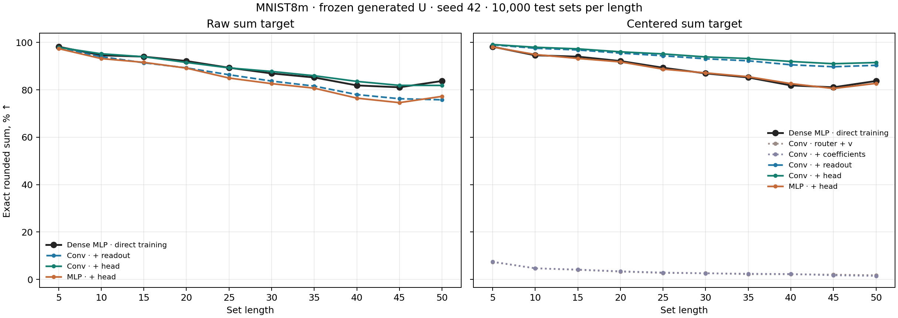
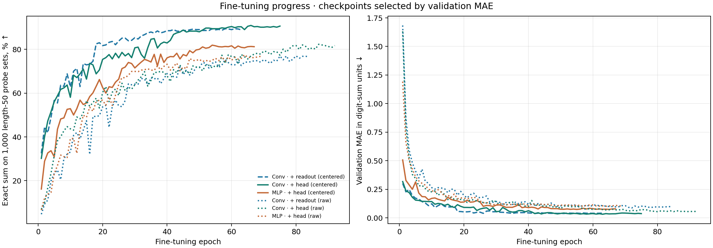

# Сумма цифр с замороженной общей U

**Проверка.** Взяли модели с 96 экспертами `v`, ранее обученные на задачах со случайной стоимостью каждой цифры. Генератор по координатам весов создаёт одну общую матрицу `U` первого слоя; роутер по изображению смешивает 96 общих 32-мерных `v`. Для обычной суммы цифр зафиксировали `U` и оба следующих слоя. Дообучали роутер и экспертов; отдельно проверили, нужно ли дообучать коэффициенты смеси и 31 параметр выхода. На тесте все параметры фиксированы, отдельной адаптации для набора нет. После дообучения `U` совпадает с исходной побитно: максимальное изменение равно **0**.

**Данные и выбор модели.** Использованы те же `sets_authors` MNIST8m, что у [dense MLP в прежнем опыте](results_authors_scaled/paper_mlp_seed42.json): 148 148 обучающих наборов из цифр 1–9, маска дополнения, длины 1–9, пиксели `/255`; 10 000 тестовых наборов для каждой длины 5, 10, …, 50. Seed 42. Дообучение: Adam `lr=0.001`, `eps=0.001`, пакет 128, MAE суммы и прежний штраф за сходство экспертов `0.2`. Лучший checkpoint выбирался **только** по MAE на отдельной валидации длины 1–9; остановка после 12 эпох без улучшения, максимум 100 эпох. График сходимости использует по 1000 тестовых наборов на длину, полный тест — все 10 000. Плотный контроль обучался непосредственно сумме цифр 500 эпох и оценивался по последним весам.

## Обычная сумма без преобразования цели

| Модель: что дообучали при фиксированной U | Лучшая / последняя эпоха | Точность 5 ↑ | Точность 20 ↑ | Точность 50 ↑ | MAE 50 ↓ |
|---|---:|---:|---:|---:|---:|
| Dense MLP, все веса, без U | — / 500 | **98,19%** | **92,15%** | **83,72%** | **0,391** |
| Свёрточный роутер, `v`, коэффициенты, выход | 80 / 92 | 97,92% | 91,55% | 81,85% | 0,464 |
| MLP-роутер, `v`, коэффициенты, выход | 57 / 69 | 97,39% | 89,16% | 77,24% | 0,584 |
| Свёрточный роутер, `v`, выход; коэффициенты фиксированы | 72 / 84 | 97,65% | 89,25% | 75,78% | 0,620 |

**Вывод для исходной задачи.** Замороженная сгенерированная `U` позволяет модели научиться обычной сумме: лучший вариант на сырых целях получает **81,85%** на длине 50. Это на **1,87 процентного пункта ниже** dense MLP в данном запуске. Свёрточный роутер здесь лучше MLP-роутера на **4,61 пункта**. Один seed не позволяет оценить разброс от повторного обучения. Кроме того, у нашей модели было предварительное обучение на случайных задачах, а число эпох дообучения отличается от dense; числа сравнивают качество на общем тесте, но не изолируют пользу предобучения или генерации `U`.

## Что даёт дообучение выхода

Следующие варианты используют **центрированную** цель `(сумма − 4,5 × длина) / √8,25`; при оценке преобразование обращается до округления. Известный член `4,5 × длина` упрощает перенос на длинные наборы, поэтому эти проценты нельзя трактовать как прямой выигрыш архитектуры над dense, обученной сырой сумме.

| Свёрточный роутер: что дообучали | Точность 5 ↑ | Точность 50 ↑ | MAE 50 ↓ |
|---|---:|---:|---:|
| Только роутер и `v` | 7,33% | 1,74% | 17,711 |
| Роутер, `v`, коэффициенты; выход фиксирован | 7,45% | 1,47% | 17,712 |
| Роутер, `v`, выход; коэффициенты фиксированы | 98,99% | 90,35% | 0,257 |
| Роутер, `v`, коэффициенты и выход | **99,12%** | **91,51%** | **0,220** |
| MLP-роутер, `v`, коэффициенты и выход | 98,09% | 82,72% | 0,437 |

Буквальная схема «зафиксировать `U`, учить только роутер и `v`» **не сошлась к сложению** при этих настройках. Добавление обучаемых коэффициентов без выхода почти ничего не изменило; добавление 31 параметра выхода изменило результат радикально. Это показывает необходимость настроить выход для новой фиксированной задачи в данном запуске, а не математическую невозможность решить её одним роутером и `v`.

Всего у свёрточной модели 199 625 параметров; в варианте с коэффициентами и выходом дообучались 158 623. У MLP-роутера 199 353 / 158 351. Плотная MLP имеет 268 661 обучаемый параметр. Эти числа не учитывают стоимость предварительного обучения нашей модели. Прямой вклад `U` остаётся открытым: нужен контроль с тем же роутером и тем же дообучением, но с другой `U`.

[Числа для всех длин и кривые по эпохам](v_moe_digit_sum_finetune_summary.json) · [скрипт дообучения](finetune_v_moe_digit_sum.py) · [скрипт сводки](summarize_v_moe_digit_sum_finetune.py).
