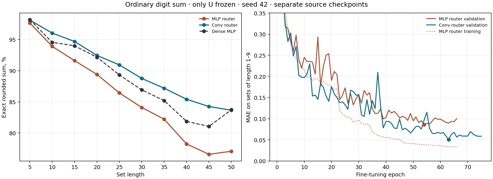

# Сумма цифр с замороженной общей U

**Проверка.** Взяли модели с 96 экспертами `v`, ранее обученные на задачах со случайной стоимостью каждой цифры. Генератор по координатам весов создаёт одну общую матрицу `U` первого слоя; роутер по изображению смешивает 96 общих 32-мерных `v`. Для обычной суммы цифр зафиксировали `U` и оба следующих слоя. Дообучали роутер и экспертов; отдельно проверили, нужно ли дообучать коэффициенты смеси и 31 параметр выхода. На тесте все параметры фиксированы, отдельной адаптации для набора нет. После дообучения `U` совпадает с исходной побитно: максимальное изменение равно **0**.

**Данные и выбор модели.** Использованы те же `sets_authors` MNIST8m, что у [dense MLP в прежнем опыте](results_authors_scaled/paper_mlp_seed42.json): 148 148 обучающих наборов из цифр 1–9, маска дополнения, длины 1–9, пиксели `/255`; 10 000 тестовых наборов для каждой длины 5, 10, …, 50. Seed 42. Дообучение: Adam `lr=0.001`, `eps=0.001`, пакет 128, MAE суммы и прежний штраф за сходство экспертов `0.2`. Лучший checkpoint выбирался **только** по MAE на отдельной валидации длины 1–9; остановка после 12 эпох без улучшения, максимум 100 эпох. График сходимости использует по 1000 тестовых наборов на длину, полный тест — все 10 000. Плотный контроль обучался непосредственно сумме цифр 500 эпох и оценивался по последним весам.

## Обычная сумма без преобразования цели

| Модель: что дообучали при фиксированной U | Лучшая / последняя эпоха | Точность 5 ↑ | Точность 20 ↑ | Точность 50 ↑ | MAE 50 ↓ |
|---|---:|---:|---:|---:|---:|
| Dense MLP, все веса, без U | — / 500 | **98,19%** | **92,15%** | **83,72%** | **0,391** |
| Свёрточный роутер, `v`, коэффициенты, выход | 80 / 92 | 97,92% | 91,55% | 81,85% | 0,464 |
| MLP-роутер, `v`, коэффициенты, выход | 57 / 69 | 97,39% | 89,16% | 77,24% | 0,584 |
| Свёрточный роутер, `v`, выход; коэффициенты фиксированы | 72 / 84 | 97,65% | 89,25% | 75,78% | 0,620 |

**Вывод для исходной задачи.** Замороженная сгенерированная `U` позволяет модели научиться обычной сумме: лучший вариант на сырых целях получает **81,85%** на длине 50. Это на **1,87 процентного пункта ниже** dense MLP в данном запуске. Свёрточный роутер здесь лучше MLP-роутера на **4,61 пункта**. Один seed не позволяет оценить разброс от повторного обучения. Кроме того, у нашей модели было предварительное обучение на случайных задачах, а число эпох дообучения отличается от dense; числа сравнивают качество на общем тесте, но не изолируют пользу предобучения или генерации `U`.

## Что даёт дообучение выхода

Следующие варианты используют **центрированную** цель `(сумма − 4,5 × длина) / √8,25`; при оценке преобразование обращается до округления. Известный член `4,5 × длина` упрощает перенос на длинные наборы, поэтому эти проценты нельзя трактовать как прямой выигрыш архитектуры над dense, обученной сырой сумме.

В этих наборах нули исключены: фактическое среднее обучающих цифр около **4,94**, поэтому `4,5 × длина` является выбранной опорной суммой, а не точным средним данного набора.

| Свёрточный роутер: что дообучали | Точность 5 ↑ | Точность 50 ↑ | MAE 50 ↓ |
|---|---:|---:|---:|
| Только роутер и `v` | 7,33% | 1,74% | 17,711 |
| Роутер, `v`, коэффициенты; выход фиксирован | 7,45% | 1,47% | 17,712 |
| Роутер, `v`, выход; коэффициенты фиксированы | 98,99% | 90,35% | 0,257 |
| Роутер, `v`, коэффициенты и выход | **99,12%** | **91,51%** | **0,220** |
| MLP-роутер, `v`, коэффициенты и выход | 98,09% | 82,72% | 0,437 |

Буквальная схема «зафиксировать `U`, учить только роутер и `v`» **не сошлась к сложению** при этих настройках. Добавление обучаемых коэффициентов без выхода почти ничего не изменило; добавление 31 параметра выхода изменило результат радикально. Это показывает необходимость настроить выход для новой фиксированной задачи в данном запуске, а не математическую невозможность решить её одним роутером и `v`.

Всего у свёрточной модели 199 625 параметров; в варианте с коэффициентами и выходом дообучались 158 623. У MLP-роутера 199 353 / 158 351. Плотная MLP имеет 268 661 обучаемый параметр. Эти числа не учитывают стоимость предварительного обучения нашей модели. Прямой вклад `U` остаётся открытым: нужен контроль с тем же роутером и тем же дообучением, но с другой `U`.

[Числа для всех длин и кривые по эпохам](v_moe_digit_sum_finetune_summary.json) · [скрипт дообучения](finetune_v_moe_digit_sum.py) · [скрипт сводки](summarize_v_moe_digit_sum_finetune.py).

## Дообучение второго и третьего слоёв при фиксированной U

Проверили предположение, что прежний разрыв с dense вызван заморозкой двух слоёв после первого. Взяли **тот же исходный checkpoint**, seed 42, свёрточный роутер, исходную сумму без преобразования цели и прежние настройки обучения. Теперь обучались также второй и третий слои; генератор `U` остался фиксированным. Число дообучаемых параметров выросло с **158 623 до 191 753**. Сравнение сохранённых весов с исходным checkpoint даёт максимальное изменение параметров генератора `U` **0**; веса обоих размороженных слоёв изменились.

| Длина набора | U и два слоя фиксированы | Только U фиксирована | Dense MLP |
|---:|---:|---:|---:|
| 5 | 97,92% | 98,14% | 98,19% |
| 20 | 91,55% | 92,45% | 92,15% |
| 40 | 83,55% | **85,42%** | 81,86% |
| 45 | 81,88% | **84,25%** | 81,06% |
| 50 | 81,85% | 83,66% | **83,72%** |

На длине 50 MAE снизилась с **0,464 до 0,441**; у dense она **0,391**. Лучший checkpoint нового варианта выбран по валидационной MAE на 63-й эпохе, остановка — на 75-й. Освобождение двух слоёв повысило точность длины 50 на **1,81 процентного пункта** и практически закрыло разрыв с dense по доле точно угаданных сумм. Это один seed; результат не выделяет отдельную пользу генератора `U` и не доказывает равенство моделей по всем метрикам.

[Полные числа и кривые нового запуска](v_moe_digit_sum_middle_unfreeze_seed42.json).

## MLP-роутер: дождались плато валидационной ошибки

Повторили дообучение с **MLP-роутером**: фиксирована только `U`, обучались роутер, эксперты `v`, коэффициенты, выход и два следующих слоя. Использовали исходную сумму без центрирования и те же настройки остановки. Стартовали с **отдельного checkpoint**, предварительно обученного с MLP-роутером; поэтому этот опыт сравнивает полные рецепты Conv и MLP, но не изолирует замену одного роутера при одинаковой `U`. Число дообучаемых параметров — **191 481**. Генератор `U` сохранился без изменения; оба следующих слоя изменились.

| Длина набора | MLP: только U фиксирована | MLP: U и два слоя фиксированы | Conv: только U фиксирована | Dense MLP |
|---:|---:|---:|---:|---:|
| 5 | 97,66% | 97,39% | 98,14% | 98,19% |
| 20 | 89,40% | 89,16% | 92,45% | 92,15% |
| 40 | 78,24% | 76,49% | 85,42% | 81,86% |
| 45 | 76,58% | 74,58% | 84,25% | 81,06% |
| 50 | **77,07%** | 77,24% | 83,66% | 83,72% |

Лучшая валидационная MAE MLP составила **0,0860 на эпохе 54** против **0,1009** у MLP с замороженными средними слоями. Затем **12 эпох без нового минимума**, остановка на эпохе 66. MAE обучения продолжала снижаться, но валидационная ошибка вышла на плато. На длине 50 MAE теста составила **0,603** против **0,584** у прежнего MLP и **0,441** у Conv с размороженными слоями. При исходном LR 0,001 этот MLP не устранил разрыв на длинных наборах; ниже проверена чувствительность к настройкам обучения.

[Полные числа и кривые MLP-запуска](v_moe_digit_sum_mlp_unfreeze_seed42.json).

## Чувствительность MLP-роутера к настройкам обучения

Для той же MLP-модели с фиксированной `U` проверили три новых начальных LR и отдельно `eps` оптимизатора Adam. Все запуски стартовали с **одного и того же предварительно обученного MLP-checkpoint**, использовали seed 42, исходную сумму, пакет 128 и штраф за сходство экспертов 0,2. Новые запуски ждали до **20 эпох без улучшения** валидационной MAE на длинах 1–9, максимум 200 эпох. Чтобы отделить изменение LR от более долгого ожидания, исходный запуск `LR=0,001` продолжили с сохранённого состояния до 20 эпох без улучшения: лучший checkpoint остался на эпохе 54, точность длины 50 не изменилась.

| MLP: LR | Adam `eps` | Лучшая / последняя эпоха | Лучшая валидационная MAE ↓ | Точность 50 ↑ | MAE 50 ↓ |
|---:|---:|---:|---:|---:|---:|
| 0,0003 | 0,001 | 73 / 93 | 0,0882 | 79,13% | 0,554 |
| **0,0005** | **0,001** | **105 / 125** | **0,0498** | **84,45%** | **0,409** |
| 0,001 | 0,001 | 54 / 74 | 0,0860 | 77,07% | 0,603 |
| 0,003 | 0,001 | 82 / 102 | 0,2006 | 45,79% | 1,557 |
| 0,001 | 0,00000001 | 92 / 112 | 0,0702 | 76,17% | 0,662 |

Лучший из этих вариантов, выбранный по **валидационной MAE**, получил на длине 50 **84,45%** против **83,66%** у Conv-роутера и **83,72%** у dense. По MAE длины 50 dense остаётся лучше: **0,391** против **0,409**. При LR 0,0005 модель дошла до плато только на эпохе 125; прежняя остановка на 66-й эпохе не давала оснований объявлять MLP-роутер слабым. При этом один seed и пять проверенных настроек не устанавливают глобально оптимальный LR или преимущество архитектуры. Другие параметры, включая размер пакета, число экспертов и вес штрафа, здесь не подбирались. Conv и MLP предобучались отдельно, а тестовые пробы по длинным наборам отслеживались во время подбора, поэтому этот результат следует считать исследовательским, а не окончательным сравнением архитектур.

[Сводка всех настроек и кривых](v_moe_digit_sum_mlp_lr_sweep_summary.json) · [полный результат лучшего запуска](v_moe_digit_sum_mlp_tuned_seed42.json).
