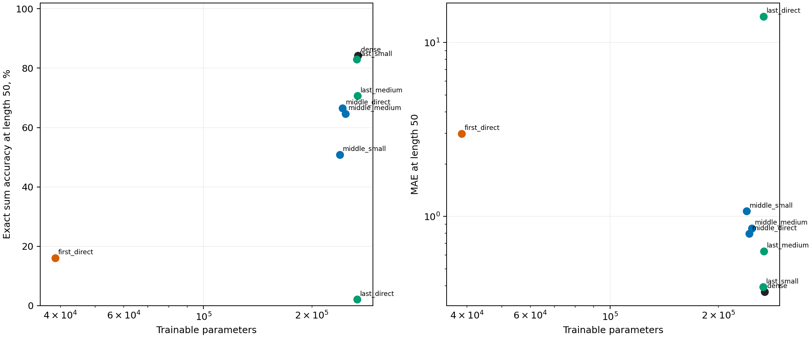
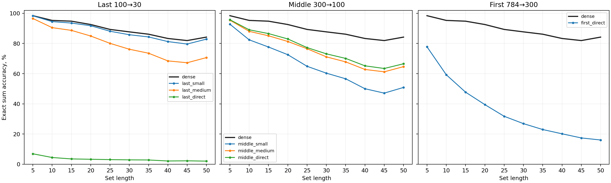
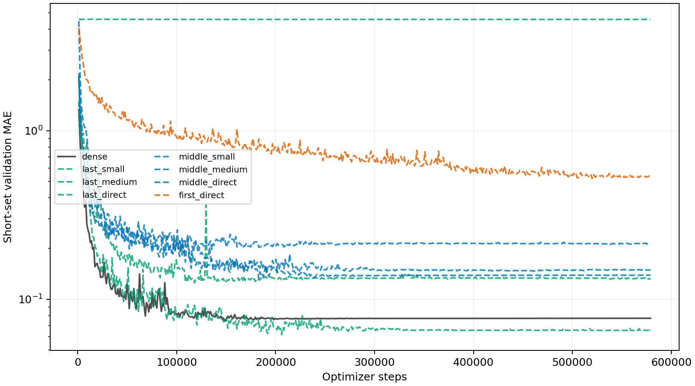
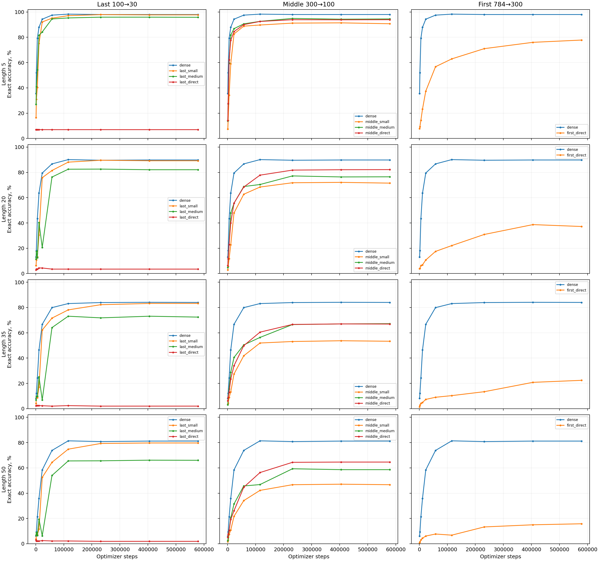
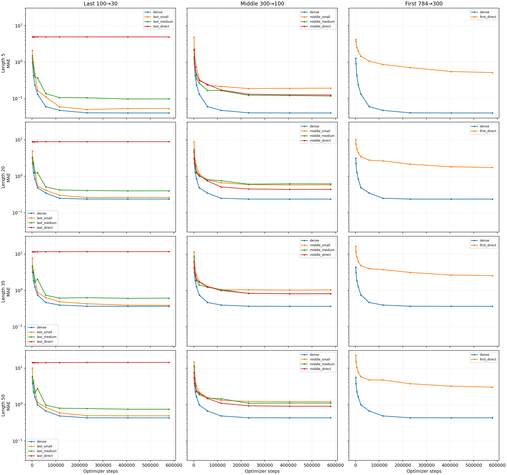

# Generated-layer placement on MNIST8m

Seed: **42**. Completed: **8/11** runs.
All runs use explicit padding masks, the same sets and optimizer. Training epochs: **500**. One seed gives an exploratory comparison, not an uncertainty estimate.

| Model | Generated layer | Generator | Parameters | Test accuracy, L=50 | Test MAE, L=50 | Train time |
| --- | --- | --- | ---: | ---: | ---: | ---: |
| `dense` | Dense control | dense | 268,661 | 84.23% | 0.368 | 26.6 min |
| `last_small` | Last 100→30 | discrete, width 16, K=16 | 266,397 | 82.90% | 0.393 | 36.1 min |
| `last_medium` | Last 100→30 | discrete, width 32, K=16 | 267,613 | 70.66% | 0.631 | 34.2 min |
| `last_direct` | Last 100→30 | direct, width 32 | 267,102 | 2.07% | 14.106 | 30.7 min |
| `middle_small` | Middle 300→100 | discrete, width 16, K=16 | 239,397 | 50.89% | 1.072 | 43.0 min |
| `middle_medium` | Middle 300→100 | discrete, width 64, K=64 | 247,749 | 64.66% | 0.854 | 37.3 min |
| `middle_direct` | Middle 300→100 | direct, width 64 | 243,590 | 66.56% | 0.796 | 31.3 min |
| `first_direct` | First 784→300 | direct, width 64 | 38,710 | 16.07% | 2.995 | 38.7 min |

Pending: `first_small`, `first_medium`, `first_large`.

