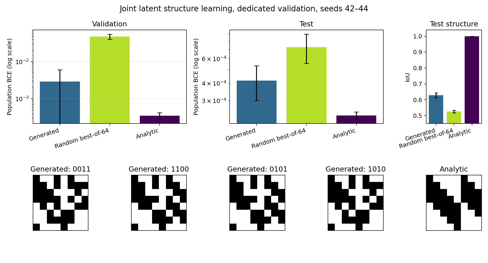

# Bilevel-обучение генератора структур

Дата: 15 сентября 2026 года.

## Постановка

Для каждой задачи `τ` и каждого из 64 latent-рестартов одновременно обучаются веса masked MLP и латент. Параметры генератора общие для всех задач.

$$
w_{\tau,r}\leftarrow\arg\min_w L_\tau^{\mathrm{support}}(G_\psi(z_{\tau,r}),w),
$$

$$
z_{\tau,r}\leftarrow\arg\min_z L_\tau^{\mathrm{validation}}(\widetilde G_\psi(z),w_{\tau,r}),
$$

$$
\psi\leftarrow\arg\min_\psi\frac1{|T|}\sum_{\tau\in T}
L_\tau^{\mathrm{query}}(G_\psi(z_{\tau,r_\tau^*}),w_{\tau,r_\tau^*}).
$$

`G` использует hard exact-32 forward и soft STE-gradient; `G̃` — continuous exact-32 relaxation для поиска `z`. Минимум по `z` ищется Adam до остановки по validation-loss. На задачу заранее строится одна стратифицированная матрица и режется по роли на support `2048`, validation `1024`, query `1024`. Финальная метрика считается точно на всех `2^8=256` входах. Gold-маска используется только после обучения.

Все `10 задач × 64 рестарта = 640 MLP` представлены четырьмя большими тензорами и обучаются без цикла по отдельным моделям.

## Результаты

Три независимых запуска: seeds `42, 43, 44`; 100 outer-шагов. В таблице среднее ± sample SD по seed.

| Split | Метод | Population BCE ↓ | Balanced accuracy ↑ | IoU с analytic ↑ |
|---|---|---:|---:|---:|
| Validation patterns | Генератор | **0.002910 ± 0.003169** | **1.0000 ± 0.0000** | **0.6208 ± 0.0200** |
| Validation patterns | Random best-of-64 | 0.048673 ± 0.007810 | 0.9845 ± 0.0043 | 0.5128 ± 0.0205 |
| Validation patterns | Analytic | 0.000350 ± 0.000070 | 1.0000 ± 0.0000 | 1.0000 |
| Test patterns | Генератор | **0.000418 ± 0.000118** | 1.0000 ± 0.0000 | **0.6277 ± 0.0155** |
| Test patterns | Random best-of-64 | 0.000728 ± 0.000173 | 1.0000 ± 0.0000 | 0.5251 ± 0.0081 |
| Test patterns | Analytic | 0.000235 ± 0.000014 | 1.0000 ± 0.0000 | 1.0000 |

| Seed | Test BCE, generator | Test BCE, random | Test BCE, analytic | Mean шагов `z` | Доля сошедшихся поисков `z` | Время |
|---:|---:|---:|---:|---:|---:|---:|
| 42 | 0.000551 | 0.000914 | 0.000226 | 73.9 | 1.00 | 112.7 s |
| 43 | 0.000374 | 0.000698 | 0.000252 | 51.8 | 1.00 | 90.1 s |
| 44 | 0.000328 | 0.000572 | 0.000228 | 56.5 | 1.00 | 95.3 s |



## Контроли

| Вариант | Test BCE | Результат |
|---|---:|---|
| Полностью soft, exact-population control, seed 42 | 0.077822 | Непрерывный objective почти нулевой, hard top-32 плохой |
| Hard STE без smooth `z`, exact-population control, 3 seeds | 0.001426 ± 0.000414 | Только 8–18% поисков `z` останавливаются до лимита |
| Hard STE + smooth `z`, exact-population control, 3 seeds | 0.001120 ± 0.000403 | 299/300 train-поисков `z` сошлись |
| Hard STE + smooth `z`, выделенный validation, 3 seeds | **0.000418 ± 0.000118** | Все train и final-eval поиски `z` сошлись при лимите 200 |

## Зафиксированный результат

- Генератор структур обошёл равный по бюджету random best-of-64 на held-out patterns: BCE `0.000418` против `0.000728`.
- Разрыв до analytic остался: `+0.000183` BCE; IoU `0.6277` против `1.0`.
- Полностью soft objective не согласован с итоговой бинарной структурой.
- На этой постановке оптимальная структура одинакова для всех patterns; генератор выдал `2–4` различных test-маски на seed. Эксперимент слабо проверяет task-dependent разнообразие структур.
- Генератор содержит `3456` параметров против `64` logits одной маски; компактность этим прототипом не подтверждена.

## Воспроизведение

Основной запуск:

```bash
bash pattern/scripts/25_joint_latent_structure.sh
```

Реализация: `pattern/bilevel_mask/latent_joint.py`; тесты: `pattern/tests/test_bilevel_mask.py`.
