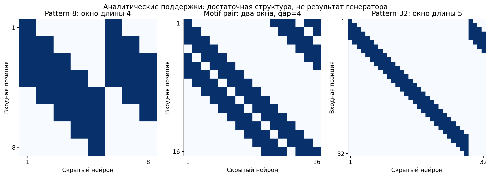
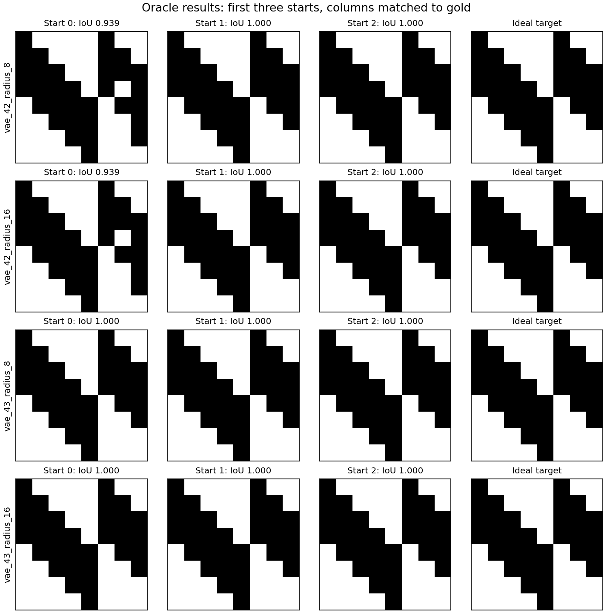
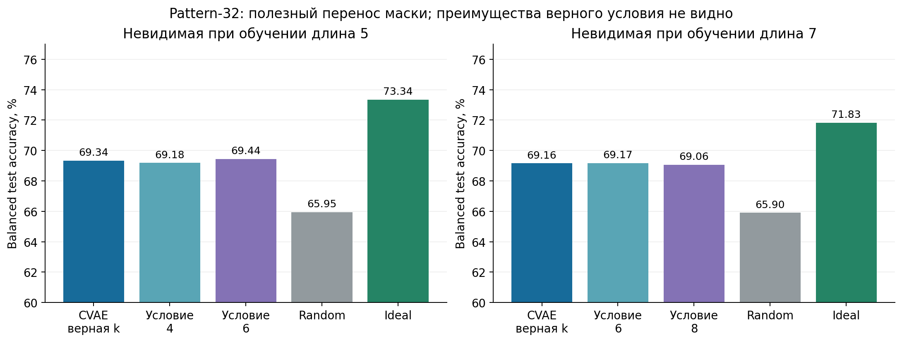
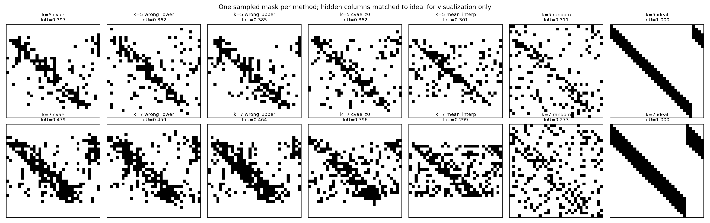
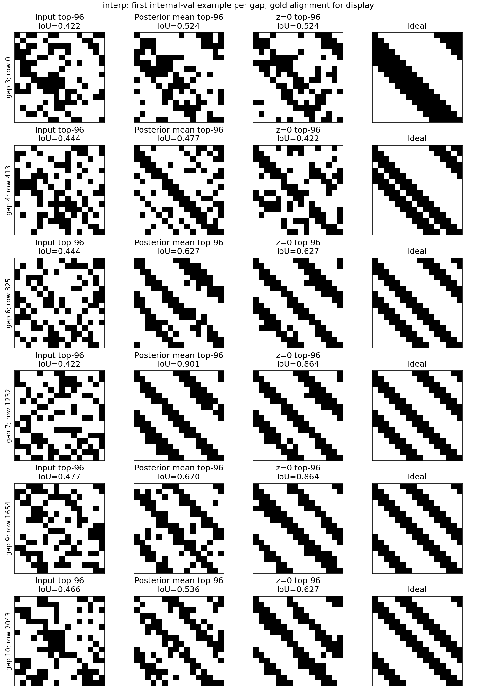
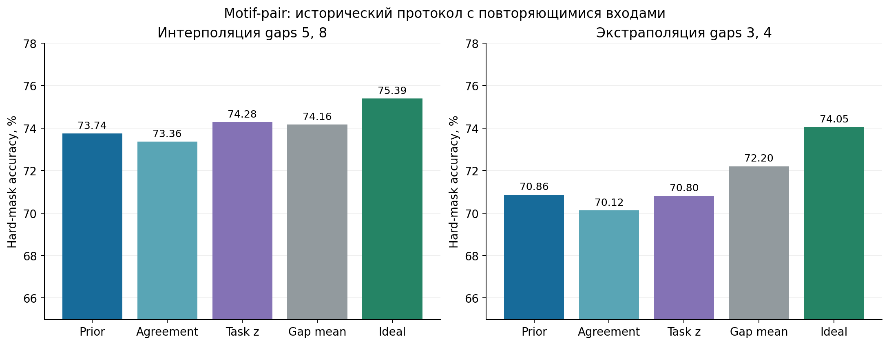
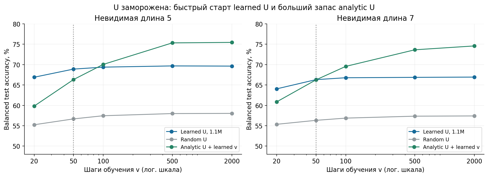
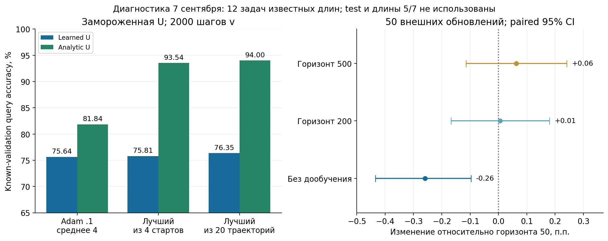

# Финальный исследовательский отчёт — 8 сентября 2026

**Ветки:** `pattern`, `motif_pair`, `meta_pattern`. **Фактический срез:** результаты и диагностики, доступные за 6–7 сентября 2026 года, с необходимыми более ранними базовыми сравнениями. Дата в заголовке — дата итогового документа, заданная для этой сводки; она не означает проведение экспериментов 8 сентября.

## Основные результаты

| Ветка | Что получилось | Что пока не получилось |
|---|---|---|
| Pattern-8, маски | CVAE переносит полезную структуру; oracle-поиск по замороженному decoder почти всегда находит идеал | Согласие двух decoder не выделяет идеальную маску среди общих решений |
| Pattern-32, длины 3–8 | На невиданных длинах 5/7 CVAE даёт **69.34% / 69.16%**, выше random на **3.39 / 3.26 п.п.** | Правильное условие длины практически не лучше соседнего |
| Motif-pair | Выявлены шумные targets, слабый перенос по gap и недостаточность agreement/task-loss | Нет убедительного улучшения hard-масок; аудит обнаружил shortcuts и почти полное повторение входов между выборками |
| Meta-pattern, генерация U | Полная U обучается через адаптацию свежего v; **69.63% / 66.94%** на длинах 5/7 против random **58.03% / 57.40%** | Рост генератора и размерности v не дал выигрыша; до аналитической U остаётся значительный запас |
| Диагностика U, 7 сентября | Подбор обучения v резко улучшает аналитическую U, но мало помогает learned U | Короткое дообучение с более длинным внутренним горизонтом не показало преимущества над контрольным продолжением |

**Общий вывод:** модели извлекают полезную общую структуру, но пока не демонстрируют надёжного восстановления именно правила, связывающего длину/gap с этой структурой. Для `meta_pattern` измерения не поддерживают объяснение «нужно просто больше параметров» в проверенном диапазоне. Причина остаточного дефицита ещё не локализована окончательно.

Точности разных строк нельзя ранжировать как результаты одного соревнования: меняются задача, входное распределение, число адаптируемых параметров, оптимизатор и бюджет. Ниже каждый результат приведён со своим протоколом.

## Как читать эксперименты

- **Маска** задаёт разрешённые связи первого слоя; свежая MLP обучает их численные веса.
- **U** задаёт общее линейное пространство весов: для конкретной задачи обучается короткий вектор `v`, а веса получаются как `Uv`. U может задавать и совместное использование весов, которого одна бинарная маска не задаёт.
- **Support** используется для обучения на конкретной задаче; **query** — для отбора/метаобучения; **test** — для итоговой оценки. В старом motif-протоколе названия выборок не гарантировали различие самих входных строк; последствия аудита изложены отдельно.
- **Oracle** здесь означает диагностический поиск с доступом к аналитическому идеалу. Его нельзя выдавать за генерацию структуры без знания ответа.
- **п.п.** — разница точностей в процентных пунктах. IoU измеряет структуру после сопоставления скрытых нейронов и не является точностью классификации.



*Рисунок 1. Достаточные аналитические поддержки: одно локальное окно для pattern и два разнесённых циклических окна для motif-pair. Это схемы известного решения, а не сгенерированные моделью результаты. В pattern лишние скрытые нейроны повторяют начальные окна.*

## Pattern: генерация масок

### Что проверяет эта ветка

Есть бинарная задача: дана последовательность $x\in\{0,1\}^n$ и фиксированный
битовый паттерн $p$ длины $k$; метка равна единице тогда и только тогда, когда
$p$ встречается в $x$ как непрерывная подстрока. Генератор не должен
генерировать веса под конкретный паттерн: он должен восстановить общую
геометрию первого слоя — локальные окна, из которых свежая MLP затем обучает
значения фильтров для своей задачи.

Конкретный пример для новой постановки: для задачи $p=10101$ длины 5
последовательность

```text
000000000000 10101 000000000000000
```

должна получить метку 1: паттерн стоит в позициях 13–17. Последовательность

```text
000000000000 10001 000000000000000
```

получает 0: ни одно из 28 окон длины 5 не равно `10101`. Это определение
метки; balanced test делает классы равновероятными только для измерения
accuracy, а не меняет правило задачи.

Здесь важно различать два типа измерений. **Геометрическая** метрика — IoU
маски с аналитической поддержкой после оптимального сопоставления скрытых
нейронов. Она отвечает, похож ли найденный support на скользящие окна.
**Функциональная** метрика — accuracy новой MLP, обученной с фиксированной
маской; она отвечает, помогает ли support решать задачу. Высокая функциональная
оценка не обязана означать идеальный IoU, и наоборот.

### 1. Старый `pattern`: длина 8 и 8 скрытых нейронов

Этот эксперимент нельзя смешивать численно с новым разделом ниже. Здесь
вход имеет длину 8, задача — распознать один из 16 паттернов длины 4, MLP имеет
8 скрытых нейронов, а каждая маска содержит 32 связи из 64. Идеальная поддержка
содержит пять локальных окон длины 4; из-за ширины 8 первые три окна повторены.

#### Перенос общей структуры на невиданные задачи

В OOD-протоколе с разделением задач CVAE обучался только на 12 паттернах, а четыре
оставшихся не использовались ни для генератора, ни для train-only baselines.
Это повторено на пяти заранее заданных split seeds (42–46). CVAE получает
**90.86%**, равномерная random exact-32 маска — **88.21%**, analytic Toeplitz
support — **92.40%**. Прирост CVAE над random равен **+2.66 п.п.** (стандартное
отклонение split-level средних 0.46 п.п.); он положителен на всех пяти split.

Это свидетельство переноса *общего, безусловного* структурного prior внутри
данного семейства задач. Оно не проверяет зависимость support от длины или от
содержимого паттерна.

#### Два замороженных decoder и поиск согласованной маски

6 сентября были обучены два независимых unconditional CVAE (seeds 42 и 43)
на одном OOD split. Затем decoder заморожены, а для 64 стартов оптимизируются
только два latent-вектора. Цель — согласовать мягкие top-32 маски после
Hungarian-сопоставления hidden columns. Ни analytic support, ни target labels
held-out задач не входят в эту оптимизацию или выбор итерации.

Согласованность действительно найдена: soft MSE падает с 0.092475 до 0.000112,
hard IoU двух decoder растёт с 0.6542 до 0.9981, а 62 из 64 пар дают полностью
совпадающие бинарные маски. Но общая маска не обязана быть правильной: после
поиска Gold IoU составляет 0.7046, тогда как у analytic support он равен 1.

| Источник маски | Gold IoU | Accuracy свежей MLP |
|---|---:|---:|
| VAE42 prior | 0.6507 | 91.38% |
| VAE42 после agreement | 0.7046 | 92.05% |
| VAE43 после agreement | 0.7046 | 92.19% |
| Random exact-32 | 0.4906 | 89.47% |
| Analytic support | 1.0000 | 93.28% |

Усреднённый gain agreement относительно исходных VAE-сэмплов — **+0.58 п.п.**
accuracy; относительно random search с тем же числом пар-кандидатов —
**+0.21 п.п.**. Это полезная self-supervised эвристика, но не критерий,
который единственным образом выделяет правильную геометрию: две одинаковые
неидеальные маски также дают нулевую disagreement-ошибку.

#### Достижимость идеала и одиночный task-aware поиск `z`

Oracle-диагностика отделяет недостаток представления decoder от недостатка
цели agreement. Если явно оптимизировать $z$ на analytic support при тех же
замороженных decoder, radius 8 даёт средний IoU 0.9953 у VAE42 и 0.9981 у
VAE43; точный hard support найден в 59/64 и 62/64 стартов соответственно.
Следовательно, agreement не упирается в невозможность decoder представить
идеальную маску — он просто не умеет выбрать её без дополнительного сигнала.
Oracle использует gold и не является zero-shot результатом.

Для VAE42 сравнили agreement с task-aware поиском одного `z`. Последний
получил IoU 0.7249 и test accuracy 92.25%, против 0.7046 и 92.05% у agreement.
Однако это не честное доказательство превосходства task-aware подхода: поиск
использует target labels, обучает свежие MLP внутри цикла и применяет
direct-gradient эвристику, а не полный bilevel hypergradient. Практический
вывод скромнее: согласие улучшает prior без меток, но само по себе не выбирает
идеальную структуру.



*Рисунок 2. Замороженные decoder, оптимизируется только z с явным доступом к ideal. Это gold-guided диагностика достижимости, а не самостоятельное открытие структуры.*

### 2. Новый изолированный `pattern/length_interp`: длина 32

Новая постановка специально проверяет интерполяцию по длине. Вход имеет длину
32, hidden width равен 32. CVAE видит только длины **3, 4, 6, 8**. Длины
**5 и 7** полностью отсутствуют при построении банка MLP, отборе карт,
обучении и выборе CVAE checkpoint; итог охватывает все 32 паттерна
длины 5 и все 128 паттернов длины 7.

Для каждой известной задачи строится банк из 1000 MLP с равномерными
random exact-(K) масками, $K=32k$. Каждая MLP обучается 2000 шагов; затем
по отдельному query-набору выбираются лучшие 10% и их нормированные
unsigned карты $|W_1\odot m|$ становятся данными CVAE. Два CVAE (seeds
42, 43; latent 32, hidden 256) получают длину как **непрерывный скаляр**
$2(k-3)/5-1$, а не one-hot вектор.

Глобальный hash входа разделяет support/query/test независимо от задачи; орбиты reversal/complement сохраняются внутри task-split. Это новый протокол, отличающийся от старого motif-pair. CVAE обучаются 80 эпох с BCE-sum + 0.1 KL, выбираются эпохи 28/27 по известным validation-задачам. Полный часовой launcher завершился примерно за 1006 секунд (16.8 минуты).

При оценке CVAE заморожен. На каждый CVAE-seed проверяются 32 маски с двумя свежими инициализациями MLP, по 2000 шагов Adam 0.001. Для каждой held-out задачи семплируются маски,
и **для каждой маски с нуля обучается своя MLP** на 8192 support-примерах:
фиксируется бинарная маска связей, а значения
весов задачи обучаются заново. Затем измеряется balanced accuracy на отдельном
test из 2048 примеров. Сравниваемые методы имеют одинаковую cardinality
(32k), одинаковые initialization/minibatches для одинакового mask ordinal.

| Длина | CVAE, правильное условие | Random exact-(32k) | Analytic support | CVAE − random |
|---:|---:|---:|---:|---:|
| 5 | **69.34%** | 65.95% | 73.34% | **+3.39 п.п.** [2.87; 3.91] |
| 7 | **69.16%** | 65.90% | 71.83% | **+3.26 п.п.** [3.01; 3.51] |

Интервалы — paired task bootstrap 95%; они условны на двух уже обученных
CVAE-seed, а не являются доверительным интервалом по всем возможным обучениям
CVAE. Таким образом, learned mask стабильно превосходит random baseline на
обеих невиданных длинах, но остаётся запас до analytic support: 4.00 п.п.
при $k=5$ и 2.67 п.п. при $k=7$.

#### Что говорит условие длины

Правильность формата conditioning пока не доказана функционально. При $k=5$
условия соседних известных длин дают 69.18% (условие 4) и 69.44% (условие 6);
при $k=7$ — 69.17% (6) и 69.06% (8), тогда как правильное условие даёт
69.16%. Те же latent-вектора и та же target cardinality использованы в этих
контролях. Смена условия не игнорируется буквально: она заменяет в среднем
8–13% активных рёбер, и не было идентичных масок. Но это изменение пока не
превратилось в устойчивое преимущество правильной длины над ближайшим
условием.

Структурная картина соответствует этому выводу. IoU CVAE с analytic support
равен 0.4015 против random 0.2736 при $k=5$, и 0.4632 против 0.2863 при
$k=7$. Геометрия заметно лучше случайной, но соседние условия практически
неотличимы. Поэтому корректная формулировка результата: **CVAE переносит
локальный support на невиданные промежуточные длины; отдельного
length-specific эффекта сверх общего локального prior ещё не показано.**



*Рисунок 3. Balanced test accuracy: правильное условие и оба соседних условия при одинаковой целевой разреженности. Выигрыш над random есть, явного выигрыша правильного condition над соседним нет.*



*Рисунок 4. По одному примеру из завершённого pattern-32 запуска. Столбцы скрытых нейронов сопоставлены с analytic support только для визуализации; это сопоставление не обучает маски и не меняет функциональный результат.*

### Ограничения и следующий эксперимент

Обе ветки синтетические: они устанавливают механизм на контролируемом
семействе substring-задач, а не универсальный способ извлекать inductive bias
из произвольных обученных сетей. В legacy-ветке пять split переиспользуют одни
и те же 16 паттернов; в длине-32 bootstrap не включает переобучение CVAE.
Кроме того, oracle-достижимость идеала и label-aware поиск `z` — отдельные
диагностики, их нельзя выдавать за zero-shot transfer.

Следующий информативный шаг для `pattern` — создать семейство, где геометрия
поддержки меняется с длиной сильнее, и предварительно зарегистрировать
контраст «правильная длина против соседней». Это напрямую проверит, может ли
continuous condition выбирать режим поддержки, а не только слегка менять
вариации одного общего local prior.


## Motif-pair: два мотива и перенос по gap

Численные эксперименты этого раздела взяты из отчётов 6 сентября. Ниже их итоговый статус с учётом аудита постановки.

### Что проверяли

**Ограничение интерпретации:** аудит поздних task-loss запусков обнаружил почти полное повторение входов между train/validation/test. Приведённые ниже paired сравнения сохраняют описательную ценность, но не устанавливают обобщение на новые входные строки.

Вход — циклическая последовательность из 16 битов `-1/+1`. Задача
`(A,B,gap)` положительна, когда уникальные трёхбитовые мотивы `A` и `B`
начинаются на расстоянии `gap` (3–10), и отрицательна при другом допустимом
расстоянии. Например, для `A=001`, `B=101`, `gap=4` MLP должна отличить
последовательности с `B` через четыре позиции после `A` от таких же
последовательностей с иным расстоянием.

Первый слой MLP имеет матрицу 16×16. Известная достаточная маска для gap `g`
открывает для каждого hidden-нейрона шесть рёбер: три к окну `h..h+2` и три к
`h+g..h+g+2` по модулю 16. Поэтому она содержит ровно 96 активных рёбер и
образует две круговые диагональные полосы. С аналитически заданными весами эта
маска решает все 101,120 пар «задача–допустимый вход» текущего каталога без
ошибок, с минимальным margin 0.5. Это доказывает представимость правила
архитектурой, но не то, что Adam найдёт эту конструкцию из случайного старта.

Основной OOD-протокол — scalar-conditioned gap OOD. В interpolation генератор
видит gaps `3,4,6,7,9,10`, а gaps `5,8` скрыты; в extrapolation видит
`5..10`, а скрыты `3,4`. В каждом профиле восемь одинаковых motif-пар на gap:
меняется только структура, а не состав мотивов. CVAE получает непрерывное
условие `c(g)=(g-3)/7`, обучается на importance-картах лучших 10% MLP
meta-train задач, после чего выдаёт ровно 96 рёбер через hard top-96. Для
каждой сгенерированной маски новый MLP обучается с нуля.

### Базовый результат: CVAE выучила полезный prior, но слабую зависимость от gap

В более раннем pair-disjoint контроле (новые пары мотивов, но **известные**
gaps) CVAE достигла 74.80% против 72.74% у случайной exact-96 маски:
`+2.063` п.п., 95% t-CI `[+1.089; +3.036]`, выигрыш на 15 из 16 задач.
Её mean Hungarian-IoU с ideal был 0.632 против 0.438 у random exact-96.
Unconditional VAE дала 73.81%; condition добавила `+0.998` п.п. и `+0.058`
IoU против неё. Однако простой train-only mean importance map оказался немного
сильнее CVAE: 74.97% и IoU 0.660. Это положительное свидетельство общего
структурного prior, но не свидетельство unseen-gap interpolation.

На настоящем unseen-gap split результаты скромнее. Для interpolation
правильный scalar condition дал 73.55% и IoU 0.6082, ближайший неправильный
condition — 73.48% и 0.6050: accuracy-разность всего `+0.08` п.п.
с 95% t-CI `[-0.06; +0.21]`. Строгая разность IoU с лучшим соседним condition
отрицательна (−0.0167), положительна в 0/16 задач. В extrapolation правильный
condition дал 71.05% и IoU 0.4097; неправильный — 70.90% и 0.4183. Значит,
в interpolation CVAE сохраняет выигрыш над random exact-96 (73.55% против 71.76%), но преимущество верного condition неубедительно. В extrapolation CVAE даже немного ниже random exact-96 (71.05% против 71.29%; IoU 0.4097 против 0.4367). Перенос функции «gap → support» этим опытом убедительно не показан.

### Где теряется идеальная структура

Входные importance-карты уже далеки от бинарного ideal: их top-96 IoU на
internal validation составляет около 0.449 в обоих профилях. CVAE улучшает
эту структуру (0.6054 interpolation и 0.6717 extrapolation через posterior
mean), но `z=0` и gap-mean сопоставимы или лучше. Поэтому основной дефицит
не сводится к тому, что decoder разрушает уже готовую идеальную маску:
обучающие targets сами шумные и неоднозначные относительно ideal support.

Oracle-поиск по `z` с **явным ideal в objective** на замороженных
importance-CVAE не нашёл exact mask: 0/2048 траекторий (2 профиля × 8 gaps ×
64 старта × 2 радиуса). На held-out gaps лучший отдельный IoU был 0.6842 для
interpolation g=5, 0.8286 для interpolation g=8, 0.4656 для extrapolation
g=3 и 0.5610 для extrapolation g=4. Это сильная диагностика ограниченности
доступной области/поиска, но не доказательство, что exact support отсутствует
во всём образе decoder.

Контроль отделил архитектуру от targets. Когда такой же CVAE обучили прямо на
canonical ideal seen gaps, posterior mean точно восстановил каждый seen ideal.
Но на unseen gaps ни encoder-подача идеала, ни 64-стартовый oracle не дали
exact mask; лучший отдельный IoU составил 0.8824 (interp g=5), 0.8641
(interp g=8), 0.5000 (extrap g=3) и 0.7143 (extrap g=4). Следовательно,
архитектура способна представлять обучающие идеальные структуры, однако одно
лишь условие скалярным gap не обеспечило перенос на новые gaps.



*Рисунок 5. Примеры из диагностики reconstruction: входные importance maps сами не являются готовыми ideal masks. Данные относятся к internal validation, а не к zero-shot генерации unseen gap.*

### Согласие двух CVAE, один latent и downstream task-loss

Затем для каждого профиля обучили второй независимый CVAE и заморозили оба.
Оптимизация пары латентов по MSE между их soft masks действительно повысила
pair-IoU: например, на interpolation g=5 с 0.5634 у prior до 0.8069, на g=8
с 0.7171 до 0.8841. Но это согласие декодеров, а не соответствие правильной
структуре: точный ideal не был найден ни одним decoder ни на одном held-out
gap. На свежих MLP pair-search ухудшил accuracy относительно prior:
73.36% против 73.74% в interpolation и 70.12% против 70.86% в
extrapolation для первого decoder.

Single-`z` поиск по downstream validation BCE переобучал fresh MLP на каждом
из 30 внешних шагов, но не дифференцировал через их обучение; это частный
градиент по маске, не полный bilevel hypergradient. Он оказался лучше
pair-search (на +0.916 и +0.675 п.п. соответственно), но его выигрыш над
prior был неубедителен: `+0.540` п.п. `[-0.041; +1.195]` при interpolation и
`−0.066` п.п. `[-0.516; +0.404]` при extrapolation. Сильный простой baseline
среди этих результатов — train-only gap mean: 74.16% / 72.20%.

Сумма task-loss и agreement не изменила вывод. При фиксированном λ=1:
72.38% interpolation и 69.44% extrapolation, тогда как task-only дал
72.24% и 69.39%; оба bootstrap-интервала разности включают ноль. В исходной
постановке норма agreement-gradient была в 18.4–47.7 раза больше нормы
task-gradient. После явного нормирования
`g = g_task + α ||g_task||/(||g_agree||+ε) g_agree` при α=0.1, 0.3, 1
hard accuracy также не улучшилась: 72.24–72.25% в interpolation и
69.22–69.33% в extrapolation, ниже нового task-only и исходного prior;
интервалы разностей включают ноль. Нормирование устранило доминирование
масштаба, но не конфликт направлений: отрицательный косинус наблюдался в
25.7–42.6% шагов interpolation и 34.2–43.2% extrapolation.

Мягкие маски в этих опытах давали около 80% accuracy, однако сохраняли все
256 ненулевых связей при сумме 96. Hard top-96 оставляет 96 связей и имеет
около 69–72%. Поэтому улучшение soft objective нельзя считать улучшением
одной и той же разреженной архитектуры; именно hard маска остаётся целевым
объектом оценки.



*Рисунок 6. Fresh-MLP hard-mask accuracy в историческом протоколе. Task-z использует метки и дополнительный поиск; простое agreement — нет. Входные строки между разделами почти полностью повторяются. Числа этого рисунка не объединяются с другими бюджетами combined/normalized-loss.*

### Аудит постановки: почему ideal-IoU нельзя превращать в единственный ответ

На ограниченном exactly-once распределении ideal support не идентифицируема
по task-loss. Для 28 из 64 задач существуют другие exact-96 supports; пример
`A001_B101_G04` использует четыре литерaла на локальный детектор, имеет
Hungarian-IoU 0.5 с ideal, но 100% accuracy на всех 960 допустимых входах.
На полном пространстве 2^16 тот же shortcut даёт 27,456 ложных срабатываний,
то есть это не та же логическая функция. При этом одинаковое строгое
подмножество не работает сразу для всех восьми motif-пар одного gap:
обучение общего генератора всё же частично подавляет данный shortcut-класс,
но уникальность идеальной маски не доказана.

Кроме того, в последних task-loss экспериментах почти все test-входы были
уже в первом search-train массиве: среднее пересечение 99.9893% для final
test и 99.9878% для search-validation. Это валидное paired сравнение методов
при одинаковых данных, но не измерение обобщения на новые входы внутри
задачи. Нужны splits по уникальным строкам, а для более сильного контроля —
по орбитам циклических сдвигов; для проверки самой логики также нужен более
широкий input universe с отсутствующими/повторными мотивами.

### Что установлено и что остаётся открытым

Установлено: (1) известная структурная маска достаточна и точно
представима MLP; (2) CVAE на importance maps выучивает переносимый
структурный prior в известных gap regimes; (3) на unseen gaps condition
недостаточно надёжен; (4) согласие двух decoder и локальная task-loss
оптимизация latent не исправили hard mask; (5) дефицит не объясняется только
малой выразительностью CVAE, поскольку ideal-CVAE точно реконструирует seen
ideals.

Открыто: находится ли хороший unseen-gap support в образе decoder, но вне
достигнутых траекторий `z`; как будет выглядеть результат при настоящем
support/query/test split; и сможет ли генератор, обучаемый напрямую через
downstream query-loss с hard-mask контролем, выучить структуру лучше
importance-CVAE. Наиболее содержательный следующий шаг — не подбирать ещё
один коэффициент agreement, а обучать детерминированный и затем стохастический
генератор маски через адаптацию fresh MLP на disjoint support/query данных;
CVAE, gap-mean и random exact-96 останутся необходимыми baseline.


## Meta-pattern: вместо масок генерируем U

### Постановка и связь с исходной идеей

Основа — идея обучаемой репараметризации из работы Zhou, Knowles и Finn [Meta-Learning Symmetries by Reparameterization](https://arxiv.org/abs/2007.02933). Наше конкретное продолжение — генератор полной матрицы базиса по непрерывной длине паттерна. Это экспериментальный выбор проекта; результаты статьи не являются гарантией успеха этой модификации.

Для входов длины 32 используется двухслойная ReLU-сеть с 32 скрытыми нейронами. Генератор получает **только длину** `k`, нормированную в диапазон `[-1,1]`; он не видит биты паттерна или его примеры. Для каждой длины он выдаёт:

```text
U1(k): 1056 × 16           (32 входа + bias) × 32 hidden
U2(k):   33 ×  4           32 hidden + output bias

vec(W1_augmented) = U1(k) v1_task
W2_augmented      = U2(k) v2_task

v_task = (v1_task, v2_task): всего 20 обучаемых коэффициентов
```

Суммарно U содержит **17 028 чисел**, около **66.5 KiB в float32** на длину. Полную U здесь действительно недорого хранить. Основные дополнительные затраты — параметры генератора, состояния оптимизатора и граф дифференцирования через обучение `v`. Факторизация U на меньшие матрицы в этой реализации не используется. При этом размерности 16 и 4 всё равно ограничивают пространство весов задачи: полная U не означает произвольную MLP без ограничений.

Ненулевые столбцы U нормируются по L2; ортогональность не навязывается. У аналитической U неиспользуемые столбцы нулевые. В генераторе нет CVAE, KL, латента `z` или reconstruction-loss по идеалу.

### Что именно обучаем на длинах 5 и 7

Метаобучение выполняется только на длинах **3, 4, 6, 8**:

1. Генерируем U(k) для выбранной training-задачи.
2. Инициализируем свежий `v` и обучаем его на support, сохраняя значения U фиксированными во внутреннем цикле.
3. Измеряем BCE на непересекающемся query.
4. Дифференцируем query-loss **через все шаги адаптации v** и обновляем генератор U.

При финальной проверке генератор заморожен. Для `k=5` используется `G(5)`, для `k=7` — `G(7)`. **Для каждого отдельного битового паттерна заново обучается свой v; U при этом не дообучается.** Это и есть проверка переноса структуры на невиданные длины.

Например, задачи `10101` и `00110` используют одну и ту же U(5), но разные обученные векторы v. Генератор обязан дать общий базис, подходящий для обоих фильтров. Из факта, что две задачи используют общую U, ещё не следует, что U реализует свёрточное разделение весов.

### Данные и защита от повторения входов

Используются все 504 бинарных паттерна длин 3–8. Последовательности линейные; допускаются отсутствие, одно и несколько вхождений. Входы выбираются как равномерные 32-битовые числа с rejection sampling по метке для балансировки классов; положительный паттерн не вставляется вручную.

Глобальный hash входа с seed 1729 задаёт support/query/test примерно в пропорции 60/20/20. Один и тот же вход не может перейти между этими разделами даже у разных задач. Эпизоды внутри одного раздела могут пересекаться. Task-split объединяет паттерн, его reversal, complement и reversed complement в одну орбиту. Checkpoint выбирается по validation-паттернам **известных длин**, до доступа к длинам 5/7.

Финальная оценка охватывает все 32 паттерна длины 5 и все 128 длины 7, по два старта v, support 8192 и balanced test 2048. Данные согласованы между сравниваемыми моделями, совпадения проверены по hash. Всего в итоговой оценке семи моделей и вариантов условия — **67 200 строк**, нечисловых метрик — **0**.

### От пилота к устойчивому обучению

Пилот 6 сентября был проверкой работоспособности: четыре метода, два seed, 100 внешних шагов и 20 внутренних SGD-шагов. Все длины 3–8 были известны, проверялись лишь первые два held-out паттерна каждой длины. Поэтому этот пилот **не является экспериментом по интерполяции длины**.

Генератор в пилоте давал примерно 64.4–64.8% после 20 шагов v и 67.3–67.4% после 500; table и random были слабее. Но аналитическая U с обучаемым v достигала лишь 60.2–63.9% после 500 шагов. Это был сигнал проверить оптимизацию: явное аналитическое v даёт ноль ошибок на проверенных **64 512** примерах (504 задачи × 128 входов), однако обычное обучение v не обязано его находить. Эта проверка не исчерпывает пространство всех 2^32 входов. Подробности сохранены в [пилотном отчёте](../meta_pattern/PILOT_RESULTS.md).

В первой попытке масштабирования внутренний SGD с learning rate 3 оказался нестабилен. На диагностированном шаге 7 query-loss вырос примерно до `4.01e14`; позже сами градиенты ещё были конечными, но вычисление их нормы в float32 переполнилось. При той же фиксированной U меньший шаг SGD и Adam не воспроизводили этот взрыв. Это численная проблема конкретного режима, а не свидетельство плохой выразительности большой модели.

Исправления: вычисление общей нормы градиента в float64 с clipping до 5, явная остановка при настоящих NaN/Inf, калибровка внутреннего оптимизатора на **том же горизонте 50**, что и метаобучение. На известных validation-задачах выбран Adam с `lr=0.1`, начальным масштабом v `0.1`: query BCE 0.54853 против 0.57931 у SGD 3. Неудачная SGD-фаза не включена в сравнительную таблицу ниже. Сохранены [численный разбор](data/2026-09-08/meta_numeric_diagnosis.md) и [результаты калибровки](data/2026-09-08/meta_calibration.json).

### Проверка размера генератора и размерности v

Пять моделей обучены с seed 42 по **1000 внешних шагов**. На каждом шаге четыре задачи, 50 внутренних шагов Adam 0.1, support/query по 1024, minibatch 128; внешний Adam 0.001. Для каждого варианта выбран лучший checkpoint по известным validation-длинам.

| Вариант | Архитектура скрытой части генератора | Параметров | Размерность v | Выбранный шаг |
|---|---|---:|---:|---:|
| Малый | 64 → 64 | 1 111 108 | 16 + 4 | 700 |
| Средний | 256 → 256 → 256 | 4 508 292 | 16 + 4 | 700 |
| Большой | 512 → 512 → 512 | 9 261 700 | 16 + 4 | 1000 |
| Без условия длины | как большой, постоянный вход | 9 261 700 | 16 + 4 | 900 |
| Больший базис | 512 → 512 → 512 | 17 997 064 | 32 + 8 | 1000 |

Seed 43 и автоматическое продолжение до 3000 шагов были остановлены по решению перейти к оценке точности. **Здесь завершён один seed генератора**, а не исследование устойчивости по нескольким seed.

| Замороженная U | k=5, 50 шагов v | k=7, 50 | k=5, 500 | k=7, 500 | k=5, 2000 | k=7, 2000 |
|---|---:|---:|---:|---:|---:|---:|
| Малый генератор | 68.90% | 66.31% | 69.68% | 66.87% | **69.63%** | **66.94%** |
| Средний | 68.85% | 65.80% | 69.43% | 66.66% | 69.54% | 66.78% |
| Большой | 68.50% | 65.89% | 69.46% | 66.79% | 69.39% | 66.87% |
| Без условия | 68.45% | 65.54% | 69.05% | 66.31% | 69.17% | 66.38% |
| Больший базис, v=40 | 67.56% | 64.94% | 68.96% | 66.35% | 68.94% | 66.43% |
| Случайная U | 56.68% | 56.33% | 57.99% | 57.35% | 58.03% | 57.40% |
| Аналитическая U, обучаемый v | 66.32% | 66.26% | 75.33% | 73.63% | **75.45%** | **74.58%** |


*Рисунок 7. Все held-out паттерны, два старта v; один seed обученного генератора. Больший базис одновременно меняет число параметров генератора и размерность v. Столбцы показывают точность обучения v, а не теоретические пределы U.*



*Рисунок 8. Вертикальная линия — горизонт 50, на котором оптимизировался генератор. Learned U помогает быстро начать адаптацию, но при длительном обучении v аналитическая структура выигрывает. Даже у аналитической U стандартный оптимизатор остаётся далеко от точного конструктивного решения.*

Малый генератор после 2000 шагов выигрывает у random U на **11.60 / 9.54 п.п.**, но уступает аналитическому контролю на **5.82 / 7.64 п.п.** для k=5/7. В исследованных моделях не обнаружен численный коллапс ранга; увеличение размерности базиса само по себе не помогло. Это не доказывает, что capacity вообще не важна: сравнение ограничено одним seed и конечным бюджетом обучения.

Правильное условие длины также даёт слабый эффект. Разность «правильное условие минус среднее двух соседних» после 2000 шагов:

| Вариант | k=5, п.п. | k=7, п.п. |
|---|---:|---:|
| Малый | +0.106 | +0.051 |
| Средний | +0.009 | +0.006 |
| Большой | +0.035 | +0.007 |
| Без условия | 0.000 | 0.000 |
| Больший базис | +0.045 | −0.004 |

У малого генератора соседнее условие изменяет U1 примерно на 8–9%, U2 примерно на 7% по относительной норме Фробениуса. Следовательно, условие не игнорируется буквально; заметного функционального преимущества этих изменений пока нет. Разности малы и не сопровождаются проверкой по независимым seed генератора.

Числа CVAE-mask и U можно сопоставить как ориентир: на одинаковом семействе данных CVAE достигает 69.34% / 69.16%, малый U-генератор — 69.63% / 66.94%. Но это разные пространства весов и бюджеты адаптации, два CVAE-seed против одного U-seed, множество сэмплируемых масок против детерминированной U. Это **не изолированное доказательство превосходства одного типа генерации**.

### Диагностика 7 сентября: проблема в обучении v или в найденной U?

Проверки ниже используют только **12 hash-выбранных validation-паттернов известных длин 3,4,6,8**: по 2,2,4,4 паттерна. Длины 5/7 и test-раздел не использованы. Усреднение сначала проводится внутри длины, затем поровну между длинами. Поэтому эти точности нельзя напрямую сравнивать с предыдущей таблицей held-out test.

Первый контроль фиксирует исходную малую U и аналитическую U. На одинаковых support/query 8192/2048 проверяются четыре старта v и пять режимов: Adam с learning rate 0.003, 0.01, 0.03, 0.1 и SGD 1. Все варианты выбора используют **только support BCE**, query показывается уже после выбора.

| Фиксированная U | Политика после 2000 шагов v | Траекторий на задачу | Query accuracy | Support accuracy |
|---|---|---:|---:|---:|
| Learned | Adam 0.1, среднее четырёх стартов | 4 | 75.64% | 75.88% |
| Learned | Лучший из четырёх стартов Adam 0.1 | 4 | 75.81% | 76.17% |
| Learned | Лучший из всей сетки | 20 | **76.35%** | 76.57% |
| Analytic | Adam 0.1, среднее четырёх стартов | 4 | 81.84% | 81.89% |
| Analytic | Лучший из четырёх стартов Adam 0.1 | 4 | 93.54% | 93.76% |
| Analytic | Лучший из всей сетки | 20 | **94.00%** | 94.10% |

У learned U сетка добавляет только **0.72 п.п.** к стандартному среднему. У analytic U — **12.16 п.п.**. Сравнение «лучший из 20» имеет больший вычислительный бюджет; это проверенная политика адаптации, а не oracle и не верхняя граница достижимого качества.

Конкретный пример — известный паттерн `000`: четыре старта на analytic U дают примерно **87.60%, 87.79%, 87.45%, 100%** query accuracy. На learned U — **87.84%, 88.53%, 88.92%, 89.01%**. У аналитического пространства в проверке обнаруживается точное решение, доступ к которому сильно зависит от старта. У learned U такие четыре старта остаются около одного уровня. По этому примеру и сетке нельзя доказать отсутствие более хорошего решения во всём пространстве learned U.

### Контроль короткого горизонта метаобучения

Конечный горизонт может смещать метацель в пользу быстрой адаптации; это известный мотив в исследованиях метаоптимизации, например [Understanding Short-Horizon Bias in Stochastic Meta-Optimization](https://arxiv.org/abs/1803.02021). Для нашего генератора это гипотеза, которую нужно проверять, а не готовое объяснение.

Взяли **один и тот же checkpoint шага 700**, сбросили внешний Adam во всех ветках и сделали ровно 50 дополнительных внешних обновлений на одинаковых эпизодах. Различался только внутренний горизонт: 50, 200 или 500 шагов. Сравнивается последний шаг 750, без отбора лучшего из траектории. Все четыре readout, включая исходный checkpoint, используют одинаковые данные и четыре старта Adam 0.1.

| Продолжение | Время обучения U | Query: 50 шагов v | 500 шагов v | 2000 шагов v | BCE после 2000 |
|---|---:|---:|---:|---:|---:|
| Исходная U | — | 75.12% | 75.53% | 75.64% | 0.47902 |
| Горизонт 50 | 69.4 с | 75.47% | 75.60% | 75.90% | 0.47660 |
| Горизонт 200 | 242.2 с | 75.28% | 75.77% | 75.90% | 0.47553 |
| Горизонт 500 | 584.5 с | 75.29% | 75.69% | 75.96% | 0.47604 |

После 2000 шагов v преимущество над **контрольным продолжением с горизонтом 50** составляет:

- Горизонт 200: **+0.01 п.п.**, 95% paired bootstrap `[−0.17; +0.18]`.
- Горизонт 500: **+0.06 п.п.**, `[−0.11; +0.24]`.



*Рисунок 9. Слева выбор оптимизатора/старта только по support. Справа bootstrap по паттернам внутри каждой длины после усреднения четырёх стартов v. Интервалы описывают эти 12 задач, а не неопределённость по seed генератора. Контроли выравнивают число внешних обновлений, но не время вычислений.*

Такое короткое продолжение не выявило выигрыша длинного горизонта сверх обычного дообучения. Оно **не доказывает**, что горизонты эквивалентны при обучении с нуля или после сходимости: выполнено только 50 дополнительных обновлений. Практически проверенные изменения не закрыли основной разрыв.

### Что теперь можно сказать о генерации U

Поддержаны три наблюдения. Генератор находит пространство, гораздо полезнее случайного. Рост ёмкости в проведённом сравнении не улучшает перенос. Подбор адаптации и короткое удлинение горизонта дают небольшой эффект для learned U, хотя аналитическая U сохраняет большой резерв.

Рабочая гипотеза: метаобучению трудно **найти подходящую структуру пространства весов из случайного старта**. Но пока не отделены окончательно геометрия U, форма метацели, начальная инициализация и конечный бюджет. Нельзя объявлять найденную U глобально оптимальной или утверждать, что единственная причина — локальный минимум.

Следующий диагностический опыт — начать с аналитической U и с её контролируемых возмущений и проверить, сохраняет ли тот же query-objective полезную структуру. Если сохраняет, но из случайного старта не находит, это поддержит гипотезу трудности поиска; если ухудшает, появится основание исследовать несоответствие метацели желаемому качеству. **Этот опыт предложен, но к срезу отчёта не выполнен.**

## Что завершено и что стоит делать дальше

| Проверка | Статус к срезу отчёта |
|---|---|
| Достижимость идеальной pattern-8 маски в замороженных CVAE | Выполнена; почти все старты находят exact support при доступе к ideal |
| Motif: reconstruction, oracle, обучение CVAE на ideal | Выполнены; unseen-gap проблема сохраняется |
| Motif: task + agreement, нормирование градиентов | Выполнены; убедительного улучшения hard accuracy нет |
| Motif: аудит логики и повторения входов | Выполнен; найдены shortcuts и почти полный input overlap |
| Pattern-32: top-10% MLP → scalar-conditioned CVAE | Выполнен; интерполяция 5/7, два CVAE-seed |
| U: масштабирование и оценка свежего v | Выполнены пять моделей seed 42 и два структурных baseline |
| U: optimizer/restart grid и три горизонта продолжения | Выполнены на известных validation-длинах |
| U: обучение второго seed до завершения / 3000 внешних шагов | Не выполнено; дальнейший бюджет перенаправлен на точность и диагностику |
| U: старт от аналитического базиса и его возмущений | Предложен; не запускался |

Приоритет следующей работы — контроль инициализации U на корректном support/query-протоколе. Для `pattern` полезен заранее фиксированный тест преимущества правильного condition над соседним, поскольку текущий CVAE уже даёт общий полезный prior. Для `motif_pair` сначала требуется переразбиение по уникальным входам/орбитам и расширение распределения за пределы exactly-once; только после этого стоит снова оценивать обучение генератора через адаптацию задачи.

Идеи из [future_ideas.md](../future_ideas.md) и [практического списка](../future_ideas_pract.md) остаются предложениями, если для них выше не приведён завершённый эксперимент. В рамках подготовки этого итогового документа новые GPU-обучения не запускались.

## Материалы, воспроизводимость и проверки

В GitHub включены исходники новых экспериментов, тесты, исторические отчёты, этот итоговый документ, примеры и компактные данные графиков. Большие банки MLP, веса/checkpoints и полные каталоги `outputs/` остаются локальными и исключены из Git. Поэтому чтение отчёта и восстановление новых сводных графиков не требуют весов, а повторное обучение потребует вычислительных ресурсов и запуска соответствующего протокола.

| Материал | Ссылка |
|---|---|
| Новый pattern-32: протокол и запуск | [README](../pattern/length_interp/README.md), [часовой launcher](../pattern/scripts/11_length_interp_hour.sh) |
| Legacy pattern: agreement и oracle | [Agreement](../pattern/DECODER_AGREEMENT.md), [single-z](../pattern/SINGLE_Z_COMPARISON.md), [oracle](../pattern/ORACLE_IDEAL.md) |
| Motif gap OOD и код | [Дизайн gap OOD](../motif_pair/GAP_OOD.md), [README](../motif_pair/README.md) |
| Meta-pattern: обучение, адаптация, диагностика | [README с командами](../meta_pattern/README.md), [diagnose_fixed_u.py](../meta_pattern/diagnose_fixed_u.py), [diagnose_horizon.py](../meta_pattern/diagnose_horizon.py) |
| Точные числа pattern | [Сводка evidence](data/2026-09-08/pattern_evidence.json), [исходная сводка pattern-32](data/2026-09-08/pattern32_summary.json), [протокол](data/2026-09-08/pattern32_protocol.json) |
| Точные числа motif | [Evidence и пути к первичным отчётам](data/2026-09-08/motif_evidence.json) |
| Точные числа U | [Все модели/бюджеты/условия](data/2026-09-08/meta_interpolation.json), [диагностика](data/2026-09-08/meta_diagnosis.json), [подробности fixed-U](data/2026-09-08/meta_fixed_u_details.json) |
| Происхождение скопированных артефактов | [Manifest с SHA-256](data/2026-09-08/manifest.json) |
| Сводные графики без GPU | [Скрипт построения](../paper_plots/build_final_report_figures.py), [PNG и SVG](assets/2026-09-08) |

Из корня репозитория в окружении с NumPy и Matplotlib:

```bash
python paper_plots/build_final_report_figures.py
```

Зависимости среды перечислены в [requirements.txt](../requirements.txt), тестовые — в [requirements-dev.txt](../requirements-dev.txt).

Шесть новых сводных рисунков строятся из сохранённых JSON. Пять иллюстраций масок/исторических диагностик скопированы без изменения из завершённых запусков; их источники и hashes перечислены в manifest. Дополнительные сохранённые рисунки: [сходимость agreement pattern-8](assets/2026-09-08/pattern8_agreement.png), [разности точности при нормировании motif-loss](assets/2026-09-08/motif_normalized.png). Полные исторические GPU-запуски в рамках финализации не повторялись.

Проверки реализации перед публикацией: **112 тестов прошли**: 29 meta-pattern, 12 legacy pattern, 13 pattern length-interp и 58 motif-pair (настоящий pytest 8.4.2; 46.29 с, exit 0). [Среда и команды проверок](data/2026-09-08/validation.json) сохранены отдельно. Проверен синтаксис shell-launcher, ссылки итогового отчёта и воспроизводимость его новых графиков. Тесты подтверждают реализацию — sampler/splits, математические контролы, метаградиенты, checkpoint/resume, согласованность оптимизаторов — и не заменяют статистическую проверку научных выводов.

Результаты 7 сентября по U представлены в таблицах выше и в сохранённой [сводке диагностики](data/2026-09-08/meta_diagnosis.json). Ранее ведшиеся промежуточные отчёты и общий обзор были сведены в этот документ и удалены; актуальными источниками остаются разделы выше, package-отчёты и материалы воспроизводимости.
