# Final report: Pattern experiments

Дата: 13 сентября 2026 года.

## Статус плана

| № | Пункт | Статус на конец сессии |
|---:|---|---|
| 1 | Agreement с разных инициализаций | Выполнено: 64 пары baseline, 8 пар tuning, 32 новые пары confirmatory |
| 2 | Разные gaps | Отложено, запусков в этой сессии нет |
| 3 | Heatmaps масок | Выполнено для `8×8` и `32×32`, добавлен random exact-K alignment control |
| 4 | Шумные `z` около `z*` | Выполнено: noise `0…8`, oracle radius `1…12`, matched `R=4` |
| 5 | Отображение между масками двух CVAE | Выполнено: 32 пары, два направления, linear/MLP adapters и one-sided Adam control |
| 6 | Adam против sampling | Выполнено: random-search control agreement, soft Adam, hard STE pilot, hard-mask sampling |
| 7 | CVAE против других моделей | Не запускалось |

Все маски в hard-оценках бинарные и имеют точную мощность: `32` для `8×8` и `160` для `32×32`. Если приведён 95% ДИ, единица независимости — VAE-пара или VAE seed, указанные в таблице; latent-старты и задачи вложены внутрь них.

## 1. Decoder agreement с разных инициализаций

Постановка: `length=8`, `pattern length=4`, unconditional VAE, 64 latent-старта на пару. Agreement оптимизирует soft top-32 MSE двух замороженных decoder после Hungarian-сопоставления колонок. Gold и task labels в objective не входят.

| Запуск | Метод | Soft MSE | Hard IoU decoder | Exact hard agreement | Gold IoU | Fresh-MLP accuracy |
|---|---|---:|---:|---:|---:|---:|
| Baseline, 64 пары | Prior | 0.092663 | 0.6476 | 0 | 0.6494 | 0.9149 |
| Baseline, 64 пары | Random search | 0.042901 | 0.7646 | 0 | 0.6812 | 0.9188 |
| Baseline, 64 пары | Adam agreement | **0.000117** | **0.9980** | **0.9668; 3960/4096** | **0.7020** | **0.9213** |
| Confirmatory, 32 пары | Prior | 0.107159 | 0.6291 | — | 0.6331 | 0.91361 |
| Confirmatory, 32 пары | Random search, 2001 состояния | 0.049630 | 0.7561 | — | 0.6691 | 0.91749 |
| Confirmatory, 32 пары | Adam agreement, 2000 шагов | **0.0000227** | **0.99964** | **0.9941; 2036/2048** | **0.6845** | **0.91981** |

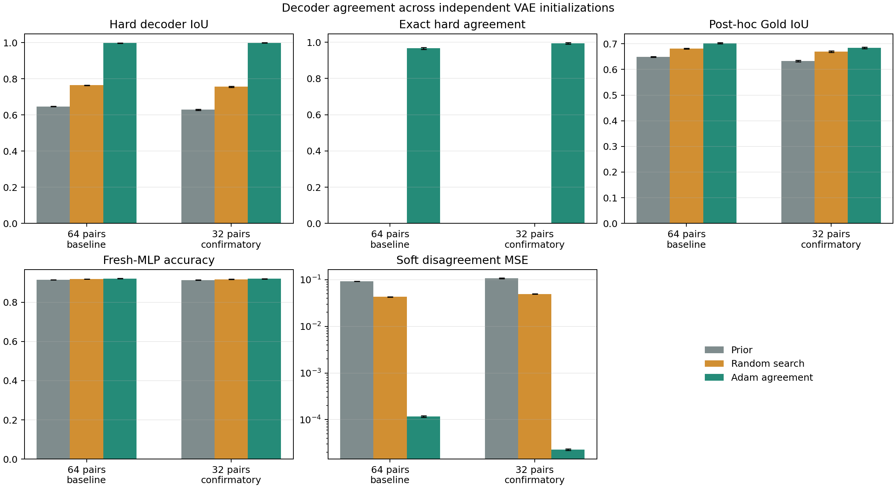

### Выбор параметров

| Проверка | Вариант | Результат |
|---|---|---:|
| VAE horizon, 16 VAE | 80 эпох | best validation loss 28.6639 |
| VAE horizon, 16 VAE | 160 эпох | **28.2849** |
| VAE horizon, 16 VAE | 240 эпох | **28.2849**; улучшений после 160: 0/16 |
| Agreement, 8 пар | 1000 шагов, `R=8`, `T=0.5`, `lr=0.03` | exact 0.9727; soft MSE `1.067e-4` |
| Agreement, 8 пар | 2000 шагов, `R=12`, `T=0.5`, `lr=0.03` | **exact 0.9961; soft MSE `2.373e-5`** |

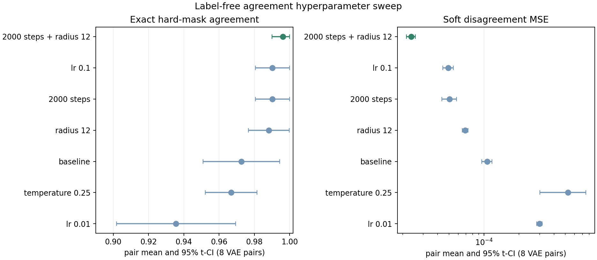

### Примеры масок

Столбцы: initial первого VAE, agreement первого VAE, выровненный agreement второго VAE, analytic ideal.

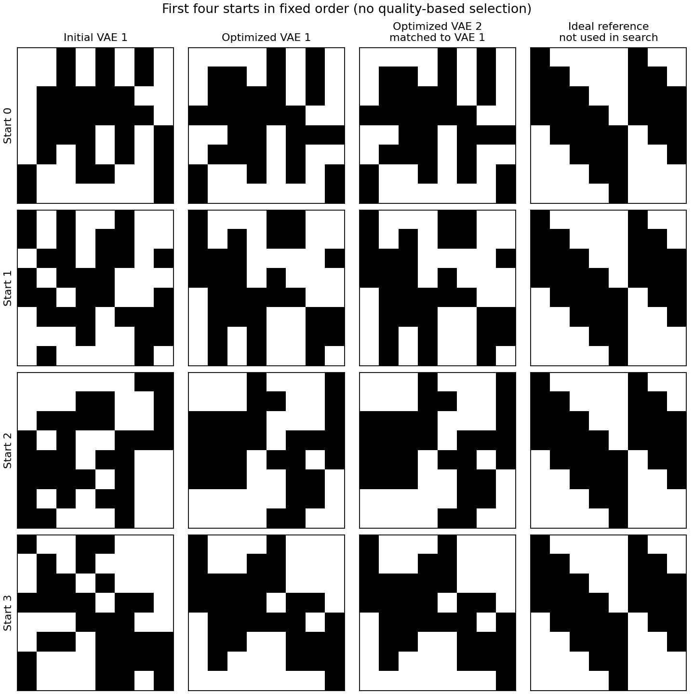

## 2. Разные gaps

| Параметр | Состояние |
|---|---|
| Gap между train- и held-out pattern | Зафиксирован текущий split |
| Sweep по разным gaps | Отложен; результатов нет |

## 3. Достижимость `z*` и шум вокруг него

Постановка: восемь frozen VAE seeds `186, 188, …, 200`; `8×8`, hard exact-32. Gold-oracle: Adam, 2000 шагов, `lr=0.03`, `T=0.5`; exact считается после Hungarian-перестановки hidden columns.

### Oracle radius sweep

128 стартов на VAE, 95% ДИ по восьми VAE.

| Радиус `R` | Exact ideal | Gold IoU |
|---:|---:|---:|
| 1 | 1.1% [0.0%; 2.3%] | 0.853 [0.823; 0.882] |
| 2 | 46.7% [35.2%; 58.2%] | 0.962 [0.950; 0.973] |
| 3 | 85.0% [80.3%; 89.6%] | 0.990 [0.987; 0.994] |
| 4 | 95.7% [93.5%; 97.9%] | 0.997 [0.996; 0.999] |
| 6 | 96.4% [94.9%; 97.9%] | 0.998 [0.997; 0.999] |
| 12 | 91.7% [89.6%; 93.8%] | 0.995 [0.994; 0.996] |

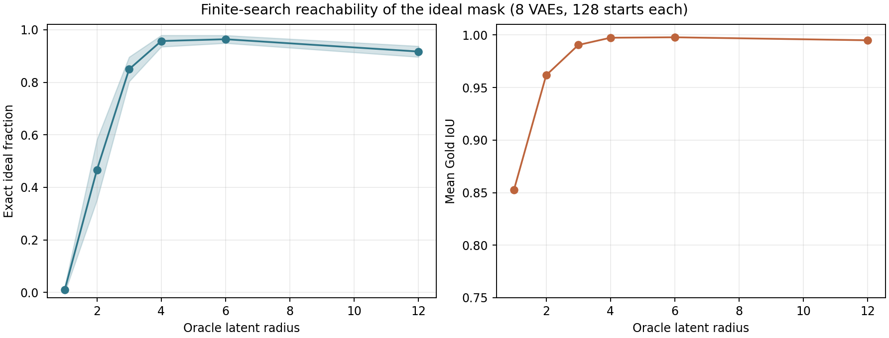

### Noise sweep около exact `z*`

Восемь VAE × восемь anchors × четыре направления × четыре задачи: 1024 task-z траектории на радиус. Anchors получены Gold-oracle при `R=12`.

| Начальный L2-шум | Exact до task-z | Exact final | Exact best-query | Gold IoU final | L2 final до anchor `z*` |
|---:|---:|---:|---:|---:|---:|
| 0 | 100.0% | 2.05% | 42.68% | 0.892 | 3.367 |
| 0.1 | 100.0% | 1.95% | 38.57% | 0.892 | 3.363 |
| 0.25 | 100.0% | 1.56% | 40.82% | 0.892 | 3.348 |
| 0.5 | 100.0% | 1.27% | 35.35% | 0.889 | 3.386 |
| 1 | 100.0% | 1.76% | 34.08% | 0.886 | 3.458 |
| 2 | 94.53% | 1.46% | 24.80% | 0.881 | 3.696 |
| 4 | 13.67% | 0.49% | 4.39% | 0.862 | 4.597 |
| 8 | 0.0% | 0.0% | 0.0% | 0.792 | 7.055 |

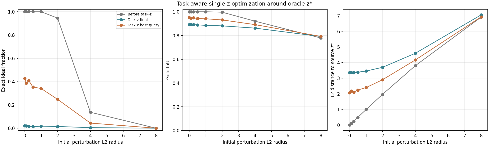

### Matched `R=4`

Gold-oracle нашёл 492/512 exact endpoints; после четырёх задач анализ содержит 1968 траекторий в каждой стартовой группе.

| Старт task-z | Стадия | Exact | Gold IoU | L2 до paired `z*` |
|---|---|---:|---:|---:|
| Prior | Initial | 0 | 0.639 [0.630; 0.648] | 3.992 [3.946; 4.038] |
| Prior | Final soft Adam | 0/1968 | 0.718 [0.712; 0.724] | 3.885 [3.842; 3.927] |
| Exact `z*` | Initial | 100% | 1.000 | 0 |
| Exact `z*` | Final soft Adam | 0/1968 | 0.798 [0.795; 0.802] | 2.307 [2.259; 2.356] |
| Exact `z*` | Best-query soft Adam | 14.4% [12.2%; 16.5%] | 0.873 [0.866; 0.880] | 1.556 [1.508; 1.604] |

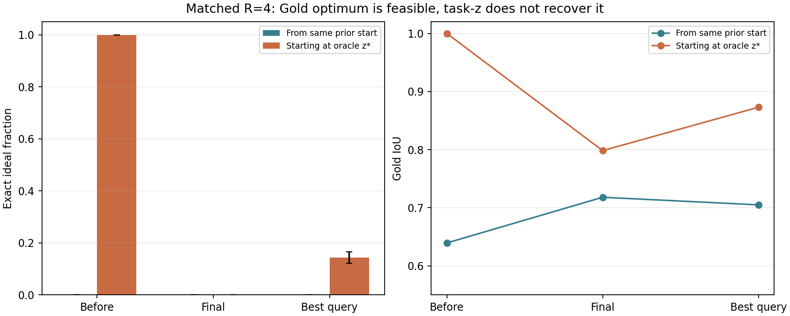

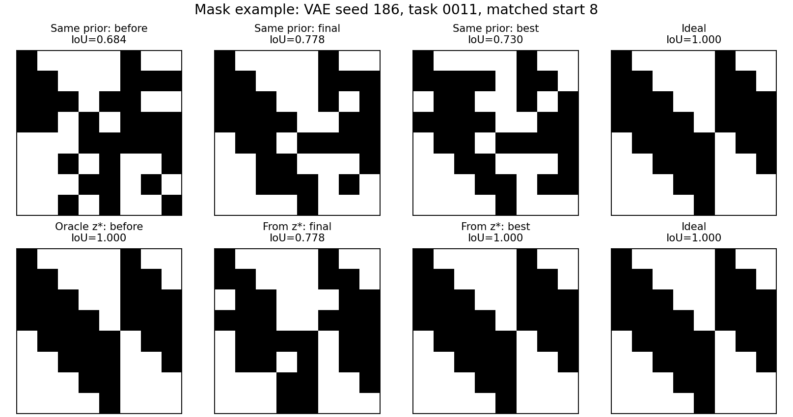

## 4. Adam, hard STE и hard-mask sampling

Сравнение относится к `length=8`, `pattern length=4`. Размер эксперимента указан отдельно для каждого метода.

| Метод | Масштаб | Final Gold IoU из prior | Exact из prior | Exact final из `z*` | Gold IoU final из `z*` | L2 final до `z*` |
|---|---|---:|---:|---:|---:|---:|
| Soft task-z Adam | 8 VAE | 0.718 | 0/1968 | 0/1968 | 0.798 | 2.307 |
| Hard-forward STE | 2 VAE, pilot | 0.675 | 0/496 | 52/496 = 10.5% | 0.915 | 1.701 |
| Robust hard sampling | 8 VAE | 0.675 | 0/2048 | 208/1968 = 10.6% | 0.871 | 1.700 |
| Robust hard sampling | 32 VAE-пары | 0.6716 | 0/16384 | 1833/15684 = 11.69% | 0.8701 | 1.6821 |

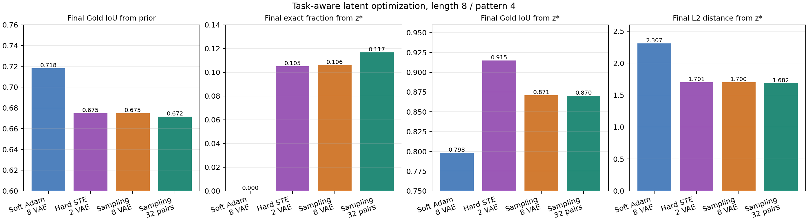

Soft Adam оптимизирует soft relaxation; hard STE использует бинарный forward и soft surrogate gradient; sampling оценивает только binary exact-K supports. Gold не участвует в task-z или sampling selection.

## 5. Robust hard-mask sampling на 32 VAE-парах

Общий протокол: 64 frozen decoder; 64 prior и 64 oracle-старта на decoder; `R=4`; восемь поколений × 16 мутаций; 400-step screening; два независимых 2000-step refinement fit; третий независимый 2000-step final fit. 95% ДИ по 32 VAE-парам.

### `length=8`, `pattern length=4`

Gold-oracle получил exact ideal для 3921/4096 стартов.

| Старт | Стадия | Exact ideal | Gold IoU | Test accuracy | Test BCE | L2 до paired `z*` |
|---|---|---:|---:|---:|---:|---:|
| Prior | Initial | 0 | 0.6353 [0.6326; 0.6381] | 0.91372 [0.91328; 0.91416] | 0.23918 [0.23839; 0.23996] | 4.0338 [4.0168; 4.0509] |
| Prior | Final | 0 | 0.6716 [0.6694; 0.6738] | 0.92110 [0.92071; 0.92148] | 0.22365 [0.22310; 0.22420] | 4.1620 [4.1485; 4.1755] |
| Exact `z*` | Initial | 1 | 1 | 0.92995 [0.92961; 0.93029] | 0.20451 [0.20397; 0.20505] | 0 |
| Exact `z*` | Final | 0.1168 [0.1117; 0.1219] | 0.8701 [0.8685; 0.8718] | 0.92926 [0.92897; 0.92956] | 0.20610 [0.20569; 0.20652] | 1.6821 [1.6697; 1.6944] |

| Старт | Δ accuracy | Δ BCE | Δ Gold IoU | Хотя бы одна принятая мутация |
|---|---:|---:|---:|---:|
| Prior | +0.007374 [+0.006864; +0.007884] | −0.015528 [−0.016195; −0.014860] | +0.03624 [+0.03468; +0.03779] | 0.9850 |
| Exact `z*` | −0.000686 [−0.001001; −0.000370] | +0.001592 [+0.001113; +0.002070] | −0.12985 [−0.13146; −0.12824] | 0.9000 |

### `length=32`, `pattern length=5`

Данные: 24 train-pattern, восемь held-out pattern, 9600 importance maps. Обучены 64 VAE: 160 эпох, latent dimension 32, `β=0.1`, batch 256. Gold-oracle при `R=4` получил 0/4096 exact; mean best hard IoU `0.5189 [0.5164; 0.5214]`.

| Старт | Стадия | Exact ideal | Gold IoU | Test accuracy | Test BCE | L2 до oracle-best |
|---|---|---:|---:|---:|---:|---:|
| Prior | Initial | 0 | 0.4535 [0.4522; 0.4548] | 0.67827 [0.67800; 0.67854] | 0.59703 [0.59676; 0.59730] | 4.2900 [4.2613; 4.3187] |
| Prior | Final | 0 | 0.4818 [0.4805; 0.4830] | 0.68459 [0.68439; 0.68479] | 0.59031 [0.59009; 0.59053] | 4.3657 [4.3424; 4.3890] |
| Oracle-best `R=4` | Initial | 0 | 0.5189 [0.5164; 0.5214] | 0.68716 [0.68684; 0.68748] | 0.58757 [0.58722; 0.58793] | 0 |
| Oracle-best `R=4` | Final | 0 | 0.5212 [0.5190; 0.5233] | 0.68902 [0.68877; 0.68927] | 0.58552 [0.58524; 0.58579] | 1.6168 [1.6034; 1.6302] |

| Старт | Δ accuracy | Δ BCE | Δ Gold IoU | Хотя бы одна принятая мутация |
|---|---:|---:|---:|---:|
| Prior | +0.006320 [+0.006124; +0.006517] | −0.006722 [−0.006910; −0.006534] | +0.02830 [+0.02744; +0.02916] | 0.9955 |
| Oracle-best `R=4` | +0.001859 [+0.001735; +0.001983] | −0.002057 [−0.002178; −0.001936] | +0.00229 [+0.00166; +0.00293] | 0.9908 |

| Oracle preflight | Mean best-soft IoU | Max best-hard IoU | Exact |
|---|---:|---:|---:|
| `R=12`, seed 1000, 8 стартов | 0.5362 | 0.5920 | 0/8 |
| `R=32`, seed 1000, 8 стартов | 0.5643 | 0.6244 | 0/8 |
| Analytic ideal fresh-MLP ceiling | Accuracy 0.7138 | BCE 0.5583 | — |

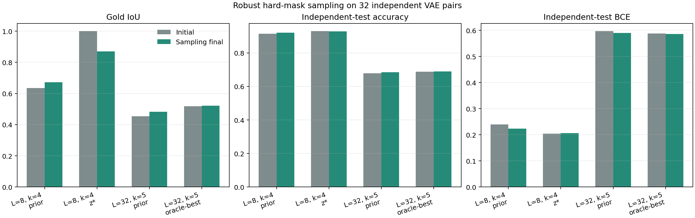

## 6. Heatmaps hard-масок

Перед усреднением каждая маска Hungarian-align’ится к analytic ideal. Initial-маски одинаковы между задачами одного decoder: `4096` уникальных initial-масок в каждой размерности; значения `16384` и `32768` ниже включают их повторения по четырём и восьми задачам.

| Размер | Старт | Стадия | Включений | Gold recall | Off-Gold | Contrast | Entropy, bit |
|---|---|---|---:|---:|---:|---:|---:|
| `8×8` | Prior | Initial | 16384 | 0.7753 | 0.2247 | 0.5507 | 0.6761 |
| `8×8` | Prior | Final | 16384 | 0.8020 | 0.1980 | 0.6040 | 0.6201 |
| `8×8` | Exact `z*` | Initial | 15684 | 1.0000 | 0.0000 | 1.0000 | 0.0000 |
| `8×8` | Exact `z*` | Final | 15684 | 0.9286 | 0.0714 | 0.8571 | 0.3041 |
| `32×32` | Prior | Initial | 32768 | 0.6235 | 0.0697 | 0.5537 | 0.3788 |
| `32×32` | Prior | Final | 32768 | 0.6499 | 0.0648 | 0.5850 | 0.3551 |
| `32×32` | Oracle-best `R=4` | Initial | 32768 | 0.6828 | 0.0587 | 0.6241 | 0.3317 |
| `32×32` | Oracle-best `R=4` | Final | 32768 | 0.6848 | 0.0584 | 0.6265 | 0.3281 |

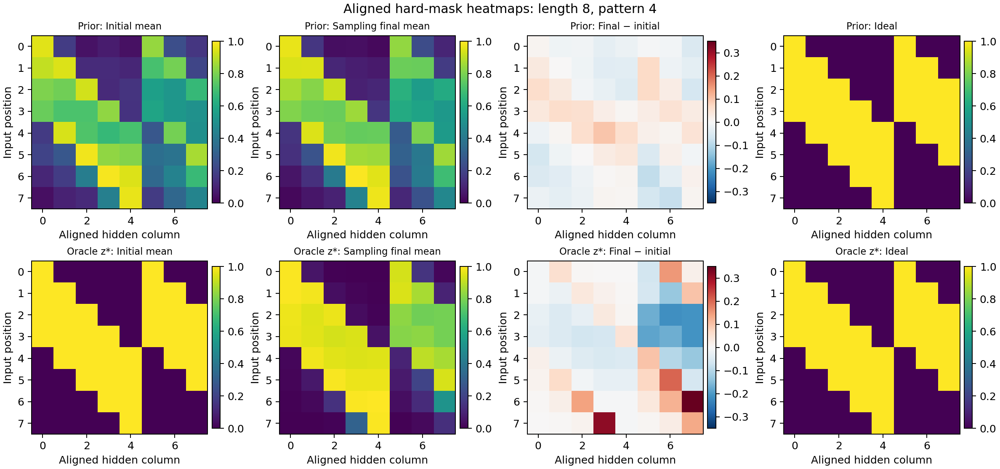

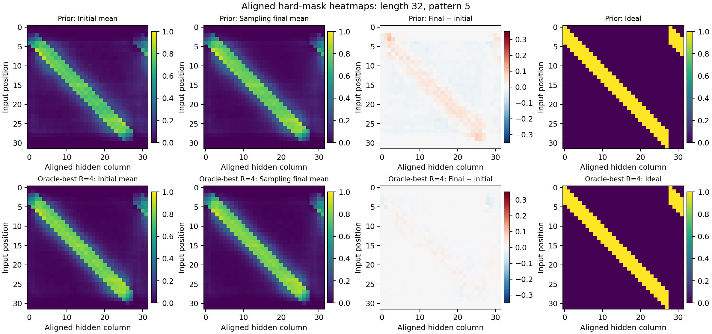

### Random exact-K alignment control

| Размер | Random raw contrast | Random + Hungarian | VAE initial raw | VAE initial + Hungarian | Best-window random | Best-window VAE initial | Best-window VAE final |
|---|---:|---:|---:|---:|---:|---:|---:|
| `8×8` | 0.0013 | 0.3132 | 0.1029 | 0.5507 | 0.6857 | 0.8122 | 0.8387 |
| `32×32` | −0.00005 | 0.3227 | 0.0186 | 0.5537 | 0.4391 | 0.6720 | 0.7010 |

`Best-window` — среднее покрытие лучшего непрерывного окна длины `k` в каждой hidden-column; метрика не использует Hungarian или Gold-column assignment.

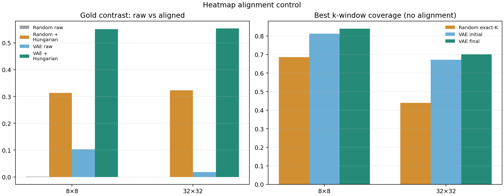

## 7. Краткий итог

| Проверка | Результат |
|---|---|
| Agreement между независимо обученными VAE | Подтверждено: exact hard agreement `96.68%` на 64 парах и `99.41%` на 32 новых парах |
| Agreement восстанавливает analytic ideal | Не подтверждено: итоговый Gold IoU `0.7020` и `0.6845` при decoder IoU `≈1` |
| Ideal достижим внутри VAE для `8×8` | Подтверждено: Gold-oracle при `R=4` нашёл exact в `95.7%` стартов |
| Task-z находит ideal из prior | Не подтверждено: `0` exact для soft Adam, hard STE и hard sampling |
| Task-loss удерживает найденный `z*` | Не подтверждено: soft Adam сохранил `0%`, hard STE `10.5%`, sampling `11.69%` exact |
| Hard sampling улучшает task-quality из prior | Подтверждено: accuracy `+0.00737` для `8×8` и `+0.00632` для `32×32` |
| VAE prior содержит locality сверх эффекта Hungarian | Подтверждено best-window без alignment: `0.812` против random `0.686` для `8×8`; `0.672` против `0.439` для `32×32` |
| Latent одного VAE можно амортизированно перенести в другой VAE | Частично подтверждено: linear adapter даёт hard IoU `0.7613` против identity `0.6299`, но exact только `97/262144` |
| Нелинейный adapter лучше линейного | Не подтверждено: MLP хуже linear на `−0.0062` hard IoU |
| Ideal достижим текущей VAE для `32×32/k=5` | Не подтверждено: `0/4096` exact при `R=4`; `0/8` в preflight при `R=32` |
| Точная граница exact-бассейна около `z*` | Не определена: sampled exact сохраняется до L2 `1`, уменьшается между `1–2`, почти исчезает к `4` |

## 8. Latent adapters между двумя CVAE

Постановка: 32 независимо обученные пары VAE, оба направления внутри каждой пары, `16384/4096/4096` train/validation/test latent-кодов на направление. Decoder заморожены; Gold и task labels не используются для обучения или выбора checkpoint.

$$
z_2=A_{12}(z_1),\qquad
\mathcal L_{adapter}=\left\|\operatorname{softTopK}(D_1(z_1))
-P^*\operatorname{softTopK}(D_2(A_{12}(z_1)))\right\|_2^2.
$$

`P*` — detached per-example Hungarian-сопоставление hidden columns. Adapter оптимизируется 2000 шагов при `R=12`; test latent-коды не участвуют в выборе checkpoint. 95% ДИ считаются по 32 VAE-парам после усреднения двух направлений.

| Метод | Soft MSE ↓ | Hard IoU ↑ | Exact hard | Fixed-permutation IoU ↑ | Unique target masks | Post-hoc Gold IoU |
|---|---:|---:|---:|---:|---:|---:|
| Independent prior | 0.106989 [0.105956; 0.108021] | 0.6299 [0.6285; 0.6312] | 0/262144 | 0.3564 | 1.0000 | 0.6325 |
| Identity `z₂=z₁` | 0.106872 [0.105816; 0.107928] | 0.6299 [0.6284; 0.6313] | 0/262144 | 0.3893 | 1.0000 | 0.6325 |
| Constant adapter | 0.071495 [0.070829; 0.072162] | 0.6777 [0.6763; 0.6792] | 0/262144 | 0.3768 | 0.0002 | 0.7436 |
| Linear adapter | **0.031884 [0.030771; 0.032996]** | **0.7613 [0.7576; 0.7649]** | **97/262144 = 0.037%** | **0.7465** | **1.0000** | 0.6448 |
| Residual MLP adapter | 0.033925 [0.032834; 0.035016] | 0.7551 [0.7517; 0.7585] | 52/262144 = 0.020% | 0.7389 | 1.0000 | 0.6451 |

Одна перестановка hidden-columns выбирается на validation и фиксируется для test. Linear сохраняет большую часть результата и без per-example Hungarian: `0.7465` против `0.7613`. Constant улучшает agreement, но генерирует одну маску; linear и MLP дают `4096/4096` уникальных target-масок в каждом направлении.

Парный эффект linear относительно constant: `−0.039612 [−0.040514; −0.038710]` soft MSE и `+0.0836 [+0.0802; +0.0869]` hard IoU.

| One-sided контроль на 64 test-кодах на направление | Soft MSE ↓ | Hard IoU ↑ | Exact hard |
|---|---:|---:|---:|
| Linear adapter | 0.032050 [0.030918; 0.033183] | 0.7609 [0.7570; 0.7648] | 1/4096 = 0.024% |
| Residual MLP adapter | 0.033968 [0.032832; 0.035104] | 0.7559 [0.7520; 0.7599] | 0/4096 |
| `z₂`-only Adam, independent init | 0.008918 [0.008659; 0.009177] | **0.9300 [0.9279; 0.9321]** | **955/4096 = 23.32%** |
| `z₂`-only Adam, MLP init | **0.008270 [0.007929; 0.008612]** | 0.9240 [0.9215; 0.9265] | 847/4096 = 20.68% |

MLP хуже linear: парный эффект `+0.002041 [0.001547; 0.002535]` soft MSE и `−0.0062 [−0.0080; −0.0044]` hard IoU. Linear output имеет mean norm `4.768` и достигает границы `R=12` в `0.03%` случаев; MLP — norm `7.366` и границу в `17.42%` случаев.

MLP-init улучшает итоговый soft Adam-loss на `−0.000648 [−0.000878; −0.000418]`, но ухудшает hard IoU на `−0.0060 [−0.0079; −0.0040]` и exact на `−2.64 п.п. [−4.39; −0.89]`.

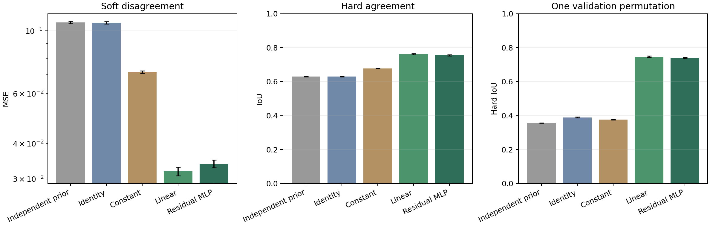

Heatmaps показывают средние hard-маски первой пары после выравнивания target к source; строки — два направления, порядок примеров фиксирован.

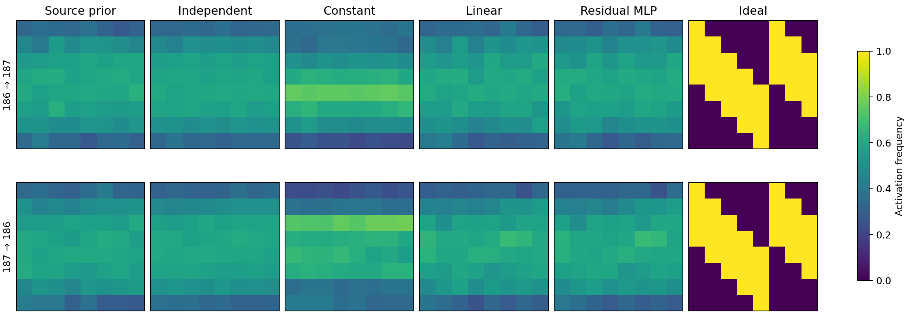

## Артефакты

| Блок | Основные данные |
|---|---|
| Agreement baseline | [`summary.json`](data/2026-09-13/agreement_baseline_64pairs.json) |
| Agreement confirmatory | [`summary.json`](data/2026-09-13/agreement_confirmatory_32pairs.json) |
| `z*` noise/radius | [`summary.json`](data/2026-09-13/zstar_noise_summary.json), [`radius_sweep_summary.json`](data/2026-09-13/zstar_radius_sweep_summary.json) |
| Matched `R=4` | [`refined_summary.json`](data/2026-09-13/zstar_matched_r4_summary.json) |
| Sampling `8×8` | [`summary.json`](data/2026-09-13/sampling_pattern8_32pairs_summary.json), [`paired_analysis.json`](data/2026-09-13/sampling_pattern8_32pairs_paired.json) |
| Sampling `32×32` | [`summary.json`](data/2026-09-13/sampling_pattern32_k5_32pairs_summary.json), [`paired_analysis.json`](data/2026-09-13/sampling_pattern32_k5_32pairs_paired.json) |
| Heatmaps | [`mask_heatmap_stats.json`](assets/2026-09-13/mask_heatmap_stats.json), [`alignment control`](assets/2026-09-13/final_heatmap_alignment_control.json) |
| Latent adapters | [`summary.json`](data/2026-09-13/latent_adapter_32pairs_summary.json), [`standalone report`](LATENT_ADAPTER_32PAIRS_2026-09-13.md) |
| Final figures | [`generator`](../pattern/evaluation/final_report_20260913.py) |
