# Отчёт за 19 сентября 2026 года

## Кратко: ответы на три вопроса

**1. Если обучить каждую VAE на своём паттерне, даст ли согласование тот же результат, что при общих данных?** Две VAE дали точное совпадение масок в **91,7%** случаев против **99,4%** в прежнем опыте с общей смесью паттернов. При увеличении группы общая маска стала больше похожа на аналитическую теплицеву: IoU вырос с **0,689** до максимума **0,744** для 6–7 VAE. Дальше улучшения нет: у 10 VAE IoU равен **0,736**. В новом опыте на входе длины 11 максимум среднего IoU составил **0,806** при восьми VAE, но рост также немонотонен.

**2. Зависит ли генератор Gψ от z и нужно ли обучать z?** Утверждать, что зависимости нет, нельзя: **один** фиксированный z дал худшее качество, чем обучаемый (**0,360 против 0,251** ошибки при близком времени). Но **16 разных фиксированных z** дали почти тот же результат, что обучаемые (**0,248 против 0,251**). Хорошую U можно найти и совсем без z, если обучить 16 отдельных генераторов, потратив примерно **в 15 раз больше времени**. Следовательно, необходимость обновлять z градиентом не показана; выбор удачной структуры или начального состояния важен. Коды VAE из первого вопроса и z на входе Gψ — разные переменные.

**3. Работает ли метод за пределами двоичных паттернов — в DeepSets и DeepSphere?** Проверили **две задачи DeepSets**: [сумму цифр, поданных четырьмя битами](#текстовая-сумма-цифр), и [сумму рукописных цифр MNIST8m](#digitsum-на-mnist8m). DeepSphere пока не проверяли. В первом опыте обучаемый `z` не помог: все варианты, включая генератор без `z`, дали **100%** точных сумм на длине 100. На MNIST8m при одинаковом свёрточном роутере непрерывная сгенерированная `U` дала **83,66%** точных сумм на длине 50 против **80,59%** у аналитической свёрточной, **76,43%** у обучаемой кронекеровской и **72,54%** у случайной `U`. Плотная сеть получила **83,72%** и меньшую MAE (**0,391 против 0,441**). Бинарная generated `U` дала **79,00%**, практически как случайная бинарная (**78,96%**). Это один seed: генератор выиграл у согласованных непрерывных rank-32 контролей, но не у бинарного контроля и не у плотной сети.

**Новая проверка на отдельных задачах — [Aug-Omniglot](#генератор-общей-u-на-aug-omniglot).** Лучшая сгенерированная `U` дала **90,60%** точности, прямая обучаемая `U` — **92,14%**, фиксированная единичная `U` — **86,46%**. Генерация помогает по сравнению с фиксированной `U`, но не обгоняет прямое обучение той же структуры. Условие `U` по support-набору не помогло: замена support на чужой не изменила ответы.

## Совпадают ли маски VAE, обученных на разных паттернах?

**Что проверяли.** Раньше две VAE обучались на одних и тех же картах важности. Теперь каждую VAE обучили только на картах *своего* паттерна и искали по одной маске от каждой модели, которые совпадают друг с другом. Проверяли, приближает ли такое совпадение маски к аналитическому решению и помогает ли новой сети решать обе задачи.

**На чём проверяли.** Взяли 8 пар из всех 16 двоичных паттернов длины 4: четыре пары отличаются одним битом, четыре — всеми битами. Для каждой пары провели 4 повтора с разными инициализациями. Банк каждого паттерна содержит 8000 карт важности; на обучение VAE взяли 800 лучших. Поиск запускали из 64 начальных точек на повтор. Сравнили его со случайным поиском при одинаковом числе проверок и с двумя VAE, обученными на одном паттерне. Найденные маски отдельно проверили на новых сетях, обученных с нуля.

| Способ получения пары масок | Совпадение масок¹ | Точное совпадение | Совпадение с аналитической маской¹ |
|---|---:|---:|---:|
| Разные паттерны, до поиска | 0,626 | — | 0,634 |
| Разные паттерны, случайный поиск | 0,735 | — | 0,667 |
| Разные паттерны, поиск совпадения | **0,995** | **91,7%** | **0,689** |
| Один паттерн, поиск совпадения | 0,998 | 97,3% | 0,660 |
| Прошлая итерация: обе VAE на общей смеси паттернов | 0,9996 | 99,4% | 0,685 |

¹ Доля общих выбранных связей среди всех связей, выбранных хотя бы одной из двух масок. В последнем столбце найденные маски сравниваются с аналитической. Новые результаты усреднены по 8 парам паттернов; четыре повтора учтены внутри каждой пары. Прошлый результат — по 32 парам VAE.

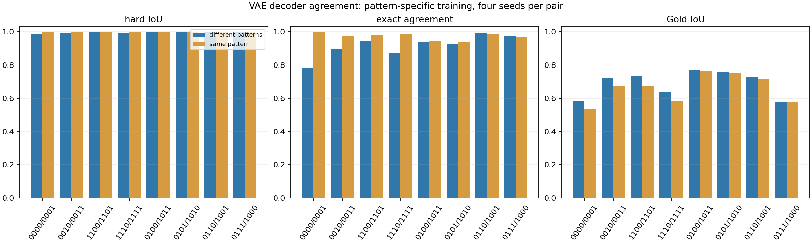

| Маска для новой сети | Средняя точность на задачах пары |
|---|---:|
| До поиска | 92,68% |
| После поиска совпадения | **92,84%** |
| После случайного поиска | 92,80% |
| Аналитическая | 92,79% |

Разница точности между маской после поиска и исходной — **+0,16 процентного пункта**. Описательный 95% интервал по восьми парам: от −0,17 до +0,50 пункта. Для разницы со случайным поиском: +0,04 пункта, интервал от −0,36 до +0,44. По этим данным нельзя уверенно утверждать, что поиск улучшил качество новой сети.

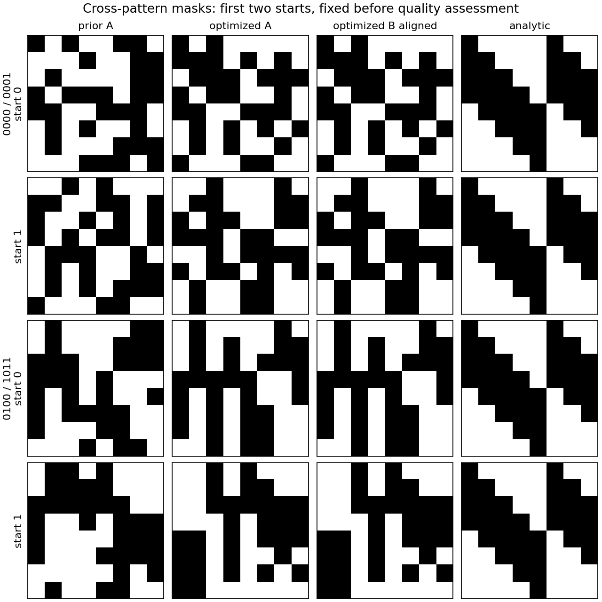

**Чего добились и как это трактовать.** Две VAE, обученные на разных паттернах, дают одинаковые маски для 91,7% начальных точек; это заметно лучше случайного поиска при том же числе кандидатов. Близость к аналитической маске выросла относительно исходных масок, но остаётся умеренной, а выигрыша в точности новой сети не видно.

В прошлой итерации обе VAE видели общую смесь 12 паттернов: точное совпадение составляло 99,4%, теперь — 91,7%. При этом близость к аналитической маске почти не изменилась: 0,685 против 0,689. В новом эксперименте контроль с двумя VAE *одного* паттерна дал 97,3% точных совпадений: разные паттерны действительно затрудняют поиск общей маски. Но высокий уровень совпадения сохранился и без общей смеси, поэтому прошлый результат нельзя объяснить только усреднением этих данных. Само совпадение по-прежнему не выделяет аналитическое правило. Старый и новый запуски различаются также объёмом данных VAE — 2400 против 800 карт, поэтому изменение относительно прошлой итерации нельзя приписать только разделению паттернов. Аналитическая маска — лишь один из способов реализовать задачу; несовпадение с ней само по себе не доказывает функциональную ошибку.

### Что меняется при согласовании 3–10 VAE

К каждой из восьми пар последовательно добавили ещё восемь VAE других паттернов. Для размеров 3–10 использовали одинаковые первые модели и начальные коды; каждый размер проверили в четырёх повторах из 64 начальных точек. Общая маска содержит 32 связи, которые чаще всего встречаются у моделей группы после приведения скрытых столбцов к одному порядку.

| Число VAE | Попарное совпадение масок | Все маски совпали | IoU общей маски с теплицевой |
|---:|---:|---:|---:|
| 2 | 0,995 | 91,7% | 0,689 |
| 3 | 0,967 | 58,3% | 0,725 |
| 4 | 0,946 | 33,6% | 0,733 |
| 5 | 0,912 | 15,7% | 0,740 |
| 6 | 0,889 | 11,9% | 0,744 |
| 7 | 0,872 | 7,0% | **0,744** |
| 8 | 0,853 | 4,5% | 0,739 |
| 9 | 0,834 | 2,8% | 0,737 |
| 10 | 0,823 | 1,6% | 0,736 |

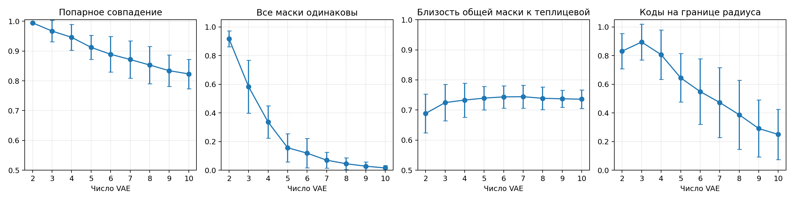

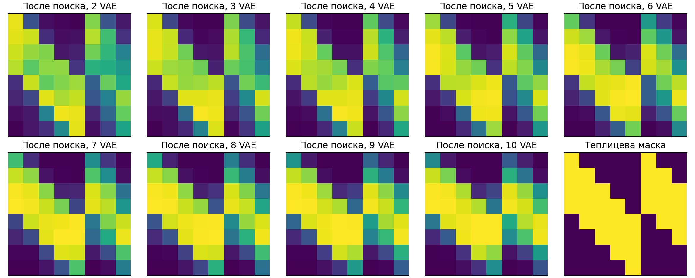

Ниже для каждого размера показана бинарная общая маска, IoU которой ближе всего к медиане по всем группам, повторам и начальным точкам. Это типичные примеры, а не лучшие найденные маски.

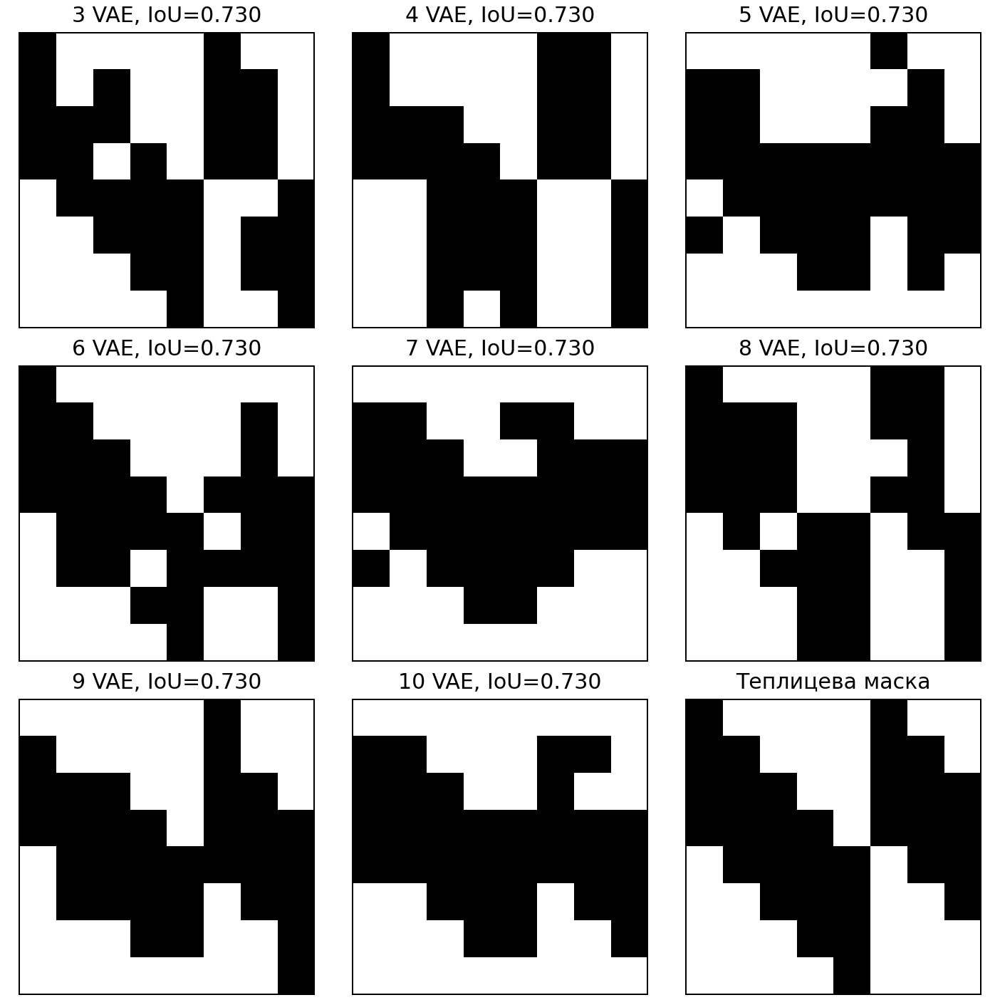

**Вывод.** Дополнительные VAE усиливают оконную диагональную структуру до 6–7 моделей, но эффект невелик и затем обращается. Разница 3 → 10 равна **+0,011 [−0,052; +0,074]**, а 5 → 10 — **−0,004 [−0,047; +0,040]**. Устойчивого улучшения после третьей VAE нет. Одновременно попарное совпадение падает до 0,823, а все десять масок совпадают лишь в 1,6% начальных точек. Ни одна общая маска не совпала с аналитической точно. [Числовые данные](data/2026-09-21/multi_pattern_agreement_summary.json).

Результаты по каждой паре: [числовые данные](data/2026-09-19/cross_pattern_agreement_summary.json).

## Новое согласование VAE на входе длины 11

*Дополнение по экспериментам 24–25 сентября.* Проверяли, появится ли диагональная, близкая к теплицевой маска, если каждый VAE обучить на картах своего паттерна длины 4. Вход имеет длину 11, восемь окон; аналитическая маска размера 11×8 содержит 32 связи. Для каждого из десяти паттернов собрали 16 384 MLP со случайными масками, оставили лучшие 10% карт и обучили четыре VAE с разными сидами.

В поиске VAE заморожены: обучаются только их векторы `z` и новые MLP. Для каждого VAE берётся его top-32 маска, по ней для **всех** паттернов считается BCE новых MLP. Для 2–10 VAE к средней BCE добавляется MSE между логитами декодеров после однократного выравнивания столбцов по первому VAE (коэффициент 0,5). Для одного VAE согласовывать логиты не с чем: его `z` обучается только по BCE, поэтому вариант «только MSE» и попарное совпадение масок здесь не определены. Аналитическая маска в поиске не участвует. Проверили вложенную группу из 1–10 VAE; для каждого размера — четыре сида и 16 случайных масок на сид.

| VAE | IoU случайная | IoU до поиска | IoU только MSE | IoU BCE (+ MSE) | Точность случайная | Точность BCE (+ MSE) | Точность аналитическая |
|---:|---:|---:|---:|---:|---:|---:|---:|
| 1 | 0,420 | 0,580 | — | 0,654 | 0,740 | 0,838 | 0,844 |
| 2 | 0,420 | 0,602 | 0,719 | 0,770 | 0,753 | 0,841 | 0,841 |
| 3 | 0,420 | 0,654 | 0,720 | 0,721 | 0,782 | 0,862 | 0,883 |
| 4 | 0,420 | 0,653 | 0,674 | 0,754 | 0,810 | 0,895 | 0,911 |
| 5 | 0,420 | 0,708 | 0,684 | 0,791 | 0,799 | 0,877 | 0,898 |
| 6 | 0,420 | 0,731 | 0,707 | 0,754 | 0,793 | 0,866 | 0,883 |
| 7 | 0,420 | 0,766 | 0,730 | 0,803 | 0,784 | 0,865 | 0,882 |
| 8 | 0,420 | 0,707 | 0,720 | **0,806** | 0,778 | 0,857 | 0,875 |
| 9 | 0,420 | 0,684 | 0,685 | 0,793 | 0,768 | 0,850 | 0,878 |
| 10 | 0,420 | 0,708 | 0,696 | 0,767 | 0,761 | 0,851 | 0,872 |

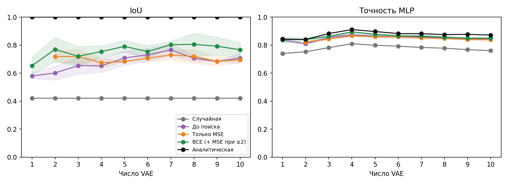

| VAE | BCE случайная ↓ | BCE только MSE ↓ | BCE (+ MSE) ↓ | BCE аналитическая ↓ | Попарный IoU масок VAE ↑ |
|---:|---:|---:|---:|---:|---:|
| 1 | 0,515 | — | 0,364 | 0,358 | — |
| 2 | 0,498 | 0,390 | 0,353 | 0,360 | 0,819 |
| 3 | 0,455 | 0,366 | 0,330 | 0,284 | 0,788 |
| 4 | 0,401 | 0,316 | 0,255 | 0,220 | 0,706 |
| 5 | 0,421 | 0,334 | 0,290 | 0,251 | 0,756 |
| 6 | 0,433 | 0,324 | 0,310 | 0,280 | 0,730 |
| 7 | 0,447 | 0,339 | 0,318 | 0,276 | 0,758 |
| 8 | 0,455 | 0,345 | 0,330 | 0,290 | 0,756 |
| 9 | 0,469 | 0,356 | 0,340 | 0,285 | 0,742 |
| 10 | 0,478 | 0,358 | 0,339 | 0,292 | 0,763 |

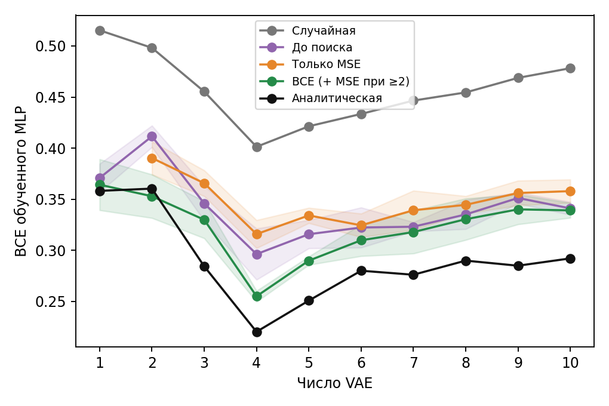

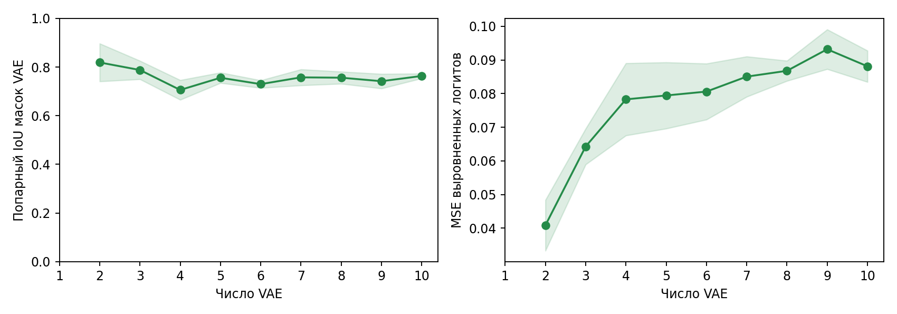

Лучший отдельный запуск — **8 VAE, сид 0: IoU 0,939** и точность MLP **0,870** против **0,875** на аналитической маске. Это максимум среди 40 запусков, а не оценка среднего качества.

Ниже — один конкретный сид для 1, 2, 3, 6, 8 и 10 VAE; строка с 8 VAE показывает этот лучший запуск. Слева показаны **средние логиты декодеров** (для одного VAE — его логиты), рядом — top-32 маска, случайная и аналитическая маски. После поиска столбцы переставлены по аналитической маске **только для показа и расчёта IoU**; на оптимизацию это не влияло.

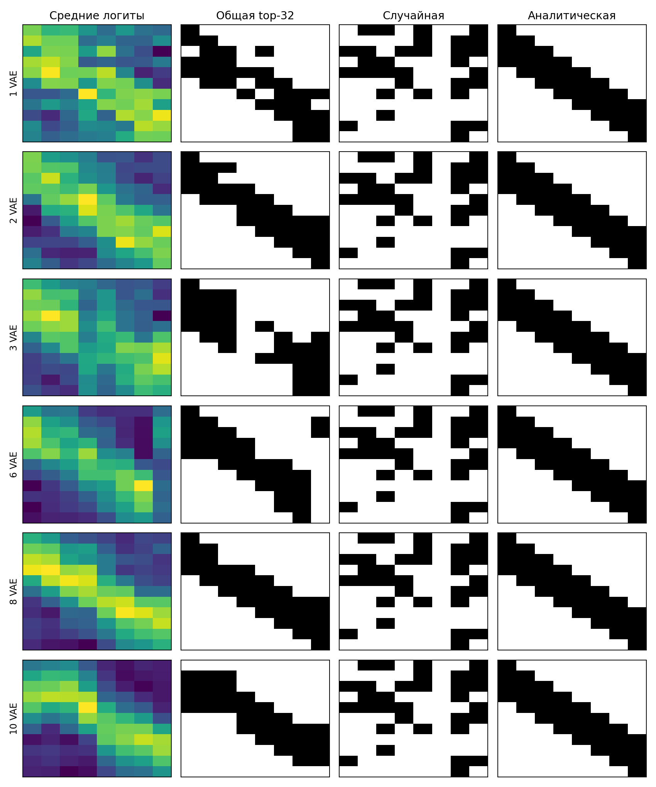

Хитмапы каждого VAE отдельно позволяют проверить, что диагональная полоса есть не только в среднем. Справа от каждого набора логитов показана его собственная top-32 маска; цветовая шкала логитов общая внутри каждого рисунка.

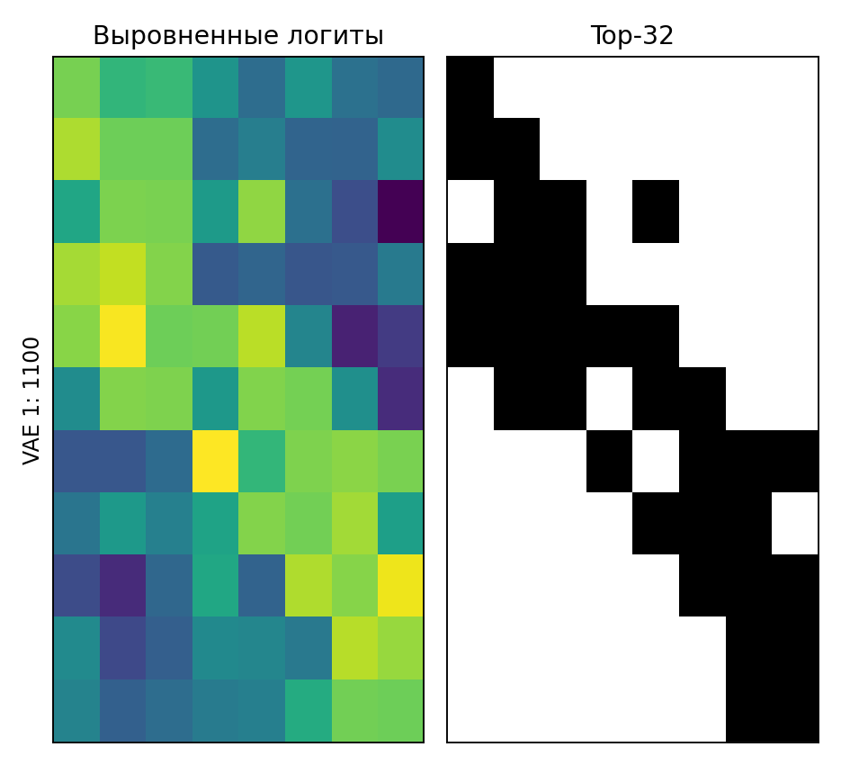

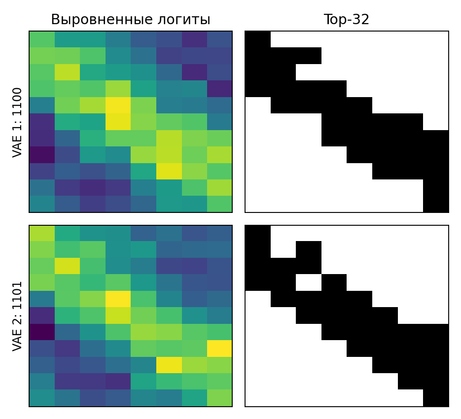

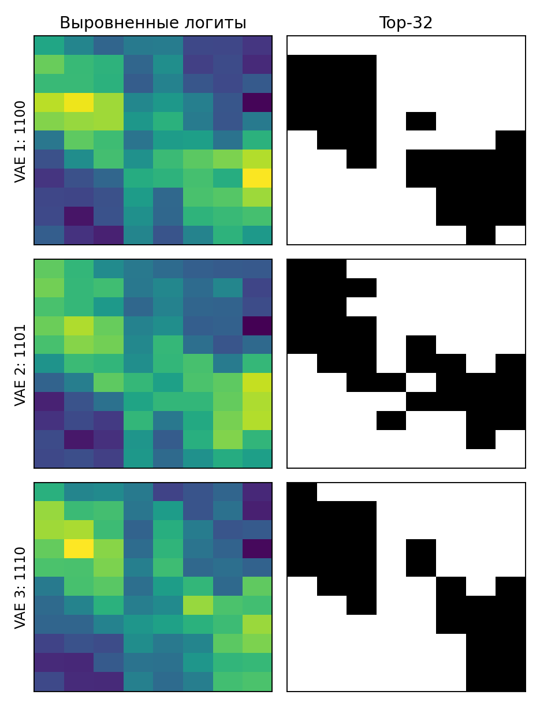

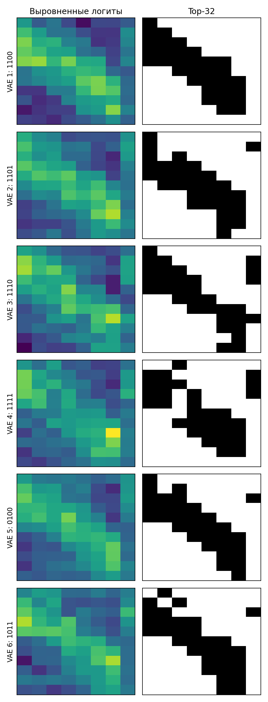

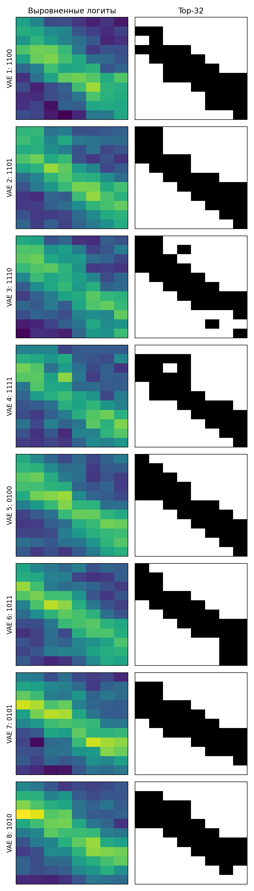

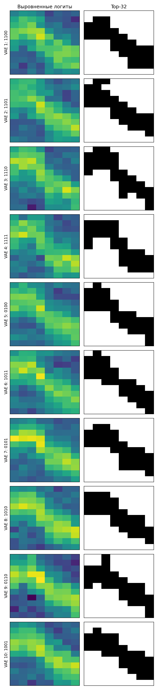

**Чего добились.** Уже один VAE после оптимизации по BCE даёт IoU **0,654**, а два — **0,770**; сам по себе рост числа VAE не объясняет весь эффект. При 8 VAE IoU составляет **0,806** против **0,420** у случайных масок, а точность MLP — **0,857** против **0,778**. BCE каждой маски улучшает IoU относительно одного MSE для 2 и 4–10 VAE; при 3 VAE разница почти нулевая. Полоса на хитмапах видна, но совпадение не полное и рост числа VAE не даёт монотонного выигрыша. Прямая подгонка `z` к аналитической маске дала средний IoU **0,914**, то есть до этого уровня поиск agreement пока не дошёл. Часть запусков упёрлась в лимит шагов; новые MLP обучались на входах, которые участвовали в отборе банка карт, поэтому абсолютную точность нельзя считать полностью независимым тестом. [Код эксперимента](../pattern/length11/).

## Помогает ли обучать `z` в генераторе общей структуры?

**Что проверяли.** Генератор получает четыре числа `z` и координаты связей, а выдаёт общую для задач матрицу `U`: она задаёт, какие связи используют общий вес. Для каждой задачи отдельно обучаются её веса. Сравнили два варианта: `z` обучается вместе с генератором или остаётся одним и тем же фиксированным кодом. В первом варианте обучение начинает с 16 разных кодов и выбирает лучший; во втором один код повторён 16 раз. Поэтому отдельно проверили, что дают 16 *разных, но фиксированных* кодов.

**На чём проверяли.** Все 16 двоичных паттернов длины 4 во входе длины 32; восемь повторов с разными инициализациями (seeds 42–49). На тесте — новые примеры тех же паттернов. В вариантах с `z` архитектура генератора и обучение весов задач одинаковы. Сравнили 100 шагов обучения и близкое время обучения: шаг с обновлением `z` дороже, поэтому фиксированному коду дали ещё 50 шагов. Ошибка BCE в таблице измеряет качество предсказания вероятности; меньше — лучше.

| Вариант | Шаги | Время обучения | Ошибка на тесте, BCE ↓ | Точность ↑ |
|---|---:|---:|---:|---:|
| **Обучаемый `z`** | 100 | 32,5 с | **0,251 ± 0,059** | **92,2%** |
| Один фиксированный `z` | 100 | 21,0 с | 0,384 ± 0,131 | 82,5% |
| Один фиксированный `z` | 150 | 31,4 с | 0,360 ± 0,153 | 83,6% |

Среднее и разброс посчитаны по восьми повторам. При одинаковом числе шагов обучаемый `z` лучше в 7 из 8 повторов; при близком времени — в 6 из 8. Во втором сравнении средняя разница ошибки составляет **0,109** в пользу обучаемого варианта. На отдельных seeds результат обратный, поэтому вывод относится к этому набору задач и способу обучения.

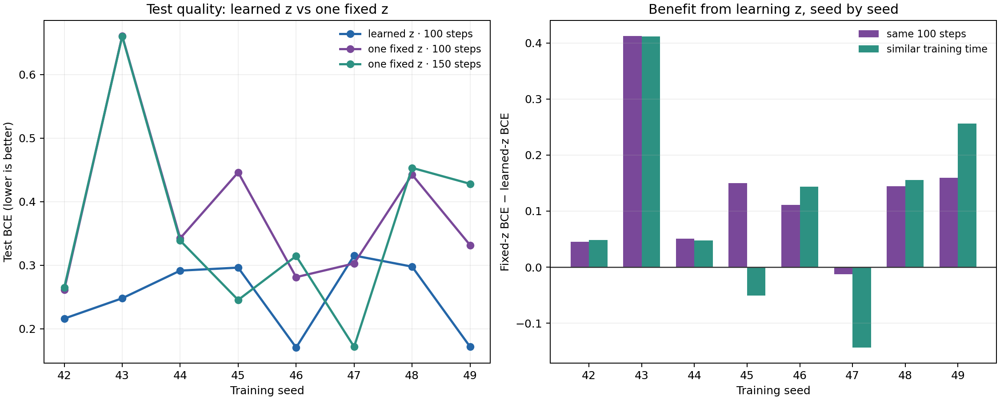

**Что объясняет выигрыш.** При близком времени 16 разных фиксированных кодов дали ошибку **0,248 ± 0,087** — практически такую же, как обучаемые коды (`0,251 ± 0,059`). Значит выигрыш над *одним* фиксированным кодом нельзя приписать только обучению `z`: возможность выбирать из нескольких структур тоже помогает. Нужность градиентного обновления самого `z` этот опыт не подтверждает. После выбора одного общего кода его можно убрать из уже обученного генератора без изменения `U`; явное обучение генератора совсем без `z` с одним начальным вариантом дало худшую среднюю ошибку `0,348`.

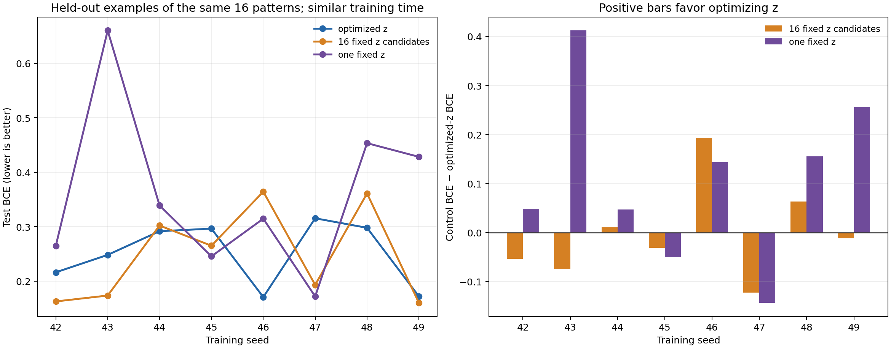

### Если `z` вообще нет: 16 независимых запусков

**Что проверяли.** Генератор получал только координаты связей. Для каждого из восьми прежних seeds обучили 16 отдельных генераторов по 150 шагов. Данные и настройки внутри seed были одинаковыми; менялась только инициализация генератора. Лучший запуск выбрали по обучающей валидации, без просмотра теста; на тесте использовали только его, не ансамбль. Варианты с `z` повторно запустили на той же ускоренной версии кода: тестовые числа в точности совпали с прежними, а время обучения стало меньше. Поэтому времена ниже относятся к повторному замеру и отличаются от первой таблицы.

| Вариант | Кандидаты на `U` | Суммарное время обучения на seed | BCE на тесте ↓ | Точность ↑ |
|---|---:|---:|---:|---:|
| Обучаемый `z` | 16 кодов одного генератора | 22,4 с | 0,251 ± 0,059 | 92,2% |
| 16 фиксированных `z` | 16 кодов одного генератора | 21,7 с | 0,248 ± 0,087 | 92,3% |
| Без `z`, один запуск | 1 генератор | 21,5 с | 0,348 ± 0,083 | 85,7% |
| **Без `z`, лучший из 16** | **16 отдельных генераторов** | **343,7 с** | **0,200 ± 0,035** | **95,2%** |

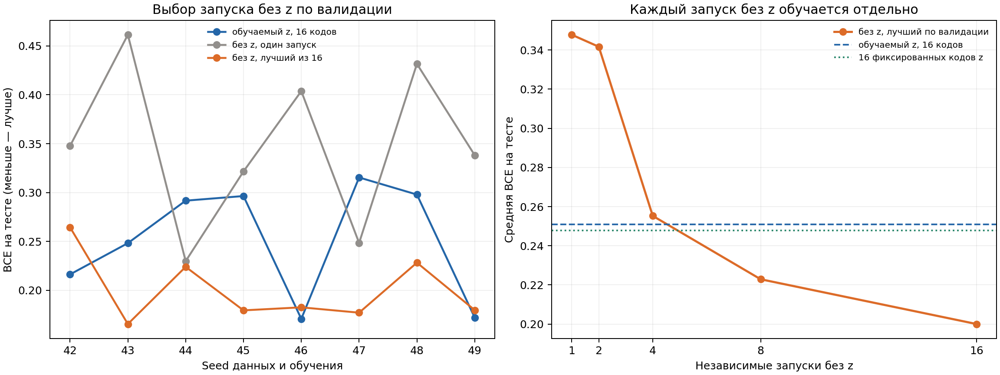

У 16 запусков без `z` средняя BCE улучшилась относительно одного запуска на **0,148**, причём улучшение есть на всех восьми seeds. По сравнению с обучаемым `z` средняя BCE ниже на **0,051**, но без `z` лучше только в **5 из 8** парных сравнений; описательный 95% интервал разницы «без `z` минус обучаемый `z`» — от **−0,107 до +0,005**. Следовательно, данные не доказывают превосходство одного подхода по качеству. Они показывают, что хорошую `U` можно найти и совсем без `z`, если потратить примерно **в 15 раз больше суммарного времени обучения**. При одинаковом времени варианты с 16 кодами дают меньшую среднюю BCE, чем один запуск без `z`: в этом протоколе латент помогает эффективно перебирать структуры, а градиентное обновление кода не оказалось необходимым.

Это проверка качества на новых примерах **известных** паттернов. Перенос на новые задачи и сравнение с кронекеровым методом статьи 2020 года здесь не проводились. [Исходные числа по каждому seed](data/2026-09-19/z_importance_summary.json), [16 запусков без `z` и правило выбора](data/2026-09-19/no_z_multistart_summary.json).

## Текстовая сумма цифр

**Что проверяли.** Сумма набора цифр 0–9, где каждая цифра уже представлена четырьмя битами. Это упрощённый опыт, а не точное воспроизведение эксперимента с изображениями из статьи Deep Sets. Обучали на наборах длины 1–10, проверяли перенос на длины 5, 10, 20, 50 и 100. В каждом из восьми повторов использовали 12 000 обучающих наборов, 2 000 валидационных и по 2 000 тестовых на каждую длину. Генератор получал один общий четырёхмерный `z` и номер бита, выдавал одну матрицу `U` размера 4×4 для всех цифр; ни цифры, ни их позиции ему не подавались. По размеченным обучающим наборам подбирали четыре веса `v`. Ответ модели: сумма битов всех цифр, умноженная на `U` и `v`.

| Вариант общей `U` | MAE суммы на длине 100 ↓ | Точная сумма после округления |
|---|---:|---:|
| Обучаемый `z`, 16 кодов | 0,001181 | 100% |
| Фиксированный `z`, 16 кодов | 0,001181 | 100% |
| Без `z`, один генератор | 0,001183 | 100% |
| Без `z`, 16 генераторов | 0,001177 | 100% |
| Единичная `U` | 0,001178 | 100% |

**Вывод.** Обучение `z` здесь не улучшило результат. Матрица `U` лишь переставляет четыре веса, а `v` может компенсировать любую перестановку; даже единичная `U` решает задачу. Поэтому этот опыт проверяет, мешает ли отсутствие `z` обучению, но не показывает, будет ли `z` полезен при более сложном преобразовании цифры.

**Почему сначала получался провал на длинных наборах.** В раннем варианте генератор также получал позицию цифры и строил отдельную `U` для каждой позиции. Если при обучении использовались только первые 10 позиций, средняя MAE на длине 100 составляла **27,8** с обучаемым `z` и **27,8** с одним генератором без `z`; результаты сильно различались между повторами. Когда короткие обучающие наборы размещали в случайных позициях из всех 100, все варианты достигли примерно **0,0012 MAE** и **100%** точных сумм. Проблемой оказались невиданные позиции, а не отсутствие обучаемого `z`.

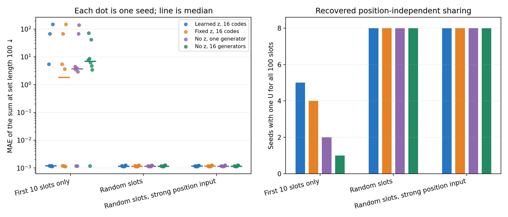

[Полный протокол](../deepsets_z/README.md) · [числа для одной общей U](../deepsets_z/summary_position_free.json) · [числа для раннего позиционного варианта](../deepsets_z/summary_prefix/summary.json).

## Помогает ли генератору первого слоя код изображения?

**Что проверяли.** В задаче суммы цифр на MNIST8m добавили к первому слою короткий код каждого изображения: энкодер 784 → 64 → 32 выдаёт 32 множителя, которые меняют веса слоя через общую матрицу U и адаптируемый для задачи вектор v. Сравнили прямое обучение U, фиксированную случайную U и четыре координатных генератора U: с правильными или перемешанными координатами весов, с ортогонализацией U или без неё. Для каждого варианта также проверили качество после отключения кода. Контроли без кода были **отдельно обучены**, а не получены таким отключением.

**На чём проверяли.** Каждая новая задача назначает цифрам случайные вещественные стоимости; нужно предсказать сумму стоимостей по набору изображений. Для адаптации v и выходного слоя даны 32 размеченных набора и пять шагов; тестовые изображения сдвинуты на три пикселя. Пулы изображений не пересекаются. На каждой длине тестового набора — 64 новые задачи. Все шесть вариантов обучались 5000 внешних шагов с одним seed 42. Ошибка MAE измеряется в единицах суммы; меньше — лучше.

| Первый слой | С кодом: длина 5 | Отдельное обучение без кода: длина 5 | С кодом: длина 20 |
|---|---:|---:|---:|
| Прямо обучаемая U | **1,126** | 1,141 | **2,544** |
| Фиксированная случайная U | 1,379 | 1,455 | 3,077 |
| Генератор, правильные координаты, ортогональная U | 1,383 | 1,575 | 3,078 |
| Генератор, перемешанные координаты, ортогональная U | 1,480 | 1,546 | 3,191 |
| Генератор, правильные координаты | 1,574 | 1,573 | 3,502 |
| Генератор, перемешанные координаты | 1,575 | 1,575 | 3,498 |
| Плотный первый слой | — | 1,302 | — |

**Чего добились и как это трактовать.** Код улучшил ортогональный пространственный генератор: MAE на длине 5 снизилась с 1,575 до 1,383. Однако плотный слой всё ещё лучше (1,302), а прямо обучаемая U — лучшая из проверенных (1,126). Генератор без ортогонализации от кода практически не выиграл. Если выключить код *после* обучения ортогонального генератора, ошибка резко растёт; это показывает, что модель использует код, но корректное сравнение качества дают отдельно обученные варианты в таблице. Пространственный генератор на этом seed лучше контроля с перемешанными координатами, но одного seed недостаточно для вывода о пространственной закономерности.

Слабый энкодер может объяснять оставшийся разрыв с плотным слоем, но его размер здесь не варьировался, поэтому причина разрыва не установлена. [Подробный протокол, числа и код](../deepsets_z/mnist8m/META_U_FIRST_IMAGE_CODE_RESULTS.md).

## DigitSum на MNIST8m

**От кода изображения к набору векторов.** После предыдущего опыта проверили энкодеры разной ширины. Лучший свёрточный энкодер снизил ошибку на новых задачах со случайными стоимостями цифр с **1,383 до 1,319** на длине 5, но обычный плотный слой давал **1,302**. Простое расширение MLP не помогло. Поэтому вместо одного набора из 32 коэффициентов на изображение дали модели несколько обучаемых векторов **v**. Роутер смотрит на пиксели цифры и выбирает их смесь. При 32 векторах ошибка снизилась до **1,155**; среди проверенных размеров выбрали 96, получив **1,111** при тех же 5000 шагах. Затем отдельно обучили свёрточный и MLP-роутер до 10 000 шагов: ошибки на длине 5 составили **0,994** и **1,097**. Именно эти два состояния стали отправной точкой для обычной суммы.

Генератор по координатам связей строит одну общую матрицу **U**. Изображение поступает роутеру, а его смесь векторов v меняет веса первого слоя через U. В этом опыте генератор не получает изображение; кода z также нет. [Энкодеры](../deepsets_z/mnist8m/META_U_FIRST_ENCODER_SWEEP_RESULTS.md), [векторы v](../deepsets_z/mnist8m/META_U_FIRST_V_MOE_RESULTS.md), [выбор числа векторов](../deepsets_z/mnist8m/META_U_FIRST_V_MOE_COUNT_RESULTS.md), [сравнение роутеров](../deepsets_z/mnist8m/META_U_FIRST_V_MOE_ROUTER_RESULTS.md).

**Проверка на обычной сумме.** Зафиксировали U и обучали остальные параметры на тех же наборах MNIST8m, что использовали для плотной контрольной сети: **148 148** обучающих наборов из цифр 1–9 длиной 1–9 и по **10 000** тестовых наборов каждой длины от 5 до 50. На тесте нет отдельной адаптации под набор. Целью была сама сумма цифр, без её центрирования. Лучшее состояние выбирали по ошибке на отдельной валидации длины 1–9; плотную сеть оценивали после 500 эпох. Точность ниже — доля наборов, где округлённый ответ равен сумме; ошибка — среднее абсолютное отклонение от суммы.

Чтобы выделить вклад генератора, при одном seed 42 и одном свёрточном роутере сравнили несколько `U` размера `235500 × 32`: непрерывную сгенерированную, бинарную сгенерированную, фиксированные случайные, аналитическую для 3×3-свёртки и обучаемую кронекеровскую. Последняя задаёт первый слой как `W = A V Bᵀ`, где размеры `A`, `V` и `B` равны `785 × 8`, `8 × 4` и `300 × 4`. У генератора 7 840 параметров, у двух кронекеровских множителей — 7 480; во всех вариантах `v` содержит 32 числа.

Бинарный генератор обучали как в протоколе Yeh: на meta-обучении каждая строка `U` была непрерывным распределением, чтобы градиент проходил через softmax; для валидации и дальнейшего обучения её заменяли на one-hot `argmax`. Из шести настроек температуры и регуляризации одну выбрали по hard-валидации, не по тестовой сумме. Для контроля использовали фиксированную случайную one-hot `U`.

| U первого слоя | Что фиксировали при обычной сумме | Точность, длина 50 ↑ | MAE, длина 50 ↓ |
|---|---|---:|---:|
| Плотная сеть; полноранговый аналог `U = I` | — | **83,72%** | **0,391** |
| Генератор | U и два следующих слоя | 81,85% | 0,464 |
| **Генератор** | **Только U** | **83,66%** | **0,441** |
| Генератор, бинарная U | Только U | 79,00% | 0,548 |
| Фиксированная случайная бинарная U | Только U | 78,96% | 0,558 |
| Kronecker, rank 32 | U и два следующих слоя | 74,54% | 0,580 |
| Kronecker, rank 32 | Только U | 76,43% | 0,636 |
| Фиксированная случайная | Только U | 72,54% | 0,619 |
| Аналитическая свёрточная | Только U | 80,59% | 0,510 |

Слева на графике показана точность на всех длинах. Справа сопоставлена сходимость генератора и кронекеровской `U` в двух режимах заморозки.

Второй график показывает влияние шага обучения на точность MLP-роутера и сходимость на валидации.

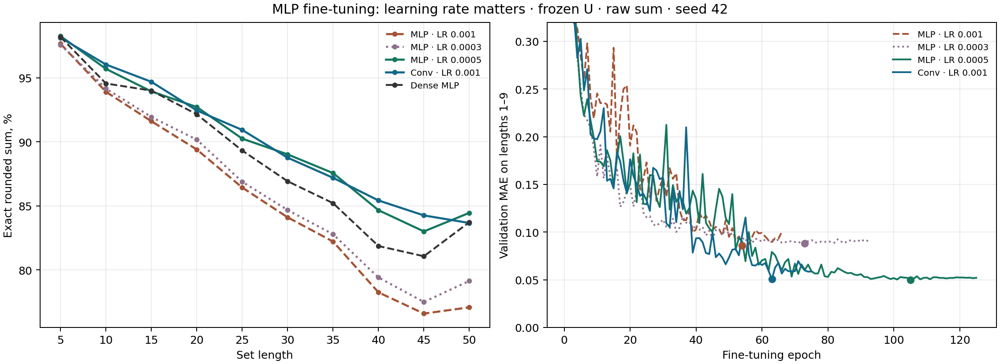

**Вывод.** При согласованном свёрточном роутере непрерывная сгенерированная `U` на длине 50 лучше аналитической свёрточной на **3,07 п.п.**, кронекеровской на **7,23 п.п.** и непрерывной случайной на **11,12 п.п.** Кронекеровская параметризация близка к генератору по числу параметров, поэтому разрыв не объясняется размером модели. Однако генератор лишь сравнялся с плотной сетью по точности (**83,66% против 83,72%**) и уступил ей по MAE (**0,441 против 0,391**).

В бинарном варианте преимущество исчезло: generated binary и random binary дали **79,00%** и **78,96%**. Разница **0,04 п.п.** при одном seed неотличима от шума. Непрерывная generated `U` выше бинарной на **4,66 п.п.** и имеет меньшую MAE (**0,441 против 0,548**). Значит, на MNIST8m найденное преимущество связано с непрерывным базисом, а не с восстановлением полезного дискретного разделения весов.

Отдельный MLP-роутер после уменьшения шага до 0,0005 достиг **84,45%** и MAE **0,409**, но длинные тестовые пробы были видны при подборе его шага. Все согласованные контроли выше выполнены на одном seed 42; для оценки устойчивости разрыва нужны дополнительные seed. [Полный протокол прежнего переноса](../deepsets_z/mnist8m/V_MOE_DIGIT_SUM_FINETUNE_RESULTS.md), [итоговые числа согласованных контролей](../deepsets_z/mnist8m/digit_sum_u_control_summary.json), [подбор и числа бинарной U](../deepsets_z/mnist8m/binary_u_summary.json), [кривые подбора шага MLP-роутера](../deepsets_z/mnist8m/v_moe_digit_sum_mlp_lr_sweep_summary.json).

## Генератор общей U на Aug-Omniglot

**Что проверяли.** Для каждого из четырёх свёрточных слоёв модель строит веса из адаптируемых коэффициентов `v` и трёх матриц `U`: для выходных каналов, входных каналов и позиций фильтра. Все `U` общие для задач. Координатный генератор получает номер слоя, номер матрицы и координаты её элемента, после чего выдаёт `U`. Ему не подают изображение, номер задачи или `z`. Сравнили его с прямым обучением тех же `U`, а также с фиксированными единичными и случайными `U`. Для новой задачи по размеченным примерам подстраиваются `v` и классификатор; роутера нет.

**На чём проверяли.** Aug-Omniglot: в задаче нужно различить пять новых символов по одному размеченному изображению каждого; для проверки есть ещё пять изображений каждого символа. Использовали 790 символов для обучения, 174 для подбора и 659 из официальной тестовой части. Один seed 42. Проверили 23 настройки ширины генератора, размера пакета задач и скоростей обучения. Лучшие состояния находили на 100 проверочных задачах, конфигурацию выбрали на **500 других проверочных задачах**, затем оценили все варианты на **1000 одинаковых новых тестовых задачах**. В таблице ошибка — средняя кросс-энтропия; меньше означает лучше.

| Общая U | Параметры U или генератора | Обучающих задач до лучшего состояния | Проверка, точность ↑ | Тест, точность ↑ | Ошибка теста ↓ |
|---|---:|---:|---:|---:|---:|
| Генератор, ширина 64, пакет 4 | 4 993 | 94 400 | 93,32% | 90,60% | 0,266 |
| Генератор, ширина 80, пакет 4 | 7 521 | 65 600 | 92,95% | 89,88% | 0,282 |
| Генератор, ширина 128, пакет 4 | 18 177 | 43 200 | 92,41% | 88,62% | 0,321 |
| Генератор, ширина 64, пакет 8 | 4 993 | 86 400 | 92,70% | 89,89% | 0,287 |
| **Прямое обучение U** | **7 493** | **48 000** | **95,14%** | **92,14%** | **0,227** |
| Фиксированная единичная U | 0 | 67 200 | 90,35% | 86,46% | 0,593 |
| Фиксированная случайная U | 0 | 38 400 | 86,81% | 82,77% | 0,792 |

**Вывод.** Лучший генератор выше единичной `U` на **4,14 процентного пункта** (95% парный интервал **[3,54; 4,77]**), но ниже прямо обучаемой `U` на **1,54 пункта** (**[1,12; 1,96]**). Генератор ширины 80 имеет почти столько же параметров, задающих `U`, сколько прямая `U` (7 521 против 7 493), но тоже уступает ей. Увеличение ширины до 128 и пакета до 8 не дало выигрыша. В первом запуске разрыв генератора с единичной `U` составлял 11,55 пункта; после настройки обоих вариантов он сократился до 4,14. Значит, обучаемая общая `U` полезна, но на этой задаче проверенный генератор не превзошёл прямую параметризацию, а размер выигрыша над фиксированной `U` зависит от настроек обучения.

Это один seed и ограниченный перебор. Интервалы учитывают различие тестовых задач, но не разных инициализаций. В прежнем запуске тестовые классы уже использовались для оценки, поэтому новый тест по задачам не делает подбор полностью слепым по классам. Протокол также отличается от протокола авторов MSR; их опубликованное качество нельзя напрямую сравнивать с этой таблицей. [Подробный протокол, настройки и график](../aug_omniglot/TUNING.md), [числа по всем вариантам](../aug_omniglot/results/tuned_candidates.json).

**Условие по support-набору.** Отдельно проверили, может ли генератор строить
разную `U` по пяти support-изображениям задачи. Сравнили одну статическую `U`,
mean-энкодер и transformer на трёх seeds. Средняя тестовая точность составила
**92,70 ± 0,49%**, **92,28 ± 0,64%** и **92,50 ± 0,35%** соответственно.
Для условных вариантов затем подменили support-набор на support другой задачи:
accuracy и loss не изменились. В этой постановке генератор научился игнорировать
support и использовал практически одну общую `U`; подавать ему изображения без
дополнительного ограничения оказалось недостаточно. [Агрегированные результаты](../aug_omniglot/conditional_u_summary.json),
[код и протокол](../aug_omniglot/README.md#support-conditioned-u-experiment).
