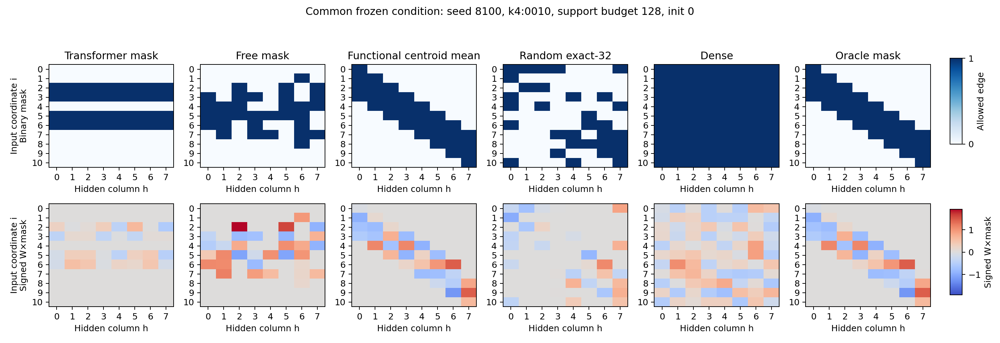

# Отчёт за 27 сентября 2026 года

**Теперь сохраняем функциональные карты решений, а не отдельные importance-карты.** В банк входят профили вкладов нейронов на общей probe-выборке, signed sensitivity связей и её статистики. С ними сохраняем полный state сети: веса, маску, biases, readout, качество и происхождение решения. Функциональная importance — одна из производных статистик этого представления.

Актуальная постановка и выводы дополнены 2 октября 2026 года. Подробная история экспериментов вынесена в [experiments_md](experiments_md/README.md).

**Следующий эксперимент:** [Transformer-генератор масок и оценщик настоящего качества](PLAN_GENERATOR_EVALUATOR.md), который периодически обновляется по новым реальным обучениям сетей.

## Цель

Из большого банка решений извлечь ограничение связей, которое помогает новой сети **повысить качество на каждой новой задаче относительно настроенного dense**. Сокращение числа связей с сохранением качества недостаточно для нашей цели. Генеративная модель необязательна; детерминированная агрегация или обучаемая модель тоже подходят.

Качество оценивается после нового обучения весов с предложенной маской. Reconstruction карт может быть вспомогательной задачей, но основной критерий — ошибка на отдельных validation-данных. Test не участвует в выборе маски, плотности, параметров обучения или checkpoint.

## Функциональное представление и обучение ограничений

Для каждого hidden-нейрона сохраняем профиль его вклада

$$
\psi_j(x)=a_j\phi\!\left(x^\top W_{\mathrm{eff},:j}+b_j\right),
\qquad W_{\mathrm{eff}}=W\odot M,
$$

на общей фиксированной probe-выборке. В DeepSets используется tanh, в текущем pattern-эксперименте — ReLU. Чувствительности и бинарная маска хранятся отдельно: запрещённая связь не считается доказанно бесполезной. Порядок probe-входов общий для решений одного банка; их IDs и источник сохраняются.

Целевая схема: модель получает решения банка, их функциональные признаки и качество, а также support-примеры новой задачи. Она предлагает маску; дочерняя сеть обучается с этой маской на support, и её query-ошибка обучает предложение ограничения. Перестановки hidden-столбцов и порядка карт не должны менять предложение; координаты входа сохраняют смысл. В текущем варианте маска бинарная, разрешённые веса свободно обучаются. Матрица $U$ не используется.

[Полное описание представления, симметрий и objective](experiments_md/2026-09-27/00_functional_method_pattern.md). · [Примеры сохранённых функциональных карт с пояснениями](../pattern/outputs/task_quality_toeplitz_20261001/diagnostics/functional_bank_examples/DESCRIPTION.md).

## Что показала проверка на pattern

Вход длины 11, восемь hidden-нейронов, 32 разрешённые связи из 88. Четыре независимых банка по 960 решений. Основной результат при 128 support-примерах:

| Метод | Test balanced BCE, меньше лучше | Задач с точечным улучшением относительно dense |
|---|---:|---:|
| Dense | 0,5941 | — |
| Transformer по функциональному банку | 0,6147 | 1/4 |
| Напрямую обучаемая маска | 0,5841 | 3/4 |
| Функциональное среднее с координатным выравниванием | **0,5575** | **4/4** |
| Случайная маска | 0,6110 | 0/4 |
| Правильные окна: oracle-контроль | 0,5558 | 4/4 |

**Функциональный baseline восстановил теплицеву бинарную поддержку в 3 из 4 разных банков**, средний IoU — 0,985. Для этого столбцы каждой карты сортируются по координатному центру функциональной sensitivity, затем карты усредняются и выбираются top-32 связи. Выигрыш получен этим простым методом. Обученный Transformer окна не восстановил: IoU — 0,371.

Теплицева поддержка не означает, что обученные signed weights повторяют одно ядро. Сами $W\odot M$ не стали точной теплицевой матрицей.

**Пояснение heatmap.** Заранее фиксированный пример: seed 8100, pattern 0010, support=128, initialization=0. По X — hidden-нейрон, по Y — позиция входа. Сверху бинарная маска: синее означает разрешённую связь. Снизу реальные подписанные $W\odot M$ на общей симметричной шкале: красное — положительный вес, синее — отрицательный, серое — нуль. В этом примере маска функционального baseline совпала с oracle. Показаны отдельные обученные сети, а не усреднённые веса.

**Ограничения вывода.** Координатная сортировка уже задаёт пространственный prior; вклад самого банка сверх этого правила ещё нужно отделить контрольным опытом. Все четыре test-паттерна относятся к одной reversal/complement-орбите. Индивидуальные интервалы по задачам не все исключают нуль. Все восемь outer-запусков прошли эмпирическое плато, но из 768 дочерних сетей критерий train/query-плато прошли 476; 292 достигли лимита 48 000 шагов. При support=128 у dense сошлись по этому критерию только 7/64, у функционального baseline — 57/64. Поэтому сравнение качества остаётся предварительным и относится к query-selected checkpoints данного протокола. Полная сходимость всех лоссов не достигнута.

[Подробный итог и графики](../pattern/outputs/task_quality_toeplitz_20261001/RESULTS_RU.md) · [Пересчёт всех 768 результатов из сохранённых весов](../pattern/outputs/task_quality_toeplitz_20261001/independent_audit.json).

**Дополнительная проверка 1 октября:** исправленный top-K и decoder с отдельными slots снова дали полосы. В новом paired full-batch L2-протоколе обучаемый functional pooling дал BCE 0,5578 против 0,5997 у заново настроенного dense, с точечным улучшением на 4/4 задачах; равномерное functional mean лучше — 0,5435. Все 1232 validation/test-траектории прошли заданный empirical plateau; пересчёт 224 test-результатов подтвердил метрики. Это отдельный протокол с двумя seeds и прежним test-split. [Диагностика, новые модели, heatmaps и ограничения](experiments_md/2026-10-01/01_pattern_transformer_debug.md).

**Короткая проверка GNN и GNN + flow matching, 1 октября:** обучение по качеству целых масок после нового обучения весов восстановило почти правильные окна, но не превзошло функциональное среднее. В отдельном протоколе с двумя банками, фиксированными 1400 шагами и терминальными весами BCE среднего — **0,5143**, GNN — 0,5229, flow с query-поиском среди восьми масок — 0,5260. Основное обучение заняло около 2–2,2 минуты на банк; все 2032 основных дочерних обучений и четыре финальные графовые модели прошли эмпирическое плато. Прежний test-split остаётся исследовательским. [Новый опыт, графики, heatmaps и ограничения](experiments_md/2026-10-01/02_pattern_gnn_flow.md).

## Новый банк DeepSets, 1 октября

Банк пересобран: **10 240 разреженных решений** при пяти плотностях $\rho\in\{0{,}1;0{,}3;0{,}5;0{,}7;0{,}9\}$ и **256 dense-контролей**. Это четыре исходные задачи, восемь seeds и по 320 решений на задачу в каждом банке; число обученных решений не равно числу уникальных масок: найдено 6666 точных топологий и 10 240 различных точных эффективных состояний. Это не оценка числа неэквивалентных функций. Все решения сохранены без отбора по audit-качеству. Полный state и функциональные профили сохранены; train-only выравнивание и агрегация не используют held-out карты. Все 10 496 обучений прошли заданный критерий эмпирического плато.

На отдельных audit-изображениях точная ожидаемая NMSE для независимых наборов из пяти элементов — **0,2318 у sparse против 0,2041 у paired dense**. Из 10 240 sparse-решений 448 лучше своего dense-контроля. Таким образом, полезные отдельные решения есть, но среднее качество source-банка ещё уступает dense. Эти числа относятся к исходным задачам, а не к переносу на новые задачи. Сохранённые конечновыборочные audit-оценки воспроизведены точно.

При сборке банка используется дополнительная информация: известная стоимость каждой цифры и её индивидуальная метка на исходных изображениях позволяют точно вычислять средний source-лосс на эмпирическом пуле. Это привилегия source-учителей в нашей синтетической задаче. Новая дочерняя сеть получает только метки наборов. Доступ к меткам отдельных элементов на новой задаче отсутствует. [Полный протокол, функциональные карты, лоссы и аудит](experiments_md/2026-10-01/03_deepsets_rebuilt_functional_bank.md).

**Проверка переноса по полезности целых масок на новом банке завершена:** восемь банков, восемь новых функций стоимости, четыре независимые финальные инициализации на задачу. В этом опыте на вход графовым моделям идут train-only средние и дисперсии функциональных признаков банка и context из support-наборов новой задачи. Качество учителей хранится, но в encoder этого опыта не входит; обучаемое внимание по отдельным решениям здесь не использовалось. Context агрегирует sparse-учителей пяти плотностей; отдельные dense-состояния служат контролем и в него не включены. Маски обучаются по query-качеству заново обученных source-сетей, а не по reconstruction карт.

| Метод | Средняя test NMSE, меньше лучше | Новых задач с точечным улучшением над dense |
|---|---:|---:|
| Dense, настроенный на meta-validation | **0,6563** | — |
| Случайная маска | 0,6615 | 2/8 |
| GNN + flow matching, query-выбор из 8 | 0,6620 | 1/8 |
| GNN, query-выбор из 8 | 0,6732 | 1/8 |
| Функциональное среднее | 0,6775 | 1/8 |

Для этого сравнения у всех sparse-масок фиксированы 7526 из 25088 связей, то есть примерно 30%; выбор плотности по задаче ещё не проверялся. Бюджет — 205 support и 51 query метка набора. Все 8192 source/selection/final дочерних обучений прошли описательный критерий стабильности support-лосса; все 16 финальных графовых моделей прошли заданное плато source-лосса после необходимых дополнительных source-only этапов. Это эмпирическая стабильность, не доказательство глобального оптимума. Новые test-данные открыты только после фиксации всех масок и дочерних весов.

**Наш критерий успеха не выполнен:** flow улучшил функциональное среднее, но не превзошёл настроенный dense в среднем и на каждой задаче. Случайная маска показывает, что наличие функционального банка пока не даёт подтверждённого преимущества в этой постановке. Функциональное среднее близко к pixel prior (средний IoU 0,911), а GNN сохраняет большую часть его связей (IoU со средним 0,851). Эти наблюдения помогают локализовать ограничение агрегации, но сами по себе не доказывают причину проигрыша. [Полные результаты, графики, heatmaps реальных весов и ограничения](experiments_md/2026-10-01/04_deepsets_gnn_flow_utility.md).

## Encoder–decoder с quality и consistency loss

Добавлена новая схема: encoder обрабатывает нейроны внутри каждого отдельного решения, затем объединяет решения банка; decoder имеет собственные 32 фиксированных выходных slots. На вход идут полные probe-профили $\psi$, signed/absolute/RMS статистики $q$, индивидуальная обучающая маска и качество учителя на source-query. Используются только train-учителя. Сохранённое выравнивание разворачивается обратно; независимые перестановки столбцов каждого учителя не меняют координаты выходной маски.

$$
L=L_{\mathrm{quality}}+\lambda L_{\mathrm{perm}},\qquad \lambda=1.
$$

$L_{\mathrm{quality}}$ — ожидаемая query NMSE новой сети после 2000 support-only шагов с реально выбранной бинарной маской из 7526 связей. Градиент предложения маски оценивается через вероятность дискретного выбора, без reconstruction карт и без straight-through top-K. Численный policy-gradient surrogate сохраняется отдельно от настоящего значения NMSE.

$$
L_{\mathrm{perm}}=
\frac{\|E(B,D)-E(B^\pi,D)\|_2^2}{d}
+\frac{\|\sigma(S(B,D))-\sigma(S(B^\pi,D))\|_2^2}{784\cdot32}.
$$

Здесь $B^\pi$ содержит те же решения с независимо переставленными столбцами; все признаки нейрона перемещаются совместно. $S$ — logits связей в фиксированных координатах новой сети. Обе версии получают одинаковые support context и состав банка. Второе слагаемое проверяет согласованность ответа decoder, первое — представления encoder.

Четыре source-only контрольных запуска завершены после 48 outer updates каждый; все прошли заданное эмпирическое плато, как и все 14 080 дочерних обучений плюс 24 фиксированных контроля. В основном set-encoder инвариантность задана архитектурой: $L_{\mathrm{perm}}$ порядка $10^{-15}$, выходная маска совпадает. Отключение этого регуляризатора не изменило измеренный source-результат; отдельное преимущество от его обучения не установлено. Проверка с positional bias сохраняет ненулевой consistency-loss, но заметного выигрыша при $\lambda=1$ здесь также не показала.

**Это проверка реализации на четырёх прежних source-задачах и одном банке, а не новый target benchmark.** По 51 query-набору на задачу повторно используются для outer-обучения и monitor. Качество учителя и fresh-child reward используют один source-validation image pool; это не независимая итоговая оценка. Перенос этой схемы на новые задачи ещё не измерен. [Два loss, графики, реальные маски с весами и ограничения](experiments_md/2026-10-01/05_deepsets_permutation_dual_loss.md).

## Что сохраняем из предыдущих результатов

В DeepSets положительный перенос также получен прямым функциональным отбором связей: при бюджете 256 и validation-выбранных 30% связей NMSE — 0,66645 против 0,70212 у dense. Этот результат относится к отдельной регрессионной задаче на наборах MNIST8m; это исследовательская проверка с конечным обучением и уже использованными test-задачами. [Протокол и ограничения](experiments_md/2026-09-27/05_deepsets_density_sweep.md).

Отдельный устойчивый выигрыш VAE не подтверждён. В новом utility-протоколе DeepSets flow улучшил простое функциональное среднее, но не решил задачу улучшения относительно dense. Таблицы MNIST/agreement, проверки VAE и KL, сравнения генераторов и аудит source-банка сохранены в [истории экспериментов](experiments_md/README.md).

## Следующие проверки

- В DeepSets проверить перенос нового encoder–decoder с quality и consistency loss на новые задачи; сравнить learned teacher pooling с pixel prior, функциональным средним и сильным dense.
- Отделить функциональный сигнал банка от координатного выравнивания: применить то же правило к разрушенным функциональным картам и необученному банку.
- Проверить зависимость от числа и разнообразия source-задач и решений; повторить перенос между независимыми семействами задач.
- Расширить набор meta-validation задач и проверить устойчивость сравнения с сильным dense при одинаковом бюджете. В коротком графовом опыте на pattern inner и финальный solver согласованы, маски оцениваются без top-K surrogate; преимущества генерации над функциональным средним там пока нет.
- Подбирать плотность по качеству новой сети, а не считать фиксированную sparsity универсальной.

Новизна возможна в способе извлечения переносимой связности из банка разных решений и его проверке на новых задачах. Сами sensitivity, функциональное probing, выравнивание и перенос sparse-сетей уже изучались. [Предварительное сопоставление с литературой](../pattern/outputs/task_quality_toeplitz_20261001/NOVELTY_RU.md).
