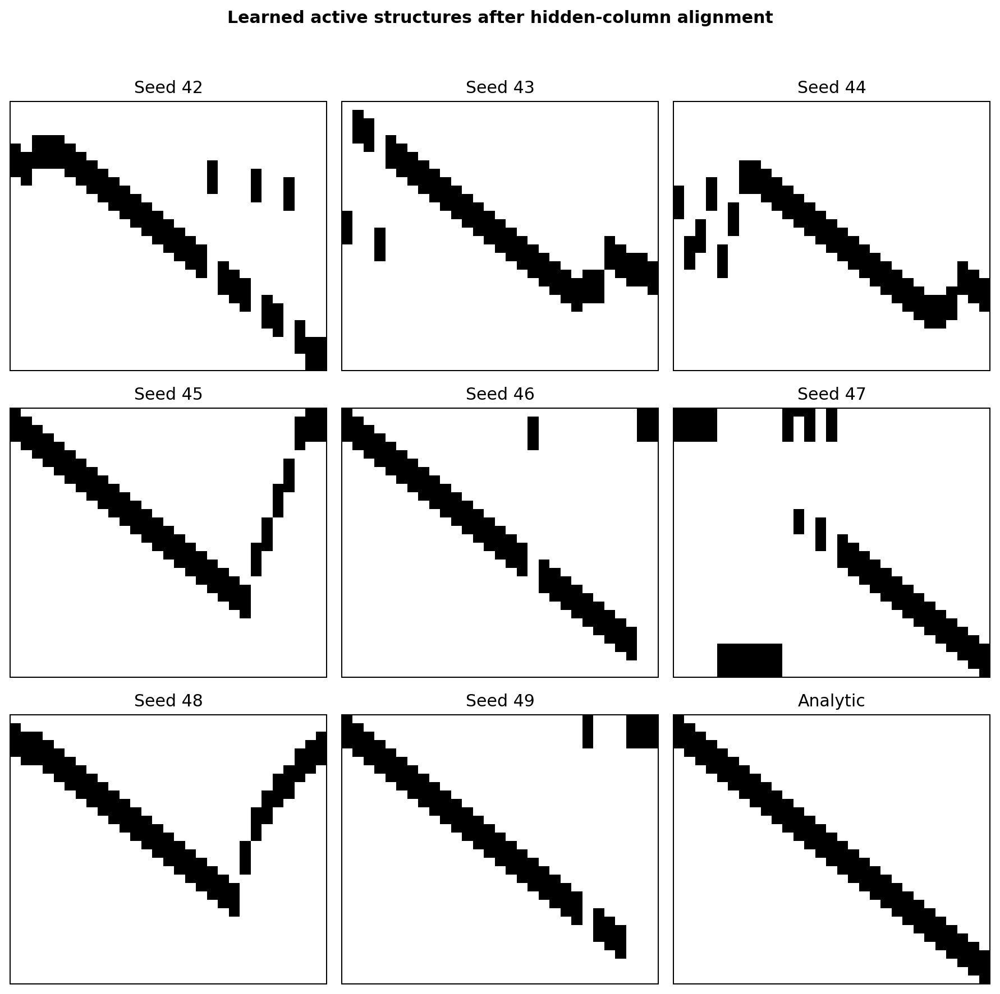

# Generated parameter sharing для pattern

Дата: 15 сентября 2026 года.

## Постановка

Зафиксированы длина входа `32` и длина паттерна `4`. Задачи — все `16` бинарных паттернов длины 4.

Генератор задаёт общую для всех задач структуру разделения параметров:

$$
U=G_\psi(z^*),\qquad W_\tau=Uv_\tau.
$$

`U` определяет связи и то, какие связи используют один параметр. Для каждой задачи `τ` с нуля обучаются только веса `vτ`. Оптимизируется средний validation-loss после внутреннего обучения этих весов:

$$
\min_{\psi,z}\frac1{16}\sum_{\tau=1}^{16}
\ell_\tau\!\left(Uv_\tau^*(U)\right),
\qquad
v_\tau^*(U)=\arg\min_v \ell_\tau^{train}(Uv).
$$

## Протокол

| Параметр | Значение |
|---|---:|
| Вход / паттерн | `32 / 4` |
| Число задач | все `16` паттернов |
| Hidden units | `29` |
| Активных связей | `116 = 29 × 4` |
| Разделяемых значений на задачу | `4` |
| Параметров генератора | `469` |
| Параметров модели на задачу | `63` |
| Outer steps / inner Adam steps | `100 / 20` |
| Inner / generator learning rate | `0.1 / 0.01` |
| Latent-кандидатов train / refit | `16 / 64` |
| Финальное обучение весов | `2000` шагов |
| Независимых запусков | `8`, seeds `42–49` |

Каждый hidden unit получает ровно четыре входа и использует каждое из четырёх разделяемых значений ровно один раз. Положения входов и их соответствие значениям выбирает генератор; диагональная структура в него не зашита.

Checkpoint весов каждой модели выбирается по отдельной validation-выборке. Test содержит новые примеры для тех же 16 pattern identities.

## Результаты

Среднее ± стандартное отклонение по восьми независимым запускам.

| Структура | Validation BCE ↓ | Test BCE ↓ | Test accuracy ↑ | Active IoU ↑ |
|---|---:|---:|---:|---:|
| Generated sharing | **0.2497 ± 0.0569** | **0.2510 ± 0.0585** | **0.9224 ± 0.0339** | **0.6099 ± 0.1265** |
| Generated connectivity, независимые веса | 0.3857 ± 0.0227 | 0.3870 ± 0.0237 | 0.8278 ± 0.0130 | 0.6099 ± 0.1265 |
| Dense MLP | 0.5380 ± 0.0033 | 0.5360 ± 0.0027 | 0.7267 ± 0.0026 | 0.1250 |
| Random sharing | 0.5973 ± 0.0025 | 0.5980 ± 0.0037 | 0.6611 ± 0.0034 | 0.2854 ± 0.0049 |
| Analytic sharing | **0.1392 ± 0.0023** | **0.1396 ± 0.0024** | **0.9849 ± 0.0014** | 1.0000 |

| Сравнение по Test BCE | Средняя разница | Победы по seeds |
|---|---:|---:|
| Generated sharing − dense | `−0.2850` | `8/8` |
| Generated sharing − та же connectivity без sharing | `−0.1359` | `8/8` |
| Generated sharing − random sharing | `−0.3470` | `8/8` |
| Generated sharing − analytic sharing | `+0.1114` | `0/8` |

## Полученные структуры

Active IoU считает только совпадение активных связей с аналитической sliding-window структурой; соответствие разделяемых коэффициентов оценивается task-loss.

## Итог

| Проверка | Результат |
|---|---|
| Генератор находит полезную общую структуру для разных паттернов одной длины | Подтверждено: BCE `0.2510` против dense `0.5360`, победа `8/8` |
| Важно именно разделение параметров, а не только разреженная connectivity | Подтверждено: BCE `0.2510` против `0.3870` на тех же активных связях |
| Генератор полностью восстанавливает analytic структуру | Не подтверждено: Active IoU `0.6099`, gap до analytic `+0.1114` BCE |
| Перенос на невиданные pattern identities или другую длину | Не проверялся |

## Отличие от ближайших работ

[Zhou et al.](https://arxiv.org/pdf/2007.02933) напрямую meta-обучают полную symmetry matrix `U`, а [Yeh et al.](https://proceedings.mlr.press/v151/yeh22b/yeh22b.pdf) напрямую оптимизируют relaxed assignment matrix `A`. Здесь `U` порождается компактным coordinate-generator `Gψ(z)` и не хранится как свободная матрица.

В текущем эксперименте один фиксированный `z*` порождает одну общую структуру. Поэтому результат подтверждает generated-параметризацию `U`; генерацию распределения полезных структур через разные `z` и перенос на новые классы задач предстоит проверить отдельно.

Основные результаты: [`generated_parameter_sharing_summary.json`](data/2026-09-15/generated_parameter_sharing_summary.json).
