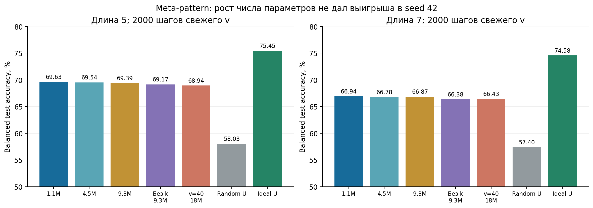
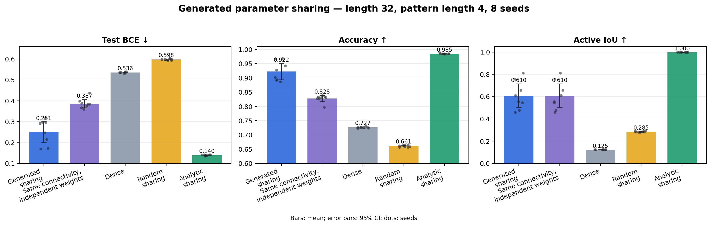
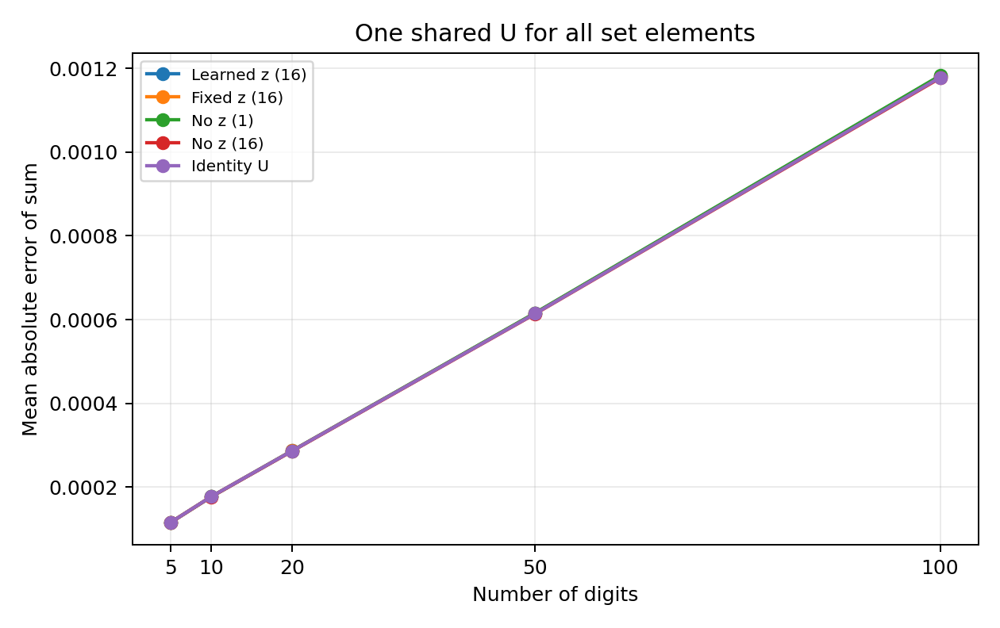
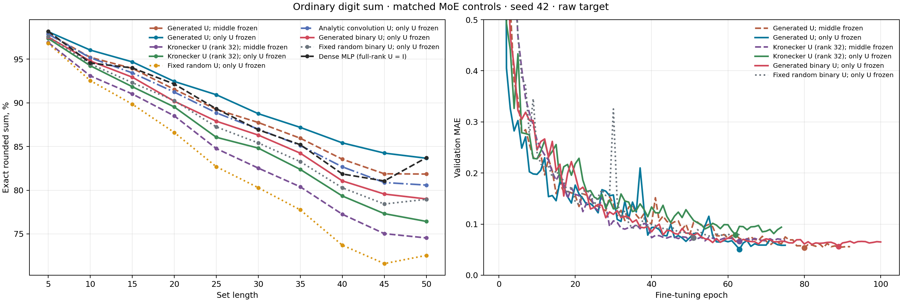
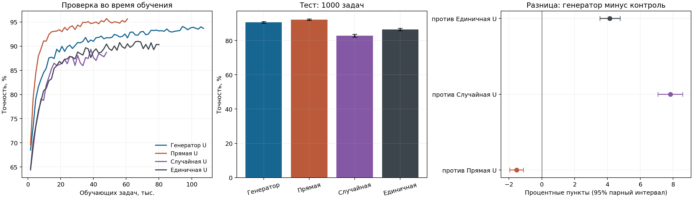

# Генератор матрицы U: сводка на 25 сентября 2026 года

## Короткий вывод

Мы проверяли идею

$$
U = G_\psi(c,z), \qquad W_\tau = Uv_\tau,
$$

где генератор строит общую структуру пространства весов, а короткий вектор
`v` обучается под задачу или выбирается роутером. В большинстве опытов
генератор получает **координаты параметра и описание слоя или задачи**, а не
сами данные. Исключение — роутер в MNIST8m: изображение получает роутер, но не
генератор `U`.

Основной результат: сгенерированная `U` почти всегда существенно лучше
случайной или фиксированной структуры. Она может превзойти кронекеровскую
параметризацию и прямую оптимизацию assignment-матрицы, но **не превосходит
прямо обучаемую `U` во всех задачах**. На Aug-Omniglot прямая `U` лучше
генератора; на MNIST8m генератор почти равен плотной MLP на официальном
test-50 и устойчивее к смене блока изображений. Польза градиентного обучения
латента `z` не подтверждена.

## Что именно делает генератор

`U` — отображение из короткого набора коэффициентов `v` во все веса слоя.
Генератор не выдаёт предсказание задачи напрямую. Типичный цикл обучения:

1. `Gψ` строит `U` по координатам связей и, иногда, условию задачи.
2. При фиксированной `U` обучается `v` для конкретной задачи.
3. Ошибка на отдельных query-примерах проходит через обучение `v` и обновляет
   параметры генератора `ψ`.
4. На новой задаче генератор фиксируется, а заново обучается только `v` и
   небольшой выходной слой.

В разных экспериментах проверялись три варианта этой идеи:

- генерация полной низкоранговой `U`;
- генерация дискретной структуры разделения параметров;
- генерация кронекеровских факторов для свёрточных слоёв.

## Сводка задач

| Задача | Что получает генератор | Главный результат | Ограничение |
|---|---|---|---|
| Бинарные паттерны, перенос между длинами | Длину паттерна `k` | На невиданных длинах 5/7: **69,63% / 66,94%** против **58,03% / 57,40%** у random `U` | Аналитическая `U` лучше: **75,45% / 74,58%**; один seed |
| 16 паттернов длины 4 | Координаты связей и один общий `z` | BCE **0,251** против **0,536** у dense и **0,598** у random; победа в 8/8 seeds | Проверены новые примеры известных паттернов, а не новые задачи |
| Gaussian / denoising / cross-correlation Yeh et al. | Координаты assignment-матрицы и `z` | На Gaussian восстановлена точная структура; на denoising и части cross-correlation улучшен predictive loss | Не везде восстановлена аналитическая структура; часть протокола не является точной репликацией кода авторов |
| Текстовая сумма цифр из четырёх битов | Номер бита и общий `z` | Все варианты достигли **100%** точных сумм на длине 100 | Задача слишком проста и не различает способы получения `U` |
| MNIST8m, случайные стоимости цифр | Координаты веса первого слоя | Ранний генератор: MAE **1,383** против **1,379** у random и **1,126** у прямой `U` | Один seed; генератор не улучшил согласованные контроли |
| MNIST8m, обычная сумма | Координаты веса; изображение видит отдельный роутер | На длине 50: **83,66%** против 80,59% у analytic-conv, 76,43% у Kronecker и 72,54% у random | Плотная MLP получила 83,72% и меньшую MAE; один seed |
| Aug-Omniglot 5-way 1-shot | Номер слоя, вид фактора и координаты элемента | **90,60%** против 86,46% у identity и 82,77% у random | Прямая `U` лучше: **92,14%**; один seed |
| Aug-Omniglot с условием по support | Пять support-изображений | Static **92,70%**, mean **92,28%**, transformer **92,50%** | Замена support на чужой не изменила accuracy или loss: условие игнорируется |

## 1. Бинарные паттерны: U как пространство адаптируемых весов

### Перенос на невиданные длины

Генератор обучался на длинах 3, 4, 6 и 8 и строил две матрицы `U(k)` для
двухслойной MLP. Для каждой pattern-задачи обучались только 20 коэффициентов
`v`; длины 5 и 7 не использовались при обучении генератора.

После 2000 шагов адаптации `v`:

| Фиксированная U | Длина 5 | Длина 7 |
|---|---:|---:|
| Генератор | **69,63%** | **66,94%** |
| Случайная U | 58,03% | 57,40% |
| Аналитическая U | **75,45%** | **74,58%** |

Генератор нашёл пространство весов, заметно более полезное, чем случайное, но
не восстановил известную аналитическую структуру. Увеличение генератора с
1,1 млн до 9,3 млн параметров и удвоение размерности `v` не улучшили результат.
Условие длины немного меняло `U`, но давало менее 0,11 п.п. функционального
выигрыша. Это указывает, что генератор в основном выучил одну общую полезную
структуру, а не содержательно разные структуры для разных `k`.

[Полный разбор](FINAL_REPORT_2026-09-08.md#meta-pattern-вместо-масок-генерируем-u)

### Одна общая структура для 16 паттернов

В более контролируемой постановке вход имел длину 32, а задачи соответствовали
всем 16 паттернам длины 4. Генератор с 469 параметрами выбирал активные связи и
разделение четырёх значений `v` между ними. Для каждой задачи обучались свои 63
параметра модели.

| Структура | Test BCE ↓ | Accuracy ↑ | Active IoU ↑ |
|---|---:|---:|---:|
| Generated sharing | **0,251 ± 0,059** | **92,24%** | 0,610 |
| Та же connectivity без sharing | 0,387 ± 0,024 | 82,78% | 0,610 |
| Dense MLP | 0,536 ± 0,003 | 72,67% | 0,125 |
| Random sharing | 0,598 ± 0,004 | 66,11% | 0,285 |
| Analytic sharing | **0,140 ± 0,002** | **98,49%** | 1,000 |

Generated sharing выиграл у dense, random и той же разреженной connectivity без
разделения параметров во всех восьми seeds. Значит эффект объясняется не только
разреженностью: полезно именно найденное связывание весов. До аналитической
структуры остаётся заметный разрыв.

[Исходные числа](data/2026-09-15/generated_parameter_sharing_summary.json) ·
[финальный отчёт](FINAL_REPORT_2026-09-15.md#дополнение-15-сентября-generated-parameter-sharing)

## 2. Нужен ли латент z

На той же pattern-постановке сравнили обучение `z`, фиксированные коды и полное
отсутствие `z`.

| Вариант | Test BCE ↓ | Accuracy ↑ |
|---|---:|---:|
| Обучаемый `z` | 0,251 ± 0,059 | 92,2% |
| 16 фиксированных `z` | 0,248 ± 0,087 | 92,3% |
| Без `z`, один генератор | 0,348 ± 0,083 | 85,7% |
| Без `z`, лучший из 16 генераторов | **0,200 ± 0,035** | **95,2%** |

Один фиксированный код часто неудачен, но 16 фиксированных кодов работают не
хуже 16 обучаемых. Пространство генератора подстраивается под выбранный код;
сам `z` не обязан нести информацию. Полный отказ от `z` тоже работает, если
запустить несколько независимых генераторов, но такой поиск занял примерно в
15 раз больше времени. Вывод: полезен выбор хорошего режима генератора, а
необходимость обновлять `z` градиентом не показана.

[Полный протокол](FINAL_REPORT_2026-09-19.md#помогает-ли-обучать-z-в-генераторе-общей-структуры)

## 3. Benchmarks learned parameter sharing

Мы заменили прямую оптимизацию assignment-матрицы из Yeh et al. на
`A = Gψ(z)`.

- **Gaussian, K=2/4/6.** Generated `A` получила loss
  `0,01084 / 0,00947 / 0,00844` и нулевое расстояние до истинного разбиения.
  Наша прямая оптимизация `A` дала `0,01642 / 0,02399 / 0,03074`.
- **Denoising, K=8.** Task-specific `z` снизил loss с `9,139` без sharing до
  `8,668`; global `z` дал `8,917`.
- **Cross-correlation, A=6.** Generated `A` дала `0,000156` против `0,000192`
  без sharing.
- **Cross-correlation, A=15.** Task-specific `z` дал `0,000185` против
  `0,000293` без sharing; один global `z` развалился до `0,403`.

На Gaussian генератор восстановил известную структуру. На более сложных задачах
predictive loss улучшился без точного восстановления разбиения. Это полезный
результат для качества, но не доказательство идентификации истинной симметрии.

[Полный отчёт](../yeh2022_generated_sharing/FINAL_REPORT.md)

## 4. DeepSets и MNIST8m

### Текстовая сумма

В упрощённой задаче цифра подавалась как четыре бита. Одна `U` размера 4×4 была
общей для всех цифр, а по наборам обучались четыре коэффициента `v`. Все
варианты — с обучаемым `z`, фиксированным `z` и без него — получили около
`0,0012` MAE и 100% точных сумм на длине 100. Ранний провал был вызван тем, что
генератору подавали позицию и проверяли его на невиданных позициях. После
удаления позиции задача перестала различать методы.

### Изображения MNIST8m

Первый вариант строил общую `U` первого слоя и добавлял 32-мерный код каждого
изображения. Пространственный генератор с ортогонализацией получил MAE 1,383 на
новых задачах со случайными стоимостями цифр. Фиксированная random `U` в том же
режиме дала 1,379, плотный первый слой — 1,302, а прямо обучаемая `U` — 1,126.
Расширение MLP-энкодера не устранило разрыв.

Затем 32 коэффициента заменили набором из 96 векторов `v`. Роутер получает
изображение и строит мягкую смесь этих векторов; генератор по-прежнему получает
только координаты весов. На обычной сумме сравнили одинаковые MoE-модели:

| U первого слоя | Accuracy, длина 50 ↑ | MAE, длина 50 ↓ |
|---|---:|---:|
| Generated U | **83,66%** | **0,441** |
| Аналитическая 3×3 convolution U | 80,59% | 0,510 |
| Kronecker U, rank 32 | 76,43% | 0,636 |
| Фиксированная random U | 72,54% | 0,619 |
| Dense MLP | **83,72%** | **0,391** |

У coordinate-генератора 7 840 параметров, у двух кронекеровских множителей —
7 480. Поэтому преимущество генератора над Kronecker трудно объяснить размером.
Свёрточный роутер одинаков во всех четырёх `U`-контролях, но сам вносит
пространственный inductive bias. Отдельный MLP-роутер после настройки достиг
84,45%, однако его шаг обучения выбирался с просмотром длинных тестовых проб.

#### Диагностика блоков MNIST8m

Официальные тесты разных длин используют разные последовательные блоки
MNIST8m. В частности, test-45 взят из блока 5, а test-50 — из более лёгкого для
dense блока 3. Поэтому подъём Dense MLP с 81,06% на длине 45 до 83,72% на длине
50 нельзя трактовать как эффект длины.

При повторной оценке длины 50 на всех семи блоках:

| Модель, seed 42 | Средняя accuracy ↑ | SD между блоками ↓ | Средняя MAE ↓ |
|---|---:|---:|---:|
| Dense MLP | 81,30% | 2,03 п.п. | **0,450** |
| Generated U + MoE | **82,85%** | **0,47 п.п.** | 0,459 |

На блоках 1–3 модели почти равны; на блоках 4–7 generated `U` выше на
2,31–3,28 п.п. Это поддерживает гипотезу устойчивости к смене источника
изображений, но диагностика проведена после просмотра исходного графика и
только для одного seed.

[Основной отчёт](FINAL_REPORT_2026-09-19.md#digitsum-на-mnist8m) ·
[matched-control числа](../deepsets_z/mnist8m/digit_sum_u_control_summary.json) ·
[диагностика семи блоков](../deepsets_z/mnist8m/digit_sum_pack_robustness_seed42.json)

## 5. Aug-Omniglot

Для каждого из четырёх свёрточных слоёв генератор строил три фактора `U`: для
выходных каналов, входных каналов и позиций фильтра. На новой 5-way задаче по
пяти support-изображениям адаптировались `v` и классификатор; генератор не видел
ни изображения, ни номер класса.

| Общая U | Параметры U или генератора | Test accuracy ↑ | Test loss ↓ |
|---|---:|---:|---:|
| Лучший генератор | 4 993 | 90,60% | 0,266 |
| Генератор с размером около direct U | 7 521 | 89,88% | 0,282 |
| Прямо обучаемая U | 7 493 | **92,14%** | **0,227** |
| Identity U | 0 | 86,46% | 0,593 |
| Random U | 0 | 82,77% | 0,792 |

Генерация полезнее фиксированной структуры, но прямое обучение `U` оказалось
лучше на 1,54 п.п. Увеличение ширины генератора до 128 и пакета meta-задач до 8
не помогло. Результат получен на одном seed; парные интервалы учитывают задачи,
но не вариативность обучения.

Затем проверили, поможет ли генератору весь support-набор задачи. Mean-энкодер
и transformer кодировали пять support-изображений и по этому коду строили `U`.
На трёх seeds статическая `U` получила **92,70 ± 0,49%**, mean —
**92,28 ± 0,64%**, transformer — **92,50 ± 0,35%**. Подмена support-набора
другой задачи не изменила ни accuracy, ни loss. Значит модели научились
игнорировать условие и фактически использовали одну общую `U`.

[Настройка и полный протокол](../aug_omniglot/TUNING.md) ·
[условие по support](../aug_omniglot/conditional_u_summary.json)

## Что подтверждено

1. Генератор способен находить структуру `U`, существенно превосходящую
   случайный базис или отсутствие sharing.
2. На pattern-задачах полезно именно разделение параметров, а не только
   разреженная connectivity.
3. Generated `U` может быть лучше сопоставимой Kronecker-параметризации:
   83,66% против 76,43% на MNIST8m при близком числе параметров.
4. Generated `U` не гарантирует превосходства над прямой оптимизацией. На
   Aug-Omniglot direct `U` лучше, а в раннем MNIST8m-опыте direct `U` имела
   меньшую ошибку.
5. Обучаемый `z` пока не показал самостоятельной пользы. Его эффект можно
   воспроизвести выбором из нескольких фиксированных кодов или рестартов.

## Что пока не подтверждено

- устойчивое преимущество по нескольким seed на MNIST8m и Aug-Omniglot;
- перенос на действительно новые семейства задач, а не только новые примеры;
- восстановление аналитической симметрии на сложных изображениях;
- преимущество генератора над плотной сетью при одинаковом протоколе;
- польза условия `z` как носителя информации о задаче;
- применимость к DeepSphere: этот эксперимент не проводился.

## Следующие необходимые проверки

1. Повторить matched controls MNIST8m минимум на трёх seeds и оценивать каждую
   длину на одинаковой смеси всех семи блоков.
2. Повторить те же `U`-контроли с MLP-роутером, чтобы отделить вклад генератора
   от свёрточного inductive bias роутера.
3. Повторить Aug-Omniglot на нескольких seeds и сравнивать генератор с direct U
   при одинаковом числе параметров и бюджете подбора.
4. Создать постановку с несколькими различающимися задачами, где условие
   генератора действительно должно менять `U`; обычная сумма MNIST8m такой
   постановкой не является.
5. Проверить перенос на новые task identities и семейства преобразований.

## Итоговая оценка направления

Направление имеет экспериментальную опору: компактный генератор регулярно
находит полезное пространство весов и иногда превосходит сильные
структурированные контроли. Самый чистый положительный результат — generated
parameter sharing на бинарных паттернах по восьми seeds. Самый практически
интересный — устойчивость MNIST8m к смене source-блока и выигрыш у Kronecker,
random и analytic-conv `U`. Главный отрицательный результат — отсутствие
универсального преимущества над прямой `U` и плотной сетью.

Поэтому обоснованный тезис сейчас такой: **генерация `U` — рабочий способ
meta-обучать компактный inductive bias, но её преимущество зависит от семейства
задач и пока не доказано как универсальное**.
