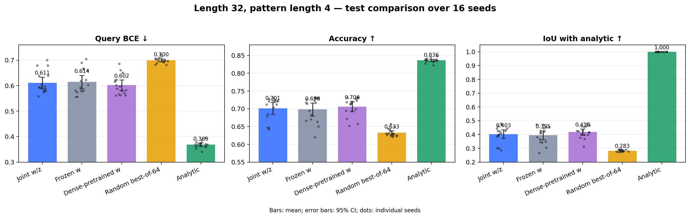

# Joint-оптимизация структуры и весов: length 32, pattern length 4

Дата: 15 сентября 2026 года.

## Протокол

- Masked MLP: `32 → 32 → 1`; бинарная маска первого слоя `32×32`, exact `K=128`.
- Генератор: `z∈R⁴ → 1024 logits`, width `16`; 17 760 параметров.
- 10 train-, 2 validation- и 4 test-patterns; 64 latent-рестарта на задачу.
- На задачу: support `1024`, validation `512`, query `4096` примеров.
- Все `10×64=640` train-MLP оптимизируются одним батчем.
- Итоговые hard-маски сравниваются после одинакового fresh refit весов на 2000 шагов.
- Gold используется только для analytic baseline и post-hoc IoU.

Финальные гиперпараметры:

| Параметр | Значение |
|---|---:|
| Latent dimension | 4 |
| Generator width | 16 |
| Outer steps | 100 |
| Generator learning rate | 0.01 |
| Latent radius | 8 |
| Weight learning rate | 0.001 |
| Latent learning rate | 0.1 |
| Weight steps per latent step | 5 |
| Final temperature | 0.05 |
| Binary penalty | 0.01 |

## Подбор гиперпараметров

Подбор выполнен только на validation-patterns. Все значения — среднее ± sample SD по seeds `42, 43, 44`.

| Этап | Конфигурация | Validation query BCE ↓ |
|---|---|---:|
| Inner sweep | weight steps `5`, z lr `0.1`, temperature `0.05` | **0.65913 ± 0.02287** |
| Architecture | latent `4`, width `16` | **0.64658 ± 0.01180** |
| Compact grid | generator lr `0.01`, radius `8`, penalty `0.01` | **0.63559 ± 0.01681** |
| Outer steps | `30` | 0.64144 ± 0.01859 |
| Outer steps | `60` | 0.63559 ± 0.01681 |
| Outer steps | `100` | **0.63332 ± 0.00561** |

Агрессивная настройка inner optimizer (`weight lr=0.003`, `z lr=0.3`, 10 weight steps) дала `0.62565 ± 0.03627` на фиксированных генераторах, но после полного переобучения ухудшилась до `0.67758 ± 0.04651`; она отклонена.

## Финальные результаты

Среднее ± sample SD по 16 seeds `42–57`.

| Split | Метод | Query BCE ↓ | Accuracy ↑ | IoU с analytic ↑ |
|---|---|---:|---:|---:|
| Validation | Joint `w/z` | 0.67598 ± 0.03240 | 0.64504 ± 0.02804 | 0.4021 ± 0.0583 |
| Validation | Frozen masked `w` | 0.68063 ± 0.04510 | 0.63760 ± 0.03706 | 0.3825 ± 0.0688 |
| Validation | Dense-pretrained `w` | **0.67425 ± 0.03495** | **0.65001 ± 0.02473** | **0.4168 ± 0.0484** |
| Validation | Random best-of-64 | 0.73910 ± 0.01162 | 0.58844 ± 0.00991 | 0.2831 ± 0.0142 |
| Validation | Analytic | **0.41313 ± 0.01779** | **0.80975 ± 0.01054** | **1.0000** |
| Test | Joint `w/z` | 0.61081 ± 0.04284 | 0.70131 ± 0.03121 | 0.4031 ± 0.0601 |
| Test | Frozen masked `w` | 0.61442 ± 0.04844 | 0.69807 ± 0.03494 | 0.3951 ± 0.0613 |
| Test | Dense-pretrained `w` | **0.60203 ± 0.03835** | **0.70635 ± 0.02602** | **0.4181 ± 0.0428** |
| Test | Random best-of-64 | 0.69960 ± 0.01108 | 0.63265 ± 0.01039 | 0.2827 ± 0.0073 |
| Test | Analytic | **0.36866 ± 0.01253** | **0.83647 ± 0.00593** | **1.0000** |



### Test BCE по seed

| Seed | Joint | Frozen | Dense | Random | Analytic |
|---:|---:|---:|---:|---:|---:|
| 42 | 0.58808 | 0.58160 | 0.59769 | 0.69835 | 0.38479 |
| 43 | 0.57412 | 0.57686 | 0.57111 | 0.70468 | 0.35454 |
| 44 | 0.55855 | 0.58101 | 0.56639 | 0.70396 | 0.37838 |
| 45 | 0.58099 | 0.55598 | 0.56245 | 0.68835 | 0.36844 |
| 46 | 0.59277 | 0.58051 | 0.57901 | 0.71480 | 0.35878 |
| 47 | 0.57902 | 0.57428 | 0.56283 | 0.69214 | 0.34041 |
| 48 | 0.59291 | 0.59341 | 0.56136 | 0.72275 | 0.37365 |
| 49 | 0.70024 | 0.69024 | 0.68620 | 0.69352 | 0.37104 |
| 50 | 0.59609 | 0.61834 | 0.58206 | 0.69705 | 0.36191 |
| 51 | 0.59302 | 0.55642 | 0.60157 | 0.68102 | 0.36410 |
| 52 | 0.67872 | 0.70462 | 0.61616 | 0.69869 | 0.37077 |
| 53 | 0.57885 | 0.60203 | 0.58911 | 0.70960 | 0.37527 |
| 54 | 0.60428 | 0.62256 | 0.62101 | 0.68222 | 0.37079 |
| 55 | 0.67933 | 0.66453 | 0.66060 | 0.70674 | 0.39531 |
| 56 | 0.63914 | 0.66106 | 0.62369 | 0.70108 | 0.36201 |
| 57 | 0.63691 | 0.66732 | 0.65120 | 0.69870 | 0.36842 |

## Сводка

| Сравнение на test | Разность BCE `joint − baseline` | Joint лучше по seeds |
|---|---:|---:|
| Frozen | −0.00361 | 9 / 16 |
| Dense | +0.00879 | 6 / 16 |
| Random | −0.08879 | 15 / 16 |
| Analytic | +0.24215 | 0 / 16 |

- Joint превосходит random, но не превосходит dense-pretrained control.
- Преимущество joint над frozen мало и нестабильно по seed.
- Разрыв до analytic сохраняется: `0.61081` против `0.36866` BCE.
- Компактность относительно одной маски не достигнута: 17 760 параметров генератора против 1024 элементов маски.
- Все 48 финальных поисков `z` (`joint`, `frozen`, `dense`) завершились по критерию сходимости.

## Воспроизведение

```bash
SEEDS='42 43 44 45 46 47 48 49 50 51 52 53 54 55 56 57' \
  MAX_JOBS=16 bash pattern/scripts/26_length32_pattern4_joint.sh
```

Реализация: `pattern/bilevel_mask/length32_joint.py`; построение сводного графика: `pattern/bilevel_mask/plot_length32_comparison.py`.
