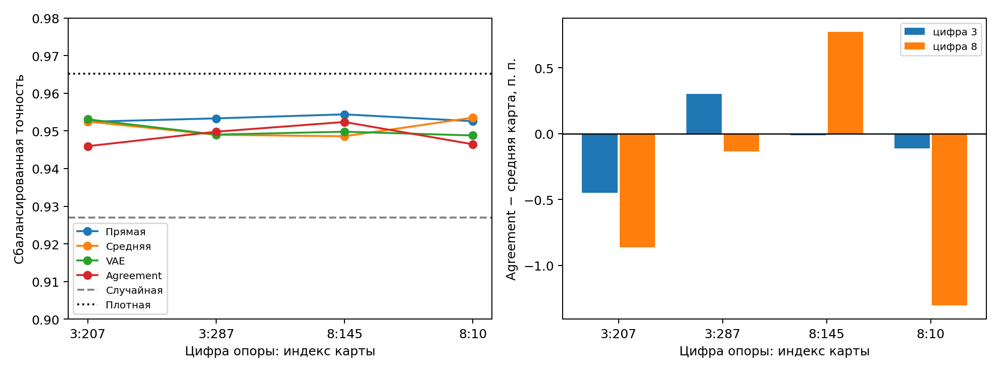

# MNIST8m: помогает ли agreement после выравнивания карт?

**Что проверяли.** Ранее выравнивание столбцов importance maps до обучения VAE подняло точность agreement при 5% связей с 0,9472 до 0,9621. Сегодня уменьшили долю связей до **2%** и проверили, даёт ли поиск `z` преимущество перед простой средней картой при разных опорных картах.

**На чём проверяли.** Две задачи: «3 против остальных» и «8 против остальных». MLP 784→64→1; на каждую задачу взяты 4096 сетей со случайными масками 20%, лучшие 10% отобраны по validation BCE. Из их карт оставлены 1004 связи на маску. Четыре заранее выбранные карты из обучающей части банка — по две для каждой цифры — поочерёдно служили общей опорой для выравнивания столбцов обеих групп. Для каждой опоры заново обучены два VAE и найдено agreement. Все маски проверены после нового обучения MLP с четырьмя одинаковыми инициализациями весов. Случайная, средняя, VAE и agreement маски имеют не более двух связей на пиксель.

| Маска | 2%, без выравнивания | 2%, среднее по 4 опорам | 5%, общая опора |
|---|---:|---:|---:|
| Случайная | 0,9270 | 0,9270 | 0,9449 |
| Прямая карта банка | 0,9526 | 0,9532 | 0,9563 |
| Средняя карта | 0,9381 | **0,9509** | **0,9646** |
| Отдельные VAE | 0,9353 | 0,9502 | 0,9638 |
| Agreement | 0,9343 | 0,9487 | 0,9621 |
| Плотный MLP | **0,9653** | **0,9653** | **0,9653** |

Сбалансированная точность на отдельном тестовом блоке; среднее по двум цифрам и четырём повторным обучениям MLP. Для 5% приведена одна общая опора, для 2% — четыре. В первом столбце средняя карта ещё не выровнена.

| Опора: цифра и индекс карты | Средняя карта | Agreement | Разница, п. п. |
|---|---:|---:|---:|
| 3:207 | 0,9525 | 0,9460 | −0,66 |
| 3:287 | 0,9490 | 0,9498 | +0,08 |
| 8:145 | 0,9486 | 0,9524 | +0,38 |
| 8:10 | 0,9535 | 0,9465 | −0,71 |

**Сходимость и структура.** Поиск agreement остановился по плато на шагах 14 000–17 000; повторное обучение MLP — на 18 100–18 900 шагах. Лучшие состояния не приходились на последние 10% доступных шагов. На отложенных картах IoU реконструкции VAE и средней карты был близким: около 0,09. При 2% итоговый MLP имеет **1133 активных коэффициента** против 50 305 у плотного, но текущий код хранит плотный весовой тензор, поэтому это пока не экономия памяти или времени.

Для сравнения: на 5% одна общая опора подняла точность agreement на **1,49 процентного пункта** относительно карт без выравнивания; однако средняя выровненная карта дала ещё более высокую точность.

**Чего добились и как это трактовать.** Выравнивание помогает: при 2% средняя точность agreement выросла с 0,9343 до 0,9487, средней карты — с 0,9381 до 0,9509. Но agreement превзошёл среднюю карту лишь при двух из четырёх опор и в среднем уступил ей на **0,22 п. п.**; при всех опорах он также уступил прямой карте банка и плотной сети. Значит, на этой паре цифр полезность выравнивания подтверждена, а отдельная польза поиска `z` пока не воспроизвелась устойчиво.
