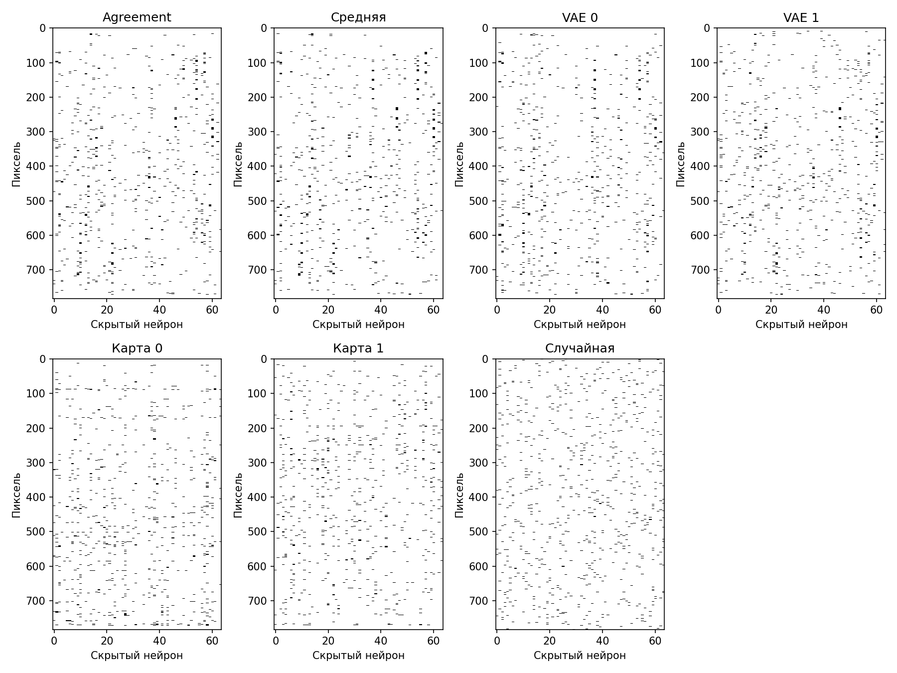

# Ночной запуск: пять пар и десять цифр

Взяты пары 0/6, 1/7, 2/5, 3/8, 4/9; для каждой — плотности 2% и 5%, восемь опорных карт. Банки, VAE и agreement обучены заново, кроме ранее собранного банка для 3/8. Маски проверены после нового обучения MLP с четырьмя инициализациями.

| Связей | Случайная | Прямая | Средняя | Agreement | Плотная | Agreement − средняя, п. п. |
|---|---:|---:|---:|---:|---:|---:|
| 2% | 0,9530 | 0,9659 | **0,9673** | 0,9647 | 0,9766 | −0,26 |
| 5% | 0,9647 | 0,9707 | **0,9729** | 0,9720 | 0,9766 | −0,09 |

Сбалансированная точность бинарных задач; среднее сначала по двум цифрам и восьми опорам каждой пары, затем по пяти парам. Agreement обошёл среднюю карту на 7 из 40 опор при 2% и на 11 из 40 при 5%. Среди десяти сочетаний «пара × плотность» он выиграл одно: 0/6 при 5%, на 0,04 п. п. При этом выравнивание подняло IoU средней обучающей карты с отложенными картами с **0,062 до 0,105** при 2% и с **0,081 до 0,104** при 5%. Все 80 поисков agreement остановились по плато; новое обучение MLP — в 79 из 80 запусков.

При поиске `z` BCE считается на масках **без** ограничения числа связей на пиксель; итоговая проверка выше вводит это ограничение. Оно меняет порядок методов:

| Связей | Agreement без ограничения | Средняя без ограничения | Agreement с ограничением | Средняя с ограничением |
|---|---:|---:|---:|---:|
| 2% | **0,9576** | 0,9564 | 0,9647 | **0,9673** |
| 5% | **0,9654** | 0,9639 | 0,9720 | **0,9729** |

Без ограничения agreement выигрывает у средней карты на четырёх из пяти пар при каждой плотности. Ограничение расширило среднее число задействованных пикселей при 2% с 285 до 537 у agreement и с 239 до 532 у средней карты; при 5% — с 432 до 675 и с 345 до 665 соответственно. Оба метода выиграли, но средняя карта — больше. Это возможное объяснение разворота результата, которое требует проверки поиском `z` сразу под финальное ограничение.

Для проверки переноса взята первая заранее заданная опора каждой пары. Фиксированные маски использованы в новой MLP 784→64→10. Выборка MNIST8m: 20 000 изображений для обучения, 5 000 для валидации, 5 000 для теста. Это все десять классов, но не все 8 млн изображений. Остальные восемь цифр присутствовали при поиске маски как отрицательные примеры.

| Связей | Случайная | Средняя | Agreement | Плотная |
|---|---:|---:|---:|---:|
| 2% | 0,8820 | **0,9014** | 0,9001 | 0,9412 |
| 5% | 0,9077 | 0,9233 | 0,9233 | 0,9412 |

Точность на десяти классах, среднее по пяти исходным парам и четырём обучениям весов; для случайного контроля усреднены ещё четыре маски. При 2% agreement уступил средней карте на 0,13 п. п.; при 5% разница менее 0,01 п. п. Обе осмысленные маски лучше случайной, но хуже плотной сети. При 2% обучение всех пяти сравнений дошло до лимита 20 000 шагов, поэтому вывод о точном размере разницы здесь предварительный.

В строгом контроле при поиске маски использованы только цифры 0, 1, 2, 3, 8: цифры 4, 5, 6, 7, 9 не попадали даже в отрицательные примеры. После фиксации маски MLP обучена на всех десяти классах. Таблица показывает среднюю полноту именно на пяти отложенных цифрах; для каждой плотности была одна опора и четыре обучения весов.

| Связей | Случайная | Средняя | Agreement | Прямая 1 | VAE 1 | Плотная |
|---|---:|---:|---:|---:|---:|---:|
| 2% | 0,8769 | 0,8764 | 0,8830 | **0,8856** | 0,8846 | 0,9397 |
| 5% | 0,9023 | 0,9098 | 0,9136 | 0,9114 | **0,9155** | 0,9397 |

Здесь agreement выше средней карты на 0,66 и 0,38 п. п., но при 2% прямая карта, а при 5% отдельный VAE оказались немного лучше agreement. У 2% варианта 10-классовое обучение сначала достигло лимита 20 000 шагов; повтор до остановки по плато на 34 900 шагах оставил результаты agreement и средней карты без изменения.

**Чего добились и как это трактовать.** Карты после выравнивания и найденные маски содержат полезный сигнал: они заметно лучше случайных. Без ограничения по пикселям agreement немного лучше средней карты на исходных бинарных задачах; с итоговым ограничением устойчивой прибавки нет. Строгий контроль показывает возможный перенос структуры на ранее не виденные при поиске маски цифры, но проверен только один набор исходных цифр и одна опора; прямая карта или отдельный VAE давали более высокую полноту. Следующий тест — искать `z` по той же ограниченной общей маске, которая потом оценивается, и повторить строгий перенос на нескольких разбиениях и опорах.

[Полный отчёт ночного запуска](../../../pattern/outputs/mnist8m_night_20260927/report.md) · [числа по опорам](../../../pattern/outputs/mnist8m_night_20260927/summary.json) · [перенос на десять классов](../../../pattern/outputs/mnist8m_night_20260927/transfer_summary.json) · [строгий контроль](../../../pattern/outputs/mnist8m_night_20260927/strict_holdout_summary.json) · [проверка сходимости 2%](../../../pattern/outputs/mnist8m_night_20260927/strict_holdout/runs/2pct/anchor_t0_i207/transfer_40k.pt) · [скрипт](../../../pattern/scripts/40_mnist8m_agreement_night.sh)
