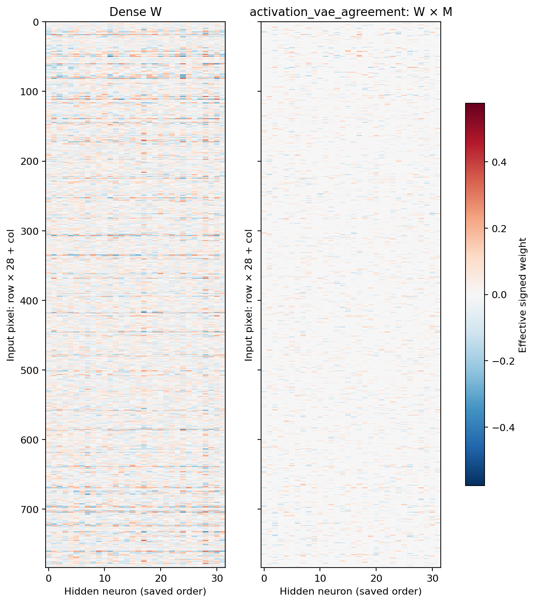
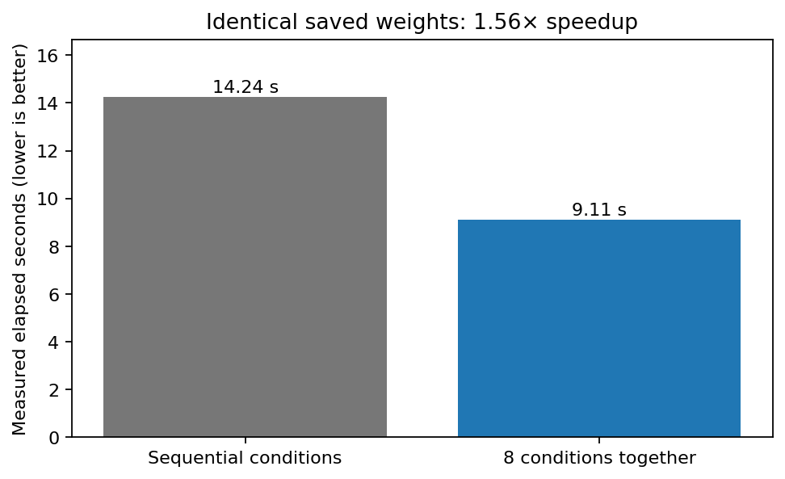

# DeepSets: проверка VAE, выравнивания и функциональной importance

Дополнение от 1 октября 2026 года: результаты внесены в отчёт за 27 сентября.

**Что проверяли.** DeepSets использован как задача для VAE + agreement: из банков обученных сетей извлекается общая бинарная маска, затем её веса заново обучаются на новых задачах. После пилота проверены три направления: детерминированные AE с обычной и Hungarian-реконструкцией; выравнивание нейронов по активациям; замена сырой importance `|W|×M` на оценки функционального вклада.

**Постановка.** Каждый пример — набор из пяти изображений MNIST8m; целевая величина — сумма заданных для цифр стоимостей. Общая сеть для каждого изображения: 784→32→1 с tanh, выходы суммируются. Восемь seeds, четыре исходные и восемь фиксированных новых задач, четыре парные инициализации весов, бюджеты 32/64/128/256 размеченных наборов. Бюджет включает обучение и выбор checkpoint по validation. В каждой sparse-маске ровно 5018 из 25 088 входных связей, около 20%. Метки новых задач не используются для извлечения масок; supervised deletion score использует только исходные обучающие метки.

**Диагностика пилота.** Общая пространственная статистика есть: корреляция профилей importance между исходными задачами после обучения 0,337 против −0,008 при инициализации. Но raw-карты выделяют малоподвижную периферию изображения. VAE получает лишь 26 обучающих и 6 отложенных карт на задачу; его BCE реконструкции 3683,20 против 3678,95 у постоянной средней карты своей задачи. Выравнивание Hungarian до VAE уже применялось, поэтому усреднение нельзя объяснить отсутствием этой стадии. Полезная индивидуальная реконструкция и переносимая общая структура этим пилотом не подтверждены.

### Результаты трёх проверок

В таблице — test NMSE = MSE/5 при бюджете 256; меньше лучше. Сначала усредняются восемь новых задач и четыре инициализации внутри seed, затем восемь seeds. Последний столбец — парный 95% t-интервал разницы с random по seeds. Если интервал включает ноль, преимущество над random не подтверждено. Интервалы точечные, без коррекции множественных сравнений.

| Метод | NMSE | Разница с random: 95% CI |
|---|---:|---|
| Dense | 0,7021 | — |
| Случайная маска | 0,7036 | — |
| Исходная средняя карта | 0,7770 | — |
| Исходный VAE + agreement | 0,7023 | — |
| Flat AE: consensus + BCE | 0,7287 | [0,0109; 0,0392] |
| Flat AE: Hungarian BCE | 0,7373 | [0,0237; 0,0436] |
| Set AE: Hungarian BCE | 0,8727 | [0,1452; 0,1930] |
| Медоид банка | 0,7017 | [-0,0069; 0,0031] |
| Средняя после выравнивания по активациям | 0,7657 | [0,0426; 0,0816] |
| VAE + agreement после выравнивания по активациям | 0,7016 | [-0,0107; 0,0066] |
| Importance с учётом активности пикселя | 0,6903 | [-0,0335; 0,0068] |
| Importance по функциональной производной | 0,6831 | [-0,0510; 0,0098] |
| Importance по положительному train Δloss удаления | 0,6959 | [-0,0313; 0,0159] |

**1. Замена VAE на AE.** Flat AE и Set AE сохраняют лишь около 13–20% разнообразия исходных карт внутри одной задачи. Отказ от KL и перестановочно-инвариантная реконструкция не устранили усреднение. Set AE улучшил внутреннее согласие найденных карт, но его перенос хуже random; flat AE тоже уступают random при бюджете 256. Медоид банка близок к random. Это не доказывает, что любая модель AE непригодна; проверены конкретные архитектуры и короткие банки.

**2. Выравнивание по активациям.** Корреляция сопоставленных нейронов на второй подвыборке якорей выросла с 0,351 до 0,584 внутри задачи и с 0,168 до 0,348 между задачами. Сохранены исходная нормировка и все значения importance: меняется только порядок столбцов. Контрольная raw-consensus маска побитово совпадает с исходной средней. Однако при бюджете 256 новый VAE agreement отличается от исходного всего на −0,0007 NMSE; его преимущество над random не подтверждено. Отдельные якоря взяты из исходного обучающего пула: это проверка воспроизводимости соответствий, а не проверка на ранее не виденных изображениях.

**4. Функциональная importance.** Учёт активности пикселя, производной функции и точного изменения loss при удалении ребра лучше сырого `|W|` выделяет связи, влияющие на исходную модель. При бюджете 256 функциональная производная снижает NMSE с 0,7770 у raw-среднего до 0,6831. Но разница с random −0,0206 имеет интервал [−0,0510; +0,0098], поэтому устойчивый выигрыш в переносе пока не установлен. Свежие source-validation наборы не совпадают с исходными anchors, но используют тот же пул изображений, участвовавший в выборе исходных checkpoints.

**Пояснение графика.** По X — общий бюджет размеченных наборов, по Y — test MSE/5. Три панели соответствуют AE, выравниванию и importance; полосы — 95% интервалы по восьми seeds. Хорошая реконструкция или высокое согласие карт сами по себе не означают хороший перенос.

**Пояснение графика.** Показана разность NMSE нового метода и random на парных задачах и инициализациях. Ниже нуля — улучшение, выше — ухудшение; пересечение интервала с нулём не подтверждает преимущество. Разброс относится к обучению на фиксированных задачах, а не к произвольным новым задачам.

### Dense и маски с обученными весами

**Пояснение heatmap.** Слева — dense W, справа — эффективные веса W×M после нового обучения на целевой задаче. Строки — 784 пикселя, столбцы — 32 нейрона; цвет показывает знак и величину веса, выключенные связи равны точно нулю. Пример выбран заранее: seed 4100, задача 0, бюджет 256, init 0. Порядок столбцов сохранён; все направления используют общую цветовую шкалу. Это один парный пример, не усреднённая карта.

Все heatmaps, пространственные фильтры 28×28 и точные массивы W/M/W×M: [AE](../../../outputs/deepsets_vaae/20261001_followup/ae/weight_heatmaps/README.md), [выравнивание](../../../outputs/deepsets_vaae/20261001_followup/alignment/weight_heatmaps/README.md), [importance](../../../outputs/deepsets_vaae/20261001_followup/importance/weight_heatmaps/README.md).

### Ускорение и проверка сохранённых результатов

Восемь независимых сочетаний «задача × бюджет» обучаются вместе; очередь допускает два процесса на карту. Направления использовали GPU в распределении 3+3+2. В контрольном замере двух задач × четырёх бюджетов × 36 моделей по 800 шагов время target-обучения сократилось с **14,24 до 9,11 с, в 1,56 раза**. Все восемь выбранных checkpoints совпали по весам точно; test NMSE и шаг выбора совпали. Это один замер скорости target-части, а не оценка ускорения всей исследовательской программы. Вариант с одним большим strided GEMM изменил численное округление и конечные результаты, поэтому исключён из итоговых запусков.

**Пояснение графика.** По Y — время в секундах для одинаковых 800-шаговых запусков, меньше лучше. Сравнивается последовательное выполнение условий и совместное обучение восьми условий. Измерения загрузки GPU и их ограничения приведены в отдельном отчёте.

Сохранены **768 итоговых checkpoints** и 26624 записей оценки, исходные массивы, параметры и снимки кода. Во всех трёх направлениях контрольные test-ошибки воспроизведены с максимальным расхождением **0**; 96 проверенных исходных артефактов не изменены. Используются только итоговые исправленные результаты: прямые float64 расстояния для поиска AE, исходная нормировка при выравнивании и строгий FP32 для расчёта importance. Предыдущие попытки сохранены отдельно.

**Чего добились и как это трактовать.** Проверка отделила реконструкцию карт, функциональное совпадение нейронов и перенос маски. Усреднение сохраняется без KL; более содержательное выравнивание само по себе почти не улучшает VAE agreement. Функциональные scores исправляют важный недостаток raw importance, но при бюджете 256 ни один новый метод не показал преимущества над random с 95% интервалом целиком ниже нуля. Поэтому проблема не сводится к одной перестановке нейронов, а генеративность VAE не является необходимым решением. Полезная переносимая структура в этой постановке пока не подтверждена; это вывод о проверенных банках и протоколе, не доказательство отсутствия такой структуры вообще.

[Диагностика пилота](../../../outputs/deepsets_vaae/20261001_pilot/DIAGNOSIS.md) · [полный итоговый отчёт](../../../outputs/deepsets_vaae/20261001_followup/REPORT.md) · [реконструкция AE](../../../outputs/deepsets_vaae/20261001_followup/ae/REPORT.md) · [выравнивание](../../../outputs/deepsets_vaae/20261001_followup/alignment/normalized_final/ALIGNMENT_REPORT.md) · [функциональная importance](../../../outputs/deepsets_vaae/20261001_followup/importance/fp32_final/REPORT.md) · [ускорение и загрузка GPU](../../../outputs/deepsets_vaae/20261001_followup/performance/REPORT.md) · [аудит](../../../outputs/deepsets_vaae/20261001_followup/audit.json).
