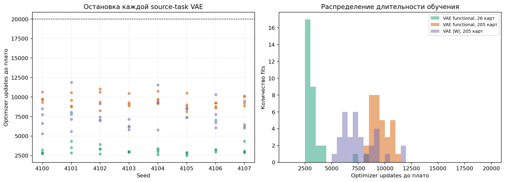
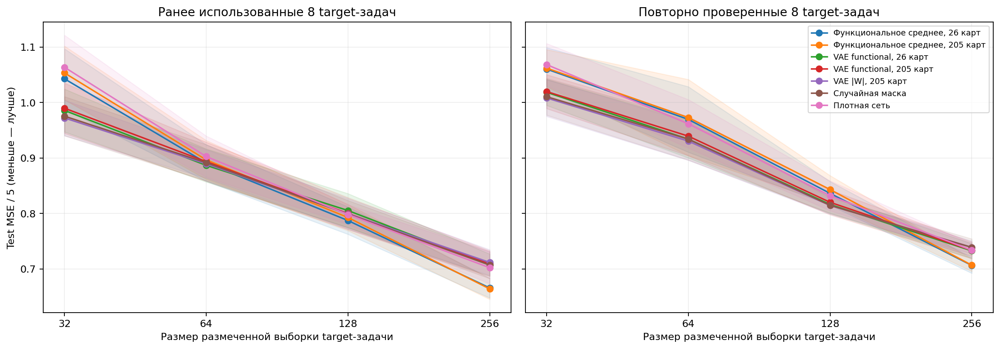
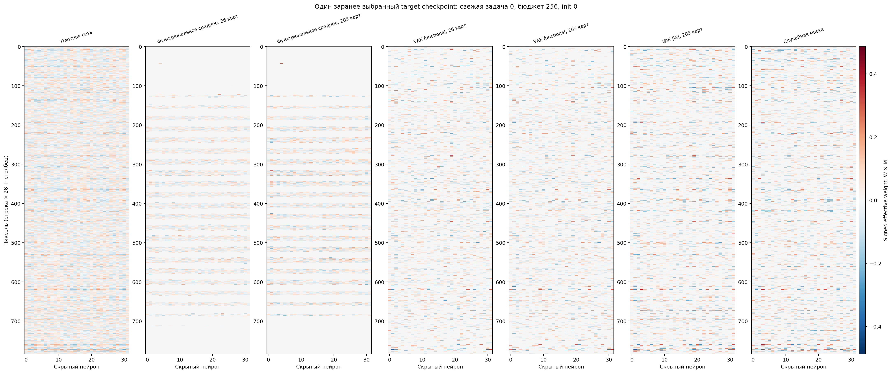
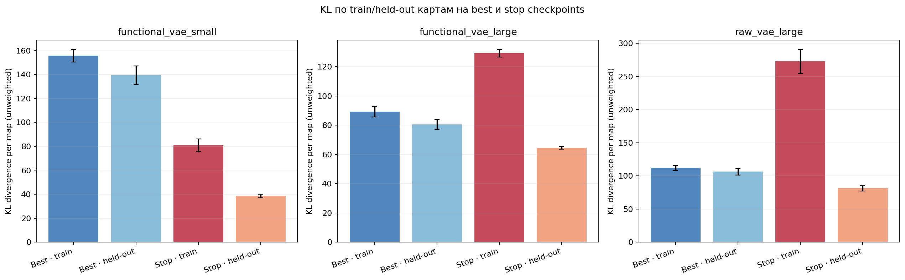
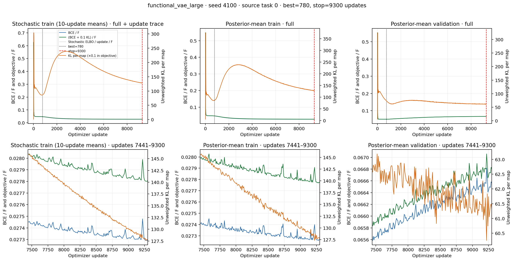

# DeepSets: больше решений на исходную задачу и VAE на функциональных картах

Дополнение от 1 октября 2026 года. Число исходных задач оставлено равным четырём; расширено именно число решений на задачу. Вместо 128 кандидатов с отбором 32 обучены 1024 кандидата и отобраны 256, сохраняя долю отбора 25%. Исходные сети по-прежнему имеют 20% связей, а переносимые маски — фиксированные 30% (7526 связей). Так изменение объёма банка не смешивается с изменением плотности исходных решений.

На каждую исходную задачу выделены 205 обучающих карт и 51 общая held-out карта. Functional VAE сравнивается при 26 вложенных обучающих картах и при всех 205; raw VAE при 205 служит контролем представления. Выравнивание обучается на raw train-картах и одинаково используется для обоих представлений; следовательно, small-контроль изолирует число примеров обучения VAE, но не является полностью независимым pipeline только на 26 картах. Функциональные scores вычислены по исходным обучающим изображениям; target-метки не участвуют в построении масок.

**Что означает NMSE.** Цель — сумма нормированных числовых значений пяти цифр, а не класс изображения. Значения цифр имеют среднее 0 и дисперсию 1; при независимом выборе пяти цифр дисперсия суммы равна 5. В этом протоколе NMSE = test MSE / 5; меньше лучше. Постоянный нулевой прогноз имеет ожидаемую NMSE около 1. Ошибка 0,7066 означает приблизительно на 29% меньшую квадратичную ошибку относительно этого ориентира, а не 70,66% точности классификации.

### Контроль с прежним ограничением 160 шагов обучения VAE

На восьми дополнительных cost-задачах, заранее заданных до этого запуска, при бюджете 256 получены следующие средние по восьми seeds, восьми задачам и четырём инициализациям:

| Метод | Test NMSE |
|---|---:|
| Прямое функциональное среднее, 26 карт на задачу | 0,70625 |
| Прямое функциональное среднее, 205 карт на задачу | **0,70663** |
| Functional VAE, 26 карт | 0,73393 |
| Functional VAE, 205 карт | 0,73223 |
| Raw VAE, 205 карт | 0,73783 |
| Random, те же 30% связей | 0,73872 |
| Dense | 0,73351 |

Прямая функциональная маска строится без VAE: нормированные выровненные scores усредняются по исходным обучающим решениям и выбираются top-K связей; затем веса целевой сети обучаются с нуля. Она лучше random на −0,03209, CI [−0,04852; −0,01565], и dense на −0,02688, CI [−0,04028; −0,01347]. Большее число карт само по себе не улучшило среднюю маску: large−small = +0,00038, CI [−0,00354; +0,00431].

Заранее выбранное основное сравнение этого запуска — large Functional VAE против large функционального среднего на дополнительных задачах при бюджете 256. VAE уступает на +0,02559, CI [+0,00631; +0,04488]. Large VAE против small VAE: −0,00171, CI [−0,00689; +0,00347]; преимущество увеличения train-набора VAE не установлено. Интервалы — парные точечные t-интервалы по восьми seeds, условные на этих фиксированных задачах; остальные контрасты исследовательские, без поправок множественных сравнений.

**Ограничение этого контроля.** У 22 из 32 large Functional VAE лучший validation checkpoint оказался на последнем, 160-м шаге. Поэтому этот запуск не подтверждает сходимость VAE и не завершает проверку требования о сошедшихся лоссах. На held-out картах реконструкции large Functional VAE также хуже train-mean baseline по BCE (0,05245 против 0,04962), их вариативность составляет около 4,4% вариативности исходных карт, а попарный IoU top-K поддержек около 0,979 против 0,140 у исходных карт. Это признаки усреднения в проверенных checkpoints, а не установленная причина проблемы.

**Пояснение графика.** По X — общий бюджет размеченных target-наборов, включая validation, по Y — test MSE / 5. Панели разделяют прежние и восемь дополнительных cost-задач. Кривые сравнивают одинаковую плотность 30%, кроме dense. Увеличение банка не означает увеличения бюджета обучения целевой сети; это разные оси эксперимента.

**Пояснение графика.** Показаны исходная функциональная карта, её реконструкция large Functional VAE и обучающее среднее для заранее фиксированного примера. Это карты важности, не веса target-сети. Сходство реконструкции со средним нужно сопоставлять с held-out ошибкой и вариативностью, а не оценивать только визуально.

**Пояснение heatmap.** Seed 4100, дополнительная cost-задача 0, бюджет 256, init 0. Цвет показывает подписанные обученные веса W×M на общей шкале; нулевые связи отсутствуют в сети. Все разреженные варианты сохраняют 7526 связей. Это реальные выбранные target-checkpoints после нового обучения весов.

Сохранены 32 расширенных исходных банка, 8192 отобранных решения, 96 VAE, 512 target-checkpoints, 14336 записей оценки и исходные данные графиков в PNG/PDF/NPZ. Контроли dense на прежних задачах воспроизвели предыдущие значения точно; проверенные исходные артефакты не изменены. [Полный отчёт контроля 160 шагов](../../../outputs/deepsets_vaae/20261001_expanded_functional_vae/REPORT.md) · [аудит](../../../outputs/deepsets_vaae/20261001_expanded_functional_vae/parent_audit.json).

### Повтор с обязательной проверкой плато лоссов VAE

Повтор использует те же карты, splits, инициализации, архитектуру (латент 16, ширина 128), Adam и ELBO = сумма BCE по карте + 0,1×KL. На каждом шаге записан стохастический train ELBO; каждые 10 шагов — deterministic train и validation objective при posterior mean. После минимум 1000 шагов одновременно проверяются средние двух соседних окон по 200 шагов и линейные тренды всех трёх objective: относительные изменения не больше 0,001. Также требуются 400 шагов без отдельного нового минимума validation с улучшением больше 0,0001 относительно предыдущего минимума и три последовательные успешные проверки. Лимит 20000 шагов служит ограничением бюджета и сам по себе не означает сходимость.

**Все 96 VAE прошли критерий**, остановившись между 2500 и 11890 шагами. Large Functional VAE остановились в среднем на 9493-м шаге; их лучший source-validation checkpoint был в среднем на 846-м. Для переноса масок используются лучшие source-validation checkpoints, а не последние веса. Плато оптимизации не означает достижения глобального оптимума или исчезновения ошибки реконструкции.

| Метод | Дополнительные задачи, NMSE при бюджете 256 | Контроль 160 шагов |
|---|---:|---:|
| Прямое функциональное среднее, 205 карт | **0,70663** | 0,70663 |
| Functional VAE, 26 карт | 0,73254 | 0,73393 |
| Functional VAE, 205 карт | 0,73343 | 0,73223 |
| Raw VAE, 205 карт | 0,73887 | 0,73783 |
| Random, 30% связей | 0,73872 | 0,73872 |
| Dense | 0,73351 | 0,73351 |

**Продление обучения до плато не устранило отставание VAE.** Large Functional VAE против функционального среднего: +0,02680, точечный парный CI [+0,00739; +0,04621]. На прежних задачах соответствующие NMSE равны 0,70952 и 0,66395; разность +0,04557, CI [+0,02505; +0,06610]. Дополнительные задачи уже были просмотрены в контроле 160 шагов, поэтому все сравнения этого повтора исследовательские, условные на прежних фиксированных cost-задачах.

На held-out source-картах large Functional VAE остаётся хуже обучающего среднего по BCE: 0,05232 против 0,04962. Вариативность реконструкций составляет около 4,25% вариативности исходных карт, попарный IoU их top-K поддержек — 0,872 против 0,140. На train BCE VAE ниже ошибки среднего (0,04771 против 0,04925), но это не перенеслось на held-out. Эти результаты отделяют недообучение от сохраняющейся проблемы представления/обобщения; они не устанавливают, что её причина именно в размерности латента, KL или выравнивании.

**Пояснение графика.** Сравниваются шаги подтверждённого плато и лучших source-validation checkpoints для трёх семейств VAE. Лучший checkpoint может существенно предшествовать плато train-лосса: дальнейшее снижение обучающей ошибки не обязательно улучшает восстановление новых карт.

**Пояснение графика.** По X — бюджет target-наборов, по Y — test NMSE. Панели разделяют прежние и дополнительные cost-задачи. Все sparse-маски сохраняют 30% связей. Здесь сравнивается перенос после полного обучения VAE, а не ошибка самой реконструкции карт.

**Пояснение heatmap.** Тот же зафиксированный seed 4100, дополнительная cost-задача 0, бюджет 256, init 0. Общая цветовая шкала показывает W×M для dense, прямых средних, VAE и random. Запрещённые связи точно нулевые; отображены обученные веса target-сетей, не importance scores.

Повтор сохраняет ещё 512 target-checkpoints и 14336 записей оценки, состояния всех 96 VAE и полные лоссы. Независимый численный аудит пересчитал последние три plateau-проверки каждого обучения и подтвердил точное воспроизведение всех 8192 записей четырёх неизменных контролей на обоих наборах задач. [Полный отчёт повтора](../../../outputs/deepsets_vaae/20261001_converged_functional_vae/REPORT.md) · [индекс всех 96 графиков лоссов](../../../outputs/deepsets_vaae/20261001_converged_functional_vae/loss_curve_index.json) · [независимый аудит](../../../outputs/deepsets_vaae/20261001_converged_functional_vae/parent_audit.json).

### Проверка KL и гипотезы о маленьком латенте

По запросу отдельно проверены BCE, KL и использование 16 координат латента. В прежних логах был записан только общий ELBO, поэтому все 96 обучений воспроизведены с теми же данными, инициализациями, Adam, латентным RNG, TF32 и исходным распределением восьми GPU. Независимая проверка подтвердила **точное совпадение 655480 стохастических лоссов, 65644 строк deterministic train/validation и всех выбранных состояний VAE**. Дополнительно все 32 лучших large Functional VAE проверены на CPU. Диагностика не меняет уже полученные маски и target-результаты.

**KL не выродился в нуль.** Во всех 96 траекториях после 100-го шага минимальный deterministic KL на карту равен 50,02 на train и 29,45 на validation. В 384 комбинациях best/stop × train/validation KL конечен и положителен. Ниже — средние по 32 large Functional VAE; KL не умножен на 0,1 и не разделён на 25088 элементов карты.

| Показатель большого Functional VAE | Лучший validation-checkpoint | Checkpoint выхода на плато |
|---|---:|---:|
| KL на train, на карту | 89,26 | 129,19 |
| KL на validation, на карту | 80,62 | 64,55 |
| Active units на train, из 16 | 16,00 | 16,00 |
| Active units на validation, из 16 | 15,94 | 16,00 |
| Эффективный ранг ковариации μ на train | 3,89 | 13,82 |
| Эффективный ранг ковариации μ на validation | 2,35 | 11,29 |
| BCE на train, сумма на карту | 1196,90 | 699,93 |
| BCE сверх entropy-floor на train | 505,14 | 8,17 |
| BCE сверх entropy-floor на validation | 621,82 | 1043,67 |

Active unit здесь означает Var(μ_j) > 0,01 — это диагностический порог, а не универсальный критерий полезной информации. Эффективный ранг равен exp(энтропия нормированных собственных значений ковариации); 16 активных координат могут сильно коррелировать и не образовывать 16 независимых направлений. Положительный KL также не доказывает качество переноса.

**Латент 16 способен почти запомнить обучающие карты.** Targets VAE мягкие, поэтому минимальная BCE не равна нулю: её нижняя граница — Bernoulli-энтропия самой карты H(y). Для больших функциональных train-карт средняя граница равна примерно 691,76 на карту; на плато BCE превышает её всего на 8,17, около 1,2%. При этом held-out ошибка возрастает. Поэтому текущая диагностика сильнее поддерживает проблему обобщения, чем объяснение «латент не вмещает train-карты». Это не исключает улучшения при 32/64/128: такую гипотезу нужно проверять отдельным контролем с теми же банками, splits, плотностью и мониторингом KL.

**Выявлено ещё одно ограничение поиска agreement.** Его радиус равен 3√16 = 12, а начальные коды берутся из стандартного нормального prior. У лучших large Functional VAE в среднем 28,0% train posterior means и 25,8% validation posterior means лежат вне этого шара. У small Functional VAE все train posterior means лежат снаружи; у raw large — около 85,7%. Значит, область, где обучался decoder, частично отличается от разрешённой области поиска. Это проверенное несовпадение областей, но ещё не установленная причина проигрыша. Отдельным контролем стоит проверить поиск с инициализацией и ограничениями, согласованными с source posterior; target-метки для этого не нужны.

**Пояснение графика.** Сравнивается исходный KL на одну карту для best/stop и train/validation в трёх семействах. Он показан до умножения на β=0,1, отдельно от BCE и target NMSE. Ненулевой KL исключает его обнуление в проверенных checkpoints, но не подтверждает переносимую структуру латента.

**Пояснение графика.** Seed 4100, исходная задача 0, large Functional VAE. По X — шаг оптимизации; сверху полный диапазон, снизу последние шаги. Слева показаны BCE/F и общий ELBO/F, где F=25088; справа — исходный KL на карту. Разные шкалы подписаны отдельно. Вертикальные линии отмечают лучший source-validation checkpoint и подтверждённое плато. Так видно, что дальнейшее улучшение train не исправляет ухудшение validation и не сопровождается обнулением KL.

Сохранены ещё 96 пар PNG/PDF с полными декомпозициями BCE/KL, значения по каждой координате, covariance spectra, best/stop posterior statistics, entropy-floor и покрытие области поиска. [Сводка диагностики латента](../../../outputs/deepsets_vaae/20261001_converged_functional_vae/latent_diagnostics/latent_report_summary.json) · [исходные значения графиков](../../../outputs/deepsets_vaae/20261001_converged_functional_vae/latent_diagnostics/latent_report_figure_data.json) · [независимая CPU-проверка](../../../outputs/deepsets_vaae/20261001_converged_functional_vae/independent_best_latent_check.json).

Диагностические CPU/GPU значения сверены с допуском 0,2%: отдельная проверка установила, что максимальная разность Var(μ) 0,181% воспроизводится режимом TF32; без него разность уменьшается до 1,77×10⁻⁶. Этот допуск не применяется к исходным лоссам и выбранным весам, которые совпали точно. [Проверка численной точности](../../../outputs/deepsets_vaae/20261001_converged_functional_vae/cpu_tf32_precision_probe.json). В 127-секундном окне обучения VAE средняя загрузка восьми GPU была около 40,4%; это ограниченное наблюдение, не сравнительный benchmark.
