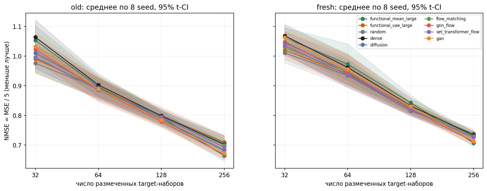
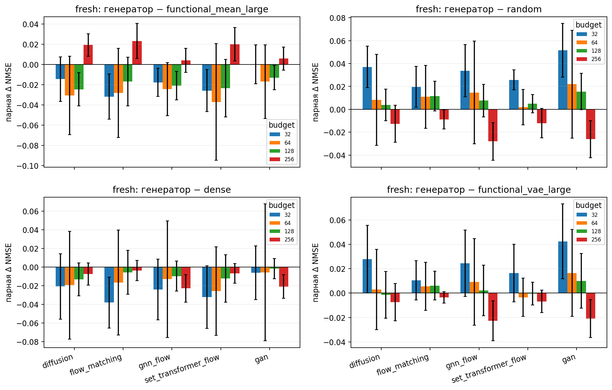
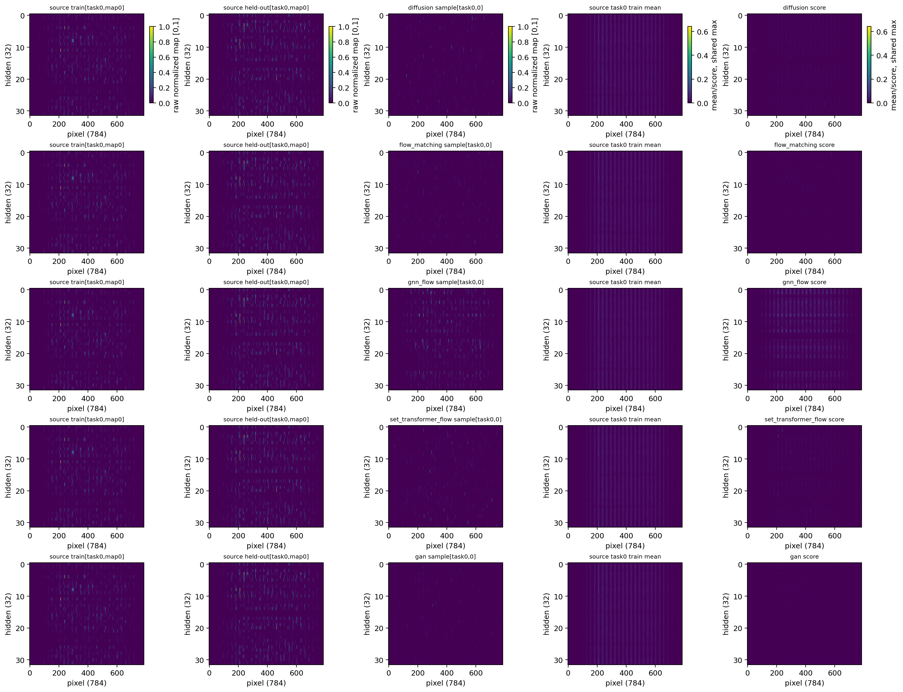
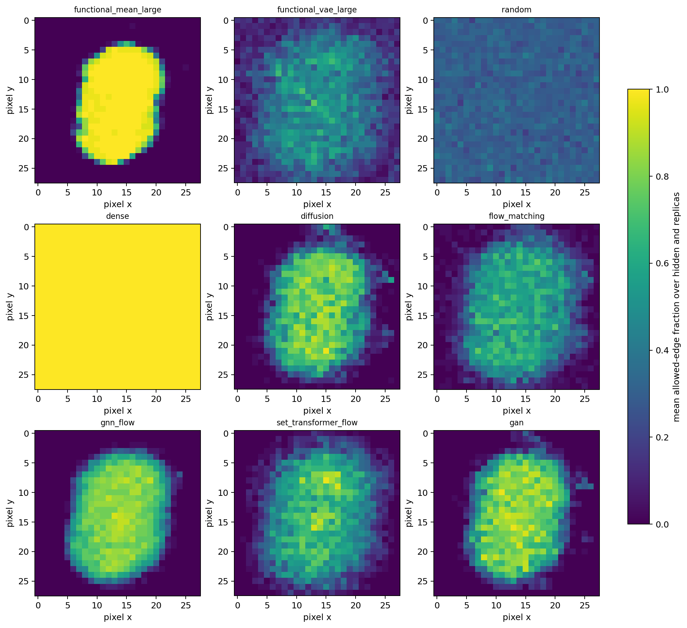
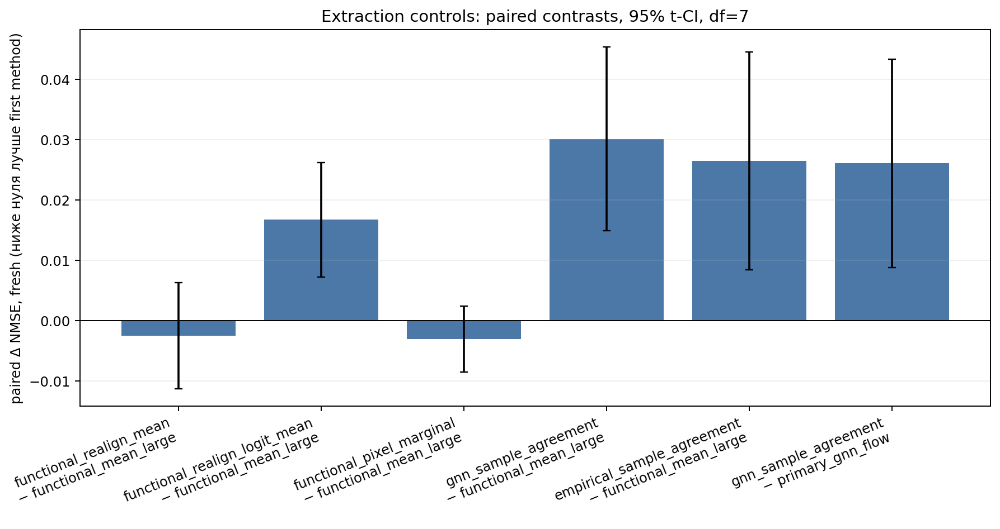
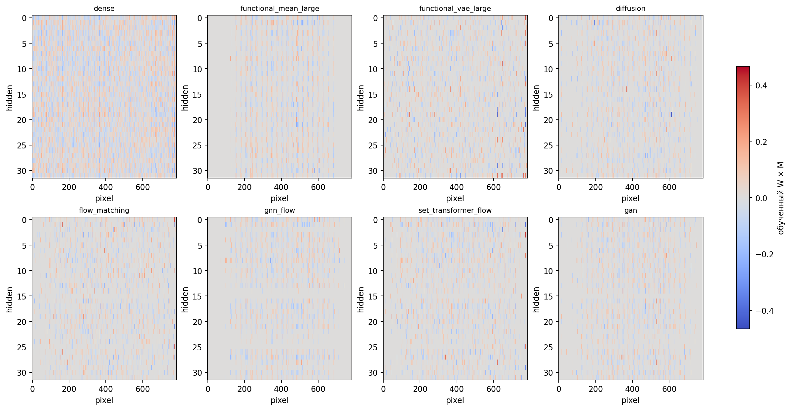
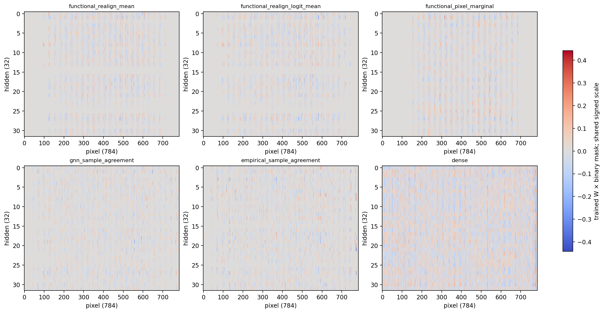
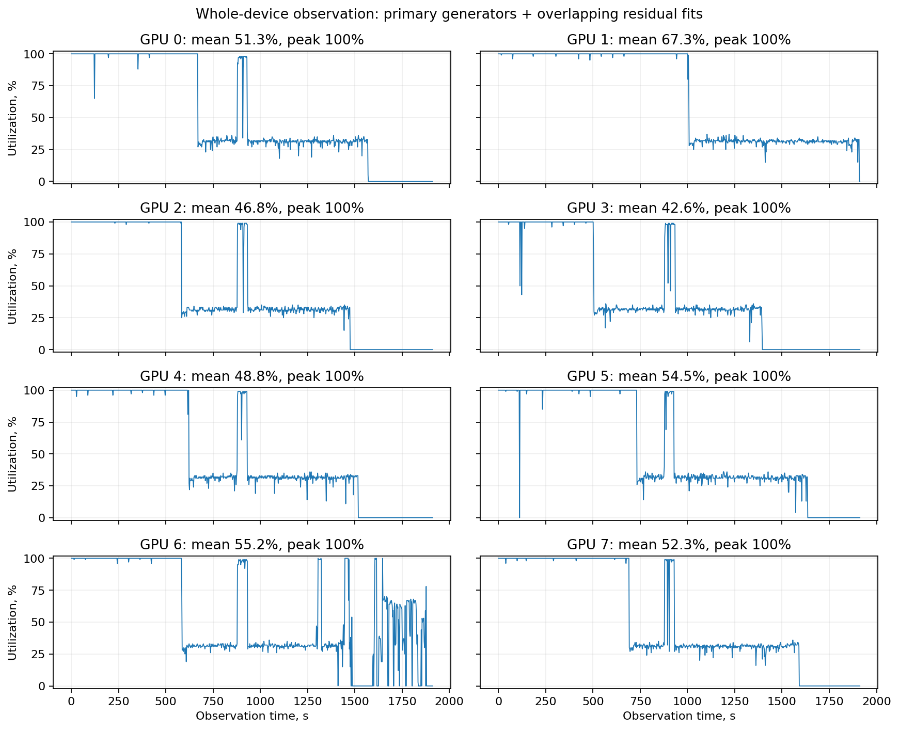

# DeepSets: другие генераторы на том же функциональном банке

Дополнение от 1 октября 2026 года, по запросу сохранено в отчёте за 27 сентября. **Из новых моделей наиболее убедителен GNN + flow matching: он лучше VAE, random и dense в текущем сравнении, но не показал убедительного выигрыша над прямой функциональной картой.** Дополнительный контроль выбора только пикселей достигает того же качества, что полная карта. Поэтому пока подтверждено полезное ограничение пространства гипотез через входные признаки; отдельный выигрыш от моделирования зависимостей между связями не установлен.

### Банк, архитектуры и то, что действительно генерируется

Банк полностью тот же, что у последнего VAE: на каждый seed четыре source-задачи, по 1024 обученных кандидата со случайными фиксированными масками 20%; сохранены лучшие 256 решений на задачу по source validation. Используются функциональные карты `E|W_ij × M_ij × x_i × a_j × (1−tanh²(u_j))|` размером 784×32, нормированные и выровненные. На задачу 205 train и 51 held-out карта: новый условный генератор обучается на pooled 820 train-картах, source checkpoint выбирается по 204 held-out. Генератор получает карту и source-task condition; изображения и target-метки не служат его обучающим targets.

Прежде чем писать модели, прочитаны [DDPM](https://arxiv.org/abs/2006.11239), [Flow Matching](https://arxiv.org/abs/2210.02747), [Permutation-Equivariant Flow Matching](https://arxiv.org/html/2609.32833v1), [GeometricFlow](https://arxiv.org/abs/2504.03710), [DeepWeightFlow](https://arxiv.org/abs/2601.05052), [Set Transformer](https://arxiv.org/abs/1810.00825), [WGAN-GP](https://arxiv.org/abs/1704.00028) и [HyperGAN](https://arxiv.org/abs/1901.11058). GNN и Set Transformer — архитектуры поля скорости внутри flow matching. Наш двудольный pixel–hidden граф и attention по 32 hidden-столбцам адаптируют эти идеи к функциональным картам; это не воспроизведение генерации полных весов из статей. GAN использует WGAN-GP; HyperGAN служил только источником идей.

Diffusion предсказывает x0 на cosine DDPM с 200 шагами; три flow-варианта учатся на linear-path velocity MSE и сэмплируются методом Heun за 64 шага. Размеры: residual flat поля 13 416 705 параметров, GNN 78 274, Set Transformer 549 521; GAN generator 6 944 256 и critic 6 886 657. Число параметров не выравнивалось. Batch генераторов равен 128; source forward BF16, параметры/оптимизация и интеграция FP32.

Во всех пяти вариантах генерируются по 32 карты на каждую из четырёх source-задач. Столбцы заново сопоставляются Hungarian к общей functional train mean; все 128 карт усредняются и проходят один hard top-K: **7526 из 25088 связей, плотность 30%, sparsity 70%**. Затем target DeepSets обучается с нуля, с зафиксированной маской и четырьмя парными инициализациями. Генераторы создают importance scores, не обученные target-веса. У прежнего VAE четыре отдельных модели и decoder agreement; здесь один pooled conditional генератор и sample mean. Поэтому разница результатов относится ко всей процедуре, её нельзя приписать только архитектуре.

### Проверка обучения и обнаруженное ограничение flat поля

В первой фазе обнаружено, что flat поле без прямого residual-пути пропускает 25088 координат через слой ширины 256. Оно не может выразить произвольное покоординатное удаление полного Gaussian noise; остановка лосса по плато этого не исправляет. Source-only t=0 проверка FM дала MSE около 1,927 при аналитической нижней границе около 1,923. Эти первоначальные diffusion/FM сохранены как диагностические контроли, а не как итоговая проверка семейств.

Оба flat генератора повторены с членом `a(t,task) × x`: это **257 дополнительных параметров**, а не множитель 257 в формуле. Он снимает описанное препятствие для обработки полноразмерного шума, не гарантируя полноты моделирования всего распределения. Сохраняется та же инициализация остальной модели; residual coefficient стартует с нуля. Исправление выбрано по source loss/архитектуре, без выбора по target-ошибке. GNN и Set Transformer уже имели прямой full-map residual; их повтор не потребовался.

В итоговом сравнении **32 из 32 non-GAN обучений прошли эмпирический критерий плато**: минимум 2000 шагов, окна по 500, изменение/тренд train, held-out и stochastic loss не более 1%, patience и три последовательные проверки. Остановка: diffusion 3300–3600 шагов, flat FM 2700–2800, GNN 4200–8200, Set Transformer 2500–4000. Лучший held-out checkpoint и checkpoint остановки могут различаться. Это проверка стабилизации objective, не доказательство совпадения с распределением банка.

**GAN не сошёлся ни в одном из восьми запусков:** достигнут лимит 16000 generator updates с тремя critic updates на шаг. Его числа ниже сохранены как нестабильные exploratory результаты и не входят в вывод о сошедшихся генераторах. Source checkpoint GAN выбирался по расстоянию quantile-проекций на 64 фиксированных направлениях; game losses отдельно показаны на своей шкале.

### Перенос при фиксированных 30% связей

Таблица — дополнительные восемь cost-задач, бюджет 256, среднее по восьми seed, восьми задачам и четырём инициализациям. **NMSE — MSE суммы пяти normalized digit-costs, делённая на 5; это регрессия, не accuracy.** В JSON поле `mse` уже содержит эту нормированную величину, повторно делить его на 5 нельзя. Нулевой предиктор имеет NMSE около 1.

| Метод | Test NMSE | Разность с прямой картой, 95% CI |
|---|---:|---:|
| Прямая функциональная карта | 0,7066 | 0,0000 [0,0000; 0,0000] |
| Functional VAE + agreement | 0,7334 | 0,0268 [0,0074; 0,0462] |
| Diffusion, residual поле | 0,7260 | 0,0194 [0,0083; 0,0304] |
| Flow matching, residual поле | 0,7299 | 0,0232 [0,0058; 0,0406] |
| GNN + flow matching | 0,7107 | 0,0041 [-0,0077; 0,0158] |
| Set Transformer + flow matching | 0,7266 | 0,0200 [0,0034; 0,0366] |
| WGAN-GP — нестабильный exploratory запуск | 0,7126 | 0,0059 [-0,0055; 0,0174] |
| Random, те же 30% | 0,7387 | 0,0321 [0,0157; 0,0485] |
| Dense | 0,7335 | 0,0269 [0,0135; 0,0403] |

Для GNN парная разность к VAE равна −0,0227 [−0,0391; −0,0064], к random −0,0280 [−0,0445; −0,0115], к dense −0,0228 [−0,0375; −0,0081]. Разность к прямой карте +0,0041 [−0,0077; +0,0158] не устанавливает преимущество ни одного из них. Diffusion, flat FM и Set Transformer уступают прямой карте в этих точечных интервалах. **Обе группы target-задач уже просмотрены в предыдущем VAE-эксперименте**, поэтому сравнение exploratory. Интервалы парные Student t по восьми seed (df=7), условны на фиксированных задачах и без коррекции множественных сравнений.

**Пояснение графика.** По X — число размеченных target-наборов, по Y — test NMSE; меньше лучше. Панели разделяют прежние и дополнительные cost-задачи. Линии — средние по seed, области — 95% t-интервалы. Здесь оценивается полезность фиксированной маски после нового обучения target-весов. Все sparse-варианты сохраняют один бюджет связей; GAN остаётся нестабильным независимо от target-кривой.

**Пояснение графика.** Generator minus baseline на дополнительных задачах, отдельно по бюджету. Отрицательная разность означает меньшую ошибку генератора; пересечение нуля не устанавливает устойчивой разницы в рамках точечного интервала. Это не interval по новым случайным типам задач и не оценка family-wise significance.

### Разнообразие сэмплов и извлечение маски

Средняя покоординатная дисперсия сэмплов относительно source-bank: diffusion 0,054, flat FM 0,032, GNN 1,007, Set Transformer 0,082, GAN 0,006. **GNN сохраняет дисперсию порядка банковской, но одной дисперсии недостаточно:** такой уровень может давать и неподходящее распределение. Для подтверждения полезных межреберных зависимостей нужны отдельные проверки, а не только визуальная похожесть или variance ratio.

**Пояснение графика.** На каждой строке строго фиксированные source train[task0,map0], held-out[task0,map0], generator[task0,sample0], source task0 mean и финальный pooled generator score; seed 4100. Первые три колонки показывают значения в общей шкале [0,1], последние две — в отдельной общей шкале среднего score. Поэтому слабый цвет у сглаженного сэмпла не означает отсутствие ненулевых значений. Карты не выбирались по качеству.

**Пояснение графика.** Для каждой binary mask показана доля разрешённых связей данного 28×28 пикселя, усреднённая по hidden-нейронам и replicas. Шкала 0–1 общая; суммарная плотность sparse-масок 30%. Прямая mean сильно концентрирует связи на области изображения с цифрой; GNN тоже выбирает центральную область. Картина описывает бюджет по входам, а не доказывает выученные зависимости рёбер. [Распределение по hidden-нейронам и полные подписи](../../../outputs/deepsets_vaae/20261001_other_generators_corrected/sample_figures/CAPTIONS.md).

Усреднение 128 сэмплов теряет информацию о совместном выборе связей. Поэтому дополнительно проверены пять source-only способов извлечения при том же K и target budget 256. Functional realign использует ту же опору, что генераторы. Pixel marginal усредняет score по hidden-столбцам и повторяет один пиксельный вектор 32 раза: почти весь выбор сводится к входным пикселям. Sample agreement на каждом из четырёх заранее заданных стартов выбирает ближайшую целую карту каждой source-задачи к текущему центру и усредняет четыре выбранные карты, до 20 раундов; аналогичный контроль применён к 32 картам на задачу из самого банка. Ни один вариант не выбирался по target-меткам.

| Способ извлечения | Test NMSE | Разность с прямой картой, 95% CI |
|---|---:|---:|
| Повторное functional-выравнивание + mean | 0,7041 | -0,0025 [-0,0113; 0,0062] |
| То же выравнивание + mean в logit | 0,7233 | 0,0167 [0,0073; 0,0262] |
| Только значимость пикселя, одинаковая для hidden-нейронов | 0,7036 | -0,0030 [-0,0085; 0,0024] |
| Согласование целых GNN-сэмплов | 0,7368 | 0,0301 [0,0149; 0,0454] |
| Согласование целых карт исходного банка | 0,7331 | 0,0265 [0,0084; 0,0445] |

**Вывод контроля:** повторное functional-выравнивание и отбор только пикселей не показывают убедительного отличия от прямой карты. Усреднение в logit и sample agreement ухудшают результат. В частности, GNN agreement 0,7368 хуже его sample mean 0,7107. Это отрицательный результат данной процедуры согласования, не опровержение любого поиска по целым сэмплам. Четыре agreement-starts дают разные маски, тогда как sample mean одну: здесь не изолирован единственный причинный эффект межреберных зависимостей.

Полезный сигнал банка в этой постановке **совместим с простым feature selection на входе**. Пока нет оснований утверждать, что сложная модель правильно ограничивает отдельные связи лучше такого контроля. Более различающий тест должен требовать структуры, которую нельзя воспроизвести только степенями входных пикселей; например, известная связность oracle или контроль с сохранением степеней и перемешиванием рёбер. Это предложение следующего исследования, не уже выполненный результат. [Полная проверка извлечения](../../../outputs/deepsets_vaae/20261001_generative_extraction_controls/EXTRACTION_REPORT.md).

**Пояснение графика.** Слева — пять extraction-контролей минус прямая карта, справа — GNN sample agreement минус GNN sample mean. Среднее и точечный парный 95% t-интервал по восьми seed; больше нуля хуже первого метода. Для agreement против GNN mean разность +0,0261 [0,0088; 0,0434]. Проверяется конкретная source-only процедура извлечения, а не генерация новых weights.

### Dense и маски с обученными весами

**Пояснение heatmap.** Фиксированы seed 4100, дополнительная задача 0, budget 256, init 0. По X — 784 input-пикселя, по Y — 32 hidden-нейрона; общая знаковая шкала показывает эффективные обученные target-веса W×M. Запрещённые связи точно нулевые. Цвета importance или частоты выбора здесь не используются. Отдельно сохранены binary masks, score heatmaps, все target weights и веса для дополнительных extraction-контролей.

**Пояснение heatmap.** Тот же заранее фиксированный seed/task/budget/init; знаковая шкала общая для всех шести панелей. Так можно видеть, как выбор маски меняет итоговые разрешённые связи после обучения target-сети. Сам по себе рисунок не измеряет качество переноса; для этого приведены NMSE и парные интервалы выше.

### Следующий вопрос: выбирать число связей по utility

Сейчас ρ=0,3 фиксировано для честного сравнения. **Банк содержит решения только при исходной плотности 20%, поэтому по его картам нельзя определить оптимальную sparsity для задачи.** Для автоматического выбора K нужен сигнал качества: либо source-bank при нескольких плотностях, либо оценка source utility после обучения с генерируемой маской на разных K. Обучать можно задачу `source loss + λ E[число разрешённых связей]`, например с [L0/hard-concrete gates](https://arxiv.org/abs/1712.01312); штраф предотвращает бесплатное открытие всех рёбер. λ и checkpoint выбираются на nested source validation, без target test. Условие на ρ помогает сравнивать несколько бюджетов, но само по себе не выбирает оптимальный бюджет. Такая модель в этом запуске не обучалась.

Практически следующее изменение должно связать генератор с полезностью маски и проверить его против pixel-only prior. Одной замены VAE на более сложный генератор оказалось недостаточно. Вариант conditioning на описании самих данных ведёт к гиперсети и требует отдельного разбиения по задачам, чтобы подтвердить перенос, а не запоминание task-id.

### Сохранение и проверка

Работа выполнена на всех восьми первоначально свободных по utilization GPU; занятую память не использовали как критерий отбора. Для source-полей применены batch 128 и факторизация GNN edge-проекций, target-сети оценивались пакетами 8 условий × 48 моделей. Параллельно с основной фазой обучались два исправленных residual-поля. В окне наблюдения 1912 секунд средняя загрузка карт 52,4%, пики 100%. Это наблюдение всей карты, включая пересекающиеся фазы; оно не является benchmark времени одной архитектуры.

**Пояснение графика.** По X — секунды окна наблюдения, по Y — загрузка всей GPU. Провалы отражают в том числе смену методов, source validation и завершение отдельных seed; разные архитектуры имеют разные времена остановки. Исходные 7128 измерений сохранены, усреднение охватывает это окно, не весь pipeline.

Итоговая фаза сохраняет 40 model/fit/sample-комплектов (32 сошедшихся, 8 нестабильных GAN), 512 target-checkpoints и 24576 записей оценки. Первоначальная диагностическая фаза и ещё 16 residual-fit-комплектов сохранены отдельно. Extraction-контроли добавляют 128 checkpoints и 6144 записи. Старые семь контролей воспроизведены с нулевой разностью; source hashes, W×M и запрет связей проверены независимо.

В extraction-контролях исходная проверка сохранённых файлов ошибочно ожидала 12 записей вместо 48 (12 методов × 4 replicas). Обучение и target-evaluation уже закончились. Исправлена только проверка: все 128 checkpoint hashes остались прежними, результаты восстановлены из сохранённых records без повторного обучения. Исходные source/protocol/logs сохранены вместе с отдельным [recovery provenance](../../../outputs/deepsets_vaae/20261001_generative_extraction_controls/recovery.json).

[Полный итоговый отчёт](../../../outputs/deepsets_vaae/20261001_other_generators_corrected/REPORT.md) · [числа и парные интервалы](../../../outputs/deepsets_vaae/20261001_other_generators_corrected/summary.json) · [40 кривых source-loss](../../../outputs/deepsets_vaae/20261001_other_generators_corrected/loss_curves) · [первая диагностическая фаза](../../../outputs/deepsets_vaae/20261001_other_generators/REPORT.md) · [source-only rank диагностика](../../../outputs/deepsets_vaae/20261001_other_generators_corrected/rank_obstruction.json) · [source-only plateau audit](../../../outputs/deepsets_vaae/20261001_other_generators_corrected/source_plateau_audit.json).

[Итоговый независимый аудит](../../../outputs/deepsets_vaae/20261001_other_generators_corrected/independent_final_audit.json) · [контрольные суммы всех сохранённых фаз](../../../outputs/deepsets_vaae/20261001_other_generators_corrected/artifact_manifest.json).
