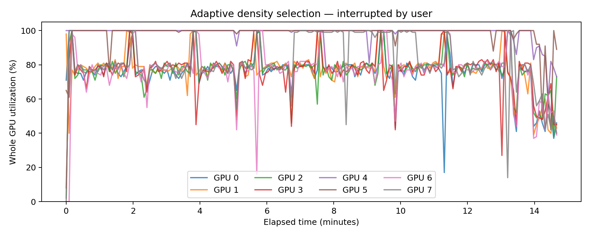

# Приложение: проверка качества expanded source bank

Перед automatic density selection проверен банк `20261001_expanded_functional_vae`, из которого строятся functional maps. В каждом из 32 source condition (8 seed × 4 source task) банк содержит 256 отобранных checkpoint из 1 024 кандидатов. Все кандидаты имеют одну и ту же исходную плотность 20%: 5 018 из 25 088 связей. Следовательно, банк содержит вариативность решений при фиксированной sparsity, но сам по себе не отвечает на вопрос, какая плотность оптимальна.

Сохранённые sparse checkpoint сравнивались с dense control на новом source-only holdout: 3 000 изображений из MNIST8m block 5, по 300 на цифру, с нулевым пересечением по row id и точным pixel-векторам с исходными пятью image pools. Для каждой исходной source task оценивались 2 048 фиксированных sets из пяти изображений. Это те же source cost tasks, а не transfer target tasks.

| Метод | Fresh source NMSE |
|---|---:|
| Все 8 192 selected sparse checkpoint | 0.5832 |
| Dense, лучший checkpoint до 800 updates | **0.3495** |
| Dense, лучший checkpoint до 3 200 updates | **0.2152** |

При равном бюджете 800 updates каждый из 8 192 sparse checkpoint оказался хуже dense control соответствующего source condition. Минимальная индивидуальная разность `sparse − dense≤800` составила +0.1476 NMSE; случаев, где sparse не хуже dense, нет. Это независимая проверка [VERIFIED_SOURCE_QUALITY.json](/home/udeneev-av/ResearchProject/outputs/deepsets_vaae/20261001_adaptive_density/bank_audit/VERIFIED_SOURCE_QUALITY.json): source costs, RNG seeds, hash inputs и CPU reference-initialization replay прошли проверку.

График показывает NMSE на fresh block-5 source holdout, где меньше лучше. Левый boxplot содержит 8 192 selected sparse checkpoint. Два dense boxplot повторяют 32 результата, по одному dense control на source condition, для сопоставления с распределением sparse решений; это не 8 192 независимых dense запусков.

Тонкие линии — 32 dense control, жирные — их среднее; слева training NMSE на minibatch, справа NMSE на фиксированной исходной source-validation выборке. Пунктир — matched budget 800 updates. Dense≤3 200 — только проверка чувствительности к оптимизации: лимит фиксирован, criterion plateau не применялся, а свежий holdout не использовался для выбора checkpoint.

Heatmap показывает эффективные веса $W_{ij}M_{ij}$ для фиксированного source примера seed 4100, task 0. Ось $y$ — 784 входных пикселя, ось $x$ — 32 hidden units; общая симметричная шкала — знак и величина веса. Слева — sparse bank solution c stored validation rank 0, справа — dense control до 800 updates. Нулевые области слева задаются фиксированной sparse mask.

Dense control использует тот же optimizer, source train/validation RNG, data-draw order и знаменатель градиента 128, что и original bank. Его начальная точка соответствует первому из 1 024 reference RNG draws batched bank. На каждую source condition был один dense control; он не образует отдельную пару по начальной инициализации с каждым из 8 192 sparse checkpoint. Это ограничивает оценку эффекта одной конкретной sparse mask при фиксированном init, но не меняет наблюдение о большом разрыве по fresh source utility.

Этот отрицательный source result не противоречит предыдущему transfer result на low-budget target задачах, где functional map служила **prior для новой маски**, а target DeepSets обучался заново. Здесь измеряется качество уже сохранённых source sparse checkpoint на тех же source task. Слабое source решение может давать переносимую статистику важных входов, но это ещё не доказывает, что оно даст target mask, улучшающую dense.

Для density selection criterion должен прямо измерять качество заново обученной сети с candidate mask против dense на заранее фиксированном validation pool. Если ни одна плотность не улучшит dense, корректно зафиксировать отрицательный результат, а не выбирать наименее плохую sparsity. Block 5 может пересекаться с phase-A score-selection новой процедуры, поэтому final confirmation нового правила нужно оставить на блоках 6/7.

### Промежуточный подбор плотности: остановлен пользователем

Подбор на восьми GPU остановлен по запросу «освободи карты». Все наши GPU-процессы завершены; чужие процессы не затрагивались. Полных завершённых seed нет, плотность не выбрана, confirmation не запускалась. Сохранены исходный протокол и код, журналы прогресса, измерения загрузки GPU и завершённая диагностика сходимости. Незавершённые веса и Adam-состояния полного sweep находились в памяти: первоначальный evaluator сохранял их лишь по завершении seed; после остановки из этих журналов продолжить обучение нельзя. Для следующего запуска нужна запись промежуточных пакетов на диск.

В завершённой отдельной диагностике seed 4100 / selection task 0 / budget 256 плато достигли 244 из 444 моделей; 200 дошли до 6000 шагов без него. В 182 случаях не прошёл критерий плато training loss, в 10 продолжались существенные checkpoint improvements, ещё 8 не прошли остальные условия. Это показывает необходимость продолжения оптимизации; это не результат выбора плотности и не подтверждение выигрыша над dense. Вариант продолжения со снижением learning rate пока не запускался.

**Пояснение графика.** По X — минуты наблюдаемого окна, по Y — загрузка всей GPU, включая сторонние процессы. Все восемь карт первоначально выбраны при нулевой загрузке без учёта занятой памяти. Отдельные чужие процессы во время запуска также могли использовать карты, поэтому график не измеряет только нашу вычислительную нагрузку. Исходные измерения сохранены в CSV.

[Статус остановки](../../../outputs/deepsets_vaae/20261001_adaptive_density/STOPPED_BY_USER.json) · [последний прогресс](../../../outputs/deepsets_vaae/20261001_adaptive_density/interrupted_progress.json) · [диагностика сходимости](../../../outputs/deepsets_vaae/20261001_adaptive_density/convergence_diagnostic/diagnosis.json).
