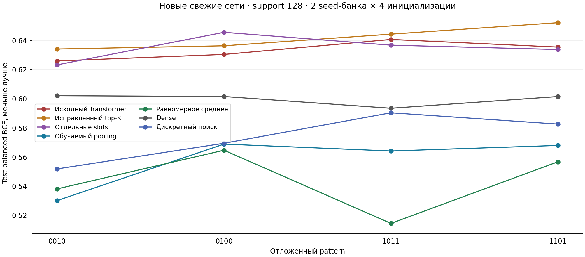
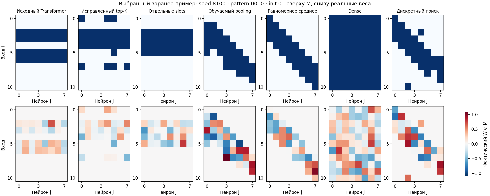

# Pattern: почему Transformer дал полосы и что проверено после диагностики

**Одно исправление top-K не решило проблему.** У исходного decoder scores почти аддитивны по строке и столбцу, а sigmoid-gradient затухает. После исправления градиента и замены decoder на Set Transformer с отдельными slots полосы вернулись. В source-only проверке 64 дискретных замен связей знак локального гиперградиента совпал с реальным изменением query-ошибки только в 32,8% случаев.

Поэтому проверены positive attention-pooling выровненных функциональных карт и прямой дискретный поиск ограничений по фактическому query-качеству. Новый paired full-batch L2-протокол: два source-банка, support=128, четыре свежие инициализации на каждую из четырёх прежних test-задач. Каждый метод получил одинаковую validation-сетку LR/L2.

| Метод | Test balanced BCE, меньше лучше |
|---|---:|
| Dense | 0,5997 |
| Прежний Transformer с исправленным top-K | 0,6419 |
| Set Transformer с отдельными slots | 0,6350 |
| Обучаемый functional pooling | 0,5578 |
| Равномерное functional mean | **0,5435** |
| Дискретный поиск из functional mean | 0,5736 |

Pooling, равномерное среднее и дискретный поиск точечно улучшили dense на 4/4 задачах. Обучаемый pooling в среднем уступил равномерному среднему; отдельное преимущество обучения сверх сильного functional baseline не показано. Coordinate alignment задано явно; нахождение окон не приписывается обучению decoder. Матрица $U$ не используется.

**Все 1232 validation/test-траектории прошли эмпирический критерий plateau** support BCE, regularized objective и query BCE. Норма градиента также сохранялась; plateau не доказывает глобального оптимума. Test оценивается по query-selected checkpoint, который может предшествовать plateau. Независимый пересчёт 224 test-метрик из полных состояний сети прошёл с максимальной разницей $1{,}19\times10^{-7}$.

Ограничения: два seeds, одна task-орбита, ранее исследованный test-split, explicit spatial prior и mismatch короткого outer-SGD с финальным Adam/L2. Source-банк не переобучен и содержит решения без подтверждённого plateau. Результаты относятся к отдельному новому протоколу и напрямую не смешиваются с прежней четырёхseedовой таблицей.

[Полный разбор, таблицы и ограничения](../../../pattern/outputs/task_quality_debug_20261001/RESULTS_RU.md) · [Зафиксированный протокол](../../../pattern/outputs/task_quality_debug_20261001/PROTOCOL_RU.md) · [Независимая проверка](../../../pattern/outputs/task_quality_debug_20261001/independent_audit.json).

По X — отложенный pattern, по Y — balanced BCE на всех 414 test-входах. Каждая точка — среднее двух source-банков и четырёх инициализаций. Соединяющие точки линии сравнивают задачи, не являются временной траекторией. Интервалы уверенности по двум seeds не заявляются.

Заранее заданный пример: seed 8100, pattern `0010`, support=128, init=0. X — hidden-нейрон, Y — входная позиция. Сверху бинарная маска: синий — разрешённая связь, белый — запрещённая. Снизу фактические подписанные $W\odot M$ на общей симметричной шкале: красный — положительный вес, синий — отрицательный, белый — нуль. Столбцы переставлены одинаково для маски и весов при post-hoc Hungarian-сопоставлении; gold не входит в обучение или выбор checkpoint. Показаны реальные отдельные сети, не средние веса и не оконный шаблон.

[Все графики и объяснения](../../../pattern/outputs/task_quality_debug_20261001/figures/captions.md) · [Полные numerical results](../../../pattern/outputs/task_quality_debug_20261001/records.json).
