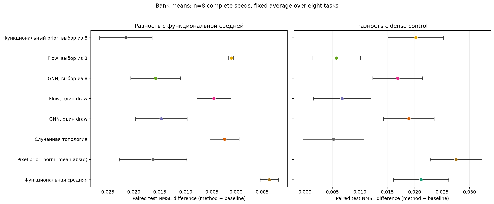
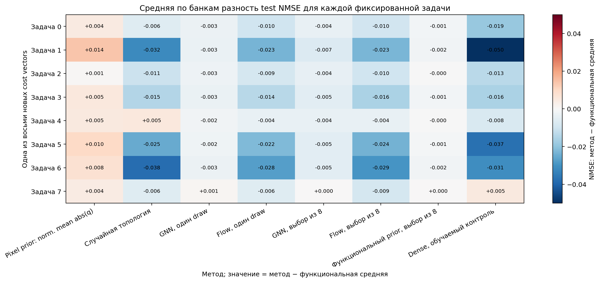
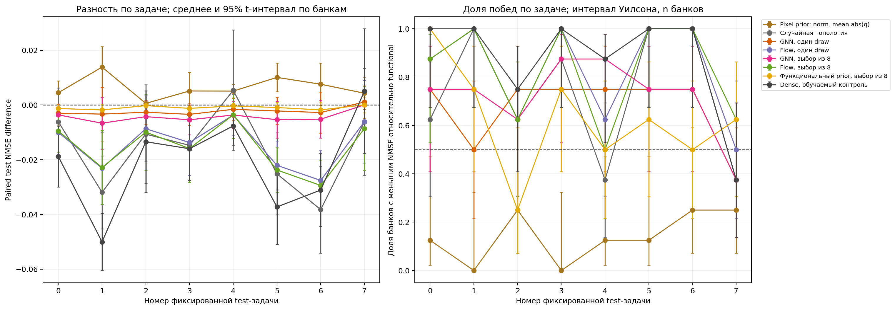
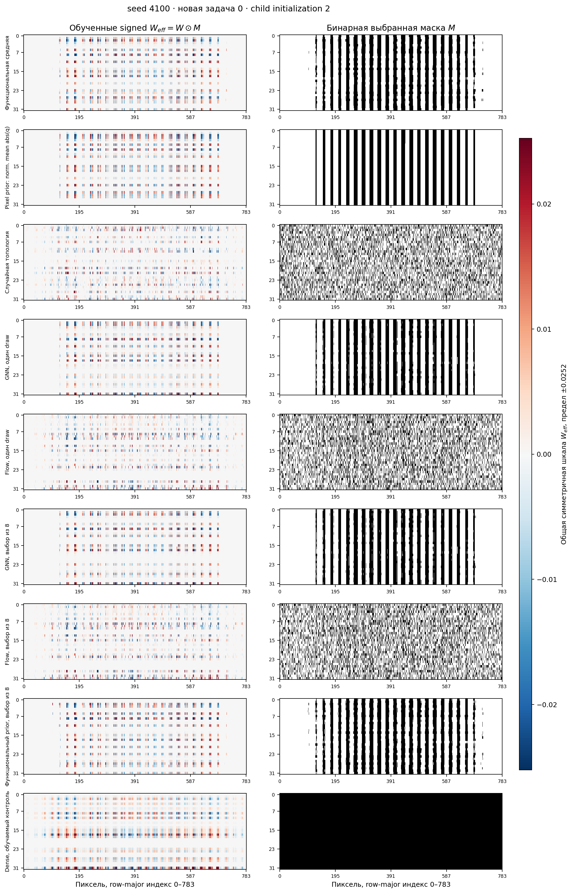
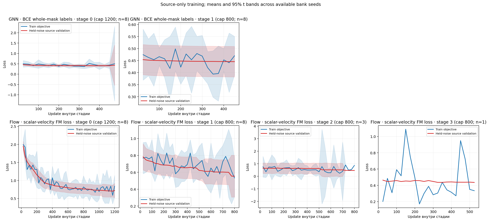
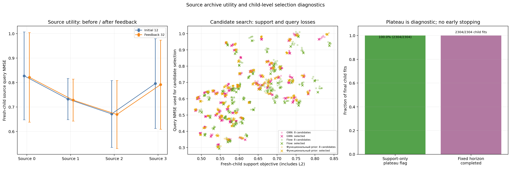
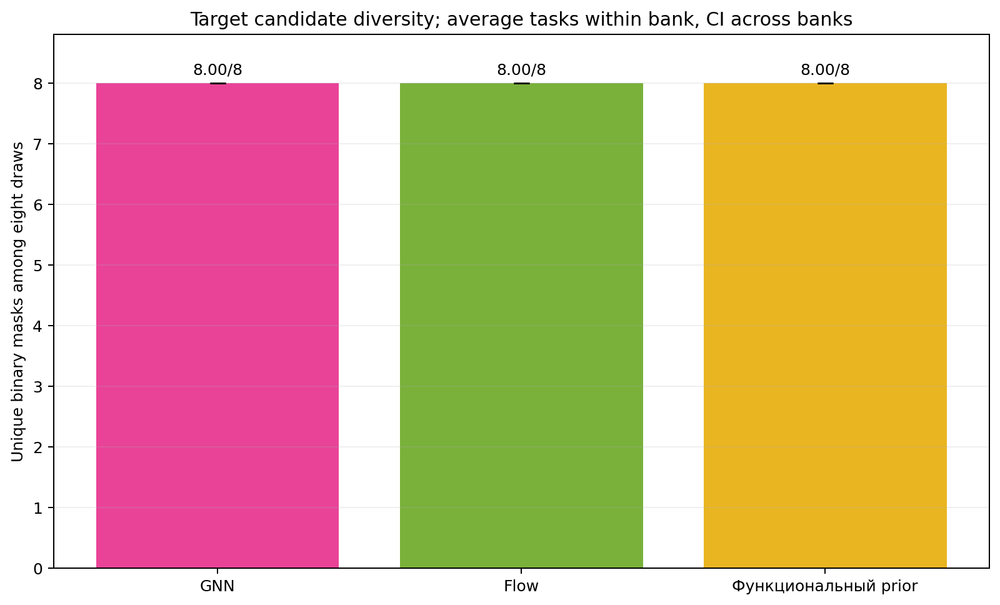

# Результаты benchmark: utility-trained graph masks для DeepSets

Завершённые bank seeds: 4100, 4101, 4102, 4103, 4104, 4105, 4106, 4107; статистическая единица — seed, $n=8$. Сначала усреднены четыре child initialization для каждой из восьми одинаковых целевых задач, затем усреднены задачи внутри seed. Поэтому 256 test fits не рассматриваются как 256 независимых задач.

## Протокол и границы информации

Функциональный банк содержит четыре source cost tasks и функциональные решения при плотностях $\rho\in\{0.1,0.3,0.5,0.7,0.9\}$. Подготовленная population сохраняет обученные полные состояния при этих плотностях; совпавшие topology masks не удаляются на уровне банка. Начальные 12 целых масок оценивались fresh children; затем один общий source-only feedback шаг добавлял 32 маски. Utility — средний query NMSE по fresh child replicas 0/1. Для элитного архива выбирались до четырёх различных масок на source task с весом $w_i\propto\exp[-(u_i-u_{\min})/0.03]$. Модель получает агрегированные по банку средние и дисперсии полных $\psi$ профилей и signed/RMS моментов производной $q_{ij}(x)=x_iW_{eff,ij}a_j(1-\tanh^2(pre_j))$. Для каждого учителя абсолютный профиль нормируется на maximum RMS чувствительность: $\tilde q_{ij}=\mathbb E_x|q_{ij}(x)|/\max_{i,j}\sqrt{\mathbb E_x q_{ij}(x)^2}$. Pixel prior усредняет $\tilde q$ по учителям и hidden units на каждом пикселе, затем broadcast-ит pixel score на все hidden units; используется та же per-teacher нормировка, что у functional-score baseline. Индивидуальные target digit labels и сырые importance rankings не подаются.

Для каждой новой target задачи используются support из 205 observed set labels и query из 51 set labels. Query выбирает одну маску из восьми кандидатов для GNN, Flow и функционального prior. Все маски и fresh children замораживаются до чтения test pool; затем для каждого target task строятся 512 test sets размера 5 из отдельного pool по 300 изображений на digit (3000 уникальных image rows). Set sampling is with replacement внутри этого pool; это не 512 независимых изображений. Оцениваются replicas 2–5. Восемь sparse вариантов (functional, pixel prior, random topology, GNN/Flow single и три search-варианта) имеют ровно $K=7526$ связей из $784\times32$ (плотность $K/25088=0.3000$); dense control обучается с полной маской.

Pixel prior ранжирует функциональный score mean по source bank на уровне пикселя (mean normalized $|q|$, усреднённый по hidden units) и транслирует его на hidden units; random topology служит контролем той же плотности. Целевая плотность 0.3 заранее фиксирована и не выбирается по target labels. Source-bank parent располагает четырьмя известными utility tasks и большим числом наблюдений, чем новый target. Выравнивание функциональных состояний сохраняет исторический train-only Hungarian preprocessing: этот benchmark не является alignment-free.

Метрика fresh child: $\mathrm{NMSE}=\frac{1}{N\cdot5}\sum_{i=1}^{N}(\hat y_i-y_i)^2$, где digit costs центрированы и нормированы к единичной дисперсии. Query NMSE участвует только в выборе кандидата; test NMSE используется только после фиксации всех child states.

Plateau-проверки относятся к разным этапам. Upstream source-population fits используют cadence 50 updates, поэтому last-50 range опирается на отдельные snapshots шагов; у utility-archive и финальных target children cadence равен 100, и округлённое окно 50 updates имеет только один checkpoint, то есть фактически охватывает 100 updates. Финальный source-field plateau проверяется отдельно по held-noise validation каждые 25 updates и требует трёх последовательных stable checks.

## Test результаты

**Пояснение графика.** По X — paired разность test NMSE метода и baseline; отрицательное значение указывает на меньшую ошибку метода. Строки подписаны методом, цвет точки следует тому же method identity. Панели сравнивают с функциональной средней и dense control. Точка и 95% t-интервал вычислены на bank means после усреднения одних и тех же восьми задач внутри банка. Интервал описывает вариацию между банками при условии этого фиксированного набора задач.

| Метод | Среднее test NMSE | 95% CI по банкам |
|---|---:|---:|
| Функциональная средняя | 0.67750 | [0.67129, 0.68371] |
| Pixel prior: norm. mean abs(q) | 0.68389 | [0.67717, 0.69060] |
| Случайная топология | 0.66154 | [0.65188, 0.67120] |
| GNN, один draw | 0.67527 | [0.66732, 0.68323] |
| Flow, один draw | 0.66313 | [0.65274, 0.67352] |
| GNN, выбор из 8 | 0.67323 | [0.66445, 0.68201] |
| Flow, выбор из 8 | 0.66204 | [0.65213, 0.67196] |
| Функциональный prior, выбор из 8 | 0.67655 | [0.66998, 0.68312] |
| Dense, обучаемый контроль | 0.65634 | [0.64886, 0.66383] |

**Пояснение графика.** Строки — восемь заранее заданных cost vectors, столбцы — методы кроме функциональной средней. Ячейка показывает среднюю по банкам разность test NMSE относительно functional; симметричная шкала центрирована на нуле. Синий означает меньшую ошибку метода, красный — большую. Heatmap показывает task-specific структуру и сам по себе не является тестом значимости.

**Пояснение графика.** Цвет линии соответствует методу в легенде. Слева показана по каждой фиксированной задаче средняя paired разность относительно functional и 95% t-интервал по bank seeds. Справа показана доля из $n$ банков, где метод имеет меньший NMSE; интервалы Уилсона основаны на этих парных сравнениях. Задачи остаются фиксированным набором, а не независимыми повторами.

### Парные сравнения с dense control по задачам

Таблица показывает, на скольких из восьми фиксированных задач средняя по bank seeds ошибка метода ниже dense, и paired разность после усреднения задач внутри банка. 95% интервалы справа скорректированы Bonferroni по всем 16 отображённым сравнениям (восемь методов против functional и dense); отрицательная разность благоприятна методу.

| Метод | Задач с меньшей средней NMSE | Task IDs | Paired NMSE gap vs dense, 95% familywise CI |
|---|---:|---|---:|
| Функциональная средняя | 1/8 | 7 | [0.01176, 0.03056] |
| Pixel prior: norm. mean abs(q) | 1/8 | 7 | [0.01876, 0.03632] |
| Случайная топология | 2/8 | 6, 7 | [-0.00516, 0.01555] |
| GNN, один draw | 1/8 | 7 | [0.01032, 0.02754] |
| Flow, один draw | 1/8 | 7 | [-0.00299, 0.01656] |
| GNN, выбор из 8 | 1/8 | 7 | [0.00843, 0.02534] |
| Flow, выбор из 8 | 1/8 | 7 | [-0.00251, 0.01391] |
| Функциональный prior, выбор из 8 | 1/8 | 7 | [0.01080, 0.02962] |

**Пояснение графика.** Условия: seed 4100, новая задача 0, child initialization 2. Строки соответствуют методам; левая колонка — фактические обученные signed $W_{eff}=W\odot M$, правая — бинарная маска. Оси показывают 784 пикселя в row-major порядке и 32 hidden units. Для весов одна общая симметричная шкала ±общая 99-я процентиль $|W_{eff}|$; маски имеют общую шкалу 0–1. Цвет отражает знак/величину параметра, не importance. Пример не заменяет paired benchmark.

### Сходство замороженных топологий

IoU ниже рассчитан постфактум для уже выбранных масок, усреднён по восьми задачам внутри каждого банка, затем между восемью bank seeds. Это описательная диагностика масок; IoU не участвовал в обучении/выборе и не устанавливает причинный механизм качества.

| Сравнение топологий | Средний IoU | 95% t-интервал по bank seeds |
|---|---:|---:|
| GNN single vs functional | 0.8511 | [0.8003, 0.9020] |
| GNN single vs pixel prior | 0.8404 | [0.7846, 0.8962] |
| Flow single vs functional | 0.4564 | [0.3581, 0.5546] |
| Functional vs pixel prior | 0.9112 | [0.9031, 0.9193] |

Средняя функциональная маска близка к pixel prior; GNN masks сохраняют значительное сходство и с functional, и с pixel prior. Flow меняет топологию сильнее (меньший IoU с functional), но это само по себе не означает лучшую test utility: средние Flow остаются хуже dense и random controls. IoU не даёт оснований приписать наблюдаемую точность сходству или отличиям топологий.

Root-level audit: plateau flags подняты у 8192/8192 source, feedback, selection и final child fits; в финальном target subset — 2304/2304. Проверены также [root_child_plateau_audit.json](../../../outputs/deepsets_vaae/20261001_rebuilt_utility_graph_flow/root_child_plateau_audit.json) и [root_mask_diagnostics.json](../../../outputs/deepsets_vaae/20261001_rebuilt_utility_graph_flow/root_mask_diagnostics.json).

Независимая проверка: [independent_review.json](../../../outputs/deepsets_vaae/20261001_rebuilt_utility_graph_flow/independent_review.json), [independent_review.md](../../../outputs/deepsets_vaae/20261001_rebuilt_utility_graph_flow/independent_review.md).

## Выбранные веса, обучение и utility

**Пояснение графика.** Строки — GNN BCE и Flow scalar-velocity FM loss; колонки — фактически выполненные stages, в заголовке указаны cap и число банков с этой стадией. Синий цвет показывает train objective, красный — held-noise validation на source archive; полупрозрачные bands — 95% t-интервалы между доступными bank seeds. Stage 0 ограничен cap 1200, stage 1 и source-only refinements 2–5 — cap 800; stages 0/1 — bounded preliminary fits, а plateau фиксируется отдельно у последней стадии каждой модели. До теста допускается только финальный GNN и Flow с plateau=true. Кривые относятся к source-only обучению, а не к target test quality.

| Bank | Модель | Стадии: updates/cap и plateau | Финальная стадия | Финальный source plateau |
|---:|---|---|---:|:---:|
| 4100 | GNN | 0: 475/1200 plateau; 1: 450/800 plateau | 1 | да |
| 4100 | FLOW | 0: 1200/1200; 1: 800/800; 2: 800/800; 3: 525/800 plateau | 3 | да |
| 4101 | GNN | 0: 450/1200 plateau; 1: 450/800 plateau | 1 | да |
| 4101 | FLOW | 0: 1175/1200 plateau; 1: 750/800 plateau | 1 | да |
| 4102 | GNN | 0: 450/1200 plateau; 1: 450/800 plateau | 1 | да |
| 4102 | FLOW | 0: 1200/1200; 1: 750/800 plateau | 1 | да |
| 4103 | GNN | 0: 450/1200 plateau; 1: 450/800 plateau | 1 | да |
| 4103 | FLOW | 0: 1200/1200; 1: 800/800 plateau | 1 | да |
| 4104 | GNN | 0: 450/1200 plateau; 1: 450/800 plateau | 1 | да |
| 4104 | FLOW | 0: 875/1200 plateau; 1: 800/800; 2: 500/800 plateau | 2 | да |
| 4105 | GNN | 0: 450/1200 plateau; 1: 450/800 plateau | 1 | да |
| 4105 | FLOW | 0: 1200/1200; 1: 525/800 plateau | 1 | да |
| 4106 | GNN | 0: 450/1200 plateau; 1: 450/800 plateau | 1 | да |
| 4106 | FLOW | 0: 1200/1200; 1: 800/800; 2: 700/800 plateau | 2 | да |
| 4107 | GNN | 0: 475/1200 plateau; 1: 450/800 plateau | 1 | да |
| 4107 | FLOW | 0: 1025/1200 plateau; 1: 475/800 plateau | 1 | да |

**Пояснение графика.** Слева показаны initial 12 и feedback 32 masks на четырёх source tasks; цвет кодирует фазу, интервалы отражают банки. В центре цветом обозначен generator в легенде, а крест отмечает выбранный query-кандидат среди восьми. Оси показывают конечный support objective с L2 и query NMSE. Справа показаны доля финальных child fits с support-only plateau flag и число завершённых fit из общего числа на фиксированном горизонте. Флаг child-fit использует checkpoints каждые 100 updates; обе его стабильности фактически оценивают последнее 100-update окно. Это только диагностика и она не останавливает fit.

**Пояснение графика.** Цвет и подпись столбца указывают generator. Столбец — число различных binary masks из восьми draws, сначала усреднённое по target tasks внутри каждого банка; интервалы рассчитаны между банками. Максимум равен восьми. График показывает diversity, не качество.

## Интерпретация

Поддержанное ограниченное преимущество обнаружено для: Flow, один draw относительно Функциональная средняя; Flow, выбор из 8 относительно Функциональная средняя. Требование включает Bonferroni-adjusted paired CI по 16 method-baseline contrasts ниже нуля и отрицательные точечные средние по всем восьми фиксированным задачам.
Поставленная цель улучшить качество относительно dense на каждой новой задаче не достигнута: ни один sparse-метод не имеет меньшей bank-mean NMSE на всех восьми задачах. Например, Flow search выигрывает по task mean на 1/8 задачах, случайная топология — на 2/8.

Главное ограничение — восемь target cost vectors фиксированы и повторяются между bank seeds: CI описывают вариацию банков на этих задачах, а не обобщение на все возможные функции стоимости. Source parent знает source utility tasks и имеет больше наблюдений, чем target learner. Контекст агрегирует полные функциональные profiles и q moments по банку; он не подаёт все индивидуальные решения отдельными токенами и не использует их quality labels как attention inputs. Историческое train-only Hungarian alignment остаётся частью preprocessing.

Числа paired contrasts, task gaps, win rates и массивы графиков находятся в [summary.json](../../../outputs/deepsets_vaae/20261001_rebuilt_utility_graph_flow/summary.json) и [figure_data.npz](../../../outputs/deepsets_vaae/20261001_rebuilt_utility_graph_flow/figure_data.npz); протокол запуска — [protocol.json](../../../outputs/deepsets_vaae/20261001_rebuilt_utility_graph_flow/protocol.json).
