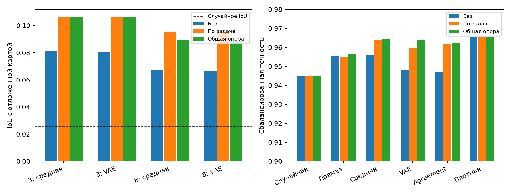

# MNIST8m: выравнивание столбцов importance maps

Для задач «3 против остальных» и «8 против остальных» столбцы importance maps сопоставлены по сходству с помощью венгерского алгоритма. Сравнены исходные карты, отдельная опора внутри каждой задачи и **одна общая карта из обучающего банка цифры 3** для обеих задач. Затем заново обучены VAE и найдены маски agreement; прежнее фиксированное выравнивание выходов двух декодеров при поиске z сохранено. MLP: 784→64→1, плотность 5%; количество связей в масках одинаково. Восстановление проверено на отложенных картах, классификация — на отдельном тестовом блоке после нового обучения весов (4 запуска на маску).

| Цифра | Опора | IoU средней карты | IoU VAE | Случайный IoU |
|---:|---|---:|---:|---:|
| 3 | Без | 0.081 | 0.080 | 0.026 |
| 3 | По задаче | 0.107 | 0.106 | 0.026 |
| 3 | Общая опора | 0.107 | 0.106 | 0.026 |
| 8 | Без | 0.067 | 0.067 | 0.026 |
| 8 | По задаче | 0.095 | 0.095 | 0.026 |
| 8 | Общая опора | 0.090 | 0.089 | 0.026 |

IoU: top-K реконструкции против top-K карты, не использованной при обучении VAE.

| Маска | Точность без | По задаче | Общая опора | BCE без | BCE по задаче | BCE общая опора |
|---|---:|---:|---:|---:|---:|---:|
| Случайная | 0.9449 | 0.9449 | 0.9449 | 0.1638 | 0.1638 | 0.1638 |
| Прямая | 0.9553 | 0.9548 | 0.9563 | 0.1383 | 0.1342 | 0.1360 |
| Средняя | 0.9559 | 0.9638 | 0.9646 | 0.1336 | 0.1202 | 0.1198 |
| VAE | 0.9483 | 0.9596 | 0.9638 | 0.1520 | 0.1377 | 0.1212 |
| Agreement | 0.9472 | 0.9615 | 0.9621 | 0.1621 | 0.1234 | 0.1164 |
| Плотная | 0.9653 | 0.9653 | 0.9653 | 0.1148 | 0.1148 | 0.1148 |

| Agreement по цифре | Без | Общая опора | Прирост, п. п. |
|---:|---:|---:|---:|
| 3 | 0.9539 | 0.9618 | +0.80 |
| 8 | 0.9406 | 0.9624 | +2.18 |

С общей опорой точность выросла во всех 8 парных повторных обучениях MLP.

Для случайной, средней, VAE и agreement масок ограничено число связей на входной пиксель: максимум четыре. Прямая маска — карта лучшего MLP из банка. Плотная сеть — контроль без маски.

**Параметры итогового MLP.** Плотный 784→64→1: 50 176 весов входного слоя, 64 смещения, 64 выходных веса и одно смещение — всего **50 305**. Маска 5% оставляет 2 509 входных связей: **2 638 активных коэффициентов**, в 19,1 раза меньше. Фиксированная маска не входит в число обучаемых параметров. Пока код хранит плотный весовой тензор: фактически выделено те же 50 305 параметров, экономия памяти и ускорение не измерены. Два VAE для поиска маски имеют по 25 897 024 параметра; после фиксации маски они не нужны для работы классификатора.

| Точность без лимита на пиксель | Без | По задаче | Общая опора |
|---|---:|---:|---:|
| Средняя | 0.8587 | 0.9538 | 0.9518 |
| Agreement | 0.9351 | 0.9522 | 0.9554 |

**Вывод.** Выравнивание улучшило восстановление отложенных importance maps, но VAE всё ещё почти повторяет среднюю карту. С общей опорой точность agreement изменилась на +1.49 п. п. относительно исходного запуска; она выше случайной маски и выше прямой маски банка. Средняя карта дала 0.9646 и осталась лучше agreement (0.9621) по точности. По BCE agreement лучше средней карты (0.1164 против 0.1198). Значит, главный прирост точности объясняется выравниванием; оптимизация z пока не дала добавочного выигрыша именно в точности.

[Код выравнивания](../pattern/align_mnist8m_importance_bank.py) · [эксперимент](../pattern/mnist8m_raw_mlp_bce.py) · [сырые результаты](../pattern/outputs/mnist8m_raw_mlp_bce/width64_5pct_global_anchor/) · [ширина и плотность](MNIST8M_WIDTH_DENSITY_2026-09-26.md)
