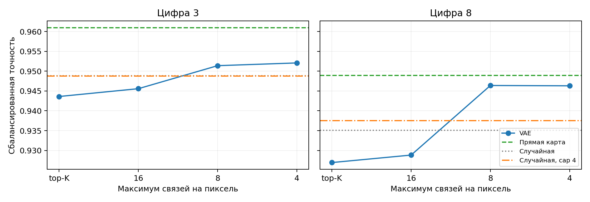
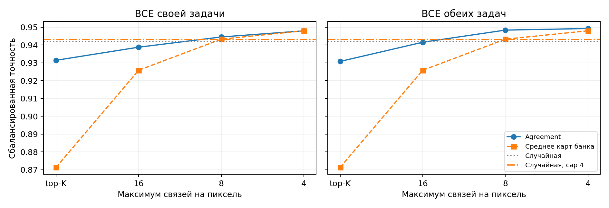
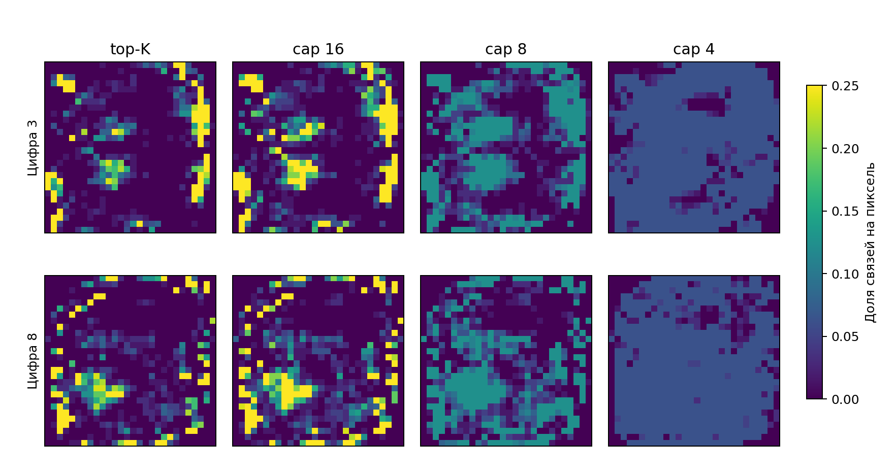

# MNIST8m: проверка покрытия пикселей при фиксированном VAE

Использованы уже обученные VAE и найденные z для цифр 3 и 8 против остальных. Из тех же логитов декодера взяты ровно 2509 связей (5%). Для каждого пикселя разрешено не более 16, 8 или 4 связей; обычный top-K ограничений не имеет. Такой же предел 4 применён к случайным маскам. Также проверены общие маски agreement (λ=1), средние карты каждого банка и их среднее. Для каждой маски обучены четыре новых MLP с одинаковой инициализацией и пакетами данных. На тесте измерены точность и BCE; лучшая эпоха выбрана по валидации.

| Маска | Предел связей/пиксель | Пикселей со связью | Точность ↑ | BCE ↓ |
|---|---:|---:|---:|---:|
| VAE цифры 3 | top-K | 275 | 0.9436 | 0.1828 |
| VAE цифры 3 | 16 | 371 | 0.9456 | 0.1719 |
| VAE цифры 3 | 8 | 497 | 0.9514 | 0.1567 |
| VAE цифры 3 | 4 | 670 | 0.9521 | 0.1432 |
| VAE цифры 8 | top-K | 310 | 0.9269 | 0.2263 |
| VAE цифры 8 | 16 | 392 | 0.9288 | 0.1943 |
| VAE цифры 8 | 8 | 475 | 0.9464 | 0.1704 |
| VAE цифры 8 | 4 | 669 | 0.9463 | 0.1560 |
| Agreement, своя BCE, λ=1 | top-K | 270 | 0.9314 | 0.2233 |
| Agreement, своя BCE, λ=1 | 16 | 345 | 0.9388 | 0.1876 |
| Agreement, своя BCE, λ=1 | 8 | 471 | 0.9445 | 0.1760 |
| Agreement, своя BCE, λ=1 | 4 | 671 | 0.9480 | 0.1579 |
| Agreement, обе BCE, λ=1 | top-K | 279 | 0.9308 | 0.2092 |
| Agreement, обе BCE, λ=1 | 16 | 356 | 0.9416 | 0.1852 |
| Agreement, обе BCE, λ=1 | 8 | 483 | 0.9484 | 0.1639 |
| Agreement, обе BCE, λ=1 | 4 | 668 | 0.9493 | 0.1572 |
| Средняя карта банка 3 | top-K | 83 | 0.8614 | 0.3436 |
| Средняя карта банка 3 | 16 | 227 | 0.9409 | 0.1802 |
| Средняя карта банка 3 | 8 | 401 | 0.9522 | 0.1504 |
| Средняя карта банка 3 | 4 | 655 | 0.9566 | 0.1287 |
| Средняя карта банка 8 | top-K | 124 | 0.8506 | 0.4320 |
| Средняя карта банка 8 | 16 | 258 | 0.9260 | 0.1968 |
| Средняя карта банка 8 | 8 | 396 | 0.9459 | 0.1592 |
| Средняя карта банка 8 | 4 | 654 | 0.9469 | 0.1485 |
| Средняя карта двух банков | top-K | 95 | 0.8713 | 0.3284 |
| Средняя карта двух банков | 16 | 227 | 0.9258 | 0.2187 |
| Средняя карта двух банков | 8 | 392 | 0.9433 | 0.1734 |
| Средняя карта двух банков | 4 | 648 | 0.9480 | 0.1696 |
| Прямая карта MLP, 3 | — | 666 | 0.9610 | 0.1284 |
| Прямая карта MLP, 8 | — | 676 | 0.9489 | 0.1505 |
| Случайные маски | — | 752 | 0.9420 | 0.1697 |
| Случайные маски с ограничением | 4 | 770 | 0.9431 | 0.1681 |

Показатели VAE и карты отдельного банка даны на своей задаче; для agreement и случайной маски — среднее по двум задачам. Во всех строках ровно 5% связей.

Обучение: 13200 шагов из 15000; остановка по плато. Индивидуальные маски и численные результаты сохранены в `evaluation.pt`.

**Вывод.** При том же VAE и тех же z распределение связей по пикселям повысило качество отдельных масок и общей маски. Случайной маске такое ограничение почти не помогло. Значит, существенная часть потери качества возникала при глобальном top-K: он выбирал слишком много связей у одних и тех же пикселей. При cap=4 общий agreement по обеим задачам достигает близкой к среднему карт банка точности, но преимущество перед этим простым контролем невелико. Проверка проведена на двух цифрах и четырёх повторениях; она не показывает, что VAE всегда будет лучше среднего карт.

[Код эксперимента](../pattern/mnist8m_coverage_diagnostic.py) · [сырые результаты](../pattern/outputs/mnist8m_raw_mlp_bce/coverage_diagnostic/)
