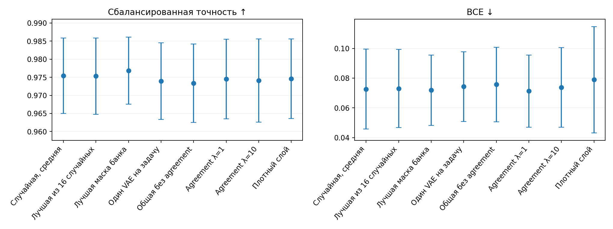
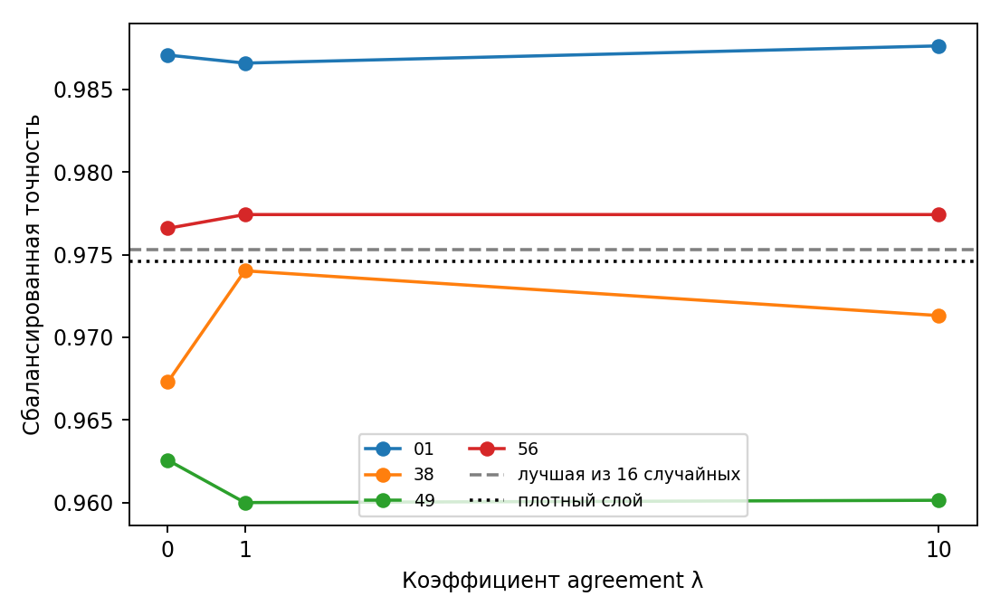
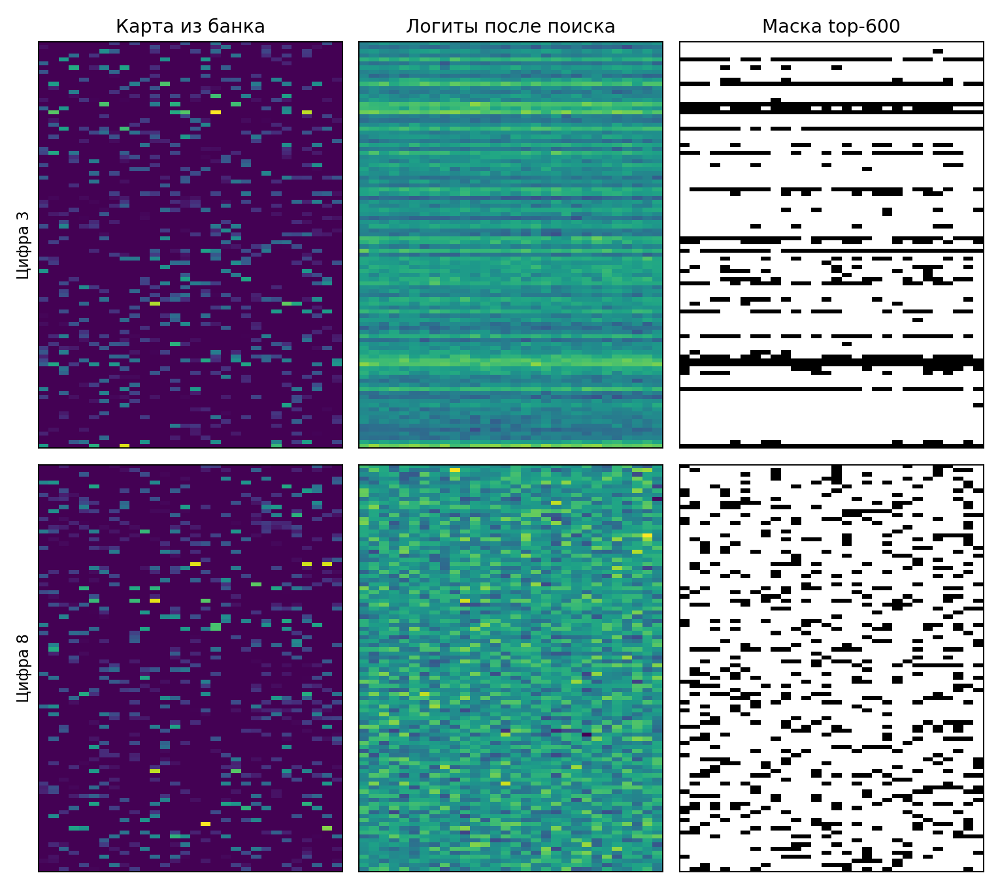

# MNIST8m: agreement VAE на importance maps

Четыре пары цифр: 0/1, 3/8, 4/9, 5/6. Для каждой цифры обучены 4096 MLP со случайными масками (600 из 3000 связей) на задаче «эта цифра против остальных». MLP обучались по BCE с проверкой сходимости. У лучших 10% по validation BCE сохранены нормированные карты |W·M|/max(|W·M|). Для каждой цифры на её картах обучен отдельный VAE с ранней остановкой.

При поиске VAE заморожены. Оптимизируются два z и две новые головы: BCE каждой задачи плюс MSE выровненных логитов декодеров с коэффициентом λ. Маски — top-600; выравнивание столбцов фиксируется в начале поиска. Каждая итоговая маска проверена двумя новыми обучениями головы на изображениях из отдельного тестового блока MNIST8m.

| Маска | Сбалансированная точность ↑ | BCE ↓ |
|---|---:|---:|
| Случайная, средняя | 0.9754 ± 0.0104 | 0.0726 ± 0.0268 |
| Лучшая из 16 случайных | 0.9753 ± 0.0105 | 0.0730 ± 0.0263 |
| Лучшая маска банка | 0.9768 ± 0.0093 | 0.0718 ± 0.0236 |
| Один VAE на задачу | 0.9739 ± 0.0106 | 0.0743 ± 0.0235 |
| Общая без agreement | 0.9734 ± 0.0108 | 0.0757 ± 0.0251 |
| Agreement λ=1 | 0.9745 ± 0.0110 | 0.0713 ± 0.0242 |
| Agreement λ=10 | 0.9741 ± 0.0115 | 0.0738 ± 0.0268 |
| Плотный слой | 0.9746 ± 0.0110 | 0.0789 ± 0.0358 |

Разброс — между четырьмя парами цифр. Сбалансированная точность придаёт одинаковый вес положительному и отрицательному классу. Лучшая из 16 случайных масок выбрана только по валидации. Плотный слой содержит 3000 связей против 600 в масках.

| Пара цифр | Лучшая случайная | Без agreement | λ=1 | λ=10 | Плотный |
|---|---:|---:|---:|---:|---:|
| 01 | 0.9880 | 0.9871 | 0.9866 | 0.9876 | 0.9891 |
| 38 | 0.9718 | 0.9673 | 0.9740 | 0.9713 | 0.9705 |
| 49 | 0.9631 | 0.9626 | 0.9600 | 0.9601 | 0.9629 |
| 56 | 0.9785 | 0.9766 | 0.9774 | 0.9774 | 0.9759 |

BCE на тех же четырёх парах:

| Пара цифр | Лучшая случайная | Без agreement | λ=1 | λ=10 | Плотный |
|---|---:|---:|---:|---:|---:|
| 01 | 0.0414 | 0.0450 | 0.0424 | 0.0413 | 0.0379 |
| 38 | 0.0874 | 0.0855 | 0.0757 | 0.0800 | 0.0878 |
| 49 | 0.1006 | 0.1039 | 0.1010 | 0.1059 | 0.1229 |
| 56 | 0.0626 | 0.0684 | 0.0660 | 0.0680 | 0.0669 |

**Проверка карт.** Средний IoU поддержек отобранных карт с первой картой: 0.112 против 0.111 у случайных; после оптимальной перестановки столбцов 0.215 против 0.215. IoU top-600 при реконструкции VAE: 0.115. IoU масок двух VAE после поиска: λ=0: 0.103, λ=1: 0.104, λ=10: 0.107.

**Вывод.** При λ=1 средняя точность отличается от лучшей случайной маски на -0.0008, от плотного слоя на -0.0001. Средняя BCE ниже на 0.0017 и 0.0076 соответственно, но выигрыш меняется между парами цифр. Устойчивого улучшения точности не обнаружено. VAE почти не восстанавливают top-600 поддержки исходных карт; это ограничивает вывод о пользе agreement. Энкодер изображений был заморожен.

[Код эксперимента](../pattern/mnist8m_importance_bce.py) · [сырые результаты](../pattern/outputs/mnist8m_importance_bce/)
