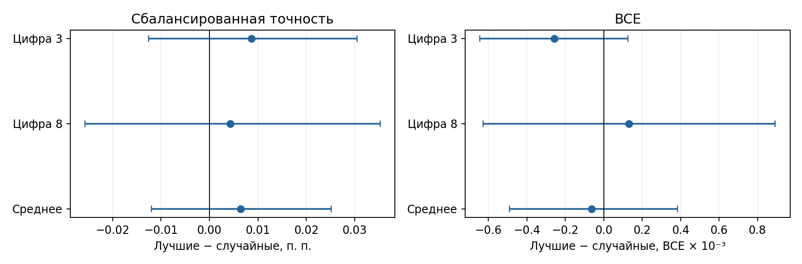

# MNIST8m: несут ли лучшие маски банка полезный сигнал?

Для цифр 3 и 8 сравнили по 410 масок из лучших 10% банка с 410 новыми случайными масками той же плотности (20%). В каждой паре MLP стартовали с одинаковых весов, получали одинаковые обучающие пакеты и обучались до ранней остановки. Маски были фиксированы. Для каждого сравнения — 4 новых старта. Тестовые изображения не использовались при отборе масок.

| Задача | Лучшая маска: точность | Случайная: точность | Разница, п. п. [95% ДИ] |
|---|---:|---:|---:|
| 3 против остальных | 0.9606 | 0.9606 | +0.009 [-0.013; +0.030] |
| 8 против остальных | 0.9529 | 0.9528 | +0.004 [-0.026; +0.035] |
| Среднее по двум задачам | — | — | +0.006 [-0.012; +0.025] |

| Задача | Лучшая маска: BCE | Случайная: BCE | Разница [95% ДИ] |
|---|---:|---:|---:|
| 3 против остальных | 0.12208 | 0.12234 | -0.00026 [-0.00064; +0.00012] |
| 8 против остальных | 0.14129 | 0.14116 | +0.00013 [-0.00063; +0.00089] |
| Среднее по двум задачам | — | — | -0.00006 [-0.00049; +0.00038] |

Доверительные интервалы получены парным бутстрэпом по маскам; они относятся к этому фиксированному набору изображений и двум задачам, а не ко всем возможным цифрам.

**Вывод.** В этом контроле маски от лучших MLP не дали заметного преимущества перед случайными масками после нового обучения весов. Значит, прежний отбор по качеству MLP не выявил воспроизводимо лучших поддержек масок; хорошее качество исходных MLP могло зависеть от их весов.

Пар масок на задачу: 410; повторов обучения: 4. Шагов: 4800 для 3, 6700 для 8.

[Код проверки](../pattern/mnist8m_bank_mask_control.py) · [сырые результаты](../pattern/outputs/mnist8m_raw_mlp_bce/mask_control/)
