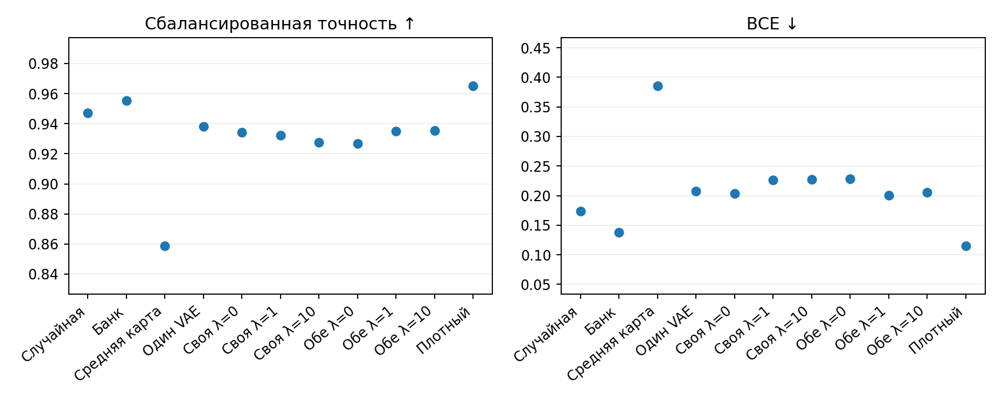
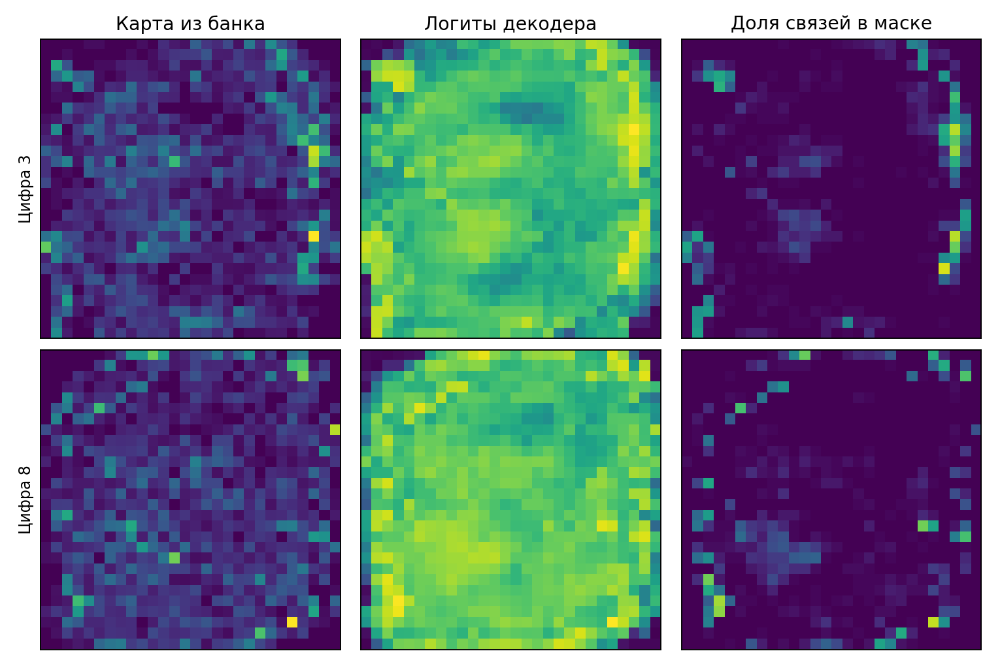
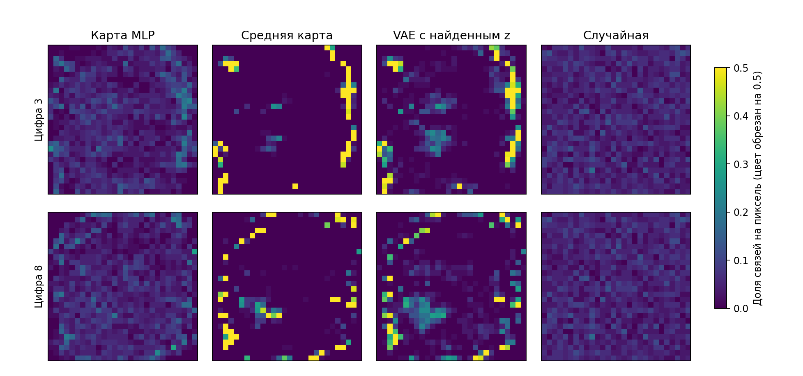

# MNIST8m: VAE и agreement на масках 5%

Те же задачи 3 и 8 против остальных и та же разметка MNIST8m. В исходном банке для каждой цифры обучены 4096 MLP с 20% случайных связей. Выбраны лучшие 10% по BCE на валидации; из их importance maps оставлены top-5% сильнейших связей (2509 из 50176). На этих картах заново обучены два VAE с ранней остановкой. При поиске VAE заморожены; оптимизируются z и MLP по BCE своей либо обеих задач и λ·MSE выровненных логитов декодеров. Маски получены по top-K и проверены после нового обучения MLP на отдельном тестовом блоке.

| Маска | Сбалансированная точность ↑ | BCE ↓ |
|---|---:|---:|
| Средняя случайная маска | 0.9451 | 0.1656 |
| Лучшая из 16 случайных | 0.9470 | 0.1733 |
| Карта лучшего MLP | 0.9553 | 0.1383 |
| Средняя карта банка | 0.8587 | 0.3859 |
| VAE, z=0 | 0.9231 | 0.2387 |
| Каждый VAE, BCE своей задачи | 0.9382 | 0.2075 |
| Общая маска, своя BCE, λ=0 | 0.9342 | 0.2030 |
| Общая маска, своя BCE, λ=1 | 0.9324 | 0.2265 |
| Общая маска, своя BCE, λ=10 | 0.9276 | 0.2275 |
| Общая маска, обе BCE, λ=0 | 0.9268 | 0.2283 |
| Общая маска, обе BCE, λ=1 | 0.9351 | 0.2007 |
| Общая маска, обе BCE, λ=10 | 0.9356 | 0.2054 |
| Плотный слой | 0.9653 | 0.1148 |

Средние по двум задачам и 4 новым обучениям MLP; лучший случайный вариант выбран по валидации. Оценка дошла до лимита 15000 шагов, но только 0.7% моделей нашли лучший валидационный чекпоинт в последние 10% шагов.

Карты на рисунке усреднены по 64 скрытым нейронам для каждого пикселя; полные матрицы 784×64 сохранены в `evaluation.pt`.

| Цифра | Пикселей со связью: карта MLP | Средняя карта | VAE с найденным z | Случайная |
|---:|---:|---:|---:|---:|
| 3 | 666 | 83 | 275 | 753 |
| 8 | 676 | 124 | 310 | 753 |

| Цифра | IoU VAE на отложенных картах | IoU средней карты | BCE VAE | BCE средней карты | Эпох VAE |
|---:|---:|---:|---:|---:|---:|
| 3 | 0.080 | 0.081 | 0.0780 | 0.0771 | 116 |
| 8 | 0.067 | 0.067 | 0.0748 | 0.0729 | 124 |

Случайный IoU при той же плотности — 0.026.

| BCE каждого z | λ | MSE логитов ↓ | Корреляция логитов ↑ | IoU масок VAE ↑ | Шагов | Остановка |
|---|---:|---:|---:|---:|---:|---|
| Своя BCE | 0 | 0.03399 | 0.514 | 0.042 | 24000 | лимит |
| Своя BCE | 1 | 0.02658 | 0.514 | 0.040 | 19750 | по плато |
| Своя BCE | 10 | 0.02384 | 0.530 | 0.042 | 20250 | по плато |
| Обе BCE | 0 | 0.03792 | 0.513 | 0.038 | 19500 | по плато |
| Обе BCE | 1 | 0.02864 | 0.513 | 0.040 | 16250 | по плато |
| Обе BCE | 10 | 0.02362 | 0.530 | 0.040 | 14500 | по плато |

**Вывод.** Прямые top-5% маски сохранили преимущество над случайными (0.9553 против 0.9451), но найденные через VAE маски дали 0.9382 и ни один вариант agreement не превзошёл случайную маску. VAE воспроизводит отложенные карты примерно на уровне средней карты банка и сильно сужает покрытие входных пикселей. Последующая проверка показала, что ограничение числа связей на пиксель при неизменных VAE и z заметно повышает качество. Это указывает на глобальный top-K как на существенную часть проблемы. [Таблицы и графики проверки покрытия](MNIST8M_COVERAGE_DIAGNOSTIC_2026-09-26.md).

[Код эксперимента](../pattern/mnist8m_raw_mlp_bce.py) · [подготовка банка](../pattern/prepare_mnist8m_5pct.py) · [сырые результаты](../pattern/outputs/mnist8m_raw_mlp_bce/pair38_5pct/) · [дальнейшая проверка 16/32 нейронов и 2%](MNIST8M_WIDTH_DENSITY_2026-09-26.md)
