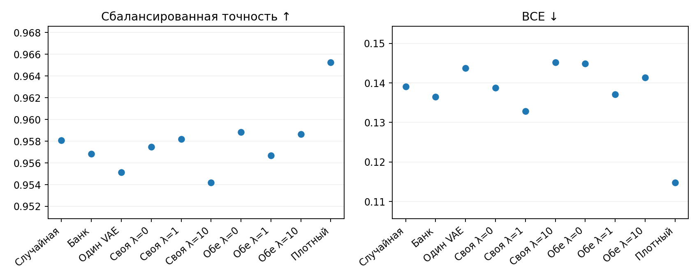
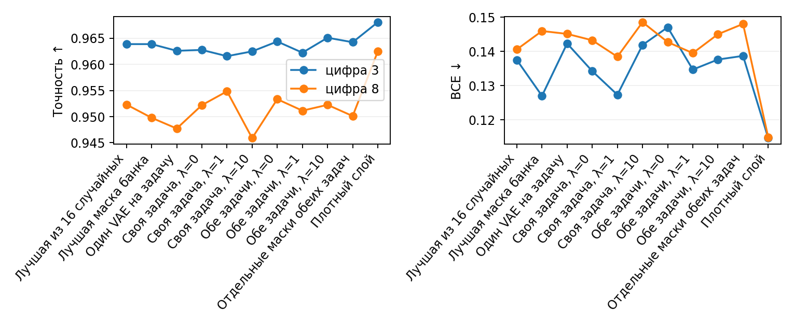
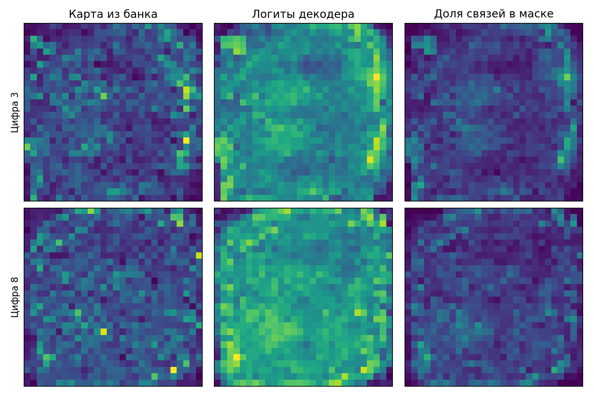

# MNIST8m: простой MLP на пикселях

Пара цифр 3/8, две задачи «цифра против остальных». Каждый MLP получает 784 пикселя напрямую: один скрытый слой из 64 нейронов и бинарная голова. В банке каждой задачи обучены 4096 MLP со случайными масками (10035 из 50176 связей). Ранжирование идёт по BCE на 512 сбалансированных валидационных изображениях для каждой цифры. У лучших 10% сохранены нормированные importance maps |W·M|/max(|W·M|); на картах каждой цифры обучен свой VAE с ранней остановкой.

При поиске оба VAE заморожены. Сравниваются два варианта: каждый z обучается по BCE своей задачи либо каждый z обучается по BCE обеих задач с отдельным MLP для каждой. В обоих вариантах добавляется λ·MSE выровненных логитов декодеров. Маски образуются по top-K. Итоговое качество измерено после 4 новых обучений MLP с фиксированной маской на отдельных тестовых изображениях: по 500 изображений каждой цифры, классы в метриках имеют равный вес.

| Маска | Сбалансированная точность ↑ | BCE ↓ |
|---|---:|---:|
| Лучшая из 16 случайных | 0.9581 | 0.1390 |
| Лучшая маска банка | 0.9568 | 0.1365 |
| Один VAE на задачу | 0.9552 | 0.1437 |
| Своя задача, λ=0 | 0.9575 | 0.1387 |
| Своя задача, λ=1 | 0.9582 | 0.1329 |
| Своя задача, λ=10 | 0.9542 | 0.1452 |
| Обе задачи, λ=0 | 0.9588 | 0.1449 |
| Обе задачи, λ=1 | 0.9567 | 0.1371 |
| Обе задачи, λ=10 | 0.9587 | 0.1413 |
| Отдельные маски обеих задач | 0.9572 | 0.1434 |
| Плотный слой | 0.9653 | 0.1148 |

Карты ниже усреднены по скрытым нейронам для каждого пикселя; полные матрицы 784×64 сохранены в результатах.

| Цифра | BCE всех MLP банка | BCE лучших 10% | Карт для VAE |
|---:|---:|---:|---:|
| 3 | 0.1215 | 0.1041 | 410 |
| 8 | 0.1013 | 0.0854 | 410 |

| BCE для каждого z | λ | MSE логитов между VAE ↓ | IoU масок VAE ↑ | Шагов поиска |
|---|---:|---:|---:|---:|
| Своя задача | 0 | 0.0088 | 0.119 | 10250 |
| Своя задача | 1 | 0.0061 | 0.125 | 7000 |
| Своя задача | 10 | 0.0047 | 0.121 | 10500 |
| Обе задачи | 0 | 0.0067 | 0.121 | 6500 |
| Обе задачи | 1 | 0.0098 | 0.122 | 7000 |
| Обе задачи | 10 | 0.0049 | 0.121 | 6250 |

IoU реконструкции top-K importance maps VAE: 0.123 для цифры 3 и 0.116 для цифры 8; ориентир для независимых случайных масок той же плотности — 0.111.

**Вывод.** При λ=1 обучение каждого z на обеих задачах изменило точность относительно собственной задачи на -0.0015, BCE на +0.0042. Разность точности со случайной маской -0.0014, с плотным слоем -0.0086. Это одна пара цифр и один банк; результат нельзя переносить на все цифры без повторов.

**Контроль масок банка.** После одинакового нового обучения MLP лучшие 10% масок дали среднюю разницу точности со случайными +0.00006. Подробности и график — в [парном сравнении](MNIST8M_MASK_CONTROL_2026-09-26.md).

**Проверка меньшей плотности.** Отбор сильнейших связей из importance maps дал преимущество над случайными масками при 5% и 2%; таблицы и график — в [сравнении плотностей](MNIST8M_SPARSITY_CONTROL_2026-09-26.md).

**Повтор VAE на 5% без выравнивания карт.** Прямая маска из карты лучшего MLP дала 0.9553, случайная 0.9451, а лучший вариант с VAE и agreement остался ниже случайной. Таблицы, графики и карты — в [отчёте по 5%](MNIST8M_RAW_MLP_5PCT_2026-09-26.md).

**Ширина MLP и плотность маски.** Проверены 64, 32 и 16 скрытых нейронов при 5% и 2% связей. Таблицы, графики и карты покрытия — в [сравнении ширины и плотности](MNIST8M_WIDTH_DENSITY_2026-09-26.md).

**Выравнивание столбцов карт.** Карты приведены к одной опорной карте до обучения VAE; восстановление и качество масок приведены в [отдельном сравнении](MNIST8M_COLUMN_ALIGNMENT_2026-09-26.md).

[Код эксперимента](../pattern/mnist8m_raw_mlp_bce.py) · [сырые результаты](../pattern/outputs/mnist8m_raw_mlp_bce/pair38/)
