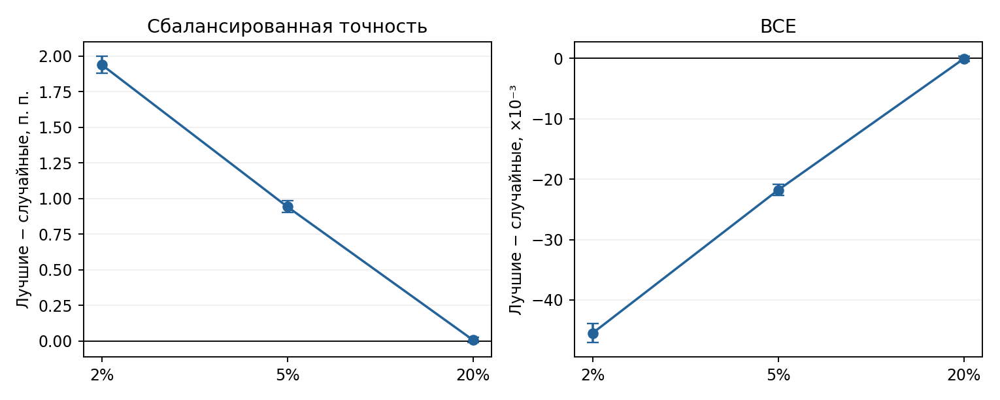

# MNIST8m: проверка плотности масок

Та же бинарная классификация цифр 3 и 8. Для плотности 2% и 5% из карт лучших MLP банка оставлены top-K связей по |W·M|. При 20% используется исходная маска MLP; она точно совпадает с top-K её карты важности. На каждой плотности сравнили 410 отобранных и 410 случайных масок на задачу: четыре новых обучения MLP с одинаковыми начальными весами и пакетами внутри каждой пары. Оценка — на отдельном тестовом блоке.

| Плотность | Связей | Top-K: точность | Случайная: точность | Разница, п. п. [95% ДИ] |
|---:|---:|---:|---:|---:|
| 2% | 1004 | 0.9461 | 0.9267 | +1.938 [+1.878; +2.000] |
| 5% | 2509 | 0.9540 | 0.9446 | +0.941 [+0.901; +0.984] |
| 20% | 10035 | 0.9568 | 0.9567 | +0.006 [-0.012; +0.025] |

| Плотность | Top-K: BCE | Случайная: BCE | Разница BCE, ×10⁻³ [95% ДИ] |
|---:|---:|---:|---:|
| 2% | 0.15863 | 0.20410 | -45.472 [-47.063; -43.911] |
| 5% | 0.13992 | 0.16170 | -21.782 [-22.699; -20.883] |
| 20% | 0.13169 | 0.13175 | -0.064 [-0.518; +0.374] |

Средние значения даны по двум задачам. Интервалы — парный бутстрэп по маскам при фиксированных изображениях; они не показывают разброс между другими задачами.

| Плотность | Разница точности: цифра 3, п. п. | Разница точности: цифра 8, п. п. | Шаги для 3/8 | Поздний лучший чекпоинт, 3/8 |
|---:|---:|---:|---:|---:|
| 2% | +1.318 | +2.558 | 15400/20000 | 0.0%/0.2% |
| 5% | +0.575 | +1.308 | 6300/10900 | —/0.0% |
| 20% | +0.009 | +0.004 | 4800/6700 | —/— |

**Вывод.** При 20% маски лучших MLP не превосходили случайные. После отбора сильнейших связей преимущество появилось на обеих задачах: в среднем +0.94 п. п. при 5% и +1.94 п. п. при 2%. Дополнительные шаги обучения не устранили разницу. Для следующей проверки VAE разумно взять 5%: это 2509 связей и более высокая абсолютная точность, чем при 2%.

[Код проверки](../pattern/mnist8m_bank_mask_control.py) · [основные результаты](../pattern/outputs/mnist8m_raw_mlp_bce/mask_control/) · [продлённые прогоны](../pattern/outputs/mnist8m_raw_mlp_bce/mask_control_extended/)
