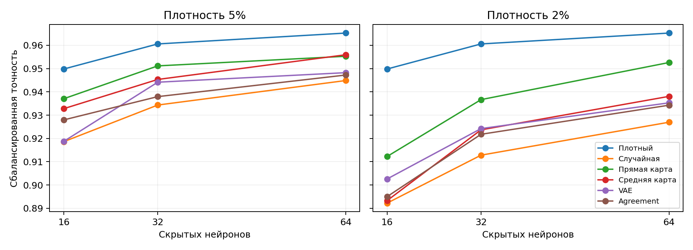
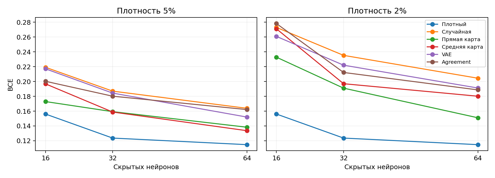
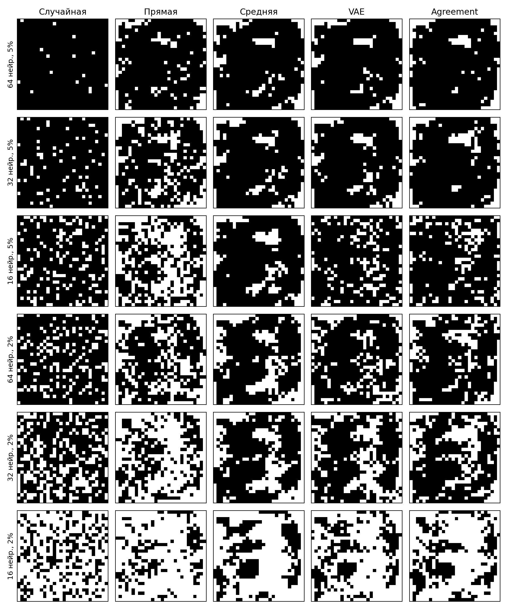

# MNIST8m: ширина MLP и плотность масок

Две задачи «цифра против остальных» для 3 и 8. MLP получает 784 сырых пикселя, имеет один скрытый слой и один выход. На каждой ширине заново обучены 4096 MLP со случайными масками 20% на задачу; лучшие 10% выбраны по validation BCE. Из их importance maps взяты 5% и 2% связей. Для каждой ширины и плотности заново обучены два VAE и найдено agreement. Маски проверены на новых MLP; плотный, случайный и прямой варианты служат контролем. Столбцы importance maps перед обучением VAE здесь не выравнивались.

| Ширина | Плотность | Связей | Лимит/пиксель | Плотный | Случайная | Прямая | Средняя | VAE | Agreement |
|---:|---:|---:|---:|---:|---:|---:|---:|---:|---:|
| 64 | 5% | 2509 | 4 | 0.9653 | 0.9449 | 0.9553 | 0.9559 | 0.9483 | 0.9472 |
| 32 | 5% | 1254 | 2 | 0.9606 | 0.9343 | 0.9512 | 0.9453 | 0.9442 | 0.9380 |
| 16 | 5% | 627 | 1 | 0.9498 | 0.9186 | 0.9371 | 0.9328 | 0.9187 | 0.9280 |
| 64 | 2% | 1004 | 2 | 0.9653 | 0.9270 | 0.9526 | 0.9381 | 0.9353 | 0.9343 |
| 32 | 2% | 502 | 1 | 0.9606 | 0.9128 | 0.9367 | 0.9237 | 0.9242 | 0.9218 |
| 16 | 2% | 251 | 1 | 0.9498 | 0.8922 | 0.9122 | 0.8933 | 0.9026 | 0.8950 |

Сбалансированная точность на отдельном тестовом блоке; среднее по двум задачам и четырём повторным обучениям. Для случайной, средней, VAE и agreement применяется предел числа связей на пиксель. Прямая маска получена из карты лучшего MLP банка. В каждой маске одинаковое число связей. Плотные MLP имеют 50305, 25153 и 12577 параметров при ширинах 64, 32 и 16 соответственно. Масочные MLP сейчас вычисляются как плотные тензоры: число активных связей не является измерением ускорения или памяти.

| Ширина | Плотность | Плотный MLP | Активно с маской | Сокращение активных коэффициентов |
|---:|---:|---:|---:|---:|
| 64 | 5% | 50305 | 2638 | 19.1× |
| 32 | 5% | 25153 | 1319 | 19.1× |
| 16 | 5% | 12577 | 660 | 19.1× |
| 64 | 2% | 50305 | 1133 | 44.4× |
| 32 | 2% | 25153 | 567 | 44.4× |
| 16 | 2% | 12577 | 284 | 44.3× |

Счёт включает веса обоих слоёв и смещения. Маска фиксирована и не считается обучаемым параметром. В текущей реализации PyTorch хранит плотный тензор весов и состояния оптимизатора: число выделенных параметров такое же, как у плотного MLP. Для экономии памяти и ускорения нужна разреженная реализация.

| Ширина | Плотность | Agreement − случайная, п. п. | Agreement − средняя, п. п. | Agreement − плотный, п. п. |
|---:|---:|---:|---:|---:|
| 64 | 5% | +0.24 | -0.87 | -1.80 |
| 32 | 5% | +0.36 | -0.74 | -2.26 |
| 16 | 5% | +0.93 | -0.48 | -2.19 |
| 64 | 2% | +0.73 | -0.38 | -3.10 |
| 32 | 2% | +0.90 | -0.19 | -3.88 |
| 16 | 2% | +0.28 | +0.17 | -5.48 |

| Ширина | Плотность | VAE: top-K | VAE: лимит | Agreement: top-K | Agreement: лимит |
|---:|---:|---:|---:|---:|---:|
| 64 | 5% | 0.9382 | 0.9483 | 0.9351 | 0.9472 |
| 32 | 5% | 0.9229 | 0.9442 | 0.9111 | 0.9380 |
| 16 | 5% | 0.9160 | 0.9187 | 0.9104 | 0.9280 |
| 64 | 2% | 0.8776 | 0.9353 | 0.8998 | 0.9343 |
| 32 | 2% | 0.8555 | 0.9242 | 0.8738 | 0.9218 |
| 16 | 2% | 0.8007 | 0.9026 | 0.8325 | 0.8950 |

| Ширина | Плотность | Цифра | Плотный | Случайная | Прямая | Средняя | VAE | Agreement |
|---:|---:|---:|---:|---:|---:|---:|---:|---:|
| 64 | 5% | 3 | 0.9681 | 0.9532 | 0.9607 | 0.9592 | 0.9530 | 0.9539 |
| 64 | 5% | 8 | 0.9625 | 0.9366 | 0.9499 | 0.9527 | 0.9435 | 0.9406 |
| 32 | 5% | 3 | 0.9678 | 0.9473 | 0.9563 | 0.9513 | 0.9510 | 0.9504 |
| 32 | 5% | 8 | 0.9534 | 0.9213 | 0.9461 | 0.9394 | 0.9373 | 0.9255 |
| 16 | 5% | 3 | 0.9594 | 0.9358 | 0.9429 | 0.9466 | 0.9400 | 0.9397 |
| 16 | 5% | 8 | 0.9402 | 0.9015 | 0.9312 | 0.9190 | 0.8975 | 0.9162 |
| 64 | 2% | 3 | 0.9681 | 0.9396 | 0.9574 | 0.9514 | 0.9442 | 0.9468 |
| 64 | 2% | 8 | 0.9625 | 0.9144 | 0.9478 | 0.9247 | 0.9264 | 0.9218 |
| 32 | 2% | 3 | 0.9678 | 0.9291 | 0.9433 | 0.9360 | 0.9315 | 0.9374 |
| 32 | 2% | 8 | 0.9534 | 0.8965 | 0.9301 | 0.9114 | 0.9169 | 0.9062 |
| 16 | 2% | 3 | 0.9594 | 0.9144 | 0.9276 | 0.9169 | 0.9194 | 0.9205 |
| 16 | 2% | 8 | 0.9402 | 0.8700 | 0.8969 | 0.8696 | 0.8858 | 0.8695 |

| Ширина | Плотность | Плотный | Случайная | Прямая | Средняя | VAE | Agreement |
|---:|---:|---:|---:|---:|---:|---:|---:|
| 64 | 5% | 0.1148 | 0.1638 | 0.1383 | 0.1336 | 0.1520 | 0.1621 |
| 32 | 5% | 0.1236 | 0.1870 | 0.1593 | 0.1588 | 0.1844 | 0.1802 |
| 16 | 5% | 0.1561 | 0.2192 | 0.1729 | 0.1968 | 0.2171 | 0.2003 |
| 64 | 2% | 0.1148 | 0.2044 | 0.1510 | 0.1801 | 0.1912 | 0.1887 |
| 32 | 2% | 0.1236 | 0.2353 | 0.1910 | 0.1970 | 0.2220 | 0.2122 |
| 16 | 2% | 0.1561 | 0.2730 | 0.2328 | 0.2711 | 0.2609 | 0.2782 |

| Ширина | Плотность | Покрыто пикселей: случайная | Прямая | Средняя | VAE | Agreement |
|---:|---:|---:|---:|---:|---:|---:|
| 64 | 5% | 769 | 671 | 654 | 670 | 668 |
| 32 | 5% | 715 | 548 | 640 | 655 | 646 |
| 16 | 5% | 627 | 390 | 627 | 627 | 627 |
| 64 | 2% | 628 | 462 | 520 | 570 | 559 |
| 32 | 2% | 502 | 306 | 502 | 502 | 502 |
| 16 | 2% | 251 | 182 | 251 | 251 | 251 |

Покрытие пикселей для задачи 3; чёрный пиксель имеет хотя бы одну связь с первым скрытым слоем.

| Ширина | Плотность | IoU реконструкции VAE | IoU средней карты | Случайный IoU |
|---:|---:|---:|---:|---:|
| 64 | 5% | 0.074 | 0.074 | 0.026 |
| 32 | 5% | 0.078 | 0.078 | 0.026 |
| 16 | 5% | 0.066 | 0.082 | 0.026 |
| 64 | 2% | 0.050 | 0.051 | 0.010 |
| 32 | 2% | 0.056 | 0.058 | 0.010 |
| 16 | 2% | 0.065 | 0.067 | 0.010 |

IoU рассчитан на картах, отложенных при обучении VAE.

| Ширина | Плотность | Шагов поиска z | Лучший шаг z | Остановка z | Шагов нового обучения | Поздний лучший чекпоинт MLP |
|---:|---:|---:|---:|---|---:|---:|
| 64 | 5% | 16250 | 13250 | плато | 15000 | 0.4% |
| 32 | 5% | 24000 | 18000 | плато | 15000 | 2.0% |
| 16 | 5% | 11750 | 7250 | плато | 15000 | 2.5% |
| 64 | 2% | 24000 | 20250 | лимит | 30000 | 2.3% |
| 32 | 2% | 24000 | 20500 | лимит | 30000 | 5.7% |
| 16 | 2% | 24000 | 12250 | лимит | 60000 | 9.8% |

**Вывод.** Уменьшение ширины и плотности увеличило разницу между прямыми и случайными масками: структура связей стала важнее. Agreement тоже иногда превосходит случайную маску, максимум на 0.93 п. п. при 16 нейронах и 5%. При этом он во всех проверенных вариантах уступает прямой карте банка и плотному MLP. IoU реконструкции VAE остаётся близким к IoU простой средней карты. Сокращение MLP показало ценность структуры маски, но не устранило потерю информации при обучении VAE.

[Проверка выравнивания столбцов](MNIST8M_COLUMN_ALIGNMENT_2026-09-26.md) · [Код](../pattern/mnist8m_raw_mlp_bce.py) · [запуск](../pattern/run_mnist8m_width_sweep.py) · [сырые результаты](../pattern/outputs/mnist8m_raw_mlp_bce/)
