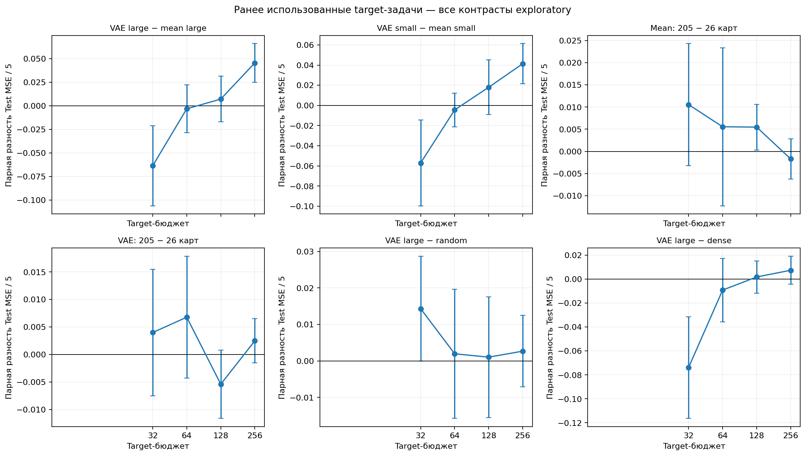
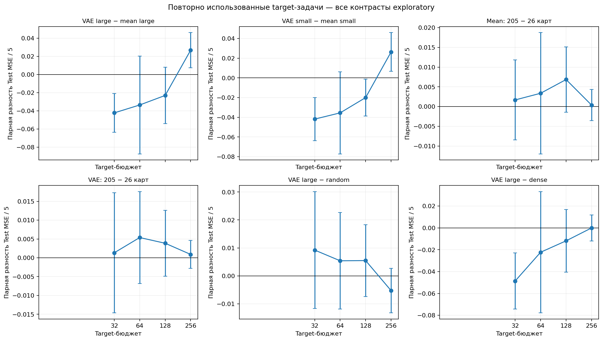
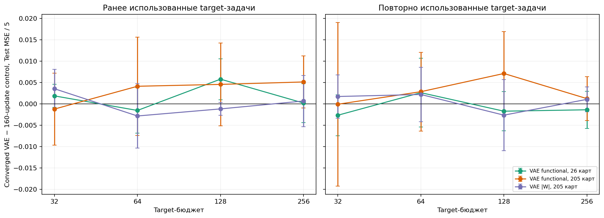
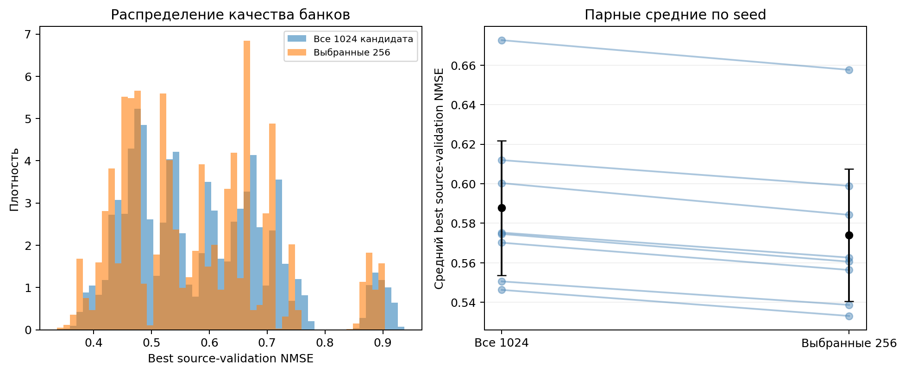
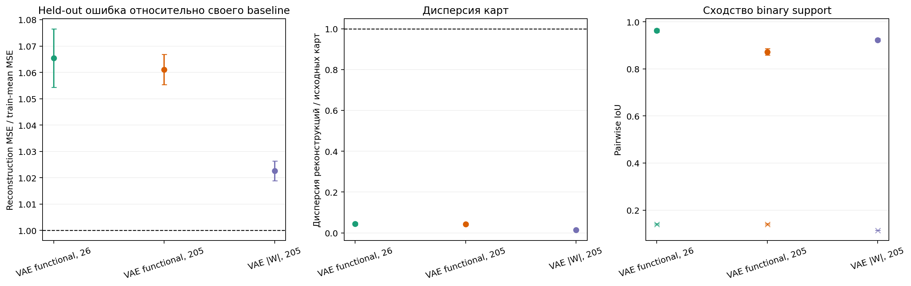
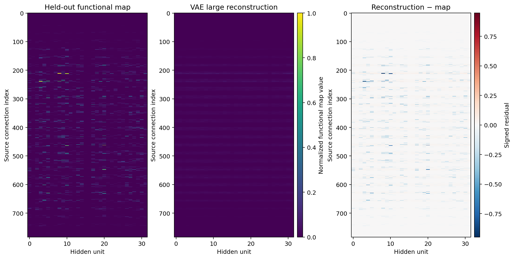
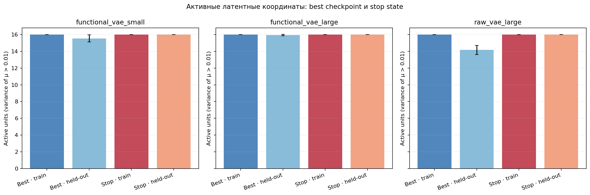
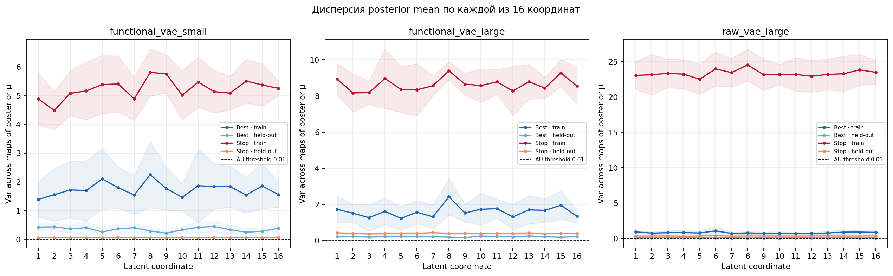
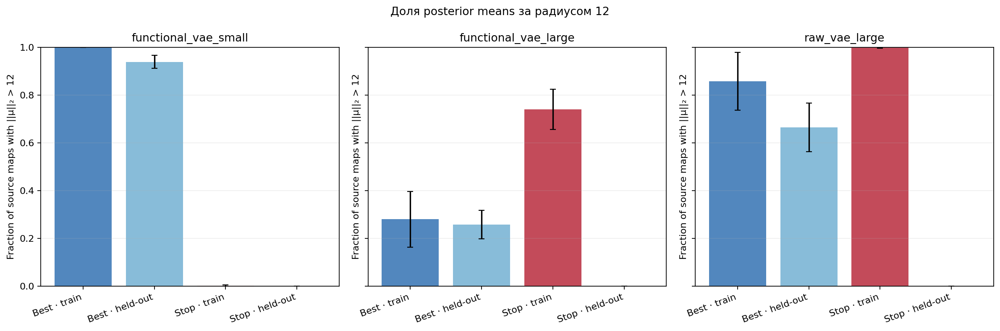
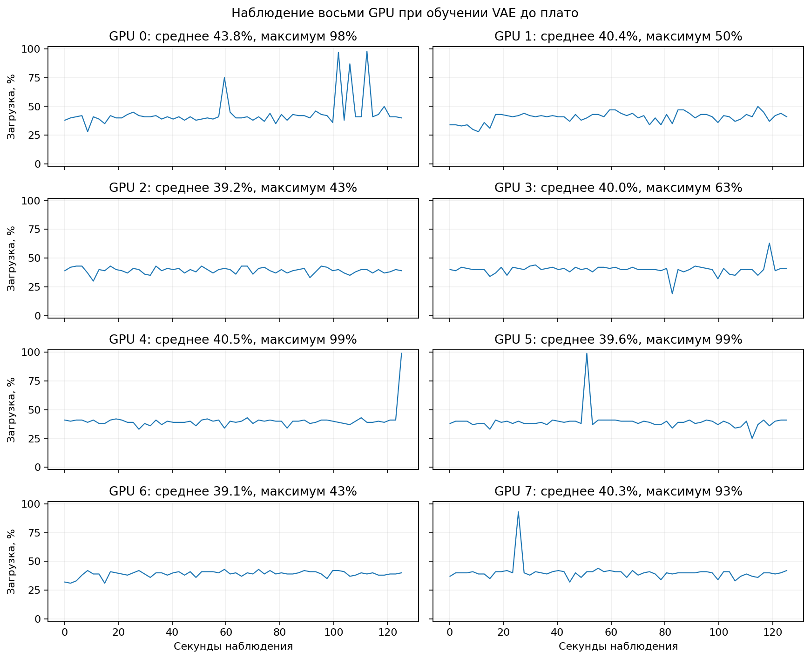

# Повтор функциональных VAE с проверкой сходимости

Отчёт выпускается только после успешного plateau-статуса всех 96 VAE fits: восемь seeds × три семейства × четыре source-задачи. Для всех четырёх source-задач используется тот же зафиксированный банк из 1024 кандидатов с выбором 256 и те же source-only raw/functional карты и splits, что в 160-update контроле.

Small functional VAE обучается на вложенных 26 функциональных source-картах, large functional VAE — на 205, raw VAE — на 205 raw-картах; для каждого семейства оставлены те же 51 held-out source-карт. Эти числа описывают обучение VAE. На target-задаче веса целевой сети обучаются по отдельным бюджетам разметки 32/64/128/256; это разные данные и единицы счёта. Source-bank маски используют K=5018 связей (20%), а извлечение/перенос — K=7526 (30%).

## Критерий остановки

Для каждой VAE фиксируется stochastic train ELBO на каждом optimizer update, а deterministic objective для posterior mean на train и validation — каждые 10 updates. После минимум 1000 updates сравниваются средние соседних окон длиной 200 updates, а также абсолютный линейный дрейф за те же два окна. Все шесть относительных изменений/дрейфов (три objective × среднее и тренд) должны быть ≤0.001. Значимое улучшение validation — новый минимум более чем на 0.0001 относительно предыдущего минимума; после последнего такого улучшения должно пройти 400 updates. Условие должно выполниться на трёх последовательных проверках через 10 updates. Жёсткий предел — 20 000 updates; достижение cap само по себе не считается сходимостью. Target-метки не участвуют в этом критерии или извлечении масок.

У всех 96 fits записан явный успешный статус и пройдены критерии plateau; stop-step не трактуется как успех без проверки метрик. Для извлечения масок используется checkpoint `best_step` с минимальной validation ELBO; `stop_step` — момент, когда подтверждено численное плато. Сходимость здесь означает плато выбранных objective на фиксированных картах и не является гарантией глобального минимума.

## Интерпретация target-результатов

Этот повтор не вводит новое подтверждающее сравнение. Свежие cost-задачи уже были просмотрены в предыдущем 160-update отчёте, поэтому все оценки и контрасты ниже помечены как exploratory. Сопоставление с 160-update контролем использует те же task vectors, data splits, source-карты и seed-offsets target-тестов; это парная оценка изменения после более долгого обучения VAE, а не независимая репликация.

**Fresh target задачи, бюджет 256 (exploratory).** Функциональное среднее на 205 картах: 0.706632 [0.695629, 0.717635] MSE/5; converged functional VAE large: 0.733434 [0.718509, 0.748358]. Разность VAE − mean составляет +0.026802 [+0.007389, +0.046214] MSE/5; статус сравнения — exploratory.

**Изменение относительно 160-update контроля.** На тех же fresh target задачах и бюджете 256 разность converged VAE large − 160-update VAE large равна +0.001208 [-0.003912, +0.006328] MSE/5. Это парное сопоставление условий повтора, а не новое независимое подтверждение.

**Held-out source карты.** Для functional VAE large отношение reconstruction MSE к собственному train-mean baseline равно 1.0611 [1.0553, 1.0668]; реконструкция сохраняет 4.25% held-out map variance. Источник-диагностика оценивает reconstruction, а не transfer quality.

Все усреднения выполняются сначала по восьми target-задачам и четырём инициализациям в пределах seed, затем по восьми seeds. Интервалы — точечные t-интервалы 95% по восьми seed (df=7), условные на фиксированных target-задачах; поправки за множественные сравнения не применялись.

## Восстановление source-карт

Held-out source reconstruction оценивается относительно собственного train-mean baseline каждого семейства. Абсолютные MSE raw- и functional-карт имеют разные масштабы, поэтому сравниваются относительные показатели, а не их абсолютные MSE. IoU реконструированных бинарных поддержек близкий к 1 означает меньшую вариативность реконструкций и сам по себе не означает лучшую точность.

## Результаты target-переноса

**Как читать.** По горизонтали указан бюджет целевых меток 32/64/128/256; по вертикали — test MSE/5. Новые наборы target-меток и пять наборов на test относятся к target-задачам; 26 и 205 карт — это количество source-карт для VAE и они не входят в эти бюджеты. Точка усредняет задачи и четыре инициализации внутри seed, а 95% t-интервал строится по восьми seed (df=7). Все сравнения этого повтора исследовательские: восемь свежих cost-задач уже были просмотрены в 160-update отчёте.

## Исследовательские target-сравнения

### Ранее использованные target-задачи

**Как читать.** Показана парная разность первого метода и baseline на тех же seed, задачах, бюджетах и инициализациях; отрицательное значение благоприятно первому методу. Интервалы получены по средним различий внутри восьми seed (df=7), точечные, без коррекции за множественные сравнения. Ни одно сравнение в converged-повторе не объявляется подтверждающим.

### Повторно использованные target-задачи

**Как читать.** Показана парная разность первого метода и baseline на тех же seed, задачах, бюджетах и инициализациях; отрицательное значение благоприятно первому методу. Интервалы получены по средним различий внутри восьми seed (df=7), точечные, без коррекции за множественные сравнения. Ни одно сравнение в converged-повторе не объявляется подтверждающим.

## Сопоставление с 160-update VAE

**Как читать.** На графике — разность Test MSE/5: converged-run минус 160-update контроль для трёх VAE-методов на одинаковых source-картах и splits, target cost-векторах, данных и seed-offsets тестовых выборок. Каждая точка усредняет те же восемь target-задач и четыре инициализации внутри seed; интервалы парные по восьми seed (df=7). Это сопоставление одного повторного анализа, а не новое подтверждение: target-задачи уже просматривались ранее. Отрицательные значения означают меньшую ошибку после обучения VAE до численного плато.

## Диагностика остановки по плато

**Как читать.** Каждая точка слева — одна source-задача одного семейства VAE (всего 96 fits); справа показано распределение optimizer updates до трёх последовательных проходов условия плато. Пунктир — hard cap 20 000 updates; статус `converged` подтверждается выполнением plateau-критериев на stop-step (в том числе при stop-step, равном cap), а сам cap без этих критериев не считается сходимостью. Checkpoint выбирается по минимальному validation objective (`best_step`), а `stop_step` показывает момент подтверждения плато. Числа не являются метрикой target-качества.

## Все кривые обучения: 96 source-only VAE fits

Для каждой комбинации seed × семейство × source-task сохранена отдельная PNG- и PDF-фигура. Каждый рисунок показывает полный ход трёх контролируемых objective и последние updates крупно; вертикальные линии отмечают checkpoint с лучшим validation objective и остановку по плато.

**Нормировка.** Обучаемая функция — полносессионная stochastic ELBO: сумма BCE-with-logits и 0.1×KL, усреднённая по картам. На графиках показан этот objective, делённый на F=25,088 входных координат на карту. Это только нормировка оси для сопоставимости, она не изменяет обучение или критерий остановки. Для validation и deterministic train показана ELBO при posterior mean; для stochastic train — фактически вычисленная loss каждого update.

### VAE functional, 26 карт

| Seed | Source task | Updates до плато | Лучший validation update | Графики |
|---:|---:|---:|---:|---|
| 4100 | 0 | 3210 | 180 | [PNG](loss_curves/seed_4100_functional_vae_small_task_0.png) · [PDF](loss_curves/seed_4100_functional_vae_small_task_0.pdf) |
| 4100 | 1 | 2860 | 230 | [PNG](loss_curves/seed_4100_functional_vae_small_task_1.png) · [PDF](loss_curves/seed_4100_functional_vae_small_task_1.pdf) |
| 4100 | 2 | 2750 | 220 | [PNG](loss_curves/seed_4100_functional_vae_small_task_2.png) · [PDF](loss_curves/seed_4100_functional_vae_small_task_2.pdf) |
| 4100 | 3 | 2810 | 280 | [PNG](loss_curves/seed_4100_functional_vae_small_task_3.png) · [PDF](loss_curves/seed_4100_functional_vae_small_task_3.pdf) |
| 4101 | 0 | 8020 | 230 | [PNG](loss_curves/seed_4101_functional_vae_small_task_0.png) · [PDF](loss_curves/seed_4101_functional_vae_small_task_0.pdf) |
| 4101 | 1 | 3520 | 190 | [PNG](loss_curves/seed_4101_functional_vae_small_task_1.png) · [PDF](loss_curves/seed_4101_functional_vae_small_task_1.pdf) |
| 4101 | 2 | 4350 | 200 | [PNG](loss_curves/seed_4101_functional_vae_small_task_2.png) · [PDF](loss_curves/seed_4101_functional_vae_small_task_2.pdf) |
| 4101 | 3 | 2840 | 200 | [PNG](loss_curves/seed_4101_functional_vae_small_task_3.png) · [PDF](loss_curves/seed_4101_functional_vae_small_task_3.pdf) |
| 4102 | 0 | 3920 | 250 | [PNG](loss_curves/seed_4102_functional_vae_small_task_0.png) · [PDF](loss_curves/seed_4102_functional_vae_small_task_0.pdf) |
| 4102 | 1 | 2710 | 190 | [PNG](loss_curves/seed_4102_functional_vae_small_task_1.png) · [PDF](loss_curves/seed_4102_functional_vae_small_task_1.pdf) |
| 4102 | 2 | 3350 | 200 | [PNG](loss_curves/seed_4102_functional_vae_small_task_2.png) · [PDF](loss_curves/seed_4102_functional_vae_small_task_2.pdf) |
| 4102 | 3 | 3300 | 180 | [PNG](loss_curves/seed_4102_functional_vae_small_task_3.png) · [PDF](loss_curves/seed_4102_functional_vae_small_task_3.pdf) |
| 4103 | 0 | 2930 | 180 | [PNG](loss_curves/seed_4103_functional_vae_small_task_0.png) · [PDF](loss_curves/seed_4103_functional_vae_small_task_0.pdf) |
| 4103 | 1 | 3010 | 210 | [PNG](loss_curves/seed_4103_functional_vae_small_task_1.png) · [PDF](loss_curves/seed_4103_functional_vae_small_task_1.pdf) |
| 4103 | 2 | 2970 | 160 | [PNG](loss_curves/seed_4103_functional_vae_small_task_2.png) · [PDF](loss_curves/seed_4103_functional_vae_small_task_2.pdf) |
| 4103 | 3 | 2990 | 240 | [PNG](loss_curves/seed_4103_functional_vae_small_task_3.png) · [PDF](loss_curves/seed_4103_functional_vae_small_task_3.pdf) |
| 4104 | 0 | 3210 | 240 | [PNG](loss_curves/seed_4104_functional_vae_small_task_0.png) · [PDF](loss_curves/seed_4104_functional_vae_small_task_0.pdf) |
| 4104 | 1 | 3400 | 230 | [PNG](loss_curves/seed_4104_functional_vae_small_task_1.png) · [PDF](loss_curves/seed_4104_functional_vae_small_task_1.pdf) |
| 4104 | 2 | 2990 | 200 | [PNG](loss_curves/seed_4104_functional_vae_small_task_2.png) · [PDF](loss_curves/seed_4104_functional_vae_small_task_2.pdf) |
| 4104 | 3 | 2640 | 270 | [PNG](loss_curves/seed_4104_functional_vae_small_task_3.png) · [PDF](loss_curves/seed_4104_functional_vae_small_task_3.pdf) |
| 4105 | 0 | 2900 | 220 | [PNG](loss_curves/seed_4105_functional_vae_small_task_0.png) · [PDF](loss_curves/seed_4105_functional_vae_small_task_0.pdf) |
| 4105 | 1 | 2500 | 250 | [PNG](loss_curves/seed_4105_functional_vae_small_task_1.png) · [PDF](loss_curves/seed_4105_functional_vae_small_task_1.pdf) |
| 4105 | 2 | 2870 | 200 | [PNG](loss_curves/seed_4105_functional_vae_small_task_2.png) · [PDF](loss_curves/seed_4105_functional_vae_small_task_2.pdf) |
| 4105 | 3 | 2710 | 190 | [PNG](loss_curves/seed_4105_functional_vae_small_task_3.png) · [PDF](loss_curves/seed_4105_functional_vae_small_task_3.pdf) |
| 4106 | 0 | 2970 | 250 | [PNG](loss_curves/seed_4106_functional_vae_small_task_0.png) · [PDF](loss_curves/seed_4106_functional_vae_small_task_0.pdf) |
| 4106 | 1 | 7030 | 200 | [PNG](loss_curves/seed_4106_functional_vae_small_task_1.png) · [PDF](loss_curves/seed_4106_functional_vae_small_task_1.pdf) |
| 4106 | 2 | 3270 | 200 | [PNG](loss_curves/seed_4106_functional_vae_small_task_2.png) · [PDF](loss_curves/seed_4106_functional_vae_small_task_2.pdf) |
| 4106 | 3 | 3210 | 220 | [PNG](loss_curves/seed_4106_functional_vae_small_task_3.png) · [PDF](loss_curves/seed_4106_functional_vae_small_task_3.pdf) |
| 4107 | 0 | 4350 | 280 | [PNG](loss_curves/seed_4107_functional_vae_small_task_0.png) · [PDF](loss_curves/seed_4107_functional_vae_small_task_0.pdf) |
| 4107 | 1 | 3070 | 220 | [PNG](loss_curves/seed_4107_functional_vae_small_task_1.png) · [PDF](loss_curves/seed_4107_functional_vae_small_task_1.pdf) |
| 4107 | 2 | 2850 | 190 | [PNG](loss_curves/seed_4107_functional_vae_small_task_2.png) · [PDF](loss_curves/seed_4107_functional_vae_small_task_2.pdf) |
| 4107 | 3 | 2950 | 260 | [PNG](loss_curves/seed_4107_functional_vae_small_task_3.png) · [PDF](loss_curves/seed_4107_functional_vae_small_task_3.pdf) |

**Подпись.** Строка каждой таблицы однозначно задаёт одну задачу и seed, а ссылки ведут к её полным кривым и позднему увеличению. ELBO/F ниже означает меньшую функцию потерь; plateau проверялся одновременно по stochastic train, deterministic train и validation: изменения средних двух соседних 200-update окон и модуль нормированного линейного тренда должны быть не выше 0.001. Значимое улучшение — новый validation minimum более чем на 0.0001 относительно предыдущего minimum; затем должно пройти 400 updates без такого улучшения. Требуется три подряд eligible проверки с интервалом 10 updates.

### VAE functional, 205 карт

| Seed | Source task | Updates до плато | Лучший validation update | Графики |
|---:|---:|---:|---:|---|
| 4100 | 0 | 9300 | 780 | [PNG](loss_curves/seed_4100_functional_vae_large_task_0.png) · [PDF](loss_curves/seed_4100_functional_vae_large_task_0.pdf) |
| 4100 | 1 | 10630 | 840 | [PNG](loss_curves/seed_4100_functional_vae_large_task_1.png) · [PDF](loss_curves/seed_4100_functional_vae_large_task_1.pdf) |
| 4100 | 2 | 9670 | 880 | [PNG](loss_curves/seed_4100_functional_vae_large_task_2.png) · [PDF](loss_curves/seed_4100_functional_vae_large_task_2.pdf) |
| 4100 | 3 | 9750 | 1100 | [PNG](loss_curves/seed_4100_functional_vae_large_task_3.png) · [PDF](loss_curves/seed_4100_functional_vae_large_task_3.pdf) |
| 4101 | 0 | 10570 | 1080 | [PNG](loss_curves/seed_4101_functional_vae_large_task_0.png) · [PDF](loss_curves/seed_4101_functional_vae_large_task_0.pdf) |
| 4101 | 1 | 9600 | 750 | [PNG](loss_curves/seed_4101_functional_vae_large_task_1.png) · [PDF](loss_curves/seed_4101_functional_vae_large_task_1.pdf) |
| 4101 | 2 | 8850 | 750 | [PNG](loss_curves/seed_4101_functional_vae_large_task_2.png) · [PDF](loss_curves/seed_4101_functional_vae_large_task_2.pdf) |
| 4101 | 3 | 8760 | 860 | [PNG](loss_curves/seed_4101_functional_vae_large_task_3.png) · [PDF](loss_curves/seed_4101_functional_vae_large_task_3.pdf) |
| 4102 | 0 | 10640 | 1130 | [PNG](loss_curves/seed_4102_functional_vae_large_task_0.png) · [PDF](loss_curves/seed_4102_functional_vae_large_task_0.pdf) |
| 4102 | 1 | 9350 | 810 | [PNG](loss_curves/seed_4102_functional_vae_large_task_1.png) · [PDF](loss_curves/seed_4102_functional_vae_large_task_1.pdf) |
| 4102 | 2 | 8260 | 790 | [PNG](loss_curves/seed_4102_functional_vae_large_task_2.png) · [PDF](loss_curves/seed_4102_functional_vae_large_task_2.pdf) |
| 4102 | 3 | 11040 | 920 | [PNG](loss_curves/seed_4102_functional_vae_large_task_3.png) · [PDF](loss_curves/seed_4102_functional_vae_large_task_3.pdf) |
| 4103 | 0 | 9050 | 680 | [PNG](loss_curves/seed_4103_functional_vae_large_task_0.png) · [PDF](loss_curves/seed_4103_functional_vae_large_task_0.pdf) |
| 4103 | 1 | 9290 | 970 | [PNG](loss_curves/seed_4103_functional_vae_large_task_1.png) · [PDF](loss_curves/seed_4103_functional_vae_large_task_1.pdf) |
| 4103 | 2 | 8870 | 900 | [PNG](loss_curves/seed_4103_functional_vae_large_task_2.png) · [PDF](loss_curves/seed_4103_functional_vae_large_task_2.pdf) |
| 4103 | 3 | 10460 | 800 | [PNG](loss_curves/seed_4103_functional_vae_large_task_3.png) · [PDF](loss_curves/seed_4103_functional_vae_large_task_3.pdf) |
| 4104 | 0 | 10760 | 840 | [PNG](loss_curves/seed_4104_functional_vae_large_task_0.png) · [PDF](loss_curves/seed_4104_functional_vae_large_task_0.pdf) |
| 4104 | 1 | 9170 | 790 | [PNG](loss_curves/seed_4104_functional_vae_large_task_1.png) · [PDF](loss_curves/seed_4104_functional_vae_large_task_1.pdf) |
| 4104 | 2 | 9530 | 940 | [PNG](loss_curves/seed_4104_functional_vae_large_task_2.png) · [PDF](loss_curves/seed_4104_functional_vae_large_task_2.pdf) |
| 4104 | 3 | 9710 | 910 | [PNG](loss_curves/seed_4104_functional_vae_large_task_3.png) · [PDF](loss_curves/seed_4104_functional_vae_large_task_3.pdf) |
| 4105 | 0 | 10500 | 1120 | [PNG](loss_curves/seed_4105_functional_vae_large_task_0.png) · [PDF](loss_curves/seed_4105_functional_vae_large_task_0.pdf) |
| 4105 | 1 | 8110 | 740 | [PNG](loss_curves/seed_4105_functional_vae_large_task_1.png) · [PDF](loss_curves/seed_4105_functional_vae_large_task_1.pdf) |
| 4105 | 2 | 8990 | 780 | [PNG](loss_curves/seed_4105_functional_vae_large_task_2.png) · [PDF](loss_curves/seed_4105_functional_vae_large_task_2.pdf) |
| 4105 | 3 | 8750 | 680 | [PNG](loss_curves/seed_4105_functional_vae_large_task_3.png) · [PDF](loss_curves/seed_4105_functional_vae_large_task_3.pdf) |
| 4106 | 0 | 9230 | 830 | [PNG](loss_curves/seed_4106_functional_vae_large_task_0.png) · [PDF](loss_curves/seed_4106_functional_vae_large_task_0.pdf) |
| 4106 | 1 | 8770 | 750 | [PNG](loss_curves/seed_4106_functional_vae_large_task_1.png) · [PDF](loss_curves/seed_4106_functional_vae_large_task_1.pdf) |
| 4106 | 2 | 8610 | 720 | [PNG](loss_curves/seed_4106_functional_vae_large_task_2.png) · [PDF](loss_curves/seed_4106_functional_vae_large_task_2.pdf) |
| 4106 | 3 | 9240 | 940 | [PNG](loss_curves/seed_4106_functional_vae_large_task_3.png) · [PDF](loss_curves/seed_4106_functional_vae_large_task_3.pdf) |
| 4107 | 0 | 9230 | 830 | [PNG](loss_curves/seed_4107_functional_vae_large_task_0.png) · [PDF](loss_curves/seed_4107_functional_vae_large_task_0.pdf) |
| 4107 | 1 | 8870 | 890 | [PNG](loss_curves/seed_4107_functional_vae_large_task_1.png) · [PDF](loss_curves/seed_4107_functional_vae_large_task_1.pdf) |
| 4107 | 2 | 10080 | 610 | [PNG](loss_curves/seed_4107_functional_vae_large_task_2.png) · [PDF](loss_curves/seed_4107_functional_vae_large_task_2.pdf) |
| 4107 | 3 | 10130 | 660 | [PNG](loss_curves/seed_4107_functional_vae_large_task_3.png) · [PDF](loss_curves/seed_4107_functional_vae_large_task_3.pdf) |

**Подпись.** Строка каждой таблицы однозначно задаёт одну задачу и seed, а ссылки ведут к её полным кривым и позднему увеличению. ELBO/F ниже означает меньшую функцию потерь; plateau проверялся одновременно по stochastic train, deterministic train и validation: изменения средних двух соседних 200-update окон и модуль нормированного линейного тренда должны быть не выше 0.001. Значимое улучшение — новый validation minimum более чем на 0.0001 относительно предыдущего minimum; затем должно пройти 400 updates без такого улучшения. Требуется три подряд eligible проверки с интервалом 10 updates.

### VAE |W|, 205 карт

| Seed | Source task | Updates до плато | Лучший validation update | Графики |
|---:|---:|---:|---:|---|
| 4100 | 0 | 5320 | 320 | [PNG](loss_curves/seed_4100_raw_vae_large_task_0.png) · [PDF](loss_curves/seed_4100_raw_vae_large_task_0.pdf) |
| 4100 | 1 | 8500 | 500 | [PNG](loss_curves/seed_4100_raw_vae_large_task_1.png) · [PDF](loss_curves/seed_4100_raw_vae_large_task_1.pdf) |
| 4100 | 2 | 7740 | 500 | [PNG](loss_curves/seed_4100_raw_vae_large_task_2.png) · [PDF](loss_curves/seed_4100_raw_vae_large_task_2.pdf) |
| 4100 | 3 | 6610 | 350 | [PNG](loss_curves/seed_4100_raw_vae_large_task_3.png) · [PDF](loss_curves/seed_4100_raw_vae_large_task_3.pdf) |
| 4101 | 0 | 7770 | 390 | [PNG](loss_curves/seed_4101_raw_vae_large_task_0.png) · [PDF](loss_curves/seed_4101_raw_vae_large_task_0.pdf) |
| 4101 | 1 | 5590 | 430 | [PNG](loss_curves/seed_4101_raw_vae_large_task_1.png) · [PDF](loss_curves/seed_4101_raw_vae_large_task_1.pdf) |
| 4101 | 2 | 11890 | 520 | [PNG](loss_curves/seed_4101_raw_vae_large_task_2.png) · [PDF](loss_curves/seed_4101_raw_vae_large_task_2.pdf) |
| 4101 | 3 | 7140 | 380 | [PNG](loss_curves/seed_4101_raw_vae_large_task_3.png) · [PDF](loss_curves/seed_4101_raw_vae_large_task_3.pdf) |
| 4102 | 0 | 7090 | 400 | [PNG](loss_curves/seed_4102_raw_vae_large_task_0.png) · [PDF](loss_curves/seed_4102_raw_vae_large_task_0.pdf) |
| 4102 | 1 | 7430 | 260 | [PNG](loss_curves/seed_4102_raw_vae_large_task_1.png) · [PDF](loss_curves/seed_4102_raw_vae_large_task_1.pdf) |
| 4102 | 2 | 9130 | 520 | [PNG](loss_curves/seed_4102_raw_vae_large_task_2.png) · [PDF](loss_curves/seed_4102_raw_vae_large_task_2.pdf) |
| 4102 | 3 | 6960 | 410 | [PNG](loss_curves/seed_4102_raw_vae_large_task_3.png) · [PDF](loss_curves/seed_4102_raw_vae_large_task_3.pdf) |
| 4103 | 0 | 5800 | 230 | [PNG](loss_curves/seed_4103_raw_vae_large_task_0.png) · [PDF](loss_curves/seed_4103_raw_vae_large_task_0.pdf) |
| 4103 | 1 | 6280 | 390 | [PNG](loss_curves/seed_4103_raw_vae_large_task_1.png) · [PDF](loss_curves/seed_4103_raw_vae_large_task_1.pdf) |
| 4103 | 2 | 7150 | 540 | [PNG](loss_curves/seed_4103_raw_vae_large_task_2.png) · [PDF](loss_curves/seed_4103_raw_vae_large_task_2.pdf) |
| 4103 | 3 | 6140 | 370 | [PNG](loss_curves/seed_4103_raw_vae_large_task_3.png) · [PDF](loss_curves/seed_4103_raw_vae_large_task_3.pdf) |
| 4104 | 0 | 5770 | 330 | [PNG](loss_curves/seed_4104_raw_vae_large_task_0.png) · [PDF](loss_curves/seed_4104_raw_vae_large_task_0.pdf) |
| 4104 | 1 | 9260 | 390 | [PNG](loss_curves/seed_4104_raw_vae_large_task_1.png) · [PDF](loss_curves/seed_4104_raw_vae_large_task_1.pdf) |
| 4104 | 2 | 11540 | 500 | [PNG](loss_curves/seed_4104_raw_vae_large_task_2.png) · [PDF](loss_curves/seed_4104_raw_vae_large_task_2.pdf) |
| 4104 | 3 | 9320 | 520 | [PNG](loss_curves/seed_4104_raw_vae_large_task_3.png) · [PDF](loss_curves/seed_4104_raw_vae_large_task_3.pdf) |
| 4105 | 0 | 8480 | 400 | [PNG](loss_curves/seed_4105_raw_vae_large_task_0.png) · [PDF](loss_curves/seed_4105_raw_vae_large_task_0.pdf) |
| 4105 | 1 | 7360 | 480 | [PNG](loss_curves/seed_4105_raw_vae_large_task_1.png) · [PDF](loss_curves/seed_4105_raw_vae_large_task_1.pdf) |
| 4105 | 2 | 8510 | 540 | [PNG](loss_curves/seed_4105_raw_vae_large_task_2.png) · [PDF](loss_curves/seed_4105_raw_vae_large_task_2.pdf) |
| 4105 | 3 | 7400 | 490 | [PNG](loss_curves/seed_4105_raw_vae_large_task_3.png) · [PDF](loss_curves/seed_4105_raw_vae_large_task_3.pdf) |
| 4106 | 0 | 10320 | 500 | [PNG](loss_curves/seed_4106_raw_vae_large_task_0.png) · [PDF](loss_curves/seed_4106_raw_vae_large_task_0.pdf) |
| 4106 | 1 | 6710 | 350 | [PNG](loss_curves/seed_4106_raw_vae_large_task_1.png) · [PDF](loss_curves/seed_4106_raw_vae_large_task_1.pdf) |
| 4106 | 2 | 7780 | 480 | [PNG](loss_curves/seed_4106_raw_vae_large_task_2.png) · [PDF](loss_curves/seed_4106_raw_vae_large_task_2.pdf) |
| 4106 | 3 | 6070 | 390 | [PNG](loss_curves/seed_4106_raw_vae_large_task_3.png) · [PDF](loss_curves/seed_4106_raw_vae_large_task_3.pdf) |
| 4107 | 0 | 9490 | 360 | [PNG](loss_curves/seed_4107_raw_vae_large_task_0.png) · [PDF](loss_curves/seed_4107_raw_vae_large_task_0.pdf) |
| 4107 | 1 | 6020 | 410 | [PNG](loss_curves/seed_4107_raw_vae_large_task_1.png) · [PDF](loss_curves/seed_4107_raw_vae_large_task_1.pdf) |
| 4107 | 2 | 6470 | 550 | [PNG](loss_curves/seed_4107_raw_vae_large_task_2.png) · [PDF](loss_curves/seed_4107_raw_vae_large_task_2.pdf) |
| 4107 | 3 | 6210 | 420 | [PNG](loss_curves/seed_4107_raw_vae_large_task_3.png) · [PDF](loss_curves/seed_4107_raw_vae_large_task_3.pdf) |

**Подпись.** Строка каждой таблицы однозначно задаёт одну задачу и seed, а ссылки ведут к её полным кривым и позднему увеличению. ELBO/F ниже означает меньшую функцию потерь; plateau проверялся одновременно по stochastic train, deterministic train и validation: изменения средних двух соседних 200-update окон и модуль нормированного линейного тренда должны быть не выше 0.001. Значимое улучшение — новый validation minimum более чем на 0.0001 относительно предыдущего minimum; затем должно пройти 400 updates без такого улучшения. Требуется три подряд eligible проверки с интервалом 10 updates.

## Качество исходных банков

**Как читать.** Слева распределение лучшей source-validation NMSE всех 1024 кандидатов и сохранённых 256 кандидатов на четырёх source-задачах и восьми seeds. Справа линии соединяют средние по четырём задачам внутри каждого seed; чёрные точки и отрезки — среднее и 95% t-интервал по восьми seeds (df=7). Меньше NMSE означает лучшее качество на source validation.

**Граница интерпретации.** Эти же source-validation оценки использовались для выбора 256 из 1024, поэтому график показывает качество отбора, а не независимую оценку обобщения source-банка. Он не участвует в сравнении методов на target-задачах.

Парная разность mean(selected − all) = -0.013697; 95% CI [-0.014812, -0.012582].

Полные значения распределений сохранены в `source_bank_quality_values.npz`.

### Восстановление и разнообразие карт

**Как читать.** Слева — held-out reconstruction MSE, делённая на MSE предсказания своим train mean; пунктир на 1 означает равенство baseline. Это относительная ошибка внутри одного представления: абсолютные значения MSE raw-карт и functional-карт имеют разные шкалы и по ним нельзя объявлять одно представление хуже другого. В центре — отношение дисперсии реконструкций к дисперсии исходных карт; пунктир на 1 означает совпадение. Справа — pairwise IoU реконструированных бинарных масок (точка) и held-out масок (крестик); высокое IoU означает низкое разнообразие выходных поддержек. Точки усредняют source-задачи внутри seed; интервалы рассчитаны по восьми seeds (df=7). Raw VAE обучается на |W|, остальные варианты — на functional maps. Поэтому сравнение raw и functional включает различие входных представлений.

Визуальные примеры исходных и восстановленных карт сохраняются отдельными численными массивами в `functional_vae_arrays.npz`; сама MSE не показывает геометрию ошибок.

### Пример held-out карты и реконструкции

**Как читать.** Показан первый сохранённый held-out пример первого source-task: исходная функциональная карта, реконструкция VAE на 205 train-картах и их поэлементная разность. Цветовая шкала общая; центр около нуля означает малую разность; residual-панель имеет собственную симметричную шкалу. Это иллюстрация геометрии ошибки для одного примера, а не средняя оценка и не дополнительная проверка переноса.

## Обученные веса на фиксированном примере

**Как читать.** Все панели используют один пример: seed 4100, новая задача стоимости 0, бюджет 256 target-наборов, первая инициализация. Каждая матрица имеет размер 784×32; цвет показывает подписанный эффективный вес W×M. Красный/синий — знаки, общая симметричная шкала задана максимумом абсолютного веса среди показанных методов. Столбцы оставлены в сохранённом порядке.

Для всех вариантов точечно проверены конечность значений, равенство effective=W×M, точные нули запрещённых связей и реальный K. Source-bank маски имеют 5018 связей (20%); после извлечения/построения для переноса используются маски с 7526 связями (30%). Dense содержит все 25 088 связей. Это один пример, он не заменяет агрегат качества по seeds и target-задачам.

Точные W, M и W×M сохранены в `weight_heatmaps/fresh_task0_budget256_values.npz`; проверки и записи checkpoint — в `weight_heatmaps/metadata.json`. Дополнительные бинарные маски сохранены отдельно в `fresh_task0_budget256_masks.npz`.

## Сводка target test MSE/5

Все значения и сравнения ниже имеют exploratory-статус.

| Повтор target-задач | Метод | Target-бюджет | Среднее | 95% CI по seeds |
|---|---|---:|---:|---|
| Ранее использованные | Функциональное среднее, 26 карт | 32 | 1.042847 | [0.988586, 1.097107] |
| Ранее использованные | Функциональное среднее, 26 карт | 64 | 0.891111 | [0.858146, 0.924076] |
| Ранее использованные | Функциональное среднее, 26 карт | 128 | 0.787244 | [0.762487, 0.812001] |
| Ранее использованные | Функциональное среднее, 26 карт | 256 | 0.665657 | [0.647617, 0.683698] |
| Ранее использованные | Функциональное среднее, 205 карт | 32 | 1.053402 | [1.004864, 1.101940] |
| Ранее использованные | Функциональное среднее, 205 карт | 64 | 0.896663 | [0.861606, 0.931721] |
| Ранее использованные | Функциональное среднее, 205 карт | 128 | 0.792718 | [0.769009, 0.816426] |
| Ранее использованные | Функциональное среднее, 205 карт | 256 | 0.663952 | [0.645176, 0.682729] |
| Ранее использованные | VAE functional, 26 карт | 32 | 0.985765 | [0.947090, 1.024441] |
| Ранее использованные | VAE functional, 26 карт | 64 | 0.886687 | [0.856902, 0.916472] |
| Ранее использованные | VAE functional, 26 карт | 128 | 0.805273 | [0.774654, 0.835892] |
| Ранее использованные | VAE functional, 26 карт | 256 | 0.707037 | [0.687149, 0.726925] |
| Ранее использованные | VAE functional, 205 карт | 32 | 0.989761 | [0.944430, 1.035091] |
| Ранее использованные | VAE functional, 205 карт | 64 | 0.893470 | [0.858332, 0.928608] |
| Ранее использованные | VAE functional, 205 карт | 128 | 0.799881 | [0.771122, 0.828640] |
| Ранее использованные | VAE functional, 205 карт | 256 | 0.709524 | [0.686195, 0.732854] |
| Ранее использованные | VAE |W|, 205 карт | 32 | 0.972235 | [0.940350, 1.004120] |
| Ранее использованные | VAE |W|, 205 карт | 64 | 0.889427 | [0.863578, 0.915275] |
| Ранее использованные | VAE |W|, 205 карт | 128 | 0.799375 | [0.772032, 0.826717] |
| Ранее использованные | VAE |W|, 205 карт | 256 | 0.711655 | [0.688522, 0.734788] |
| Ранее использованные | Случайная маска | 32 | 0.975449 | [0.940105, 1.010792] |
| Ранее использованные | Случайная маска | 64 | 0.891515 | [0.858832, 0.924198] |
| Ранее использованные | Случайная маска | 128 | 0.798847 | [0.774268, 0.823425] |
| Ранее использованные | Случайная маска | 256 | 0.706845 | [0.682673, 0.731017] |
| Ранее использованные | Плотная сеть | 32 | 1.063629 | [1.005793, 1.121466] |
| Ранее использованные | Плотная сеть | 64 | 0.902614 | [0.865534, 0.939694] |
| Ранее использованные | Плотная сеть | 128 | 0.798101 | [0.780309, 0.815894] |
| Ранее использованные | Плотная сеть | 256 | 0.702120 | [0.673230, 0.731009] |
| Повторно использованные | Функциональное среднее, 26 карт | 32 | 1.060364 | [1.021659, 1.099069] |
| Повторно использованные | Функциональное среднее, 26 карт | 64 | 0.969564 | [0.910504, 1.028624] |
| Повторно использованные | Функциональное среднее, 26 карт | 128 | 0.836243 | [0.814803, 0.857684] |
| Повторно использованные | Функциональное среднее, 26 карт | 256 | 0.706248 | [0.692171, 0.720325] |
| Повторно использованные | Функциональное среднее, 205 карт | 32 | 1.062049 | [1.028516, 1.095582] |
| Повторно использованные | Функциональное среднее, 205 карт | 64 | 0.972942 | [0.904202, 1.041682] |
| Повторно использованные | Функциональное среднее, 205 карт | 128 | 0.843096 | [0.817822, 0.868371] |
| Повторно использованные | Функциональное среднее, 205 карт | 256 | 0.706632 | [0.695629, 0.717635] |
| Повторно использованные | VAE functional, 26 карт | 32 | 1.018484 | [0.995024, 1.041944] |
| Повторно использованные | VAE functional, 26 карт | 64 | 0.934027 | [0.900161, 0.967894] |
| Повторно использованные | VAE functional, 26 карт | 128 | 0.816221 | [0.799740, 0.832702] |
| Повторно использованные | VAE functional, 26 карт | 256 | 0.732535 | [0.719237, 0.745833] |
| Повторно использованные | VAE functional, 205 карт | 32 | 1.019809 | [0.989207, 1.050412] |
| Повторно использованные | VAE functional, 205 карт | 64 | 0.939405 | [0.904182, 0.974629] |
| Повторно использованные | VAE functional, 205 карт | 128 | 0.820082 | [0.797680, 0.842483] |
| Повторно использованные | VAE functional, 205 карт | 256 | 0.733434 | [0.718509, 0.748358] |
| Повторно использованные | VAE |W|, 205 карт | 32 | 1.008274 | [0.975012, 1.041537] |
| Повторно использованные | VAE |W|, 205 карт | 64 | 0.930500 | [0.895858, 0.965142] |
| Повторно использованные | VAE |W|, 205 карт | 128 | 0.814457 | [0.798896, 0.830019] |
| Повторно использованные | VAE |W|, 205 карт | 256 | 0.738866 | [0.727476, 0.750255] |
| Повторно использованные | Случайная маска | 32 | 1.010589 | [0.977328, 1.043851] |
| Повторно использованные | Случайная маска | 64 | 0.934014 | [0.896344, 0.971685] |
| Повторно использованные | Случайная маска | 128 | 0.814615 | [0.800681, 0.828550] |
| Повторно использованные | Случайная маска | 256 | 0.738719 | [0.723222, 0.754217] |
| Повторно использованные | Плотная сеть | 32 | 1.068428 | [1.030309, 1.106548] |
| Повторно использованные | Плотная сеть | 64 | 0.961715 | [0.918068, 1.005362] |
| Повторно использованные | Плотная сеть | 128 | 0.831960 | [0.805058, 0.858863] |
| Повторно использованные | Плотная сеть | 256 | 0.733509 | [0.722202, 0.744816] |

## Разности target test MSE/5 между методами

Отрицательная разность означает меньшую ошибку у первого метода. Все строки exploratory.

| Повтор | Сравнение | Бюджет | Разность | 95% CI |
|---|---|---:|---:|---|
| Ранее использованные | Функциональное среднее, 26 карт − Функциональное среднее, 205 карт | 32 | -0.010556 | [-0.024322, +0.003210] |
| Ранее использованные | Функциональное среднее, 26 карт − VAE functional, 26 карт | 32 | +0.057081 | [+0.014535, +0.099628] |
| Ранее использованные | Функциональное среднее, 26 карт − VAE functional, 205 карт | 32 | +0.053086 | [+0.014719, +0.091453] |
| Ранее использованные | Функциональное среднее, 26 карт − VAE |W|, 205 карт | 32 | +0.070612 | [+0.029094, +0.112129] |
| Ранее использованные | Функциональное среднее, 26 карт − Случайная маска | 32 | +0.067398 | [+0.028761, +0.106035] |
| Ранее использованные | Функциональное среднее, 26 карт − Плотная сеть | 32 | -0.020783 | [-0.057514, +0.015949] |
| Ранее использованные | Функциональное среднее, 205 карт − VAE functional, 26 карт | 32 | +0.067637 | [+0.022479, +0.112795] |
| Ранее использованные | Функциональное среднее, 205 карт − VAE functional, 205 карт | 32 | +0.063642 | [+0.021073, +0.106210] |
| Ранее использованные | Функциональное среднее, 205 карт − VAE |W|, 205 карт | 32 | +0.081168 | [+0.038143, +0.124192] |
| Ранее использованные | Функциональное среднее, 205 карт − Случайная маска | 32 | +0.077954 | [+0.037165, +0.118742] |
| Ранее использованные | Функциональное среднее, 205 карт − Плотная сеть | 32 | -0.010227 | [-0.043622, +0.023168] |
| Ранее использованные | VAE functional, 26 карт − VAE functional, 205 карт | 32 | -0.003995 | [-0.015497, +0.007506] |
| Ранее использованные | VAE functional, 26 карт − VAE |W|, 205 карт | 32 | +0.013531 | [-0.000708, +0.027770] |
| Ранее использованные | VAE functional, 26 карт − Случайная маска | 32 | +0.010317 | [-0.001807, +0.022440] |
| Ранее использованные | VAE functional, 26 карт − Плотная сеть | 32 | -0.077864 | [-0.125924, -0.029804] |
| Ранее использованные | VAE functional, 205 карт − VAE |W|, 205 карт | 32 | +0.017526 | [-0.001184, +0.036236] |
| Ранее использованные | VAE functional, 205 карт − Случайная маска | 32 | +0.014312 | [-0.000069, +0.028693] |
| Ранее использованные | VAE functional, 205 карт − Плотная сеть | 32 | -0.073868 | [-0.116369, -0.031367] |
| Ранее использованные | VAE |W|, 205 карт − Случайная маска | 32 | -0.003214 | [-0.010855, +0.004428] |
| Ранее использованные | VAE |W|, 205 карт − Плотная сеть | 32 | -0.091394 | [-0.141813, -0.040976] |
| Ранее использованные | Случайная маска − Плотная сеть | 32 | -0.088181 | [-0.134343, -0.042018] |
| Ранее использованные | Функциональное среднее, 26 карт − Функциональное среднее, 205 карт | 64 | -0.005552 | [-0.023393, +0.012288] |
| Ранее использованные | Функциональное среднее, 26 карт − VAE functional, 26 карт | 64 | +0.004424 | [-0.012304, +0.021152] |
| Ранее использованные | Функциональное среднее, 26 карт − VAE functional, 205 карт | 64 | -0.002359 | [-0.026182, +0.021464] |
| Ранее использованные | Функциональное среднее, 26 карт − VAE |W|, 205 карт | 64 | +0.001684 | [-0.023693, +0.027061] |
| Ранее использованные | Функциональное среднее, 26 карт − Случайная маска | 64 | -0.000404 | [-0.022783, +0.021974] |
| Ранее использованные | Функциональное среднее, 26 карт − Плотная сеть | 64 | -0.011503 | [-0.045717, +0.022711] |
| Ранее использованные | Функциональное среднее, 205 карт − VAE functional, 26 карт | 64 | +0.009976 | [-0.006625, +0.026577] |
| Ранее использованные | Функциональное среднее, 205 карт − VAE functional, 205 карт | 64 | +0.003194 | [-0.022250, +0.028638] |
| Ранее использованные | Функциональное среднее, 205 карт − VAE |W|, 205 карт | 64 | +0.007237 | [-0.016255, +0.030728] |
| Ранее использованные | Функциональное среднее, 205 карт − Случайная маска | 64 | +0.005148 | [-0.014156, +0.024453] |
| Ранее использованные | Функциональное среднее, 205 карт − Плотная сеть | 64 | -0.005950 | [-0.040103, +0.028202] |
| Ранее использованные | VAE functional, 26 карт − VAE functional, 205 карт | 64 | -0.006782 | [-0.017866, +0.004301] |
| Ранее использованные | VAE functional, 26 карт − VAE |W|, 205 карт | 64 | -0.002739 | [-0.016401, +0.010922] |
| Ранее использованные | VAE functional, 26 карт − Случайная маска | 64 | -0.004828 | [-0.019880, +0.010224] |
| Ранее использованные | VAE functional, 26 карт − Плотная сеть | 64 | -0.015926 | [-0.044210, +0.012357] |
| Ранее использованные | VAE functional, 205 карт − VAE |W|, 205 карт | 64 | +0.004043 | [-0.010311, +0.018397] |
| Ранее использованные | VAE functional, 205 карт − Случайная маска | 64 | +0.001954 | [-0.015750, +0.019658] |
| Ранее использованные | VAE functional, 205 карт − Плотная сеть | 64 | -0.009144 | [-0.035706, +0.017418] |
| Ранее использованные | VAE |W|, 205 карт − Случайная маска | 64 | -0.002089 | [-0.014360, +0.010182] |
| Ранее использованные | VAE |W|, 205 карт − Плотная сеть | 64 | -0.013187 | [-0.037589, +0.011215] |
| Ранее использованные | Случайная маска − Плотная сеть | 64 | -0.011098 | [-0.040609, +0.018412] |
| Ранее использованные | Функциональное среднее, 26 карт − Функциональное среднее, 205 карт | 128 | -0.005474 | [-0.010614, -0.000333] |
| Ранее использованные | Функциональное среднее, 26 карт − VAE functional, 26 карт | 128 | -0.018030 | [-0.045235, +0.009176] |
| Ранее использованные | Функциональное среднее, 26 карт − VAE functional, 205 карт | 128 | -0.012637 | [-0.037704, +0.012429] |
| Ранее использованные | Функциональное среднее, 26 карт − VAE |W|, 205 карт | 128 | -0.012131 | [-0.046960, +0.022698] |
| Ранее использованные | Функциональное среднее, 26 карт − Случайная маска | 128 | -0.011603 | [-0.044627, +0.021422] |
| Ранее использованные | Функциональное среднее, 26 карт − Плотная сеть | 128 | -0.010858 | [-0.031062, +0.009346] |
| Ранее использованные | Функциональное среднее, 205 карт − VAE functional, 26 карт | 128 | -0.012556 | [-0.039519, +0.014407] |
| Ранее использованные | Функциональное среднее, 205 карт − VAE functional, 205 карт | 128 | -0.007164 | [-0.031364, +0.017036] |
| Ранее использованные | Функциональное среднее, 205 карт − VAE |W|, 205 карт | 128 | -0.006657 | [-0.040512, +0.027197] |
| Ранее использованные | Функциональное среднее, 205 карт − Случайная маска | 128 | -0.006129 | [-0.038042, +0.025783] |
| Ранее использованные | Функциональное среднее, 205 карт − Плотная сеть | 128 | -0.005384 | [-0.023812, +0.013044] |
| Ранее использованные | VAE functional, 26 карт − VAE functional, 205 карт | 128 | +0.005392 | [-0.000823, +0.011607] |
| Ранее использованные | VAE functional, 26 карт − VAE |W|, 205 карт | 128 | +0.005899 | [-0.012525, +0.024322] |
| Ранее использованные | VAE functional, 26 карт − Случайная маска | 128 | +0.006427 | [-0.010019, +0.022872] |
| Ранее использованные | VAE functional, 26 карт − Плотная сеть | 128 | +0.007172 | [-0.009405, +0.023749] |
| Ранее использованные | VAE functional, 205 карт − VAE |W|, 205 карт | 128 | +0.000507 | [-0.015753, +0.016766] |
| Ранее использованные | VAE functional, 205 карт − Случайная маска | 128 | +0.001035 | [-0.015497, +0.017566] |
| Ранее использованные | VAE functional, 205 карт − Плотная сеть | 128 | +0.001780 | [-0.011645, +0.015205] |
| Ранее использованные | VAE |W|, 205 карт − Случайная маска | 128 | +0.000528 | [-0.010329, +0.011385] |
| Ранее использованные | VAE |W|, 205 карт − Плотная сеть | 128 | +0.001273 | [-0.017204, +0.019750] |
| Ранее использованные | Случайная маска − Плотная сеть | 128 | +0.000745 | [-0.017207, +0.018698] |
| Ранее использованные | Функциональное среднее, 26 карт − Функциональное среднее, 205 карт | 256 | +0.001705 | [-0.002830, +0.006240] |
| Ранее использованные | Функциональное среднее, 26 карт − VAE functional, 26 карт | 256 | -0.041380 | [-0.061351, -0.021408] |
| Ранее использованные | Функциональное среднее, 26 карт − VAE functional, 205 карт | 256 | -0.043867 | [-0.065827, -0.021907] |
| Ранее использованные | Функциональное среднее, 26 карт − VAE |W|, 205 карт | 256 | -0.045997 | [-0.073434, -0.018561] |
| Ранее использованные | Функциональное среднее, 26 карт − Случайная маска | 256 | -0.041188 | [-0.067338, -0.015038] |
| Ранее использованные | Функциональное среднее, 26 карт − Плотная сеть | 256 | -0.036462 | [-0.063463, -0.009462] |
| Ранее использованные | Функциональное среднее, 205 карт − VAE functional, 26 карт | 256 | -0.043085 | [-0.061604, -0.024565] |
| Ранее использованные | Функциональное среднее, 205 карт − VAE functional, 205 карт | 256 | -0.045572 | [-0.066097, -0.025047] |
| Ранее использованные | Функциональное среднее, 205 карт − VAE |W|, 205 карт | 256 | -0.047702 | [-0.073721, -0.021684] |
| Ранее использованные | Функциональное среднее, 205 карт − Случайная маска | 256 | -0.042893 | [-0.066882, -0.018904] |
| Ранее использованные | Функциональное среднее, 205 карт − Плотная сеть | 256 | -0.038167 | [-0.064014, -0.012321] |
| Ранее использованные | VAE functional, 26 карт − VAE functional, 205 карт | 256 | -0.002487 | [-0.006493, +0.001518] |
| Ранее использованные | VAE functional, 26 карт − VAE |W|, 205 карт | 256 | -0.004618 | [-0.014744, +0.005509] |
| Ранее использованные | VAE functional, 26 карт − Случайная маска | 256 | +0.000192 | [-0.008767, +0.009150] |
| Ранее использованные | VAE functional, 26 карт − Плотная сеть | 256 | +0.004917 | [-0.008291, +0.018125] |
| Ранее использованные | VAE functional, 205 карт − VAE |W|, 205 карт | 256 | -0.002131 | [-0.012999, +0.008738] |
| Ранее использованные | VAE functional, 205 карт − Случайная маска | 256 | +0.002679 | [-0.007121, +0.012479] |
| Ранее использованные | VAE functional, 205 карт − Плотная сеть | 256 | +0.007404 | [-0.004359, +0.019168] |
| Ранее использованные | VAE |W|, 205 карт − Случайная маска | 256 | +0.004810 | [-0.003266, +0.012885] |
| Ранее использованные | VAE |W|, 205 карт − Плотная сеть | 256 | +0.009535 | [-0.006223, +0.025292] |
| Ранее использованные | Случайная маска − Плотная сеть | 256 | +0.004725 | [-0.010033, +0.019484] |
| Повторно использованные | Функциональное среднее, 26 карт − Функциональное среднее, 205 карт | 32 | -0.001685 | [-0.011838, +0.008468] |
| Повторно использованные | Функциональное среднее, 26 карт − VAE functional, 26 карт | 32 | +0.041880 | [+0.020081, +0.063679] |
| Повторно использованные | Функциональное среднее, 26 карт − VAE functional, 205 карт | 32 | +0.040555 | [+0.021633, +0.059477] |
| Повторно использованные | Функциональное среднее, 26 карт − VAE |W|, 205 карт | 32 | +0.052090 | [+0.032040, +0.072140] |
| Повторно использованные | Функциональное среднее, 26 карт − Случайная маска | 32 | +0.049775 | [+0.028640, +0.070909] |
| Повторно использованные | Функциональное среднее, 26 карт − Плотная сеть | 32 | -0.008064 | [-0.035909, +0.019780] |
| Повторно использованные | Функциональное среднее, 205 карт − VAE functional, 26 карт | 32 | +0.043565 | [+0.026199, +0.060931] |
| Повторно использованные | Функциональное среднее, 205 карт − VAE functional, 205 карт | 32 | +0.042240 | [+0.020948, +0.063532] |
| Повторно использованные | Функциональное среднее, 205 карт − VAE |W|, 205 карт | 32 | +0.053775 | [+0.033527, +0.074022] |
| Повторно использованные | Функциональное среднее, 205 карт − Случайная маска | 32 | +0.051460 | [+0.030444, +0.072476] |
| Повторно использованные | Функциональное среднее, 205 карт − Плотная сеть | 32 | -0.006379 | [-0.038465, +0.025707] |
| Повторно использованные | VAE functional, 26 карт − VAE functional, 205 карт | 32 | -0.001325 | [-0.017292, +0.014642] |
| Повторно использованные | VAE functional, 26 карт − VAE |W|, 205 карт | 32 | +0.010210 | [-0.001867, +0.022287] |
| Повторно использованные | VAE functional, 26 карт − Случайная маска | 32 | +0.007895 | [-0.008536, +0.024326] |
| Повторно использованные | VAE functional, 26 карт − Плотная сеть | 32 | -0.049944 | [-0.081223, -0.018666] |
| Повторно использованные | VAE functional, 205 карт − VAE |W|, 205 карт | 32 | +0.011535 | [-0.001581, +0.024651] |
| Повторно использованные | VAE functional, 205 карт − Случайная маска | 32 | +0.009220 | [-0.011724, +0.030163] |
| Повторно использованные | VAE functional, 205 карт − Плотная сеть | 32 | -0.048619 | [-0.074296, -0.022942] |
| Повторно использованные | VAE |W|, 205 карт − Случайная маска | 32 | -0.002315 | [-0.016795, +0.012165] |
| Повторно использованные | VAE |W|, 205 карт − Плотная сеть | 32 | -0.060154 | [-0.093365, -0.026943] |
| Повторно использованные | Случайная маска − Плотная сеть | 32 | -0.057839 | [-0.091646, -0.024032] |
| Повторно использованные | Функциональное среднее, 26 карт − Функциональное среднее, 205 карт | 64 | -0.003378 | [-0.018752, +0.011996] |
| Повторно использованные | Функциональное среднее, 26 карт − VAE functional, 26 карт | 64 | +0.035537 | [-0.006164, +0.077238] |
| Повторно использованные | Функциональное среднее, 26 карт − VAE functional, 205 карт | 64 | +0.030158 | [-0.013793, +0.074110] |
| Повторно использованные | Функциональное среднее, 26 карт − VAE |W|, 205 карт | 64 | +0.039064 | [-0.022032, +0.100160] |
| Повторно использованные | Функциональное среднее, 26 карт − Случайная маска | 64 | +0.035549 | [-0.021140, +0.092239] |
| Повторно использованные | Функциональное среднее, 26 карт − Плотная сеть | 64 | +0.007849 | [-0.058032, +0.073730] |
| Повторно использованные | Функциональное среднее, 205 карт − VAE functional, 26 карт | 64 | +0.038915 | [-0.013603, +0.091434] |
| Повторно использованные | Функциональное среднее, 205 карт − VAE functional, 205 карт | 64 | +0.033537 | [-0.020374, +0.087448] |
| Повторно использованные | Функциональное среднее, 205 карт − VAE |W|, 205 карт | 64 | +0.042443 | [-0.028342, +0.113227] |
| Повторно использованные | Функциональное среднее, 205 карт − Случайная маска | 64 | +0.038928 | [-0.027194, +0.105050] |
| Повторно использованные | Функциональное среднее, 205 карт − Плотная сеть | 64 | +0.011228 | [-0.061524, +0.083979] |
| Повторно использованные | VAE functional, 26 карт − VAE functional, 205 карт | 64 | -0.005378 | [-0.017591, +0.006834] |
| Повторно использованные | VAE functional, 26 карт − VAE |W|, 205 карт | 64 | +0.003528 | [-0.024888, +0.031943] |
| Повторно использованные | VAE functional, 26 карт − Случайная маска | 64 | +0.000013 | [-0.024080, +0.024106] |
| Повторно использованные | VAE functional, 26 карт − Плотная сеть | 64 | -0.027688 | [-0.088027, +0.032652] |
| Повторно использованные | VAE functional, 205 карт − VAE |W|, 205 карт | 64 | +0.008906 | [-0.014299, +0.032110] |
| Повторно использованные | VAE functional, 205 карт − Случайная маска | 64 | +0.005391 | [-0.011910, +0.022693] |
| Повторно использованные | VAE functional, 205 карт − Плотная сеть | 64 | -0.022309 | [-0.077819, +0.033200] |
| Повторно использованные | VAE |W|, 205 карт − Случайная маска | 64 | -0.003515 | [-0.019250, +0.012220] |
| Повторно использованные | VAE |W|, 205 карт − Плотная сеть | 64 | -0.031215 | [-0.083499, +0.021069] |
| Повторно использованные | Случайная маска − Плотная сеть | 64 | -0.027700 | [-0.083896, +0.028495] |
| Повторно использованные | Функциональное среднее, 26 карт − Функциональное среднее, 205 карт | 128 | -0.006853 | [-0.015117, +0.001411] |
| Повторно использованные | Функциональное среднее, 26 карт − VAE functional, 26 карт | 128 | +0.020022 | [+0.001389, +0.038655] |
| Повторно использованные | Функциональное среднее, 26 карт − VAE functional, 205 карт | 128 | +0.016162 | [-0.009680, +0.042004] |
| Повторно использованные | Функциональное среднее, 26 карт − VAE |W|, 205 карт | 128 | +0.021786 | [-0.003482, +0.047055] |
| Повторно использованные | Функциональное среднее, 26 карт − Случайная маска | 128 | +0.021628 | [+0.004340, +0.038916] |
| Повторно использованные | Функциональное среднее, 26 карт − Плотная сеть | 128 | +0.004283 | [-0.007737, +0.016304] |
| Повторно использованные | Функциональное среднее, 205 карт − VAE functional, 26 карт | 128 | +0.026875 | [+0.002466, +0.051285] |
| Повторно использованные | Функциональное среднее, 205 карт − VAE functional, 205 карт | 128 | +0.023015 | [-0.008043, +0.054072] |
| Повторно использованные | Функциональное среднее, 205 карт − VAE |W|, 205 карт | 128 | +0.028639 | [-0.002205, +0.059484] |
| Повторно использованные | Функциональное среднее, 205 карт − Случайная маска | 128 | +0.028481 | [+0.004924, +0.052038] |
| Повторно использованные | Функциональное среднее, 205 карт − Плотная сеть | 128 | +0.011136 | [-0.003846, +0.026119] |
| Повторно использованные | VAE functional, 26 карт − VAE functional, 205 карт | 128 | -0.003860 | [-0.012628, +0.004907] |
| Повторно использованные | VAE functional, 26 карт − VAE |W|, 205 карт | 128 | +0.001764 | [-0.008107, +0.011635] |
| Повторно использованные | VAE functional, 26 карт − Случайная маска | 128 | +0.001606 | [-0.005320, +0.008531] |
| Повторно использованные | VAE functional, 26 карт − Плотная сеть | 128 | -0.015739 | [-0.039031, +0.007553] |
| Повторно использованные | VAE functional, 205 карт − VAE |W|, 205 карт | 128 | +0.005624 | [-0.005367, +0.016616] |
| Повторно использованные | VAE functional, 205 карт − Случайная маска | 128 | +0.005466 | [-0.007390, +0.018323] |
| Повторно использованные | VAE functional, 205 карт − Плотная сеть | 128 | -0.011879 | [-0.040486, +0.016728] |
| Повторно использованные | VAE |W|, 205 карт − Случайная маска | 128 | -0.000158 | [-0.008833, +0.008516] |
| Повторно использованные | VAE |W|, 205 карт − Плотная сеть | 128 | -0.017503 | [-0.048007, +0.013001] |
| Повторно использованные | Случайная маска − Плотная сеть | 128 | -0.017345 | [-0.039700, +0.005011] |
| Повторно использованные | Функциональное среднее, 26 карт − Функциональное среднее, 205 карт | 256 | -0.000384 | [-0.004314, +0.003545] |
| Повторно использованные | Функциональное среднее, 26 карт − VAE functional, 26 карт | 256 | -0.026288 | [-0.045989, -0.006586] |
| Повторно использованные | Функциональное среднее, 26 карт − VAE functional, 205 карт | 256 | -0.027186 | [-0.049083, -0.005289] |
| Повторно использованные | Функциональное среднее, 26 карт − VAE |W|, 205 карт | 256 | -0.032618 | [-0.049502, -0.015734] |
| Повторно использованные | Функциональное среднее, 26 карт − Случайная маска | 256 | -0.032472 | [-0.050466, -0.014478] |
| Повторно использованные | Функциональное среднее, 26 карт − Плотная сеть | 256 | -0.027261 | [-0.044242, -0.010281] |
| Повторно использованные | Функциональное среднее, 205 карт − VAE functional, 26 карт | 256 | -0.025903 | [-0.043405, -0.008401] |
| Повторно использованные | Функциональное среднее, 205 карт − VAE functional, 205 карт | 256 | -0.026802 | [-0.046214, -0.007389] |
| Повторно использованные | Функциональное среднее, 205 карт − VAE |W|, 205 карт | 256 | -0.032234 | [-0.046780, -0.017687] |
| Повторно использованные | Функциональное среднее, 205 карт − Случайная маска | 256 | -0.032087 | [-0.048524, -0.015650] |
| Повторно использованные | Функциональное среднее, 205 карт − Плотная сеть | 256 | -0.026877 | [-0.040281, -0.013473] |
| Повторно использованные | VAE functional, 26 карт − VAE functional, 205 карт | 256 | -0.000898 | [-0.004586, +0.002789] |
| Повторно использованные | VAE functional, 26 карт − VAE |W|, 205 карт | 256 | -0.006330 | [-0.012027, -0.000633] |
| Повторно использованные | VAE functional, 26 карт − Случайная маска | 256 | -0.006184 | [-0.013426, +0.001057] |
| Повторно использованные | VAE functional, 26 карт − Плотная сеть | 256 | -0.000974 | [-0.013010, +0.011062] |
| Повторно использованные | VAE functional, 205 карт − VAE |W|, 205 карт | 256 | -0.005432 | [-0.012533, +0.001669] |
| Повторно использованные | VAE functional, 205 карт − Случайная маска | 256 | -0.005286 | [-0.013266, +0.002695] |
| Повторно использованные | VAE functional, 205 карт − Плотная сеть | 256 | -0.000075 | [-0.012075, +0.011925] |
| Повторно использованные | VAE |W|, 205 карт − Случайная маска | 256 | +0.000146 | [-0.005474, +0.005766] |
| Повторно использованные | VAE |W|, 205 карт − Плотная сеть | 256 | +0.005357 | [-0.004773, +0.015486] |
| Повторно использованные | Случайная маска − Плотная сеть | 256 | +0.005210 | [-0.008587, +0.019008] |

## Target-разности: converged-run минус 160-update control

Это сравнение относится только к трём VAE-вариантам. Четыре source-control mask-метода (functional means, random, dense) проверены на точное совпадение с сохранённым 160-update контролем.

| Набор задач | VAE вариант | Target-бюджет | Разность | 95% CI |
|---|---|---:|---:|---|
| Ранее использованные | VAE functional, 26 карт | 32 | +0.001855 | [-0.000859, +0.004569] |
| Ранее использованные | VAE functional, 26 карт | 64 | -0.001558 | [-0.006895, +0.003780] |
| Ранее использованные | VAE functional, 26 карт | 128 | +0.005769 | [+0.000975, +0.010563] |
| Ранее использованные | VAE functional, 26 карт | 256 | +0.000172 | [-0.004378, +0.004722] |
| Ранее использованные | VAE functional, 205 карт | 32 | -0.001235 | [-0.009650, +0.007180] |
| Ранее использованные | VAE functional, 205 карт | 64 | +0.004105 | [-0.007409, +0.015618] |
| Ранее использованные | VAE functional, 205 карт | 128 | +0.004546 | [-0.005161, +0.014253] |
| Ранее использованные | VAE functional, 205 карт | 256 | +0.005113 | [-0.000957, +0.011182] |
| Ранее использованные | VAE |W|, 205 карт | 32 | +0.003530 | [-0.001029, +0.008090] |
| Ранее использованные | VAE |W|, 205 карт | 64 | -0.002851 | [-0.010388, +0.004686] |
| Ранее использованные | VAE |W|, 205 карт | 128 | -0.001194 | [-0.002719, +0.000331] |
| Ранее использованные | VAE |W|, 205 карт | 256 | +0.000655 | [-0.005334, +0.006643] |
| Повторно использованные | VAE functional, 26 карт | 32 | -0.002680 | [-0.007470, +0.002110] |
| Повторно использованные | VAE functional, 26 карт | 64 | +0.002604 | [-0.005429, +0.010637] |
| Повторно использованные | VAE functional, 26 карт | 128 | -0.001729 | [-0.006308, +0.002851] |
| Повторно использованные | VAE functional, 26 карт | 256 | -0.001399 | [-0.005741, +0.002943] |
| Повторно использованные | VAE functional, 205 карт | 32 | -0.000107 | [-0.019251, +0.019037] |
| Повторно использованные | VAE functional, 205 карт | 64 | +0.002835 | [-0.006390, +0.012059] |
| Повторно использованные | VAE functional, 205 карт | 128 | +0.007094 | [-0.002712, +0.016899] |
| Повторно использованные | VAE functional, 205 карт | 256 | +0.001208 | [-0.003912, +0.006328] |
| Повторно использованные | VAE |W|, 205 карт | 32 | +0.001709 | [-0.003376, +0.006794] |
| Повторно использованные | VAE |W|, 205 карт | 64 | +0.002183 | [-0.004202, +0.008569] |
| Повторно использованные | VAE |W|, 205 карт | 128 | -0.002657 | [-0.010963, +0.005648] |
| Повторно использованные | VAE |W|, 205 карт | 256 | +0.001040 | [-0.001851, +0.003932] |

## Артефакты

Протокол, curve index, per-seed fit criteria/metrics, маски, восстановленные карты, веса и численные plotted values сохранены рядом с отчётом. Все графики доступны как PNG и PDF; список 96 графиков с идентификаторами и шагами остановки — в `loss_curve_index.json`.

<!-- LATENT_DIAGNOSTICS_BEGIN -->
## Диагностика KL и использования 16 латентных координат

Все 96 исходных converged fits повторно проиграны только на source-картах. Повтор подтвердил битовое совпадение сохранённой stochastic ELBO последовательности и best-checkpoint параметров; не загружались target-данные и target-метки. Для каждого fit сохранены best и stop latent metrics на train и validation split.

### Проверка точности повторного прохода и CPU-сверка

Replay каждой стохастической кривой и state dict best checkpoint совпали с frozen source artifacts точно (максимальная абсолютная разность 0). Независимая CPU-проверка на 32 large-functional best checkpoint сверена с GPU replay с rtol=0.002 и atol=1e-5; best_step совпал точно для 32/32 fits, а active-unit count точно совпал для 64/64 split-comparisons. Максимальные относительные расхождения непрерывных метрик приведены ниже; CPU check покрывает best checkpoint large-functional и не является проверкой training trajectory.

| CPU/GPU metric | Max relative error | Mean of row maxima | Rows |
|---|---:|---:|---:|
| KL_per_dimension | 0.00122 | 0.000322 | 64 |
| KL_per_map | 0.000222 | 3.42e-05 | 64 |
| MU_variance_per_dimension | 0.00181 | 0.000559 | 64 |
| effective_covariance_rank | 0.000322 | 6.58e-05 | 64 |
| participation_ratio | 0.00035 | 6.81e-05 | 64 |

В 32 CPU-сверенных fit не было координат с CPU variance в пределах заданной численной погрешности от AU-порога 0.01; поэтому совпадение active-unit count не зависит от граничного округления.

### Ответ на вопрос о KL collapse и latent_dim=16

Для functional_vae_large на best validation checkpoint средний KL составляет 80.62 на карту (95% CI 77.16…84.07), число active units — 15.94/16 (95% CI 15.84…16.03), а effective covariance rank — 2.35 (95% CI 2.12…2.59). Эти метрики не указывают на posterior collapse к prior: KL ненулевой, а все/почти все маргинальные координаты меняются по картам. Одновременно rank заметно ниже 16, то есть posterior means занимают коррелированное эффективное подпространство. Эта диагностика описывает использование координат, но сама по себе не отвечает, достаточен ли latent_dim=16 для качества решения задачи.

### functional_vae_small: декомпозиция BCE и KL

| Seed | Source task | Best update | Stop update | Loss figures |
|---:|---:|---:|---:|---|
| 4100 | 0 | 180 | 3210 | [PNG](latent_diagnostics/plots/loss_decomposition/seed_4100_functional_vae_small_task_0_bce_kl.png) · [PDF](latent_diagnostics/plots/loss_decomposition/seed_4100_functional_vae_small_task_0_bce_kl.pdf) |
| 4100 | 1 | 230 | 2860 | [PNG](latent_diagnostics/plots/loss_decomposition/seed_4100_functional_vae_small_task_1_bce_kl.png) · [PDF](latent_diagnostics/plots/loss_decomposition/seed_4100_functional_vae_small_task_1_bce_kl.pdf) |
| 4100 | 2 | 220 | 2750 | [PNG](latent_diagnostics/plots/loss_decomposition/seed_4100_functional_vae_small_task_2_bce_kl.png) · [PDF](latent_diagnostics/plots/loss_decomposition/seed_4100_functional_vae_small_task_2_bce_kl.pdf) |
| 4100 | 3 | 280 | 2810 | [PNG](latent_diagnostics/plots/loss_decomposition/seed_4100_functional_vae_small_task_3_bce_kl.png) · [PDF](latent_diagnostics/plots/loss_decomposition/seed_4100_functional_vae_small_task_3_bce_kl.pdf) |
| 4101 | 0 | 230 | 8020 | [PNG](latent_diagnostics/plots/loss_decomposition/seed_4101_functional_vae_small_task_0_bce_kl.png) · [PDF](latent_diagnostics/plots/loss_decomposition/seed_4101_functional_vae_small_task_0_bce_kl.pdf) |
| 4101 | 1 | 190 | 3520 | [PNG](latent_diagnostics/plots/loss_decomposition/seed_4101_functional_vae_small_task_1_bce_kl.png) · [PDF](latent_diagnostics/plots/loss_decomposition/seed_4101_functional_vae_small_task_1_bce_kl.pdf) |
| 4101 | 2 | 200 | 4350 | [PNG](latent_diagnostics/plots/loss_decomposition/seed_4101_functional_vae_small_task_2_bce_kl.png) · [PDF](latent_diagnostics/plots/loss_decomposition/seed_4101_functional_vae_small_task_2_bce_kl.pdf) |
| 4101 | 3 | 200 | 2840 | [PNG](latent_diagnostics/plots/loss_decomposition/seed_4101_functional_vae_small_task_3_bce_kl.png) · [PDF](latent_diagnostics/plots/loss_decomposition/seed_4101_functional_vae_small_task_3_bce_kl.pdf) |
| 4102 | 0 | 250 | 3920 | [PNG](latent_diagnostics/plots/loss_decomposition/seed_4102_functional_vae_small_task_0_bce_kl.png) · [PDF](latent_diagnostics/plots/loss_decomposition/seed_4102_functional_vae_small_task_0_bce_kl.pdf) |
| 4102 | 1 | 190 | 2710 | [PNG](latent_diagnostics/plots/loss_decomposition/seed_4102_functional_vae_small_task_1_bce_kl.png) · [PDF](latent_diagnostics/plots/loss_decomposition/seed_4102_functional_vae_small_task_1_bce_kl.pdf) |
| 4102 | 2 | 200 | 3350 | [PNG](latent_diagnostics/plots/loss_decomposition/seed_4102_functional_vae_small_task_2_bce_kl.png) · [PDF](latent_diagnostics/plots/loss_decomposition/seed_4102_functional_vae_small_task_2_bce_kl.pdf) |
| 4102 | 3 | 180 | 3300 | [PNG](latent_diagnostics/plots/loss_decomposition/seed_4102_functional_vae_small_task_3_bce_kl.png) · [PDF](latent_diagnostics/plots/loss_decomposition/seed_4102_functional_vae_small_task_3_bce_kl.pdf) |
| 4103 | 0 | 180 | 2930 | [PNG](latent_diagnostics/plots/loss_decomposition/seed_4103_functional_vae_small_task_0_bce_kl.png) · [PDF](latent_diagnostics/plots/loss_decomposition/seed_4103_functional_vae_small_task_0_bce_kl.pdf) |
| 4103 | 1 | 210 | 3010 | [PNG](latent_diagnostics/plots/loss_decomposition/seed_4103_functional_vae_small_task_1_bce_kl.png) · [PDF](latent_diagnostics/plots/loss_decomposition/seed_4103_functional_vae_small_task_1_bce_kl.pdf) |
| 4103 | 2 | 160 | 2970 | [PNG](latent_diagnostics/plots/loss_decomposition/seed_4103_functional_vae_small_task_2_bce_kl.png) · [PDF](latent_diagnostics/plots/loss_decomposition/seed_4103_functional_vae_small_task_2_bce_kl.pdf) |
| 4103 | 3 | 240 | 2990 | [PNG](latent_diagnostics/plots/loss_decomposition/seed_4103_functional_vae_small_task_3_bce_kl.png) · [PDF](latent_diagnostics/plots/loss_decomposition/seed_4103_functional_vae_small_task_3_bce_kl.pdf) |
| 4104 | 0 | 240 | 3210 | [PNG](latent_diagnostics/plots/loss_decomposition/seed_4104_functional_vae_small_task_0_bce_kl.png) · [PDF](latent_diagnostics/plots/loss_decomposition/seed_4104_functional_vae_small_task_0_bce_kl.pdf) |
| 4104 | 1 | 230 | 3400 | [PNG](latent_diagnostics/plots/loss_decomposition/seed_4104_functional_vae_small_task_1_bce_kl.png) · [PDF](latent_diagnostics/plots/loss_decomposition/seed_4104_functional_vae_small_task_1_bce_kl.pdf) |
| 4104 | 2 | 200 | 2990 | [PNG](latent_diagnostics/plots/loss_decomposition/seed_4104_functional_vae_small_task_2_bce_kl.png) · [PDF](latent_diagnostics/plots/loss_decomposition/seed_4104_functional_vae_small_task_2_bce_kl.pdf) |
| 4104 | 3 | 270 | 2640 | [PNG](latent_diagnostics/plots/loss_decomposition/seed_4104_functional_vae_small_task_3_bce_kl.png) · [PDF](latent_diagnostics/plots/loss_decomposition/seed_4104_functional_vae_small_task_3_bce_kl.pdf) |
| 4105 | 0 | 220 | 2900 | [PNG](latent_diagnostics/plots/loss_decomposition/seed_4105_functional_vae_small_task_0_bce_kl.png) · [PDF](latent_diagnostics/plots/loss_decomposition/seed_4105_functional_vae_small_task_0_bce_kl.pdf) |
| 4105 | 1 | 250 | 2500 | [PNG](latent_diagnostics/plots/loss_decomposition/seed_4105_functional_vae_small_task_1_bce_kl.png) · [PDF](latent_diagnostics/plots/loss_decomposition/seed_4105_functional_vae_small_task_1_bce_kl.pdf) |
| 4105 | 2 | 200 | 2870 | [PNG](latent_diagnostics/plots/loss_decomposition/seed_4105_functional_vae_small_task_2_bce_kl.png) · [PDF](latent_diagnostics/plots/loss_decomposition/seed_4105_functional_vae_small_task_2_bce_kl.pdf) |
| 4105 | 3 | 190 | 2710 | [PNG](latent_diagnostics/plots/loss_decomposition/seed_4105_functional_vae_small_task_3_bce_kl.png) · [PDF](latent_diagnostics/plots/loss_decomposition/seed_4105_functional_vae_small_task_3_bce_kl.pdf) |
| 4106 | 0 | 250 | 2970 | [PNG](latent_diagnostics/plots/loss_decomposition/seed_4106_functional_vae_small_task_0_bce_kl.png) · [PDF](latent_diagnostics/plots/loss_decomposition/seed_4106_functional_vae_small_task_0_bce_kl.pdf) |
| 4106 | 1 | 200 | 7030 | [PNG](latent_diagnostics/plots/loss_decomposition/seed_4106_functional_vae_small_task_1_bce_kl.png) · [PDF](latent_diagnostics/plots/loss_decomposition/seed_4106_functional_vae_small_task_1_bce_kl.pdf) |
| 4106 | 2 | 200 | 3270 | [PNG](latent_diagnostics/plots/loss_decomposition/seed_4106_functional_vae_small_task_2_bce_kl.png) · [PDF](latent_diagnostics/plots/loss_decomposition/seed_4106_functional_vae_small_task_2_bce_kl.pdf) |
| 4106 | 3 | 220 | 3210 | [PNG](latent_diagnostics/plots/loss_decomposition/seed_4106_functional_vae_small_task_3_bce_kl.png) · [PDF](latent_diagnostics/plots/loss_decomposition/seed_4106_functional_vae_small_task_3_bce_kl.pdf) |
| 4107 | 0 | 280 | 4350 | [PNG](latent_diagnostics/plots/loss_decomposition/seed_4107_functional_vae_small_task_0_bce_kl.png) · [PDF](latent_diagnostics/plots/loss_decomposition/seed_4107_functional_vae_small_task_0_bce_kl.pdf) |
| 4107 | 1 | 220 | 3070 | [PNG](latent_diagnostics/plots/loss_decomposition/seed_4107_functional_vae_small_task_1_bce_kl.png) · [PDF](latent_diagnostics/plots/loss_decomposition/seed_4107_functional_vae_small_task_1_bce_kl.pdf) |
| 4107 | 2 | 190 | 2850 | [PNG](latent_diagnostics/plots/loss_decomposition/seed_4107_functional_vae_small_task_2_bce_kl.png) · [PDF](latent_diagnostics/plots/loss_decomposition/seed_4107_functional_vae_small_task_2_bce_kl.pdf) |
| 4107 | 3 | 260 | 2950 | [PNG](latent_diagnostics/plots/loss_decomposition/seed_4107_functional_vae_small_task_3_bce_kl.png) · [PDF](latent_diagnostics/plots/loss_decomposition/seed_4107_functional_vae_small_task_3_bce_kl.pdf) |

**Подпись.** Показаны source-only stochastic train decomposition и deterministic posterior-mean decomposition на train и validation. BCE/F и objective/F нанесены на левую ось; невзвешенный KL на карту — на правую, с весом 0.1 в objective. Полная последовательность stochastic ELBO/F на каждом update приведена тонкой линией по левой оси для stochastic train. Нижний ряд — поздний zoom; пунктирные вертикали отмечают best validation checkpoint и plateau stop.

### functional_vae_large: декомпозиция BCE и KL

| Seed | Source task | Best update | Stop update | Loss figures |
|---:|---:|---:|---:|---|
| 4100 | 0 | 780 | 9300 | [PNG](latent_diagnostics/plots/loss_decomposition/seed_4100_functional_vae_large_task_0_bce_kl.png) · [PDF](latent_diagnostics/plots/loss_decomposition/seed_4100_functional_vae_large_task_0_bce_kl.pdf) |
| 4100 | 1 | 840 | 10630 | [PNG](latent_diagnostics/plots/loss_decomposition/seed_4100_functional_vae_large_task_1_bce_kl.png) · [PDF](latent_diagnostics/plots/loss_decomposition/seed_4100_functional_vae_large_task_1_bce_kl.pdf) |
| 4100 | 2 | 880 | 9670 | [PNG](latent_diagnostics/plots/loss_decomposition/seed_4100_functional_vae_large_task_2_bce_kl.png) · [PDF](latent_diagnostics/plots/loss_decomposition/seed_4100_functional_vae_large_task_2_bce_kl.pdf) |
| 4100 | 3 | 1100 | 9750 | [PNG](latent_diagnostics/plots/loss_decomposition/seed_4100_functional_vae_large_task_3_bce_kl.png) · [PDF](latent_diagnostics/plots/loss_decomposition/seed_4100_functional_vae_large_task_3_bce_kl.pdf) |
| 4101 | 0 | 1080 | 10570 | [PNG](latent_diagnostics/plots/loss_decomposition/seed_4101_functional_vae_large_task_0_bce_kl.png) · [PDF](latent_diagnostics/plots/loss_decomposition/seed_4101_functional_vae_large_task_0_bce_kl.pdf) |
| 4101 | 1 | 750 | 9600 | [PNG](latent_diagnostics/plots/loss_decomposition/seed_4101_functional_vae_large_task_1_bce_kl.png) · [PDF](latent_diagnostics/plots/loss_decomposition/seed_4101_functional_vae_large_task_1_bce_kl.pdf) |
| 4101 | 2 | 750 | 8850 | [PNG](latent_diagnostics/plots/loss_decomposition/seed_4101_functional_vae_large_task_2_bce_kl.png) · [PDF](latent_diagnostics/plots/loss_decomposition/seed_4101_functional_vae_large_task_2_bce_kl.pdf) |
| 4101 | 3 | 860 | 8760 | [PNG](latent_diagnostics/plots/loss_decomposition/seed_4101_functional_vae_large_task_3_bce_kl.png) · [PDF](latent_diagnostics/plots/loss_decomposition/seed_4101_functional_vae_large_task_3_bce_kl.pdf) |
| 4102 | 0 | 1130 | 10640 | [PNG](latent_diagnostics/plots/loss_decomposition/seed_4102_functional_vae_large_task_0_bce_kl.png) · [PDF](latent_diagnostics/plots/loss_decomposition/seed_4102_functional_vae_large_task_0_bce_kl.pdf) |
| 4102 | 1 | 810 | 9350 | [PNG](latent_diagnostics/plots/loss_decomposition/seed_4102_functional_vae_large_task_1_bce_kl.png) · [PDF](latent_diagnostics/plots/loss_decomposition/seed_4102_functional_vae_large_task_1_bce_kl.pdf) |
| 4102 | 2 | 790 | 8260 | [PNG](latent_diagnostics/plots/loss_decomposition/seed_4102_functional_vae_large_task_2_bce_kl.png) · [PDF](latent_diagnostics/plots/loss_decomposition/seed_4102_functional_vae_large_task_2_bce_kl.pdf) |
| 4102 | 3 | 920 | 11040 | [PNG](latent_diagnostics/plots/loss_decomposition/seed_4102_functional_vae_large_task_3_bce_kl.png) · [PDF](latent_diagnostics/plots/loss_decomposition/seed_4102_functional_vae_large_task_3_bce_kl.pdf) |
| 4103 | 0 | 680 | 9050 | [PNG](latent_diagnostics/plots/loss_decomposition/seed_4103_functional_vae_large_task_0_bce_kl.png) · [PDF](latent_diagnostics/plots/loss_decomposition/seed_4103_functional_vae_large_task_0_bce_kl.pdf) |
| 4103 | 1 | 970 | 9290 | [PNG](latent_diagnostics/plots/loss_decomposition/seed_4103_functional_vae_large_task_1_bce_kl.png) · [PDF](latent_diagnostics/plots/loss_decomposition/seed_4103_functional_vae_large_task_1_bce_kl.pdf) |
| 4103 | 2 | 900 | 8870 | [PNG](latent_diagnostics/plots/loss_decomposition/seed_4103_functional_vae_large_task_2_bce_kl.png) · [PDF](latent_diagnostics/plots/loss_decomposition/seed_4103_functional_vae_large_task_2_bce_kl.pdf) |
| 4103 | 3 | 800 | 10460 | [PNG](latent_diagnostics/plots/loss_decomposition/seed_4103_functional_vae_large_task_3_bce_kl.png) · [PDF](latent_diagnostics/plots/loss_decomposition/seed_4103_functional_vae_large_task_3_bce_kl.pdf) |
| 4104 | 0 | 840 | 10760 | [PNG](latent_diagnostics/plots/loss_decomposition/seed_4104_functional_vae_large_task_0_bce_kl.png) · [PDF](latent_diagnostics/plots/loss_decomposition/seed_4104_functional_vae_large_task_0_bce_kl.pdf) |
| 4104 | 1 | 790 | 9170 | [PNG](latent_diagnostics/plots/loss_decomposition/seed_4104_functional_vae_large_task_1_bce_kl.png) · [PDF](latent_diagnostics/plots/loss_decomposition/seed_4104_functional_vae_large_task_1_bce_kl.pdf) |
| 4104 | 2 | 940 | 9530 | [PNG](latent_diagnostics/plots/loss_decomposition/seed_4104_functional_vae_large_task_2_bce_kl.png) · [PDF](latent_diagnostics/plots/loss_decomposition/seed_4104_functional_vae_large_task_2_bce_kl.pdf) |
| 4104 | 3 | 910 | 9710 | [PNG](latent_diagnostics/plots/loss_decomposition/seed_4104_functional_vae_large_task_3_bce_kl.png) · [PDF](latent_diagnostics/plots/loss_decomposition/seed_4104_functional_vae_large_task_3_bce_kl.pdf) |
| 4105 | 0 | 1120 | 10500 | [PNG](latent_diagnostics/plots/loss_decomposition/seed_4105_functional_vae_large_task_0_bce_kl.png) · [PDF](latent_diagnostics/plots/loss_decomposition/seed_4105_functional_vae_large_task_0_bce_kl.pdf) |
| 4105 | 1 | 740 | 8110 | [PNG](latent_diagnostics/plots/loss_decomposition/seed_4105_functional_vae_large_task_1_bce_kl.png) · [PDF](latent_diagnostics/plots/loss_decomposition/seed_4105_functional_vae_large_task_1_bce_kl.pdf) |
| 4105 | 2 | 780 | 8990 | [PNG](latent_diagnostics/plots/loss_decomposition/seed_4105_functional_vae_large_task_2_bce_kl.png) · [PDF](latent_diagnostics/plots/loss_decomposition/seed_4105_functional_vae_large_task_2_bce_kl.pdf) |
| 4105 | 3 | 680 | 8750 | [PNG](latent_diagnostics/plots/loss_decomposition/seed_4105_functional_vae_large_task_3_bce_kl.png) · [PDF](latent_diagnostics/plots/loss_decomposition/seed_4105_functional_vae_large_task_3_bce_kl.pdf) |
| 4106 | 0 | 830 | 9230 | [PNG](latent_diagnostics/plots/loss_decomposition/seed_4106_functional_vae_large_task_0_bce_kl.png) · [PDF](latent_diagnostics/plots/loss_decomposition/seed_4106_functional_vae_large_task_0_bce_kl.pdf) |
| 4106 | 1 | 750 | 8770 | [PNG](latent_diagnostics/plots/loss_decomposition/seed_4106_functional_vae_large_task_1_bce_kl.png) · [PDF](latent_diagnostics/plots/loss_decomposition/seed_4106_functional_vae_large_task_1_bce_kl.pdf) |
| 4106 | 2 | 720 | 8610 | [PNG](latent_diagnostics/plots/loss_decomposition/seed_4106_functional_vae_large_task_2_bce_kl.png) · [PDF](latent_diagnostics/plots/loss_decomposition/seed_4106_functional_vae_large_task_2_bce_kl.pdf) |
| 4106 | 3 | 940 | 9240 | [PNG](latent_diagnostics/plots/loss_decomposition/seed_4106_functional_vae_large_task_3_bce_kl.png) · [PDF](latent_diagnostics/plots/loss_decomposition/seed_4106_functional_vae_large_task_3_bce_kl.pdf) |
| 4107 | 0 | 830 | 9230 | [PNG](latent_diagnostics/plots/loss_decomposition/seed_4107_functional_vae_large_task_0_bce_kl.png) · [PDF](latent_diagnostics/plots/loss_decomposition/seed_4107_functional_vae_large_task_0_bce_kl.pdf) |
| 4107 | 1 | 890 | 8870 | [PNG](latent_diagnostics/plots/loss_decomposition/seed_4107_functional_vae_large_task_1_bce_kl.png) · [PDF](latent_diagnostics/plots/loss_decomposition/seed_4107_functional_vae_large_task_1_bce_kl.pdf) |
| 4107 | 2 | 610 | 10080 | [PNG](latent_diagnostics/plots/loss_decomposition/seed_4107_functional_vae_large_task_2_bce_kl.png) · [PDF](latent_diagnostics/plots/loss_decomposition/seed_4107_functional_vae_large_task_2_bce_kl.pdf) |
| 4107 | 3 | 660 | 10130 | [PNG](latent_diagnostics/plots/loss_decomposition/seed_4107_functional_vae_large_task_3_bce_kl.png) · [PDF](latent_diagnostics/plots/loss_decomposition/seed_4107_functional_vae_large_task_3_bce_kl.pdf) |

**Подпись.** Показаны source-only stochastic train decomposition и deterministic posterior-mean decomposition на train и validation. BCE/F и objective/F нанесены на левую ось; невзвешенный KL на карту — на правую, с весом 0.1 в objective. Полная последовательность stochastic ELBO/F на каждом update приведена тонкой линией по левой оси для stochastic train. Нижний ряд — поздний zoom; пунктирные вертикали отмечают best validation checkpoint и plateau stop.

### raw_vae_large: декомпозиция BCE и KL

| Seed | Source task | Best update | Stop update | Loss figures |
|---:|---:|---:|---:|---|
| 4100 | 0 | 320 | 5320 | [PNG](latent_diagnostics/plots/loss_decomposition/seed_4100_raw_vae_large_task_0_bce_kl.png) · [PDF](latent_diagnostics/plots/loss_decomposition/seed_4100_raw_vae_large_task_0_bce_kl.pdf) |
| 4100 | 1 | 500 | 8500 | [PNG](latent_diagnostics/plots/loss_decomposition/seed_4100_raw_vae_large_task_1_bce_kl.png) · [PDF](latent_diagnostics/plots/loss_decomposition/seed_4100_raw_vae_large_task_1_bce_kl.pdf) |
| 4100 | 2 | 500 | 7740 | [PNG](latent_diagnostics/plots/loss_decomposition/seed_4100_raw_vae_large_task_2_bce_kl.png) · [PDF](latent_diagnostics/plots/loss_decomposition/seed_4100_raw_vae_large_task_2_bce_kl.pdf) |
| 4100 | 3 | 350 | 6610 | [PNG](latent_diagnostics/plots/loss_decomposition/seed_4100_raw_vae_large_task_3_bce_kl.png) · [PDF](latent_diagnostics/plots/loss_decomposition/seed_4100_raw_vae_large_task_3_bce_kl.pdf) |
| 4101 | 0 | 390 | 7770 | [PNG](latent_diagnostics/plots/loss_decomposition/seed_4101_raw_vae_large_task_0_bce_kl.png) · [PDF](latent_diagnostics/plots/loss_decomposition/seed_4101_raw_vae_large_task_0_bce_kl.pdf) |
| 4101 | 1 | 430 | 5590 | [PNG](latent_diagnostics/plots/loss_decomposition/seed_4101_raw_vae_large_task_1_bce_kl.png) · [PDF](latent_diagnostics/plots/loss_decomposition/seed_4101_raw_vae_large_task_1_bce_kl.pdf) |
| 4101 | 2 | 520 | 11890 | [PNG](latent_diagnostics/plots/loss_decomposition/seed_4101_raw_vae_large_task_2_bce_kl.png) · [PDF](latent_diagnostics/plots/loss_decomposition/seed_4101_raw_vae_large_task_2_bce_kl.pdf) |
| 4101 | 3 | 380 | 7140 | [PNG](latent_diagnostics/plots/loss_decomposition/seed_4101_raw_vae_large_task_3_bce_kl.png) · [PDF](latent_diagnostics/plots/loss_decomposition/seed_4101_raw_vae_large_task_3_bce_kl.pdf) |
| 4102 | 0 | 400 | 7090 | [PNG](latent_diagnostics/plots/loss_decomposition/seed_4102_raw_vae_large_task_0_bce_kl.png) · [PDF](latent_diagnostics/plots/loss_decomposition/seed_4102_raw_vae_large_task_0_bce_kl.pdf) |
| 4102 | 1 | 260 | 7430 | [PNG](latent_diagnostics/plots/loss_decomposition/seed_4102_raw_vae_large_task_1_bce_kl.png) · [PDF](latent_diagnostics/plots/loss_decomposition/seed_4102_raw_vae_large_task_1_bce_kl.pdf) |
| 4102 | 2 | 520 | 9130 | [PNG](latent_diagnostics/plots/loss_decomposition/seed_4102_raw_vae_large_task_2_bce_kl.png) · [PDF](latent_diagnostics/plots/loss_decomposition/seed_4102_raw_vae_large_task_2_bce_kl.pdf) |
| 4102 | 3 | 410 | 6960 | [PNG](latent_diagnostics/plots/loss_decomposition/seed_4102_raw_vae_large_task_3_bce_kl.png) · [PDF](latent_diagnostics/plots/loss_decomposition/seed_4102_raw_vae_large_task_3_bce_kl.pdf) |
| 4103 | 0 | 230 | 5800 | [PNG](latent_diagnostics/plots/loss_decomposition/seed_4103_raw_vae_large_task_0_bce_kl.png) · [PDF](latent_diagnostics/plots/loss_decomposition/seed_4103_raw_vae_large_task_0_bce_kl.pdf) |
| 4103 | 1 | 390 | 6280 | [PNG](latent_diagnostics/plots/loss_decomposition/seed_4103_raw_vae_large_task_1_bce_kl.png) · [PDF](latent_diagnostics/plots/loss_decomposition/seed_4103_raw_vae_large_task_1_bce_kl.pdf) |
| 4103 | 2 | 540 | 7150 | [PNG](latent_diagnostics/plots/loss_decomposition/seed_4103_raw_vae_large_task_2_bce_kl.png) · [PDF](latent_diagnostics/plots/loss_decomposition/seed_4103_raw_vae_large_task_2_bce_kl.pdf) |
| 4103 | 3 | 370 | 6140 | [PNG](latent_diagnostics/plots/loss_decomposition/seed_4103_raw_vae_large_task_3_bce_kl.png) · [PDF](latent_diagnostics/plots/loss_decomposition/seed_4103_raw_vae_large_task_3_bce_kl.pdf) |
| 4104 | 0 | 330 | 5770 | [PNG](latent_diagnostics/plots/loss_decomposition/seed_4104_raw_vae_large_task_0_bce_kl.png) · [PDF](latent_diagnostics/plots/loss_decomposition/seed_4104_raw_vae_large_task_0_bce_kl.pdf) |
| 4104 | 1 | 390 | 9260 | [PNG](latent_diagnostics/plots/loss_decomposition/seed_4104_raw_vae_large_task_1_bce_kl.png) · [PDF](latent_diagnostics/plots/loss_decomposition/seed_4104_raw_vae_large_task_1_bce_kl.pdf) |
| 4104 | 2 | 500 | 11540 | [PNG](latent_diagnostics/plots/loss_decomposition/seed_4104_raw_vae_large_task_2_bce_kl.png) · [PDF](latent_diagnostics/plots/loss_decomposition/seed_4104_raw_vae_large_task_2_bce_kl.pdf) |
| 4104 | 3 | 520 | 9320 | [PNG](latent_diagnostics/plots/loss_decomposition/seed_4104_raw_vae_large_task_3_bce_kl.png) · [PDF](latent_diagnostics/plots/loss_decomposition/seed_4104_raw_vae_large_task_3_bce_kl.pdf) |
| 4105 | 0 | 400 | 8480 | [PNG](latent_diagnostics/plots/loss_decomposition/seed_4105_raw_vae_large_task_0_bce_kl.png) · [PDF](latent_diagnostics/plots/loss_decomposition/seed_4105_raw_vae_large_task_0_bce_kl.pdf) |
| 4105 | 1 | 480 | 7360 | [PNG](latent_diagnostics/plots/loss_decomposition/seed_4105_raw_vae_large_task_1_bce_kl.png) · [PDF](latent_diagnostics/plots/loss_decomposition/seed_4105_raw_vae_large_task_1_bce_kl.pdf) |
| 4105 | 2 | 540 | 8510 | [PNG](latent_diagnostics/plots/loss_decomposition/seed_4105_raw_vae_large_task_2_bce_kl.png) · [PDF](latent_diagnostics/plots/loss_decomposition/seed_4105_raw_vae_large_task_2_bce_kl.pdf) |
| 4105 | 3 | 490 | 7400 | [PNG](latent_diagnostics/plots/loss_decomposition/seed_4105_raw_vae_large_task_3_bce_kl.png) · [PDF](latent_diagnostics/plots/loss_decomposition/seed_4105_raw_vae_large_task_3_bce_kl.pdf) |
| 4106 | 0 | 500 | 10320 | [PNG](latent_diagnostics/plots/loss_decomposition/seed_4106_raw_vae_large_task_0_bce_kl.png) · [PDF](latent_diagnostics/plots/loss_decomposition/seed_4106_raw_vae_large_task_0_bce_kl.pdf) |
| 4106 | 1 | 350 | 6710 | [PNG](latent_diagnostics/plots/loss_decomposition/seed_4106_raw_vae_large_task_1_bce_kl.png) · [PDF](latent_diagnostics/plots/loss_decomposition/seed_4106_raw_vae_large_task_1_bce_kl.pdf) |
| 4106 | 2 | 480 | 7780 | [PNG](latent_diagnostics/plots/loss_decomposition/seed_4106_raw_vae_large_task_2_bce_kl.png) · [PDF](latent_diagnostics/plots/loss_decomposition/seed_4106_raw_vae_large_task_2_bce_kl.pdf) |
| 4106 | 3 | 390 | 6070 | [PNG](latent_diagnostics/plots/loss_decomposition/seed_4106_raw_vae_large_task_3_bce_kl.png) · [PDF](latent_diagnostics/plots/loss_decomposition/seed_4106_raw_vae_large_task_3_bce_kl.pdf) |
| 4107 | 0 | 360 | 9490 | [PNG](latent_diagnostics/plots/loss_decomposition/seed_4107_raw_vae_large_task_0_bce_kl.png) · [PDF](latent_diagnostics/plots/loss_decomposition/seed_4107_raw_vae_large_task_0_bce_kl.pdf) |
| 4107 | 1 | 410 | 6020 | [PNG](latent_diagnostics/plots/loss_decomposition/seed_4107_raw_vae_large_task_1_bce_kl.png) · [PDF](latent_diagnostics/plots/loss_decomposition/seed_4107_raw_vae_large_task_1_bce_kl.pdf) |
| 4107 | 2 | 550 | 6470 | [PNG](latent_diagnostics/plots/loss_decomposition/seed_4107_raw_vae_large_task_2_bce_kl.png) · [PDF](latent_diagnostics/plots/loss_decomposition/seed_4107_raw_vae_large_task_2_bce_kl.pdf) |
| 4107 | 3 | 420 | 6210 | [PNG](latent_diagnostics/plots/loss_decomposition/seed_4107_raw_vae_large_task_3_bce_kl.png) · [PDF](latent_diagnostics/plots/loss_decomposition/seed_4107_raw_vae_large_task_3_bce_kl.pdf) |

**Подпись.** Показаны source-only stochastic train decomposition и deterministic posterior-mean decomposition на train и validation. BCE/F и objective/F нанесены на левую ось; невзвешенный KL на карту — на правую, с весом 0.1 в objective. Полная последовательность stochastic ELBO/F на каждом update приведена тонкой линией по левой оси для stochastic train. Нижний ряд — поздний zoom; пунктирные вертикали отмечают best validation checkpoint и plateau stop.

## Проверка KL и использования 16 латентных координат

Здесь проверяется конкретное опасение о collapse: полезно смотреть одновременно на KL, дисперсию posterior mean между картами и количество active units. Суммарный KL сам по себе не доказывает, что латентное пространство использует 16 независимых направлений. Active unit считается по заранее зафиксированному порогу variance(mu)>0.01; effective rank и participation ratio показывают сжатость совместной ковариации.

Метрики агрегированы по четырём source-задачам внутри seed; 95% интервалы рассчитаны по восьми seed (df=7), а не по 32 source-task fit как независимым повторам.

### Active units

**Как читать.** Каждая точка/столбец — среднее числа координат с variance(posterior mean)>0.01. Показаны train и общий held-out split для best checkpoint и последнего stop state. Если число близко к 16, каждая координата меняется по картам выше заданного порога; это не говорит об их независимости.

### Дисперсия по координатам

**Как читать.** Для каждой координаты показана дисперсия μ между source maps, усреднённая по четырём задачам внутри seed; полупрозрачные полосы — pointwise 95% t-интервалы по восьми seeds. Горизонтальная линия 0.01 — тот же порог, использованный для подсчёта active units. Соседние номера координат не имеют встроенного семантического порядка.

### KL и эффективная размерность

**Как читать.** Столбцы показывают невзвешенный аналитический KL на одну карту; в objective он вносится с коэффициентом 0.1. Интервалы — по seed-level средним. Сопоставляйте KL с числом active units и effective rank: активность всех координат не означает, что covariance занимает все 16 независимых направлений.

### Покрытие радиуса поиска

**Как читать.** Показана доля source maps, для которых евклидова норма posterior mean μ превышает радиус 12, использованный в agreement search. Это геометрическая доля точек за границей заданного шара, а не доля успешных поисков, качество decoder или доказательство оптимальности радиуса. Интервалы рассчитаны по seed-level средним.

### Численная сводка latent metrics

| VAE семейство | Checkpoint | Split | KL/map | Active units | Effective rank | Participation ratio | Noise/signal | ||μ||₂ > 12 |
|---|---|---|---:|---:|---:|---:|---:|---:|
| functional_vae_small | best | training | 155.6186 | 16.000 | 5.588 | 3.995 | 0.2476 | 100.0% |
| functional_vae_small | best | validation | 139.5454 | 15.531 | 1.118 | 1.035 | 0.6744 | 93.8% |
| functional_vae_small | stop | training | 80.8733 | 16.000 | 12.377 | 11.005 | 0.0017 | 0.2% |
| functional_vae_small | stop | validation | 38.5398 | 16.000 | 6.770 | 4.014 | 0.2700 | 0.0% |
| functional_vae_large | best | training | 89.2552 | 16.000 | 3.888 | 3.243 | 0.0313 | 28.0% |
| functional_vae_large | best | validation | 80.6166 | 15.938 | 2.352 | 1.702 | 0.1832 | 25.8% |
| functional_vae_large | stop | training | 129.1890 | 16.000 | 13.824 | 12.470 | 0.0001 | 74.0% |
| functional_vae_large | stop | validation | 64.5546 | 16.000 | 11.285 | 9.168 | 0.0041 | 0.0% |
| raw_vae_large | best | training | 111.9528 | 16.000 | 6.396 | 4.817 | 0.0275 | 85.7% |
| raw_vae_large | best | validation | 106.2856 | 14.156 | 1.606 | 1.225 | 0.2158 | 66.4% |
| raw_vae_large | stop | training | 272.6084 | 16.000 | 15.383 | 14.877 | 0.0000 | 99.8% |
| raw_vae_large | stop | validation | 81.3385 | 16.000 | 12.591 | 10.523 | 0.0028 | 0.0% |

Все агрегаты усредняют четыре source-задачи внутри каждого seed; полный набор per-fit значений и интервалы сохранены в `latent_diagnostics/latent_report_summary.json`.

### Интерпретация

KL, число active units и дисперсия posterior means позволяют проверить свёртывание posterior к prior, а effective rank и participation ratio уточняют, сколько независимых направлений несёт ковариация. Стоит различать активность координаты по маргинальной дисперсии и независимость направлений: 16 active units сами по себе не означают effective rank 16. KL измерен на одной карте и в training objective умножается на 0.1; он не смешивается с target test MSE.

Полные per-fit latent statistics, curves и parity flags находятся в `latent_diagnostics/seed_*/`; сводка, тензорные значения и index всех 96 PNG/PDF сохранены в `latent_diagnostics/latent_report_summary.json` и `latent_diagnostics/latent_report_figure_data.json`.

<!-- LATENT_DIAGNOSTICS_END -->

## Дополнительные проверки точности и работы GPU

Сверка CPU с GPU использует rtol=0,002 и atol=1e-5 для диагностических значений латента. На одинаковых данных и весах выключение TF32 уменьшило максимальную относительную разность Var(μ) с CPU до 1,77×10⁻⁶; включённый TF32 точно воспроизвёл GPU-диагностику с разностью до 0,001809. Поэтому допуск 0,2% относится к сравнению разных режимов вычисления. Он не применяется к воспроизведению обучения: все три исходные кривые и выбранные веса совпали побитно. [Контроль режимов вычисления](cpu_tf32_precision_probe.json) · [максимальные расхождения всех проверенных метрик](cpu_tf32_differences.json).

**Пояснение графика.** Показаны 60 наблюдений для каждой из восьми карт за окно примерно 127 секунд во время обучения VAE до плато. Средняя загрузка по этому окну — около 40,4%, максимумы отдельных карт — 43–99%. Это ограниченное наблюдение работающего запуска, а не измерение всего pipeline или сравнительный тест скорости. Банки, маски и качество проверяются независимо от этих значений. Память GPU при выборе карт не учитывалась.

Воспроизведение KL сохранило данные всех 96 fits до завершения. Ошибка в заключительной печати статуса вызвала exit 1 уже после сохранения результатов; исправлен только этот вызов печати, затем все восемь workers успешно подтвердили сохранённые COMPLETE через повторный запуск без обучения. Исходные статусы, логи, выполненный код и исправленный код сохранены в `latent_diagnostics/status_recovery/`; live allocation содержит обе истории. [Протокол восстановления статуса](latent_diagnostics/status_recovery/audit.json).

