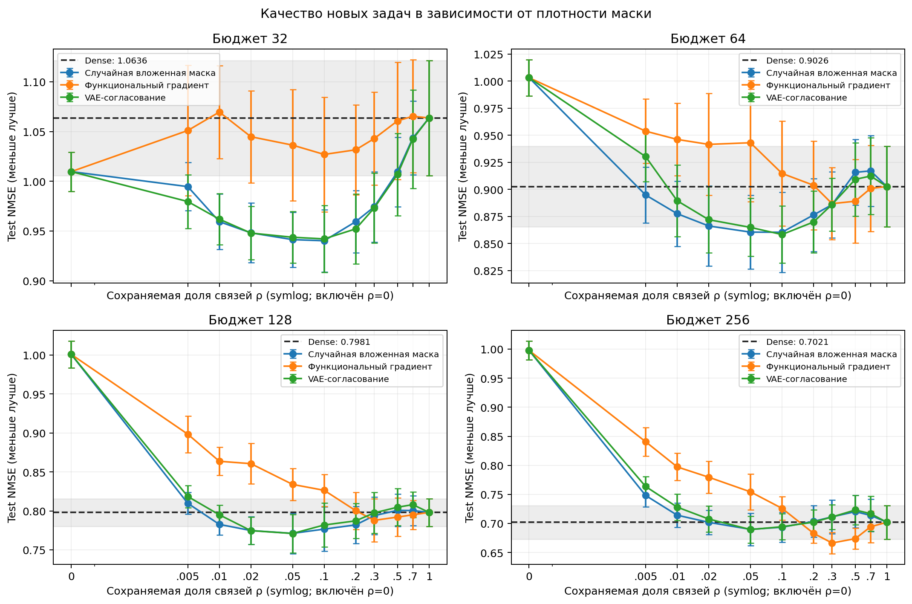
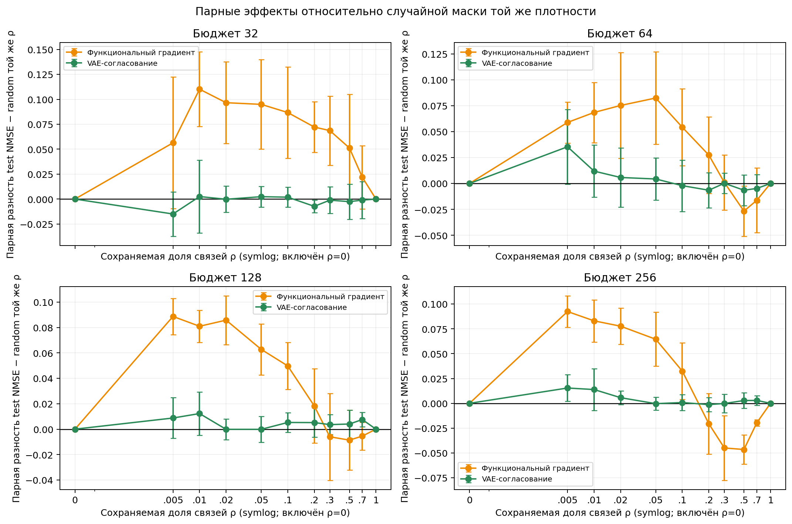
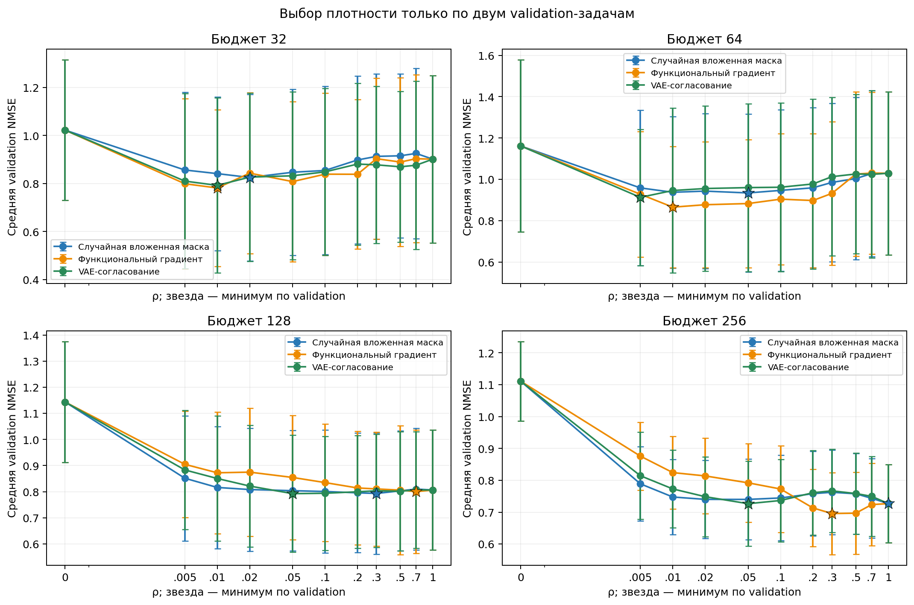
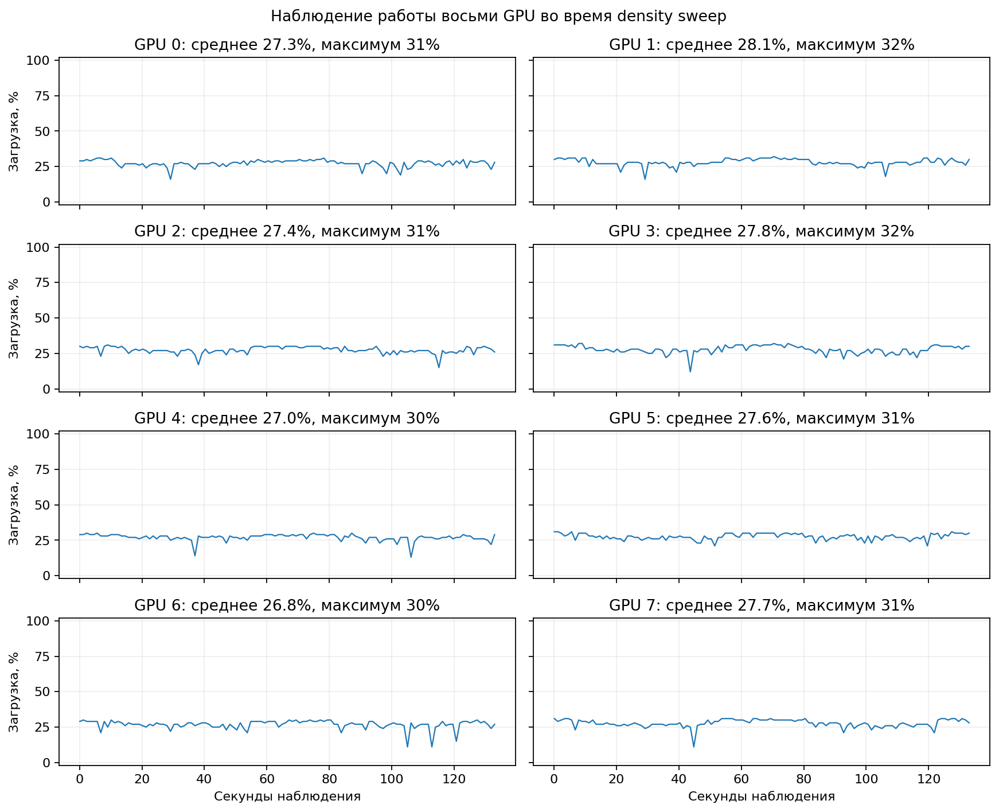
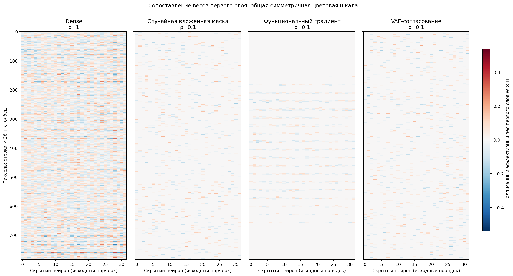
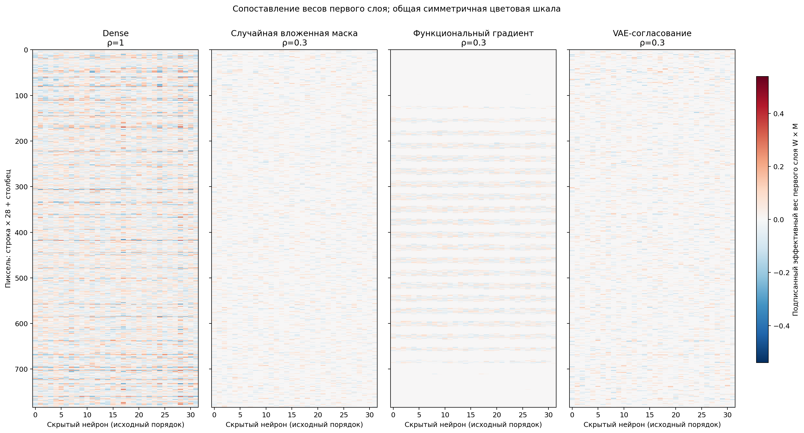
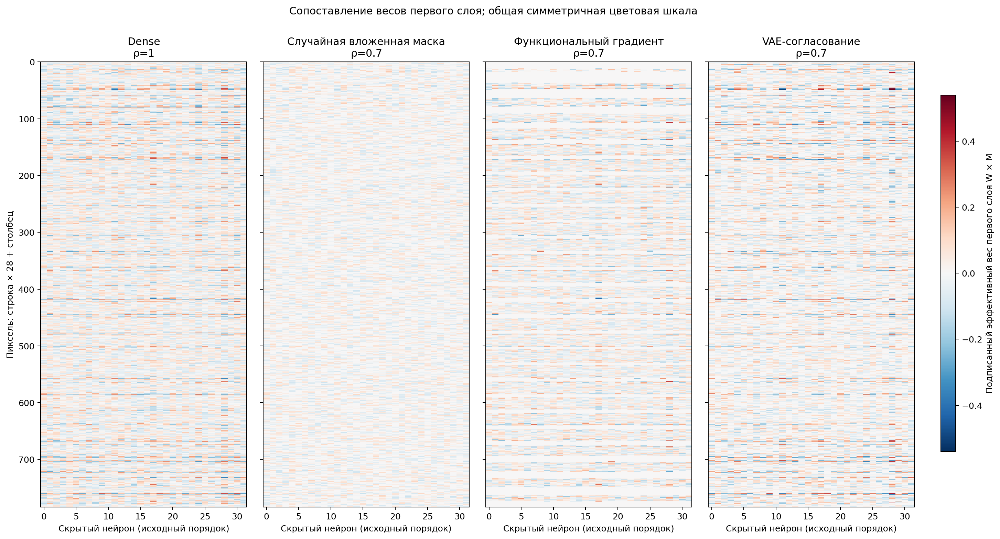
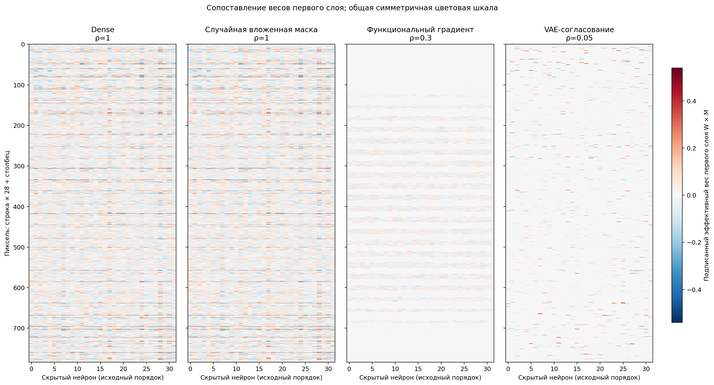

# Плотность маски DeepSets: качество на новых задачах

Исследовательский фиксированный sweep чувствительности уже определённых методов: 11 заранее заданных долей сохранённых связей, 8 seed, 8 ранее использованных тестовых cost-задач и 4 парные инициализации. Восемь seed запускались по одному на каждой из восьми выделенных GPU. В каждой точке обучено по 800 шагов. Банк VAE зафиксирован на исходной плотности 20%; для agreement на каждом K повторно выполнялись 400 шагов оптимизации на том же замороженном банке. Новые VAE-банки для каждой плотности не обучались. При ρ=0 отключены только связи input→hidden: bias, readout и per-image offset обучаются, поэтому сеть остаётся обучаемым постоянным предиктором. При ρ=1 включены все 25 088 связей и проверено точное совпадение с dense. Между сеточными точками оптимальность плотности не утверждается.

Все test-показатели читаются только после выбора чекпойнта по target-validation. Для density-selection одно глобальное ρ выбирается отдельно для каждой пары method × budget: минимум средней validation NMSE по двум validation cost-задачам, четырём инициализациям и восьми seed; при равенстве выбрана меньшая маска. В выборе не использованы test NMSE.

Единица статистического вывода — seed. Сначала внутри каждого seed усредняются 8 test-задач × 4 инициализации; интервалы — двусторонние 95% Student t, df=7. Разбиение cost-задач остаётся фиксированным, поэтому интервал отражает разброс seed условно на этих задачах.

## Качество в зависимости от плотности

**Как читать.** Четыре панели показывают бюджеты 32, 64, 128 и 256. По X — доля сохранённых связей ρ; применена явно подписанная symlog-шкала, чтобы показать точку ρ=0 вместе с логарифмически разнесёнными ненулевыми долями. По Y — test NMSE, меньше лучше. Цветные линии — три метода. Random и functional-gradient используют вложенные ранги; agreement переоптимизируется отдельно для каждого K. Пунктир и полоса — горизонтальный dense-контроль с 95% интервалом. Маркеры соединены только для визуального чтения сетки из 11 точек.

**Граница вывода.** Эти задачи уже использовались в более ранних запусках. Сетка из 11 точек и 800 шагов на checkpoint — ограниченный исследовательский sweep: он не доказывает непрерывно оптимальную плотность и не устанавливает сходимость обучения.

## Парная разность с random при той же плотности

**Как читать.** Каждая точка сравнивает новый метод со `random_density` при одинаковых ρ, бюджете, задаче и init. По Y отложено NMSE(метод) − NMSE(random); отрицательное значение благоприятствует методу. Перед доверительным интервалом четыре init и восемь задач усреднены внутри каждого seed; планки — 95% t-интервалы по восьми seed (df=7). Сравнение при одинаковом числе связей отделено от сравнения двух независимо выбранных validation-плотностей, приведённого ниже.

## Выбор плотности по validation

**Как читать.** В каждой панели показана средняя validation NMSE по двум отдельным validation cost-задачам, четырём init и восьми seed. Звёздой отмечен единственный минимум по всей сетке для данного method × budget. Планки вокруг точек показывают разброс seed-уровневых средних; сами validation score включают обе validation-задачи.

Таблица содержит только validation-выбранные плотности; test-столбец оценивает выбранную точку и не участвовал в выборе.

| Метод | Бюджет | Выбранное ρ | Связей K | Validation NMSE | Test NMSE | Парная Δ test к random той же ρ | Парная Δ test к random с его лучшим ρ | Парная Δ test к dense |
|---|---:|---:|---:|---:|---:|---:|---:|---:|
| Случайная вложенная маска | 32 | 0.020 | 502 | 0.82517 [0.47832, 1.17202] | 0.94817 [0.91828, 0.97806] | 0.00000 [0.00000, 0.00000] | 0.00000 [0.00000, 0.00000] | -0.11546 [-0.17342, -0.05750] |
| Случайная вложенная маска | 64 | 0.050 | 1254 | 0.93414 [0.55254, 1.31574] | 0.86051 [0.82630, 0.89473] | 0.00000 [0.00000, 0.00000] | 0.00000 [0.00000, 0.00000] | -0.04210 [-0.07302, -0.01118] |
| Случайная вложенная маска | 128 | 0.300 | 7526 | 0.79319 [0.56105, 1.02533] | 0.79391 [0.76977, 0.81805] | 0.00000 [0.00000, 0.00000] | 0.00000 [0.00000, 0.00000] | -0.00419 [-0.02328, 0.01490] |
| Случайная вложенная маска | 256 | 1.000 | 25088 | 0.72704 [0.60493, 0.84915] | 0.70212 [0.67323, 0.73101] | 0.00000 [0.00000, 0.00000] | 0.00000 [0.00000, 0.00000] | 0.00000 [0.00000, 0.00000] |
| Функциональный градиент | 32 | 0.010 | 251 | 0.78141 [0.45508, 1.10773] | 1.06958 [1.02279, 1.11638] | 0.11017 [0.07261, 0.14772] | 0.12141 [0.08282, 0.16001] | 0.00596 [-0.05250, 0.06441] |
| Функциональный градиент | 64 | 0.010 | 251 | 0.86535 [0.57214, 1.15856] | 0.94613 [0.91268, 0.97958] | 0.06859 [0.03947, 0.09772] | 0.08562 [0.05462, 0.11662] | 0.04352 [0.01187, 0.07517] |
| Функциональный градиент | 128 | 0.700 | 17562 | 0.80018 [0.56344, 1.03692] | 0.79503 [0.77647, 0.81358] | -0.00547 [-0.01641, 0.00546] | 0.00111 [-0.01918, 0.02141] | -0.00308 [-0.00563, -0.00052] |
| Функциональный градиент | 256 | 0.300 | 7526 | 0.69571 [0.56735, 0.82407] | 0.66645 [0.64833, 0.68457] | -0.04494 [-0.07740, -0.01249] | -0.03567 [-0.06515, -0.00618] | -0.03567 [-0.06515, -0.00618] |
| VAE-согласование | 32 | 0.010 | 251 | 0.79229 [0.42826, 1.15633] | 0.96193 [0.93608, 0.98777] | 0.00251 [-0.03412, 0.03914] | 0.01376 [-0.02544, 0.05295] | -0.10170 [-0.14646, -0.05695] |
| VAE-согласование | 64 | 0.005 | 125 | 0.91284 [0.58304, 1.24264] | 0.93026 [0.90707, 0.95344] | 0.03545 [-0.00061, 0.07151] | 0.06975 [0.02602, 0.11348] | 0.02764 [-0.02376, 0.07905] |
| VAE-согласование | 128 | 0.050 | 1254 | 0.79251 [0.56818, 1.01684] | 0.77106 [0.74644, 0.79569] | -0.00013 [-0.01026, 0.01001] | -0.02285 [-0.04092, -0.00479] | -0.02704 [-0.04304, -0.01103] |
| VAE-согласование | 256 | 0.050 | 1254 | 0.72658 [0.59359, 0.85957] | 0.68960 [0.66645, 0.71276] | -0.00031 [-0.00684, 0.00622] | -0.01252 [-0.02517, 0.00014] | -0.01252 [-0.02517, 0.00014] |

Парные столбцы — разность method minus baseline, усреднённая внутри seed; отрицательное значение благоприятствует выбранному методу. В столбце равной плотности random использует то же ρ. Следующий столбец сравнивает с random при его независимо validation-выбранном ρ; это отдельное сравнение, где обе маски получили собственный выбор плотности.

## Выводы по выбранным плотностям

При бюджете 256 functional-gradient выбрал ρ=0.30: средняя test NMSE равна 0.66645 [0.64833, 0.68457], против 0.71140 [0.68238, 0.74041] у random_density той же плотности и 0.70212 [0.67323, 0.73101] у dense. Парные разности составили −0.04494 [−0.07740, −0.01249] относительно random той же ρ и −0.03567 [−0.06515, −0.00618] относительно random при его validation-выбранной ρ=1 (в этой точке random совпадает с dense). Интервалы — 95% Student t по восьми seed, df=7.

Agreement выбрал ρ=0.05: test NMSE 0.68960 [0.66645, 0.71276] против 0.68991 [0.66198, 0.71784] у random той же плотности. Парная разность −0.00031 [−0.00684, 0.00622] включает ноль, поэтому преимущество agreement над random при таком бюджете не установлено.

При бюджетах 32 и 64 functional-gradient на выбранной validation плотности ρ=0.01 имел более высокую test NMSE, чем random той же ρ: парные разности +0.11017 [0.07261, 0.14772] и +0.06859 [0.03947, 0.09772]. Два validation cost-задачи не гарантируют репрезентативный выбор для более широкого набора задач. Вместе с ранее использованными test-задачами это оставляет результаты исследовательскими и не позволяет утверждать универсально оптимальную плотность.

## Проверки входных результатов

Покрытие подтверждено для 8 seed × 11 плотностей. В каждом seed-density каталоге найдено ровно 32 test checkpoint и 8 validation checkpoint; все контрольные аудиты отмечены как пройденные. Все три новых метода имеют двоичные маски точного размера K; random и functional-gradient вложены при росте ρ, agreement переоптимизируется отдельно при каждом K.

Поля density/edges в строке результата обозначают density-каталог sweep. Три новых метода меняют K по этой сетке. Пять исходных контролей сохраняют исходные маски: random/agreement/mean/single-VAE имеют 5 018 входных связей (20%), dense — все 25 088. Фактические маски для выбранных весовых матриц читаются из checkpoint.

При ρ=0.2 сохранённые маски и результаты воспроизводят исходную random- и agreement-маски пилота, а также исправленный FP32 functional-gradient baseline. Сравнение включает MSE, MAE, validation MSE и шаг лучшего чекпойнта; сами маски совпали побитно.

На верхней границе ρ=1 параметры первого слоя, bias, readout, offset, effective weights и метрики всех трёх новых методов совпали с dense точно для каждого test и validation checkpoint. В бюджете разреженности учитывается только матрица input→hidden размера 784×32; pooling и readout остаются общими для всех методов.

## Наблюдение загрузки GPU

**Как читать.** Это один live-срез длительностью 120 секунд во время параллельного sweep: каждая панель показывает загрузку одной из восьми GPU. Среднее по 120 точкам наблюдения на карту — 27.5%. Срез включает CPU-подготовку и сопоставление карт, а также ожидание запуска вычислений; причины отдельных спадов на графике не размечались. Это описание одного рабочего замера, не сравнение FLOP/s или скорости старого и нового методов.

Сырые точки и сводка сохранены в [`gpu_utilization_samples.json`](gpu_utilization_samples.json) и [`gpu_utilization_summary.json`](gpu_utilization_summary.json); построитель графика — [`source_snapshot/density_utilization.py`](source_snapshot/density_utilization.py).

## Фактически обученные веса при фиксированном примере

Для визуального контроля заранее зафиксированы seed=4100, test task=0, бюджет 256 и init=0. На каждой матрице показан подписанный эффективный вес первого слоя W×M; веса запрещённых связей равны точному нулю. Все панели используют одну симметричную цветовую шкалу и исходный порядок пикселей и нейронов.

### rho 10pct

**Как читать.** Слева dense, затем random-density, functional-gradient и agreement-density. Для первых четырёх графиков новые методы имеют указанную в заголовке фиксированную ρ; в последнем каждая маска взята при собственной validation-выбранной ρ для бюджета 256. Красный и синий показывают знак, белый — нулевые или малые значения. Общая шкала сохраняется между всеми heatmap.

### rho 20pct

**Как читать.** Слева dense, затем random-density, functional-gradient и agreement-density. Для первых четырёх графиков новые методы имеют указанную в заголовке фиксированную ρ; в последнем каждая маска взята при собственной validation-выбранной ρ для бюджета 256. Красный и синий показывают знак, белый — нулевые или малые значения. Общая шкала сохраняется между всеми heatmap.

### rho 30pct

**Как читать.** Слева dense, затем random-density, functional-gradient и agreement-density. Для первых четырёх графиков новые методы имеют указанную в заголовке фиксированную ρ; в последнем каждая маска взята при собственной validation-выбранной ρ для бюджета 256. Красный и синий показывают знак, белый — нулевые или малые значения. Общая шкала сохраняется между всеми heatmap.

### rho 70pct

**Как читать.** Слева dense, затем random-density, functional-gradient и agreement-density. Для первых четырёх графиков новые методы имеют указанную в заголовке фиксированную ρ; в последнем каждая маска взята при собственной validation-выбранной ρ для бюджета 256. Красный и синий показывают знак, белый — нулевые или малые значения. Общая шкала сохраняется между всеми heatmap.

### validation selected rho budget256

**Как читать.** Слева dense, затем random-density, functional-gradient и agreement-density. Для первых четырёх графиков новые методы имеют указанную в заголовке фиксированную ρ; в последнем каждая маска взята при собственной validation-выбранной ρ для бюджета 256. Красный и синий показывают знак, белый — нулевые или малые значения. Общая шкала сохраняется между всеми heatmap.

Dense использует ρ=1. Каждый график состоит из четырёх панелей. В heatmap отображены конкретные веса checkpoint, выбранного только по validation; результаты не усредняются по seed или init. Точные массивы W, M и W×M сохранены в `weightedheatmaps/weighted_heatmap_values.npz`; метаданные checkpoint и проверка точных нулей — в `weightedheatmaps/weighted_heatmap_metadata.json`.

## Методы, исходные файлы и артефакты

| Метод | Описание входной маски | Основные артефакты |
|---|---|---|
| random_density | Одна случайная перестановка рангов; первые K связей образуют вложенные маски. | [`source_snapshot/density_sweep.py`](source_snapshot/density_sweep.py); маски `seed_4100/rho_0p200/masks.pt`; кривые выше. |
| function_gradient_density | Веса связей ранжируются исправленным функциональным градиентом, рассчитанным только на исходных задачах. | [`source_snapshot/followup_importance.py`](source_snapshot/followup_importance.py); `masks.pt` при каждой ρ. |
| agreement_density | Текущая процедура VAE-согласования повторно оптимизируется при каждом K на том же замороженном банке; новые банки не обучались. | [`source_snapshot/masks.py`](source_snapshot/masks.py) и [`source_snapshot/density_sweep.py`](source_snapshot/density_sweep.py); `masks.pt`; target-веса в `weights/`. |

Код генератора этого отчёта сохранён в `source_snapshot/density_report.py`. Исходные JSON по плотностям и бинарные артефакты масок сохранены в `seed_*/rho_*/`; численные веса каждого выбранного target checkpoint лежат в `weights/`, а отдельные validation checkpoint — в `validation_weights/`. Все рисунки имеют версии PNG и PDF; агрегированные значения и интервалы можно проверить в `summary/summary.json`.

План анализа и хеши исходных файлов: [`PLAN.json`](PLAN.json) и [`input_artifact_hashes.json`](input_artifact_hashes.json).

Полная сводка проверок, кривые, seed-уровневые значения, все validation-кандидаты и табличные сравнения находятся в [`summary/summary.json`](summary/summary.json). Проверка входных артефактов — [`summary/audit.json`](summary/audit.json); выбранные плотности с их validation score — [`summary/density_selection.json`](summary/density_selection.json).
