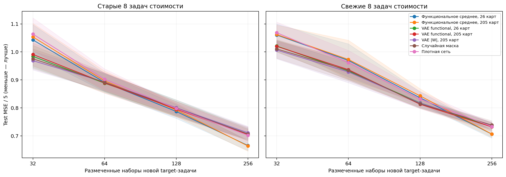
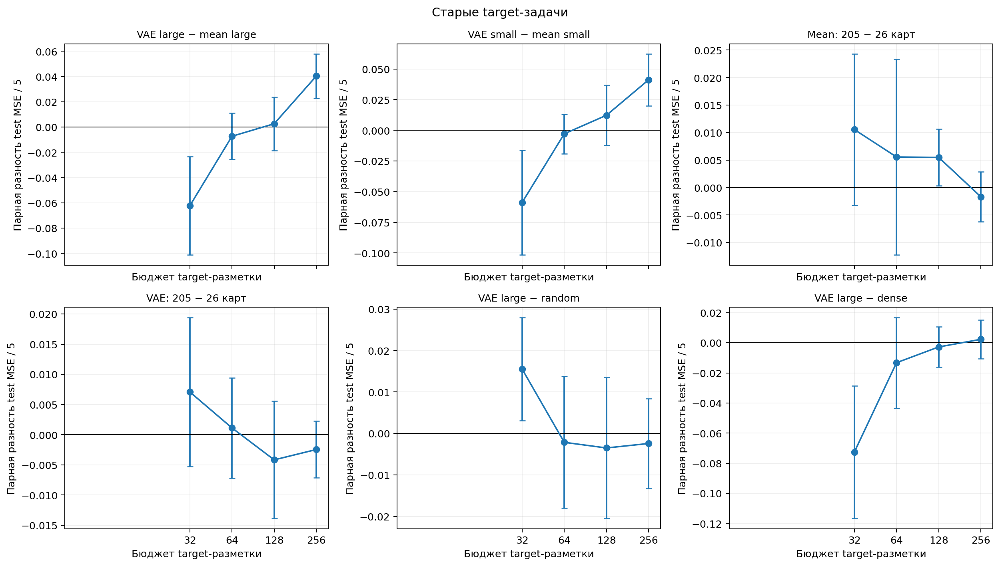
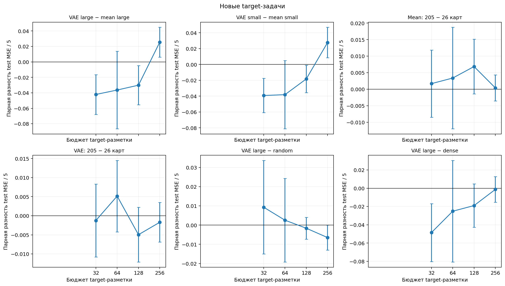
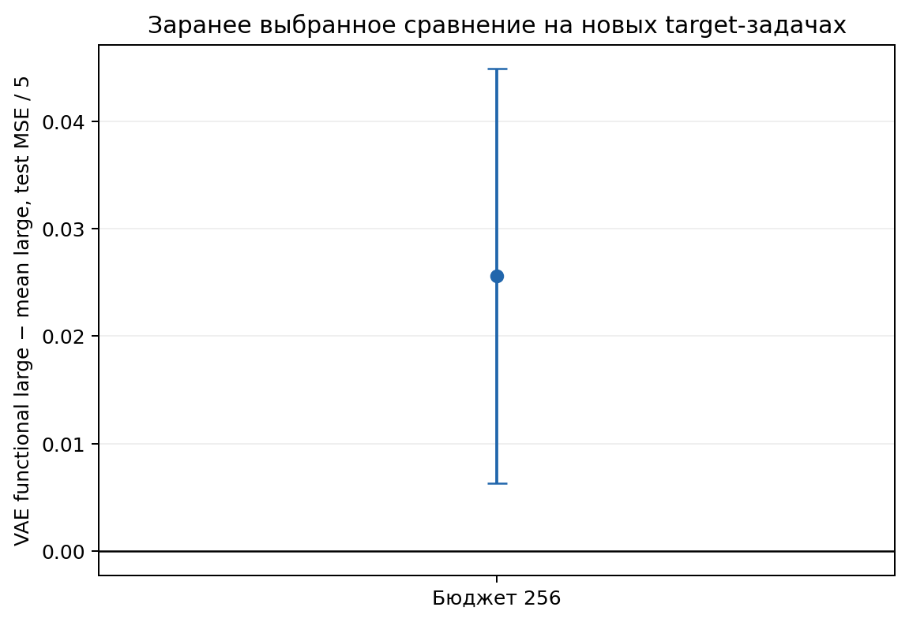
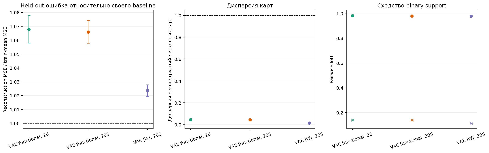
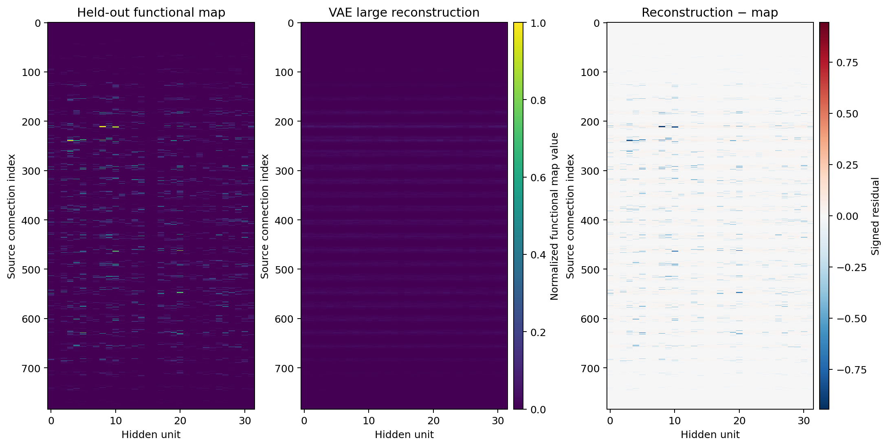
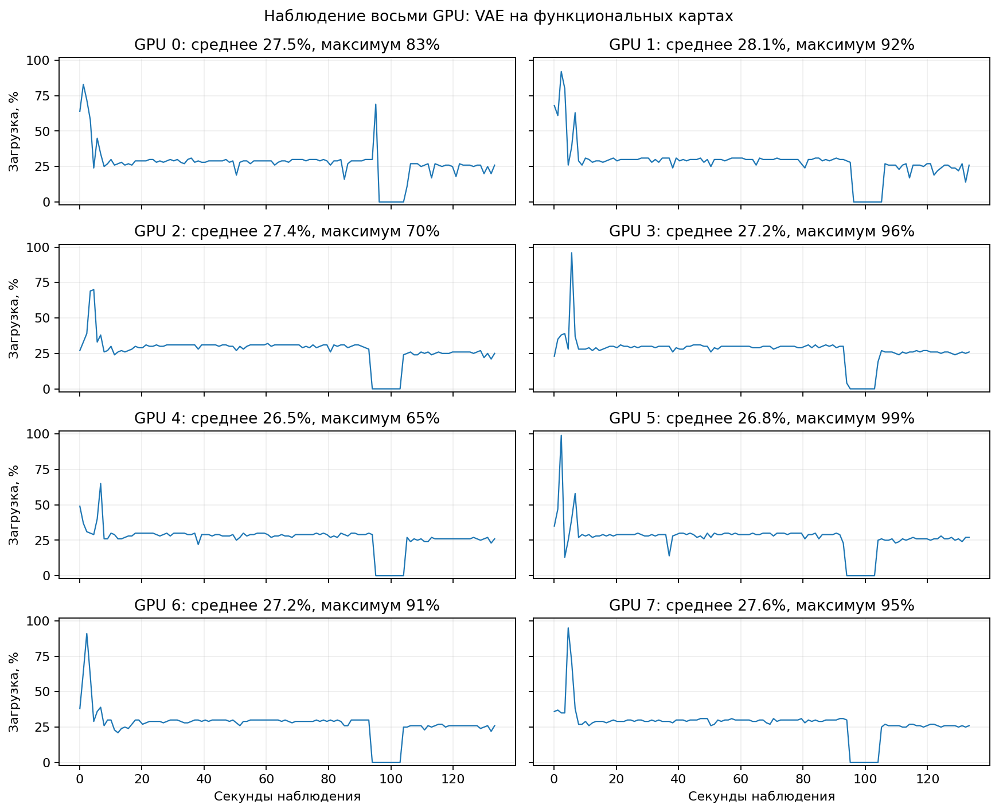
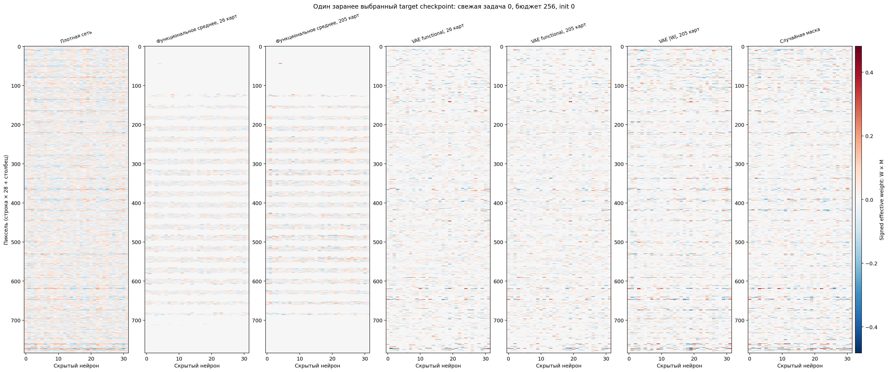

# Расширенный перенос функциональных карт через VAE

Завершены восемь независимых seeds (4100–4107). Для каждого seed отдельно агрегируются четыре инициализации и восемь фиксированных target-задач; t-интервалы строятся только по восьми seed, df=7. Старые восемь задач и восемь новых задач показаны отдельно.

Банк построен для четырёх исходных source-задач: на каждую создано 1024 кандидата и отобрано 256 решений. Source-банк использует маски с 5018 связями (20%). Перед переносом выбирается ровно 7526 связей (30%). Веса target-моделей обучаются по новым target-меткам; source-карты и target-бюджеты — разные наборы данных и разные единицы счёта.

VAE получает functional-карты, вычисленные без target-меток. В большом варианте на каждой source-задаче 205 карт используются для обучения и 51 общая карта отложена; малый вариант обучается на вложенном подмножестве из 26 карт и проверяется на тех же 51 held-out картах. Эти числа относятся к числу карт source-решений, а бюджеты 32/64/128/256 ниже относятся к размеченным наборам новой target-задачи, включая validation для выбора checkpoint.

## Основные выводы

**Основное заранее выбранное сравнение.** На новых задачах при бюджете 256 VAE functional large минус среднее по тем же 205 functional-картам равно +0.025594 MSE/5; 95% CI [+0.006307, +0.044880]. Положительная разность и интервал выше нуля означают, что VAE не улучшила целевой перенос и в этом сравнении показала более высокую ошибку.

**Эффект дополнительных source-карт не подтверждён.** При переходе с 26 на 205 карт функциональное среднее меняется на +0.000384 [-0.003545, +0.004314], а VAE — на -0.001709 [-0.006887, +0.003470]. Оба интервала включают ноль. Преимущество функционального среднего над VAE сохраняется и после увеличения банка карт.

**Вторичные сравнения на новых задачах.** При бюджете 256 функциональное среднее large ниже random на -0.032087 [-0.048524, -0.015650] и ниже dense на -0.026877 [-0.040281, -0.013473] MSE/5. Это исследовательские сравнения, а не основной заранее выбранный контраст.

### Свежие задачи, бюджет 256

| Метод | Test MSE/5 | 95% CI по seeds |
|---|---:|---|
| Функциональное среднее, 26 карт | 0.706248 | [0.692171, 0.720325] |
| Функциональное среднее, 205 карт | 0.706632 | [0.695629, 0.717635] |
| VAE functional, 26 карт | 0.733934 | [0.721042, 0.746827] |
| VAE functional, 205 карт | 0.732226 | [0.716184, 0.748268] |
| VAE |W|, 205 карт | 0.737825 | [0.726370, 0.749280] |
| Случайная маска | 0.738719 | [0.723222, 0.754217] |
| Плотная сеть | 0.733509 | [0.722202, 0.744816] |

### Что показала VAE на held-out source-картах

Для functional VAE large отношение held-out MSE к baseline по train mean равно 1.0659 [1.0575, 1.0744]. Held-out BCE 0.05245 против 0.04962 у своего mean-baseline; парная разность +0.00283 [+0.00265, +0.00301]. Реконструкции сохраняют 4.36% дисперсии held-out карт; pairwise IoU реконструированных бинарных поддержек 0.97906 против 0.14034 у held-out карт. Это согласуется с потерей разнообразия реконструкций.

Для raw VAE large отношение MSE к собственному train-mean baseline равно 1.0237; отношения сопоставимы, но абсолютные значения raw- и functional-MSE имеют разные шкалы. По ним нельзя заключать, что одна входная репрезентация хуже другой.

**Ограничение сходимости.** VAE обучалась 160 optimizer updates; лучший checkpoint часто приходился на последний update: functional small — 18/32 source-задач, functional large — 22/32, raw large — 16/32. В последние 10% update попали соответственно 28/32, 30/32 и 31/32. Сходимость не установлена; вывод о целевом переносе относится только к этому 160-update протоколу и не исключает иной результат при более долгом обучении.

## Итоги по target-задачам

Полный predeclared protocol с векторами задач, параметрами обучения и source SHA-256 сохранён в [protocol.json](protocol.json). Пер-seed CUDA и data split provenance включены в `summary.json`.

## Качество переноса

**Как читать.** По горизонтали — полный бюджет размеченных наборов target-задачи, включая обучение и выбор checkpoint; по вертикали — тестовая MSE, делённая на 5. Левая панель использует прежние 8 задач стоимости, правая — 8 новых заранее зафиксированных задач. Точки — среднее сначала по задачам и четырём инициализациям внутри seed, затем по восьми seeds. Полосы — t-интервалы 95% по seed, df=7.

**Ограничение.** Интервалы условны на фиксированных задачах и разбиениях данных. Они отражают вариативность обучения между seeds; target-задачи не являются независимыми повторениями.

## Парные различия между вариантами

### Старые target-задачи

**Как читать.** По вертикали показана разность MSE первого метода и baseline на тех же seed, задаче, бюджете и инициализации; внутри seed сначала усреднены фиксированные target-задачи и четыре обучения. Значения ниже нуля благоприятны первому методу. Отрезки — парные 95% t-интервалы по восьми seeds, df=7. Интервалы точечные, без поправки на множественные бюджеты и сравнения.

Сравнение small с large отвечает на эффект большего числа карт при фиксированном способе построения; сравнение VAE с соответствующим mean оценивает добавку VAE. Сравнения с random и dense относятся к переносу структуры на target-задачу.

### Новые target-задачи

**Как читать.** По вертикали показана разность MSE первого метода и baseline на тех же seed, задаче, бюджете и инициализации; внутри seed сначала усреднены фиксированные target-задачи и четыре обучения. Значения ниже нуля благоприятны первому методу. Отрезки — парные 95% t-интервалы по восьми seeds, df=7. Интервалы точечные, без поправки на множественные бюджеты и сравнения.

Сравнение small с large отвечает на эффект большего числа карт при фиксированном способе построения; сравнение VAE с соответствующим mean оценивает добавку VAE. Сравнения с random и dense относятся к переносу структуры на target-задачу.

### Предварительно выбранная проверка

**Как читать.** Показана только заранее обозначенная разность на новых задачах стоимости при бюджете 256: VAE по функциональным картам с 205 train-картами минус функциональное среднее тех же 205 карт. Интервал парный по восьми seeds (df=7); отрицательное значение поддерживает VAE.

Оценка разности: +0.025594; 95% интервал [+0.006307, +0.044880]. Это единственное подтверждающее сравнение, заданное заранее. Все остальные сравнения и графики имеют исследовательский статус; новые target-задачи не использовались для выбора варианта VAE.

## Качество исходных банков

**Как читать.** Слева распределение лучшей source-validation NMSE всех 1024 кандидатов и сохранённых 256 кандидатов на четырёх source-задачах и восьми seeds. Справа линии соединяют средние по четырём задачам внутри каждого seed; чёрные точки и отрезки — среднее и 95% t-интервал по восьми seeds (df=7). Меньше NMSE означает лучшее качество на source validation.

**Граница интерпретации.** Эти же source-validation оценки использовались для выбора 256 из 1024, поэтому график показывает качество отбора, а не независимую оценку обобщения source-банка. Он не участвует в сравнении методов на target-задачах.

Парная разность mean(selected − all) = -0.013697; 95% CI [-0.014812, -0.012582].

Полные значения распределений сохранены в `source_bank_quality_values.npz`.

### Восстановление и разнообразие карт

**Как читать.** Слева — held-out reconstruction MSE, делённая на MSE предсказания своим train mean; пунктир на 1 означает равенство baseline. Это относительная ошибка внутри одного представления: абсолютные значения MSE raw-карт и functional-карт имеют разные шкалы и по ним нельзя объявлять одно представление хуже другого. В центре — отношение дисперсии реконструкций к дисперсии исходных карт; пунктир на 1 означает совпадение. Справа — pairwise IoU реконструированных бинарных масок (точка) и held-out масок (крестик); высокое IoU означает низкое разнообразие выходных поддержек. Точки усредняют source-задачи внутри seed; интервалы рассчитаны по восьми seeds (df=7). Raw VAE обучается на |W|, остальные варианты — на functional maps. Поэтому сравнение raw и functional включает различие входных представлений.

Визуальные примеры исходных и восстановленных карт сохраняются отдельными численными массивами в `functional_vae_arrays.npz`; сама MSE не показывает геометрию ошибок.

### Пример held-out карты и реконструкции

**Как читать.** Показан первый сохранённый held-out пример первого source-task: исходная функциональная карта, реконструкция VAE на 205 train-картах и их поэлементная разность. Цветовая шкала общая; центр около нуля означает малую разность; residual-панель имеет собственную симметричную шкалу. Это иллюстрация геометрии ошибки для одного примера, а не средняя оценка и не дополнительная проверка переноса.

## Наблюдение GPU во время VAE и target-обучения

**Как читать.** Для каждой из восьми GPU показана загрузка за короткий период наблюдения: 120 точек на GPU, 960 значений суммарно. Показатель — занятость GPU в процентах по сэмплам наблюдателя.

**Ограничение.** Запись охватывает только финальную фазу VAE и target-обучения, а не весь pipeline формирования source-банков. Это наблюдение очереди, не сравнительный benchmark и не оценка FLOPs. Источники CPU-простоев отдельно не измерялись.

[PDF графика](plots/gpu_utilization.pdf) · [Сводка по GPU](gpu_utilization_summary.json).

## Обученные веса на фиксированном примере

**Как читать.** Все панели используют один пример: seed 4100, новая задача стоимости 0, бюджет 256 target-наборов, первая инициализация. Каждая матрица имеет размер 784×32; цвет показывает подписанный эффективный вес W×M. Красный/синий — знаки, общая симметричная шкала задана максимумом абсолютного веса среди показанных методов. Столбцы оставлены в сохранённом порядке.

Для всех вариантов точечно проверены конечность значений, равенство effective=W×M, точные нули запрещённых связей и реальный K. Source-bank маски имеют 5018 связей (20%); после извлечения/построения для переноса используются маски с 7526 связями (30%). Dense содержит все 25 088 связей. Это один пример, он не заменяет агрегат качества по seeds и target-задачам.

Точные W, M и W×M сохранены в `weight_heatmaps/fresh_task0_budget256_values.npz`; проверки и записи checkpoint — в `weight_heatmaps/metadata.json`. Дополнительные бинарные маски сохранены отдельно в `fresh_task0_budget256_masks.npz`.

## Итоговые оценки

Test MSE / 5; интервалы — 95% t-интервалы по восьми seed. Они условны на зафиксированных задачах стоимости и разбиениях.

| Набор задач | Метод | Target-бюджет | MSE/5 | 95% CI |
|---|---|---:|---:|---|
| Старые | Функциональное среднее, 26 карт | 32 | 1.042847 | [0.988586, 1.097107] |
| Старые | Функциональное среднее, 26 карт | 64 | 0.891111 | [0.858146, 0.924076] |
| Старые | Функциональное среднее, 26 карт | 128 | 0.787244 | [0.762487, 0.812001] |
| Старые | Функциональное среднее, 26 карт | 256 | 0.665657 | [0.647617, 0.683698] |
| Старые | Функциональное среднее, 205 карт | 32 | 1.053402 | [1.004864, 1.101940] |
| Старые | Функциональное среднее, 205 карт | 64 | 0.896663 | [0.861606, 0.931721] |
| Старые | Функциональное среднее, 205 карт | 128 | 0.792718 | [0.769009, 0.816426] |
| Старые | Функциональное среднее, 205 карт | 256 | 0.663952 | [0.645176, 0.682729] |
| Старые | VAE functional, 26 карт | 32 | 0.983911 | [0.944362, 1.023459] |
| Старые | VAE functional, 26 карт | 64 | 0.888245 | [0.855669, 0.920820] |
| Старые | VAE functional, 26 карт | 128 | 0.799504 | [0.770478, 0.828531] |
| Старые | VAE functional, 26 карт | 256 | 0.706865 | [0.686723, 0.727007] |
| Старые | VAE functional, 205 карт | 32 | 0.990996 | [0.950110, 1.031882] |
| Старые | VAE functional, 205 карт | 64 | 0.889365 | [0.852585, 0.926145] |
| Старые | VAE functional, 205 карт | 128 | 0.795335 | [0.768273, 0.822398] |
| Старые | VAE functional, 205 карт | 256 | 0.704412 | [0.684951, 0.723873] |
| Старые | VAE |W|, 205 карт | 32 | 0.968705 | [0.935576, 1.001833] |
| Старые | VAE |W|, 205 карт | 64 | 0.892277 | [0.860809, 0.923746] |
| Старые | VAE |W|, 205 карт | 128 | 0.800569 | [0.772620, 0.828517] |
| Старые | VAE |W|, 205 карт | 256 | 0.711000 | [0.687902, 0.734099] |
| Старые | Случайная маска | 32 | 0.975449 | [0.940105, 1.010792] |
| Старые | Случайная маска | 64 | 0.891515 | [0.858832, 0.924198] |
| Старые | Случайная маска | 128 | 0.798847 | [0.774268, 0.823425] |
| Старые | Случайная маска | 256 | 0.706845 | [0.682673, 0.731017] |
| Старые | Плотная сеть | 32 | 1.063629 | [1.005793, 1.121466] |
| Старые | Плотная сеть | 64 | 0.902614 | [0.865534, 0.939694] |
| Старые | Плотная сеть | 128 | 0.798101 | [0.780309, 0.815894] |
| Старые | Плотная сеть | 256 | 0.702120 | [0.673230, 0.731009] |
| Новые | Функциональное среднее, 26 карт | 32 | 1.060364 | [1.021659, 1.099069] |
| Новые | Функциональное среднее, 26 карт | 64 | 0.969564 | [0.910504, 1.028624] |
| Новые | Функциональное среднее, 26 карт | 128 | 0.836243 | [0.814803, 0.857684] |
| Новые | Функциональное среднее, 26 карт | 256 | 0.706248 | [0.692171, 0.720325] |
| Новые | Функциональное среднее, 205 карт | 32 | 1.062049 | [1.028516, 1.095582] |
| Новые | Функциональное среднее, 205 карт | 64 | 0.972942 | [0.904202, 1.041682] |
| Новые | Функциональное среднее, 205 карт | 128 | 0.843096 | [0.817822, 0.868371] |
| Новые | Функциональное среднее, 205 карт | 256 | 0.706632 | [0.695629, 0.717635] |
| Новые | VAE functional, 26 карт | 32 | 1.021164 | [1.000325, 1.042003] |
| Новые | VAE functional, 26 карт | 64 | 0.931423 | [0.901804, 0.961042] |
| Новые | VAE functional, 26 карт | 128 | 0.817950 | [0.801153, 0.834746] |
| Новые | VAE functional, 26 карт | 256 | 0.733934 | [0.721042, 0.746827] |
| Новые | VAE functional, 205 карт | 32 | 1.019916 | [0.999937, 1.039896] |
| Новые | VAE functional, 205 карт | 64 | 0.936571 | [0.900417, 0.972725] |
| Новые | VAE functional, 205 карт | 128 | 0.812988 | [0.797728, 0.828248] |
| Новые | VAE functional, 205 карт | 256 | 0.732226 | [0.716184, 0.748268] |
| Новые | VAE |W|, 205 карт | 32 | 1.006566 | [0.975257, 1.037875] |
| Новые | VAE |W|, 205 карт | 64 | 0.928316 | [0.889963, 0.966670] |
| Новые | VAE |W|, 205 карт | 128 | 0.817114 | [0.798071, 0.836158] |
| Новые | VAE |W|, 205 карт | 256 | 0.737825 | [0.726370, 0.749280] |
| Новые | Случайная маска | 32 | 1.010589 | [0.977328, 1.043851] |
| Новые | Случайная маска | 64 | 0.934014 | [0.896344, 0.971685] |
| Новые | Случайная маска | 128 | 0.814615 | [0.800681, 0.828550] |
| Новые | Случайная маска | 256 | 0.738719 | [0.723222, 0.754217] |
| Новые | Плотная сеть | 32 | 1.068428 | [1.030309, 1.106548] |
| Новые | Плотная сеть | 64 | 0.961715 | [0.918068, 1.005362] |
| Новые | Плотная сеть | 128 | 0.831960 | [0.805058, 0.858863] |
| Новые | Плотная сеть | 256 | 0.733509 | [0.722202, 0.744816] |

## Парные сравнения

Отрицательная разность означает преимущество первого указанного метода. Первичная проверка заранее задана для новых задач при бюджете 256; прочие сравнения являются exploratory.

| Набор | Сравнение | Бюджет | Разность | 95% CI |
|---|---|---:|---:|---|
| Старые | Функциональное среднее, 26 карт − Случайная маска | 32 | +0.067398 | [+0.028761, +0.106035] |
| Старые | Функциональное среднее, 26 карт − Плотная сеть | 32 | -0.020783 | [-0.057514, +0.015949] |
| Старые | Функциональное среднее, 205 карт − Случайная маска | 32 | +0.077954 | [+0.037165, +0.118742] |
| Старые | Функциональное среднее, 205 карт − Плотная сеть | 32 | -0.010227 | [-0.043622, +0.023168] |
| Старые | VAE functional, 26 карт − Случайная маска | 32 | +0.008462 | [-0.004592, +0.021516] |
| Старые | VAE functional, 26 карт − Плотная сеть | 32 | -0.079719 | [-0.126244, -0.033193] |
| Старые | VAE functional, 205 карт − Случайная маска | 32 | +0.015547 | [+0.003121, +0.027973] |
| Старые | VAE functional, 205 карт − Плотная сеть | 32 | -0.072633 | [-0.116775, -0.028492] |
| Старые | VAE |W|, 205 карт − Случайная маска | 32 | -0.006744 | [-0.016171, +0.002683] |
| Старые | VAE |W|, 205 карт − Плотная сеть | 32 | -0.094925 | [-0.146757, -0.043092] |
| Старые | Функциональное среднее, 26 карт − Функциональное среднее, 205 карт | 32 | -0.010556 | [-0.024322, +0.003210] |
| Старые | VAE functional, 26 карт − Функциональное среднее, 205 карт | 32 | -0.069492 | [-0.114732, -0.024252] |
| Старые | VAE functional, 205 карт − Функциональное среднее, 205 карт | 32 | -0.062406 | [-0.101355, -0.023458] |
| Старые | VAE |W|, 205 карт − Функциональное среднее, 205 карт | 32 | -0.084698 | [-0.128772, -0.040624] |
| Старые | VAE functional, 26 карт − Функциональное среднее, 26 карт | 32 | -0.058936 | [-0.101703, -0.016168] |
| Старые | Функциональное среднее, 205 карт − Функциональное среднее, 26 карт | 32 | +0.010556 | [-0.003210, +0.024322] |
| Старые | VAE functional, 205 карт − VAE functional, 26 карт | 32 | +0.007085 | [-0.005257, +0.019427] |
| Старые | VAE |W|, 205 карт − VAE functional, 205 карт | 32 | -0.022291 | [-0.038347, -0.006235] |
| Старые | Функциональное среднее, 26 карт − Случайная маска | 64 | -0.000404 | [-0.022783, +0.021974] |
| Старые | Функциональное среднее, 26 карт − Плотная сеть | 64 | -0.011503 | [-0.045717, +0.022711] |
| Старые | Функциональное среднее, 205 карт − Случайная маска | 64 | +0.005148 | [-0.014156, +0.024453] |
| Старые | Функциональное среднее, 205 карт − Плотная сеть | 64 | -0.005950 | [-0.040103, +0.028202] |
| Старые | VAE functional, 26 карт − Случайная маска | 64 | -0.003270 | [-0.018164, +0.011624] |
| Старые | VAE functional, 26 карт − Плотная сеть | 64 | -0.014369 | [-0.042500, +0.013762] |
| Старые | VAE functional, 205 карт − Случайная маска | 64 | -0.002150 | [-0.018033, +0.013733] |
| Старые | VAE functional, 205 карт − Плотная сеть | 64 | -0.013249 | [-0.043347, +0.016850] |
| Старые | VAE |W|, 205 карт − Случайная маска | 64 | +0.000762 | [-0.012386, +0.013911] |
| Старые | VAE |W|, 205 карт − Плотная сеть | 64 | -0.010336 | [-0.035146, +0.014473] |
| Старые | Функциональное среднее, 26 карт − Функциональное среднее, 205 карт | 64 | -0.005552 | [-0.023393, +0.012288] |
| Старые | VAE functional, 26 карт − Функциональное среднее, 205 карт | 64 | -0.008418 | [-0.024976, +0.008139] |
| Старые | VAE functional, 205 карт − Функциональное среднее, 205 карт | 64 | -0.007298 | [-0.025590, +0.010994] |
| Старые | VAE |W|, 205 карт − Функциональное среднее, 205 карт | 64 | -0.004386 | [-0.026322, +0.017550] |
| Старые | VAE functional, 26 карт − Функциональное среднее, 26 карт | 64 | -0.002866 | [-0.018996, +0.013264] |
| Старые | Функциональное среднее, 205 карт − Функциональное среднее, 26 карт | 64 | +0.005552 | [-0.012288, +0.023393] |
| Старые | VAE functional, 205 карт − VAE functional, 26 карт | 64 | +0.001120 | [-0.007182, +0.009423] |
| Старые | VAE |W|, 205 карт − VAE functional, 205 карт | 64 | +0.002912 | [-0.009159, +0.014984] |
| Старые | Функциональное среднее, 26 карт − Случайная маска | 128 | -0.011603 | [-0.044627, +0.021422] |
| Старые | Функциональное среднее, 26 карт − Плотная сеть | 128 | -0.010858 | [-0.031062, +0.009346] |
| Старые | Функциональное среднее, 205 карт − Случайная маска | 128 | -0.006129 | [-0.038042, +0.025783] |
| Старые | Функциональное среднее, 205 карт − Плотная сеть | 128 | -0.005384 | [-0.023812, +0.013044] |
| Старые | VAE functional, 26 карт − Случайная маска | 128 | +0.000658 | [-0.016392, +0.017708] |
| Старые | VAE functional, 26 карт − Плотная сеть | 128 | +0.001403 | [-0.014313, +0.017119] |
| Старые | VAE functional, 205 карт − Случайная маска | 128 | -0.003511 | [-0.020544, +0.013521] |
| Старые | VAE functional, 205 карт − Плотная сеть | 128 | -0.002766 | [-0.016096, +0.010564] |
| Старые | VAE |W|, 205 карт − Случайная маска | 128 | +0.001722 | [-0.009157, +0.012601] |
| Старые | VAE |W|, 205 карт − Плотная сеть | 128 | +0.002467 | [-0.016041, +0.020976] |
| Старые | Функциональное среднее, 26 карт − Функциональное среднее, 205 карт | 128 | -0.005474 | [-0.010614, -0.000333] |
| Старые | VAE functional, 26 карт − Функциональное среднее, 205 карт | 128 | +0.006787 | [-0.017337, +0.030911] |
| Старые | VAE functional, 205 карт − Функциональное среднее, 205 карт | 128 | +0.002618 | [-0.018555, +0.023790] |
| Старые | VAE |W|, 205 карт − Функциональное среднее, 205 карт | 128 | +0.007851 | [-0.026341, +0.042043] |
| Старые | VAE functional, 26 карт − Функциональное среднее, 26 карт | 128 | +0.012261 | [-0.012336, +0.036858] |
| Старые | Функциональное среднее, 205 карт − Функциональное среднее, 26 карт | 128 | +0.005474 | [+0.000333, +0.010614] |
| Старые | VAE functional, 205 карт − VAE functional, 26 карт | 128 | -0.004169 | [-0.013897, +0.005559] |
| Старые | VAE |W|, 205 карт − VAE functional, 205 карт | 128 | +0.005233 | [-0.014003, +0.024470] |
| Старые | Функциональное среднее, 26 карт − Случайная маска | 256 | -0.041188 | [-0.067338, -0.015038] |
| Старые | Функциональное среднее, 26 карт − Плотная сеть | 256 | -0.036462 | [-0.063463, -0.009462] |
| Старые | Функциональное среднее, 205 карт − Случайная маска | 256 | -0.042893 | [-0.066882, -0.018904] |
| Старые | Функциональное среднее, 205 карт − Плотная сеть | 256 | -0.038167 | [-0.064014, -0.012321] |
| Старые | VAE functional, 26 карт − Случайная маска | 256 | +0.000019 | [-0.009383, +0.009422] |
| Старые | VAE functional, 26 карт − Плотная сеть | 256 | +0.004745 | [-0.007693, +0.017183] |
| Старые | VAE functional, 205 карт − Случайная маска | 256 | -0.002433 | [-0.013270, +0.008403] |
| Старые | VAE functional, 205 карт − Плотная сеть | 256 | +0.002292 | [-0.010639, +0.015222] |
| Старые | VAE |W|, 205 карт − Случайная маска | 256 | +0.004155 | [+0.000095, +0.008215] |
| Старые | VAE |W|, 205 карт − Плотная сеть | 256 | +0.008880 | [-0.005477, +0.023237] |
| Старые | Функциональное среднее, 26 карт − Функциональное среднее, 205 карт | 256 | +0.001705 | [-0.002830, +0.006240] |
| Старые | VAE functional, 26 карт − Функциональное среднее, 205 карт | 256 | +0.042912 | [+0.023007, +0.062818] |
| Старые | VAE functional, 205 карт − Функциональное среднее, 205 карт | 256 | +0.040459 | [+0.022947, +0.057971] |
| Старые | VAE |W|, 205 карт − Функциональное среднее, 205 карт | 256 | +0.047048 | [+0.023561, +0.070535] |
| Старые | VAE functional, 26 карт − Функциональное среднее, 26 карт | 256 | +0.041207 | [+0.020059, +0.062355] |
| Старые | Функциональное среднее, 205 карт − Функциональное среднее, 26 карт | 256 | -0.001705 | [-0.006240, +0.002830] |
| Старые | VAE functional, 205 карт − VAE functional, 26 карт | 256 | -0.002453 | [-0.007148, +0.002242] |
| Старые | VAE |W|, 205 карт − VAE functional, 205 карт | 256 | +0.006588 | [-0.003354, +0.016531] |
| Новые | Функциональное среднее, 26 карт − Случайная маска | 32 | +0.049775 | [+0.028640, +0.070909] |
| Новые | Функциональное среднее, 26 карт − Плотная сеть | 32 | -0.008064 | [-0.035909, +0.019780] |
| Новые | Функциональное среднее, 205 карт − Случайная маска | 32 | +0.051460 | [+0.030444, +0.072476] |
| Новые | Функциональное среднее, 205 карт − Плотная сеть | 32 | -0.006379 | [-0.038465, +0.025707] |
| Новые | VAE functional, 26 карт − Случайная маска | 32 | +0.010575 | [-0.007594, +0.028743] |
| Новые | VAE functional, 26 карт − Плотная сеть | 32 | -0.047264 | [-0.075500, -0.019029] |
| Новые | VAE functional, 205 карт − Случайная маска | 32 | +0.009327 | [-0.015043, +0.033697] |
| Новые | VAE functional, 205 карт − Плотная сеть | 32 | -0.048512 | [-0.080239, -0.016785] |
| Новые | VAE |W|, 205 карт − Случайная маска | 32 | -0.004024 | [-0.020031, +0.011983] |
| Новые | VAE |W|, 205 карт − Плотная сеть | 32 | -0.061863 | [-0.093681, -0.030045] |
| Новые | Функциональное среднее, 26 карт − Функциональное среднее, 205 карт | 32 | -0.001685 | [-0.011838, +0.008468] |
| Новые | VAE functional, 26 карт − Функциональное среднее, 205 карт | 32 | -0.040885 | [-0.058651, -0.023119] |
| Новые | VAE functional, 205 карт − Функциональное среднее, 205 карт | 32 | -0.042133 | [-0.067836, -0.016430] |
| Новые | VAE |W|, 205 карт − Функциональное среднее, 205 карт | 32 | -0.055483 | [-0.073628, -0.037339] |
| Новые | VAE functional, 26 карт − Функциональное среднее, 26 карт | 32 | -0.039200 | [-0.060880, -0.017521] |
| Новые | Функциональное среднее, 205 карт − Функциональное среднее, 26 карт | 32 | +0.001685 | [-0.008468, +0.011838] |
| Новые | VAE functional, 205 карт − VAE functional, 26 карт | 32 | -0.001248 | [-0.010785, +0.008290] |
| Новые | VAE |W|, 205 карт − VAE functional, 205 карт | 32 | -0.013351 | [-0.031463, +0.004761] |
| Новые | Функциональное среднее, 26 карт − Случайная маска | 64 | +0.035549 | [-0.021140, +0.092239] |
| Новые | Функциональное среднее, 26 карт − Плотная сеть | 64 | +0.007849 | [-0.058032, +0.073730] |
| Новые | Функциональное среднее, 205 карт − Случайная маска | 64 | +0.038928 | [-0.027194, +0.105050] |
| Новые | Функциональное среднее, 205 карт − Плотная сеть | 64 | +0.011228 | [-0.061524, +0.083979] |
| Новые | VAE functional, 26 карт − Случайная маска | 64 | -0.002591 | [-0.023716, +0.018533] |
| Новые | VAE functional, 26 карт − Плотная сеть | 64 | -0.030292 | [-0.084004, +0.023421] |
| Новые | VAE functional, 205 карт − Случайная маска | 64 | +0.002556 | [-0.019238, +0.024351] |
| Новые | VAE functional, 205 карт − Плотная сеть | 64 | -0.025144 | [-0.080739, +0.030451] |
| Новые | VAE |W|, 205 карт − Случайная маска | 64 | -0.005698 | [-0.022491, +0.011095] |
| Новые | VAE |W|, 205 карт − Плотная сеть | 64 | -0.033398 | [-0.090711, +0.023915] |
| Новые | Функциональное среднее, 26 карт − Функциональное среднее, 205 карт | 64 | -0.003378 | [-0.018752, +0.011996] |
| Новые | VAE functional, 26 карт − Функциональное среднее, 205 карт | 64 | -0.041519 | [-0.095837, +0.012798] |
| Новые | VAE functional, 205 карт − Функциональное среднее, 205 карт | 64 | -0.036371 | [-0.086614, +0.013871] |
| Новые | VAE |W|, 205 карт − Функциональное среднее, 205 карт | 64 | -0.044626 | [-0.115583, +0.026331] |
| Новые | VAE functional, 26 карт − Функциональное среднее, 26 карт | 64 | -0.038141 | [-0.081296, +0.005014] |
| Новые | Функциональное среднее, 205 карт − Функциональное среднее, 26 карт | 64 | +0.003378 | [-0.011996, +0.018752] |
| Новые | VAE functional, 205 карт − VAE functional, 26 карт | 64 | +0.005148 | [-0.004211, +0.014506] |
| Новые | VAE |W|, 205 карт − VAE functional, 205 карт | 64 | -0.008254 | [-0.036679, +0.020170] |
| Новые | Функциональное среднее, 26 карт − Случайная маска | 128 | +0.021628 | [+0.004340, +0.038916] |
| Новые | Функциональное среднее, 26 карт − Плотная сеть | 128 | +0.004283 | [-0.007737, +0.016304] |
| Новые | Функциональное среднее, 205 карт − Случайная маска | 128 | +0.028481 | [+0.004924, +0.052038] |
| Новые | Функциональное среднее, 205 карт − Плотная сеть | 128 | +0.011136 | [-0.003846, +0.026119] |
| Новые | VAE functional, 26 карт − Случайная маска | 128 | +0.003334 | [-0.005128, +0.011797] |
| Новые | VAE functional, 26 карт − Плотная сеть | 128 | -0.014011 | [-0.035113, +0.007091] |
| Новые | VAE functional, 205 карт − Случайная маска | 128 | -0.001627 | [-0.007291, +0.004036] |
| Новые | VAE functional, 205 карт − Плотная сеть | 128 | -0.018972 | [-0.042780, +0.004836] |
| Новые | VAE |W|, 205 карт − Случайная маска | 128 | +0.002499 | [-0.007125, +0.012122] |
| Новые | VAE |W|, 205 карт − Плотная сеть | 128 | -0.014846 | [-0.043499, +0.013807] |
| Новые | Функциональное среднее, 26 карт − Функциональное среднее, 205 карт | 128 | -0.006853 | [-0.015117, +0.001411] |
| Новые | VAE functional, 26 карт − Функциональное среднее, 205 карт | 128 | -0.025147 | [-0.047353, -0.002940] |
| Новые | VAE functional, 205 карт − Функциональное среднее, 205 карт | 128 | -0.030108 | [-0.055341, -0.004876] |
| Новые | VAE |W|, 205 карт − Функциональное среднее, 205 карт | 128 | -0.025982 | [-0.056013, +0.004049] |
| Новые | VAE functional, 26 карт − Функциональное среднее, 26 карт | 128 | -0.018294 | [-0.035590, -0.000998] |
| Новые | Функциональное среднее, 205 карт − Функциональное среднее, 26 карт | 128 | +0.006853 | [-0.001411, +0.015117] |
| Новые | VAE functional, 205 карт − VAE functional, 26 карт | 128 | -0.004962 | [-0.012127, +0.002203] |
| Новые | VAE |W|, 205 карт − VAE functional, 205 карт | 128 | +0.004126 | [-0.002753, +0.011006] |
| Новые | Функциональное среднее, 26 карт − Случайная маска | 256 | -0.032472 | [-0.050466, -0.014478] |
| Новые | Функциональное среднее, 26 карт − Плотная сеть | 256 | -0.027261 | [-0.044242, -0.010281] |
| Новые | Функциональное среднее, 205 карт − Случайная маска | 256 | -0.032087 | [-0.048524, -0.015650] |
| Новые | Функциональное среднее, 205 карт − Плотная сеть | 256 | -0.026877 | [-0.040281, -0.013473] |
| Новые | VAE functional, 26 карт − Случайная маска | 256 | -0.004785 | [-0.012326, +0.002756] |
| Новые | VAE functional, 26 карт − Плотная сеть | 256 | +0.000425 | [-0.009486, +0.010337] |
| Новые | VAE functional, 205 карт − Случайная маска | 256 | -0.006493 | [-0.012995, +0.000008] |
| Новые | VAE functional, 205 карт − Плотная сеть | 256 | -0.001283 | [-0.015367, +0.012801] |
| Новые | VAE |W|, 205 карт − Случайная маска | 256 | -0.000894 | [-0.007613, +0.005824] |
| Новые | VAE |W|, 205 карт − Плотная сеть | 256 | +0.004316 | [-0.006747, +0.015379] |
| Новые | Функциональное среднее, 26 карт − Функциональное среднее, 205 карт | 256 | -0.000384 | [-0.004314, +0.003545] |
| Новые | VAE functional, 26 карт − Функциональное среднее, 205 карт | 256 | +0.027302 | [+0.010537, +0.044068] |
| Новые | Основное: VAE functional, 205 карт − Функциональное среднее, 205 карт | 256 | +0.025594 | [+0.006307, +0.044880] |
| Новые | VAE |W|, 205 карт − Функциональное среднее, 205 карт | 256 | +0.031193 | [+0.017289, +0.045097] |
| Новые | VAE functional, 26 карт − Функциональное среднее, 26 карт | 256 | +0.027687 | [+0.008377, +0.046997] |
| Новые | Функциональное среднее, 205 карт − Функциональное среднее, 26 карт | 256 | +0.000384 | [-0.003545, +0.004314] |
| Новые | VAE functional, 205 карт − VAE functional, 26 карт | 256 | -0.001709 | [-0.006887, +0.003470] |
| Новые | VAE |W|, 205 карт − VAE functional, 205 карт | 256 | +0.005599 | [-0.003228, +0.014427] |

Полные seed-level значения, парные интервалы и plotted values сохранены в `summary.json` и `figure_data.json`. Восемь исходных `results.json`, source VAE diagnostics и target checkpoints остаются рядом с seed-каталогами.
