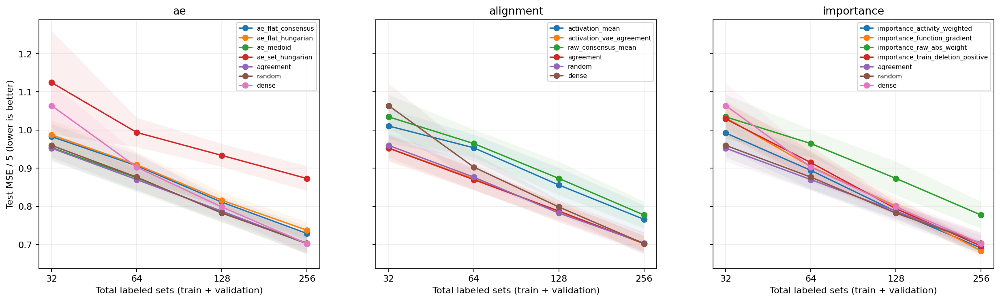
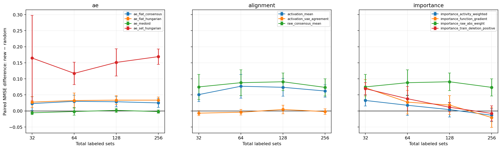

# DeepSets: три направления после диагностики

Все направления используют те же восемь исходных seeds, четыре source-задачи и восемь фиксированных target-задач. GPU распределены 3+3+2. Значения усредняются по задачам и инициализациям внутри seed; интервалы вычислены по восьми seeds. Это условная вариативность обучения на фиксированном наборе задач, а не независимые 256 повторов.

Каждый target-бюджет включает train и checkpoint validation. Test не используется для извлечения масок или выбора метода. Все sparse маски имеют 5018 связей. Численные веса обучаются заново; сохранены все выбранные checkpoints.

Замена VAE на детерминированные AE не устранила усреднение: разнообразие реконструкций внутри задачи составляет лишь около 13–20% разнообразия исходных карт. Flat AE и Set AE уступают random при бюджете 256. Функциональное выравнивание повышает воспроизводимость сопоставления нейронов, но VAE agreement после него почти не меняет перенос. Функциональные importance scores полезнее |W| для выбора значимых связей исходной модели и лучше raw-среднего на новых задачах. Однако ни один новый метод при бюджете 256 не показал преимущества над random с парным 95% интервалом, лежащим целиком ниже нуля. Это не доказывает невозможность переноса: проверены конкретные банки, задачи и протокол.

Ось X — общий бюджет размеченных наборов, Y — test MSE/5; меньше лучше. Три панели показывают направления, полосы — 95% t-интервалы по seeds.

Разность нового метода и random на одинаковых seeds/задачах/инициализациях; отрицательное значение выгодно новому методу. Интервалы 95%, без коррекции множественных сравнений; выводы исследовательские.

[Ускорение вычислений, проверка совпадения и наблюдения загрузки GPU](performance/REPORT.md). Восемь условий обучаются вместе; очередь допускает два процесса на карту. На контрольном замере ускорение 1.56×, выбранные веса и test NMSE совпали точно.

## ae

Парное отличие от random при бюджете 256 наборов. Интервал, включающий ноль, не подтверждает преимущество; положительное отличие означает более высокую ошибку.

| Метод | NMSE − random | 95% CI |
|---|---:|---|
| ae_flat_consensus | +0.025083 | [+0.010944, +0.039222] |
| ae_flat_hungarian | +0.033658 | [+0.023675, +0.043641] |
| ae_medoid | -0.001914 | [-0.006922, +0.003094] |
| ae_set_hungarian | +0.169097 | [+0.145174, +0.193019] |

| Метод | Бюджет | NMSE | 95% CI |
|---|---:|---:|---|
| ae_flat_consensus | 32 | 0.982447 | [0.949213, 1.015681] |
| ae_flat_consensus | 64 | 0.906295 | [0.877500, 0.935090] |
| ae_flat_consensus | 128 | 0.810703 | [0.795367, 0.826039] |
| ae_flat_consensus | 256 | 0.728709 | [0.709698, 0.747720] |
| ae_flat_hungarian | 32 | 0.986979 | [0.948741, 1.025218] |
| ae_flat_hungarian | 64 | 0.908753 | [0.875781, 0.941724] |
| ae_flat_hungarian | 128 | 0.815710 | [0.794503, 0.836917] |
| ae_flat_hungarian | 256 | 0.737284 | [0.715593, 0.758975] |
| ae_medoid | 32 | 0.953716 | [0.921167, 0.986265] |
| ae_medoid | 64 | 0.874609 | [0.836842, 0.912376] |
| ae_medoid | 128 | 0.783910 | [0.758420, 0.809399] |
| ae_medoid | 256 | 0.701712 | [0.674633, 0.728790] |
| ae_set_hungarian | 32 | 1.124133 | [0.988788, 1.259478] |
| ae_set_hungarian | 64 | 0.993440 | [0.954992, 1.031889] |
| ae_set_hungarian | 128 | 0.933206 | [0.903281, 0.963131] |
| ae_set_hungarian | 256 | 0.872723 | [0.840270, 0.905175] |
| agreement | 32 | 0.952154 | [0.917194, 0.987114] |
| agreement | 64 | 0.869866 | [0.841378, 0.898354] |
| agreement | 128 | 0.787270 | [0.764757, 0.809784] |
| agreement | 256 | 0.702329 | [0.681193, 0.723465] |
| dense | 32 | 1.063629 | [1.005793, 1.121466] |
| dense | 64 | 0.902614 | [0.865534, 0.939694] |
| dense | 128 | 0.798101 | [0.780309, 0.815894] |
| dense | 256 | 0.702120 | [0.673230, 0.731009] |
| mean | 32 | 1.034288 | [0.976503, 1.092073] |
| mean | 64 | 0.964326 | [0.928024, 1.000627] |
| mean | 128 | 0.872941 | [0.829054, 0.916828] |
| mean | 256 | 0.777032 | [0.742046, 0.812019] |
| random | 32 | 0.959456 | [0.928104, 0.990807] |
| random | 64 | 0.876365 | [0.842706, 0.910024] |
| random | 128 | 0.782087 | [0.758438, 0.805736] |
| random | 256 | 0.703626 | [0.676255, 0.730997] |
| single_vae | 32 | 0.952069 | [0.921127, 0.983011] |
| single_vae | 64 | 0.870780 | [0.845193, 0.896367] |
| single_vae | 128 | 0.783693 | [0.761252, 0.806133] |
| single_vae | 256 | 0.704179 | [0.679179, 0.729180] |

Контроль воспроизведения исходных методов: максимальная абсолютная разница NMSE 0.
[Парные сравнения и значения по seeds](ae/transfer_summary.json).
[Dense и все маски с обученными весами](ae/weight_heatmaps/README.md).

[Диагностика направления: REPORT.md](ae/REPORT.md).

## alignment

Парное отличие от random при бюджете 256 наборов. Интервал, включающий ноль, не подтверждает преимущество; положительное отличие означает более высокую ошибку.

| Метод | NMSE − random | 95% CI |
|---|---:|---|
| activation_mean | +0.062098 | [+0.042562, +0.081633] |
| activation_vae_agreement | -0.002019 | [-0.010668, +0.006630] |
| raw_consensus_mean | +0.073406 | [+0.046677, +0.100136] |

| Метод | Бюджет | NMSE | 95% CI |
|---|---:|---:|---|
| activation_mean | 32 | 1.010379 | [0.965468, 1.055291] |
| activation_mean | 64 | 0.953235 | [0.918900, 0.987570] |
| activation_mean | 128 | 0.855692 | [0.810875, 0.900509] |
| activation_mean | 256 | 0.765724 | [0.728693, 0.802755] |
| activation_vae_agreement | 32 | 0.952613 | [0.920759, 0.984466] |
| activation_vae_agreement | 64 | 0.872343 | [0.844066, 0.900620] |
| activation_vae_agreement | 128 | 0.786607 | [0.758882, 0.814333] |
| activation_vae_agreement | 256 | 0.701607 | [0.681604, 0.721610] |
| agreement | 32 | 0.952154 | [0.917194, 0.987114] |
| agreement | 64 | 0.869866 | [0.841378, 0.898354] |
| agreement | 128 | 0.787270 | [0.764757, 0.809784] |
| agreement | 256 | 0.702329 | [0.681193, 0.723465] |
| dense | 32 | 1.063629 | [1.005793, 1.121466] |
| dense | 64 | 0.902614 | [0.865534, 0.939694] |
| dense | 128 | 0.798101 | [0.780309, 0.815894] |
| dense | 256 | 0.702120 | [0.673230, 0.731009] |
| mean | 32 | 1.034288 | [0.976503, 1.092073] |
| mean | 64 | 0.964326 | [0.928024, 1.000627] |
| mean | 128 | 0.872941 | [0.829054, 0.916828] |
| mean | 256 | 0.777032 | [0.742046, 0.812019] |
| random | 32 | 0.959456 | [0.928104, 0.990807] |
| random | 64 | 0.876365 | [0.842706, 0.910024] |
| random | 128 | 0.782087 | [0.758438, 0.805736] |
| random | 256 | 0.703626 | [0.676255, 0.730997] |
| raw_consensus_mean | 32 | 1.034288 | [0.976503, 1.092073] |
| raw_consensus_mean | 64 | 0.964326 | [0.928024, 1.000627] |
| raw_consensus_mean | 128 | 0.872941 | [0.829054, 0.916828] |
| raw_consensus_mean | 256 | 0.777032 | [0.742046, 0.812019] |
| single_vae | 32 | 0.952069 | [0.921127, 0.983011] |
| single_vae | 64 | 0.870780 | [0.845193, 0.896367] |
| single_vae | 128 | 0.783693 | [0.761252, 0.806133] |
| single_vae | 256 | 0.704179 | [0.679179, 0.729180] |

Контроль воспроизведения исходных методов: максимальная абсолютная разница NMSE 0.
[Парные сравнения и значения по seeds](alignment/normalized_final/transfer_summary.json).
[Dense и все маски с обученными весами](alignment/weight_heatmaps/README.md).

[Диагностика направления: ALIGNMENT_REPORT.md](alignment/normalized_final/ALIGNMENT_REPORT.md).

## importance

Парное отличие от random при бюджете 256 наборов. Интервал, включающий ноль, не подтверждает преимущество; положительное отличие означает более высокую ошибку.

| Метод | NMSE − random | 95% CI |
|---|---:|---|
| importance_activity_weighted | -0.013351 | [-0.033466, +0.006765] |
| importance_function_gradient | -0.020567 | [-0.050959, +0.009824] |
| importance_raw_abs_weight | +0.073406 | [+0.046677, +0.100136] |
| importance_train_deletion_positive | -0.007735 | [-0.031329, +0.015859] |

| Метод | Бюджет | NMSE | 95% CI |
|---|---:|---:|---|
| agreement | 32 | 0.952154 | [0.917194, 0.987114] |
| agreement | 64 | 0.869866 | [0.841378, 0.898354] |
| agreement | 128 | 0.787270 | [0.764757, 0.809784] |
| agreement | 256 | 0.702329 | [0.681193, 0.723465] |
| dense | 32 | 1.063629 | [1.005793, 1.121466] |
| dense | 64 | 0.902614 | [0.865534, 0.939694] |
| dense | 128 | 0.798101 | [0.780309, 0.815894] |
| dense | 256 | 0.702120 | [0.673230, 0.731009] |
| importance_activity_weighted | 32 | 0.992092 | [0.950265, 1.033919] |
| importance_activity_weighted | 64 | 0.894018 | [0.845305, 0.942731] |
| importance_activity_weighted | 128 | 0.786199 | [0.767874, 0.804523] |
| importance_activity_weighted | 256 | 0.690275 | [0.674405, 0.706145] |
| importance_function_gradient | 32 | 1.031647 | [0.986479, 1.076815] |
| importance_function_gradient | 64 | 0.903786 | [0.862829, 0.944744] |
| importance_function_gradient | 128 | 0.800343 | [0.776548, 0.824138] |
| importance_function_gradient | 256 | 0.683059 | [0.666570, 0.699547] |
| importance_raw_abs_weight | 32 | 1.034288 | [0.976503, 1.092073] |
| importance_raw_abs_weight | 64 | 0.964326 | [0.928024, 1.000627] |
| importance_raw_abs_weight | 128 | 0.872941 | [0.829054, 0.916828] |
| importance_raw_abs_weight | 256 | 0.777032 | [0.742046, 0.812019] |
| importance_train_deletion_positive | 32 | 1.028830 | [0.987562, 1.070097] |
| importance_train_deletion_positive | 64 | 0.914421 | [0.871437, 0.957404] |
| importance_train_deletion_positive | 128 | 0.793570 | [0.777696, 0.809443] |
| importance_train_deletion_positive | 256 | 0.695891 | [0.682050, 0.709732] |
| mean | 32 | 1.034288 | [0.976503, 1.092073] |
| mean | 64 | 0.964326 | [0.928024, 1.000627] |
| mean | 128 | 0.872941 | [0.829054, 0.916828] |
| mean | 256 | 0.777032 | [0.742046, 0.812019] |
| random | 32 | 0.959456 | [0.928104, 0.990807] |
| random | 64 | 0.876365 | [0.842706, 0.910024] |
| random | 128 | 0.782087 | [0.758438, 0.805736] |
| random | 256 | 0.703626 | [0.676255, 0.730997] |
| single_vae | 32 | 0.952069 | [0.921127, 0.983011] |
| single_vae | 64 | 0.870780 | [0.845193, 0.896367] |
| single_vae | 128 | 0.783693 | [0.761252, 0.806133] |
| single_vae | 256 | 0.704179 | [0.679179, 0.729180] |

Контроль воспроизведения исходных методов: максимальная абсолютная разница NMSE 0.
[Парные сравнения и значения по seeds](importance/fp32_final/transfer_summary.json).
[Dense и все маски с обученными весами](importance/weight_heatmaps/README.md).

[Диагностика направления: REPORT.md](importance/fp32_final/REPORT.md).
