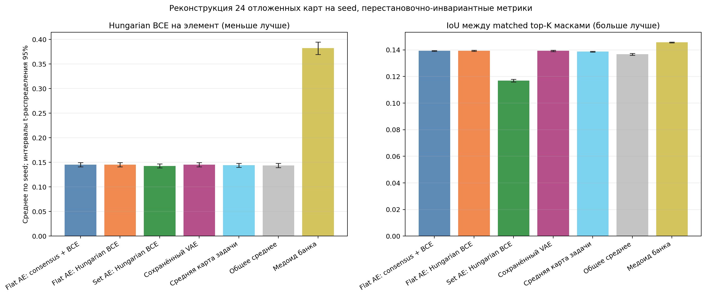
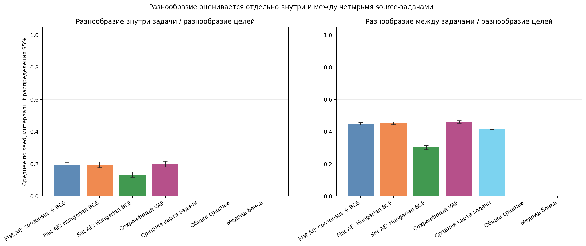
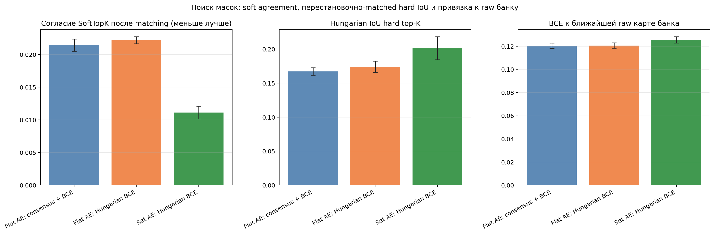

# Детерминированные AE для карт DeepSets

Завершено seed: 8/8 — [4100, 4101, 4102, 4103, 4104, 4105, 4106, 4107]. Ожидают завершения: нет.
Все интервалы и средние сначала агрегированы внутри seed по 24 отложенным картам и четырём source-задачам. Интервал 95% рассчитан по восьми (или имеющимся) seed, а не по картам как независимым повторам.

## Реконструкция отложенных карт

BCE и exact top-K IoU вычислены одной перестановочно-инвариантной метрикой для трёх AE, сохранённого VAE, средних карт и медоида. Для каждой пары карт Hungarian выбирает соответствие скрытых колонок отдельно по BCE и IoU. Ни метрика, ни target-задачи не выбирали маски.

| Метод | Hungarian BCE на элемент, ниже лучше | Matched top-K IoU, выше лучше | Разнообразие внутри задачи / цели |
|---|---:|---:|---:|
| Flat AE: consensus + BCE | 0.1455 [0.1411; 0.1499] | 0.1393 [0.1390; 0.1396] | 0.1933 [0.1748; 0.2118] |
| Flat AE: Hungarian BCE | 0.1453 [0.1410; 0.1497] | 0.1393 [0.1390; 0.1397] | 0.1954 [0.1772; 0.2136] |
| Set AE: Hungarian BCE | 0.1429 [0.1387; 0.1470] | 0.1168 [0.1158; 0.1178] | 0.1345 [0.1184; 0.1506] |
| Сохранённый VAE | 0.1453 [0.1410; 0.1496] | 0.1392 [0.1388; 0.1397] | 0.1996 [0.1817; 0.2174] |
| Средняя карта задачи | 0.1441 [0.1399; 0.1483] | 0.1386 [0.1383; 0.1390] | 0.0000 [0.0000; 0.0000] |
| Общее среднее | 0.1436 [0.1394; 0.1479] | 0.1367 [0.1360; 0.1374] | 0.0000 [0.0000; 0.0000] |
| Медоид банка | 0.3822 [0.3696; 0.3948] | 0.1456 [0.1453; 0.1459] | 0.0000 [0.0000; 0.0000] |

## Разнообразие и поиск согласия

Внутри-task diversity сравнивает шесть отложенных карт одной задачи и помогает обнаружить схлопывание в постоянное предсказание. Межзадачное значение приведено отдельно и не подменяет эту проверку. Agreement использует SoftTopK-карты после Hungarian matching; hard IoU также сопоставляет колонки по IoU. В качестве нуля показаны независимые случайные exact-K маски, а равномерная soft-карта имеет нулевое согласие по построению и высокую softness.

| Метод | Soft agreement MSE | Hard matched IoU | Случайный exact-K null | Raw bank-anchor BCE/entry | Softness | Код: mean/max dist/radius; среднее r=0 задач; used/direct radius |
|---|---:|---:|---:|---:|---:|---:|
| Flat AE: consensus + BCE | 0.0214 [0.0205; 0.0224] | 0.1672 [0.1616; 0.1728] | 0.1460 [0.1457; 0.1463] | 0.1205 [0.1181; 0.1228] | 0.1243 [0.1228; 0.1258] | 0.9500 [0.9500; 0.9500] / 0.9500 [0.9500; 0.9500]; 0.00 [0.00; 0.00]/4; radius/direct NN=1.0000 [1.0000; 1.0000] |
| Flat AE: Hungarian BCE | 0.0222 [0.0216; 0.0227] | 0.1740 [0.1658; 0.1823] | 0.1457 [0.1454; 0.1461] | 0.1206 [0.1183; 0.1229] | 0.1244 [0.1234; 0.1254] | 0.9485 [0.9449; 0.9521] / 0.9500 [0.9500; 0.9500]; 0.00 [0.00; 0.00]/4; radius/direct NN=1.0000 [1.0000; 1.0000] |
| Set AE: Hungarian BCE | 0.0111 [0.0101; 0.0121] | 0.2014 [0.1846; 0.2182] | 0.1457 [0.1452; 0.1462] | 0.1256 [0.1229; 0.1282] | 0.1377 [0.1359; 0.1395] | 0.9500 [0.9500; 0.9500] / 0.9500 [0.9500; 0.9500]; 0.00 [0.00; 0.00]/4; radius/direct NN=1.0000 [1.0000; 1.0000] |

## Исправление cdist и побитовая проверка масок

Исправление выполнено для 8 seed без переобучения AE. Изменённые маски требуют повторного target fit для seed [4100, 4101, 4102, 4103, 4104, 4105, 4106, 4107]; его статус сохранён в `target_refit_status.json`. Старые маски и состояния сохранены в `cdist_attempt/`.

| Метод | Старый cdist radius, среднее | Прямой radius, среднее | Нулей старый → новый | Seed с изменением маски | Изменённые replica | Flipped edges |
|---|---:|---:|---:|---:|---:|---:|
| Flat AE: consensus + BCE | 0.362731 | 0.37825 | 0 → 0 | 8 | 32/32 | 396 |
| Flat AE: Hungarian BCE | 0.301057 | 0.321144 | 0 → 0 | 8 | 32/32 | 364 |
| Set AE: Hungarian BCE | 0.0026754 | 0.00845087 | 27 → 0 | 8 | 29/32 | 122 |
| Exact-K медоид | — | — | — | 0 | 0/32 | 0 |

## Параметры и ограничения

Среднее число параметров flat AE: 6451984 [6451984; 6451984]; set AE: 259488 [259488; 259488]. Flat fixed-loss и flat Hungarian-loss используют одинаковые начальные веса, одну train-only consensus-перестановку и одинаковые карты; это изолирует loss в пределах этой модели. Set encoder имеет другую ёмкость.
Сохранённый VAE использует исторический checkpoint, выбранный по BCE плюс KL на validation; здесь его переоценивают общей matched BCE и IoU, но не переотбирают checkpoint. Короткий source-банк содержит 26 training-карт на задачу. Даже хорошая реконструкция или decoder agreement не гарантирует перенос на новые задачи, функциональное совпадение скрытых нейронов либо полезность exact-K маски.
Исправленный agreement-search начинается с кодов реальных training-карт. Радиус каждого локального шара равен 0.5 медианы расстояний до ближайшего другого train-code; расстояния до соседей, центров, при проекции и при финальном аудите вычисляются прямыми float64 residual-нормами. Старые float32 torch.cdist радиусы, маски и target-состояния архивированы и приведены рядом для аудита. Эта train-only локальная поддержка ограничивает область поиска, но не доказывает, что она представляет весь кодовый manifold. Raw BCE anchor использует raw importance до SoftTopK; target labels и held-out source-карты не выбирают коды или маски. Нулевой радиус остаётся когда медиана прямых расстояний до ближайшего соседа равна нулю.

Слева — matched BCE на элемент, меньше лучше; справа — совпадение top-K масок после сопоставления колонок, больше лучше. Средние карты дают контроль постоянного предсказания. Ошибки — 95% t-интервалы по восьми seeds.

Ось Y — отношение разнообразия реконструкций к разнообразию исходных карт, отдельно внутри одной задачи и между задачами. Ноль соответствует постоянной реконструкции, единица — исходному уровню разнообразия. Все AE сохраняют лишь небольшую часть разнообразия карт.

Три панели показывают расстояние между согласованными soft-картами (меньше лучше), IoU бинарных масок (больше лучше) и BCE до ближайшей raw-карты банка (меньше лучше). Высокое внутреннее согласие само по себе не подтверждает перенос: downstream-кривые и сравнение с random приведены в общем отчёте.

PDF-копии имеют те же имена. Полные значения по seed сохранены в `aggregate_metrics.json`.
