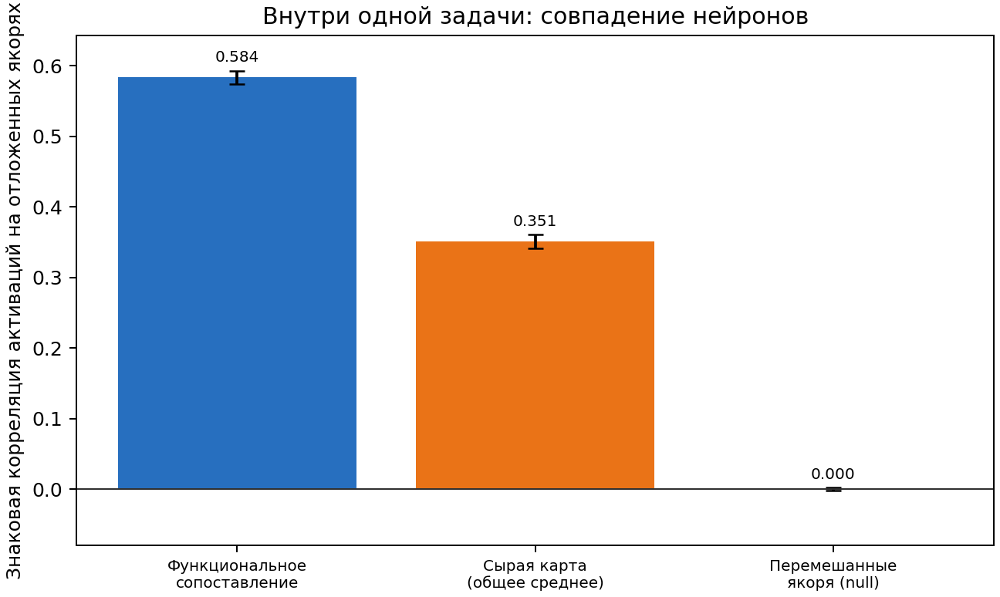
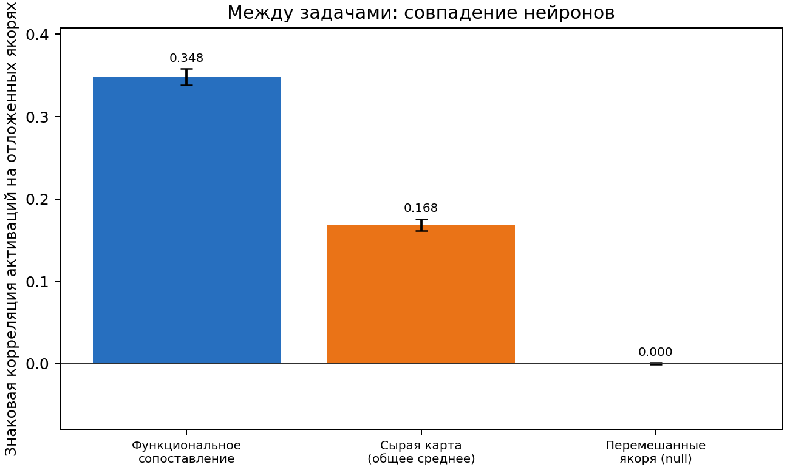
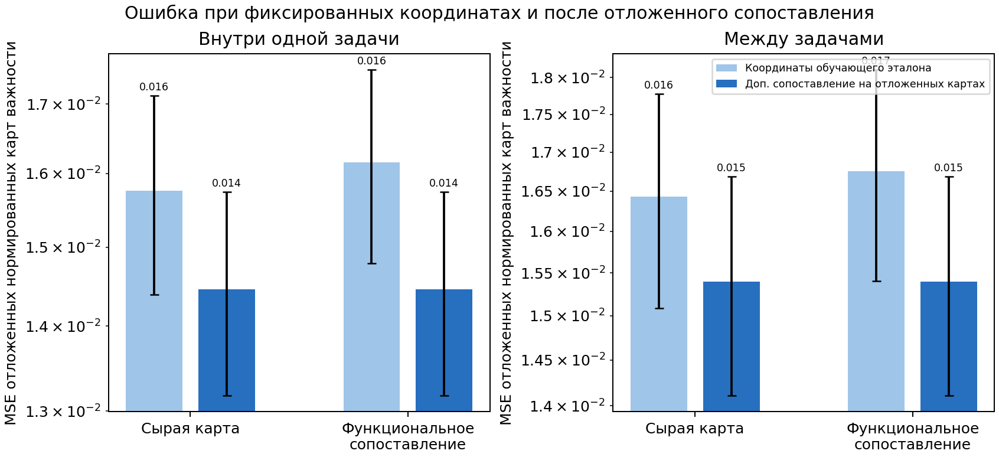
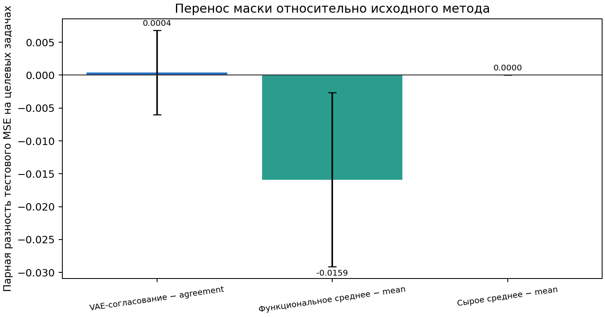

# Функциональное выравнивание активаций DeepSets

Для каждого выбранного исходного нейросетевого состояния сохранены полные знаковые параметры. Нейроны сопоставляются по корреляции Пирсона для `tanh(x @ (W * M) + b)` на фиксированных изображениях из `source_train`; метки классов не используются. Совместная смена знака весов входа, смещения и весов readout учитывается как симметрия функции. Почти постоянные нейроны исключаются только из статистики сопоставления и корреляций. Их исходные значения карт важности сохраняются: для среднего и VAE переставляются столбцы, без зануления или фильтрации.

Разбиение карт воспроизводит CUDA-генератор пилота: `seed + 50000 + 101`, исходный порядок четырёх задач и отсортированные уникальные карты. Эталон строится только на обучающих картах банков, карты валидации сопоставляются с этим эталоном. Для активационного сопоставления 512 якорных изображений задают соответствия, ещё 512 непересекающихся изображений из того же `source_train` оценивают перенос соответствий. Обе подвыборки получены из пула, на котором обучались исходные модели, поэтому это проверка на отдельной подвыборке якорей, а не на ранее не виденных изображениях. Целевые и тестовые метки не участвуют в извлечении масок.

## Корреляции активаций на отложенных якорях

Первые два рисунка показывают знаковую корреляцию пар нейронов на отложенной подвыборке якорей после подгонки соответствий на первой подвыборке. Сначала усредняются пары внутри каждого seed; столбец показывает среднее по восьми seed, усики — стандартное отклонение между seed. Null-проверка сохраняет найденные пары, но случайно переставляет строки изображений во второй модели.

Внутри одной задачи: корреляция после функционального сопоставления 0.584 (SD по seed 0.010); соответствие сырого среднего, обученное на исходных картах, — 0.351 (SD 0.010); null после перемешивания — 0.000 (SD 0.002).

 [PDF](heldout_activation_within_task.pdf)

Между задачами: корреляция после функционального сопоставления 0.348 (SD по seed 0.010); соответствие сырого среднего, обученное на исходных картах, — 0.168 (SD 0.007); null после перемешивания — 0.000 (SD 0.001).

 [PDF](heldout_activation_cross_task.pdf)

## Ошибка сопоставления карт и новые маски

Карта потерь строится по исходным `bank['maps']`: каждая карта уже нормирована исходным экспортёром отдельно для своей модели делением на максимум `abs(W) * M`. Поэтому сравнение изолирует перестановку скрытых координат. `raw_consensus_mean` воспроизводит исходные четыре итерации сырого сопоставления; перед целевым обучением его маска побитово проверяется на равенство `masks.pt['mean']` каждого seed. `activation_mean` и VAE получают те же нормированные значения с переставленными по функциям столбцами. Для VAE использованы латентный размер 16, ширина 128, 160 эпох и поиск согласия на 4 стартах по 400 шагов. Все маски бинарны и содержат ровно 5 018 рёбер.

На рисунке MSE для фиксированных координат измеряет качество карт относительно эталона, полученного на обучающих картах. Дополнительное Hungarian-сопоставление на отложенных картах показано как диагностическая нижняя граница; оно не используется при обучении масок. Отдельно показаны результаты внутри одной задачи и между задачами: разные cost-задачи не обязаны использовать одни и те же скрытые нейроны.

При фиксированных координатах MSE внутри задачи составляет 0.0158 для сырого среднего и 0.0162 после функционального выравнивания; между задачами — 0.0164 и 0.0168. После дополнительного сопоставления на отложенных картах ошибки совпадают: 0.0145 внутри задачи и 0.0154 между задачами.

 [PDF](heldout_map_losses.pdf)

## Парная оценка переноса на целевые задачи

Оценка на целевых задачах запускается после сохранения масок, извлечённых только из исходных банков. Для каждого seed сравниваются пять исходных методов и три новые маски: 8 задач × 4 бюджета × 4 парные инициализации (1 024 записи). На рисунке приведена парная разность MSE нового метода и соответствующего исходного метода; отрицательное значение означает улучшение. Усики показывают стандартное отклонение восьми средних по seed.

 [PDF](target_paired_effects.pdf)

VAE-согласование относительно agreement: средний целевой MSE 0.8283 (SD по seed 0.0278); парная разность +0.0004 (SD по seed 0.0064).
Функциональное среднее относительно mean: средний целевой MSE 0.8963 (SD по seed 0.0375); парная разность -0.0159 (SD по seed 0.0132).
Исходное среднее относительно mean: средний целевой MSE 0.9121 (SD по seed 0.0401); парная разность +0.0000 (SD по seed 0.0000).

## Ограничения и вывод

Функциональное сопоставление повышает корреляцию на второй подвыборке якорей по сравнению с соответствиями, найденными по нормированным картам. Это подтверждает воспроизводимость сопоставления на выбранных якорях, но не означает, что каждый нейрон общий для моделей или что межзадачная пара переносится на произвольные задачи. Пары зависимы; SD отражает разброс восьми seed и не является доверительным интервалом. Контрольные исходные методы сохраняют парные инициализации, а их численная проверка должна проходить порогом `1e-4`.
На целевых задачах функциональная средняя дала среднюю парную разность `−0.0159` относительно исходного `mean`; VAE-согласование осталось близко к `agreement` (`+0.0004`), а контрольное сырое среднее точно совпало с `mean`. Это описательные результаты по восьми seed; стандартное отклонение между seed не следует трактовать как доверительный интервал.

Точные значения рисунков и попарная диагностика сохранены в `plotted_values.json`; перестановки, знаки и полные выровненные состояния — в `source_alignment.pt`. Протокол, разбиения, контроль равенства исходному среднему и хэши кода лежат в каталогах seed.
