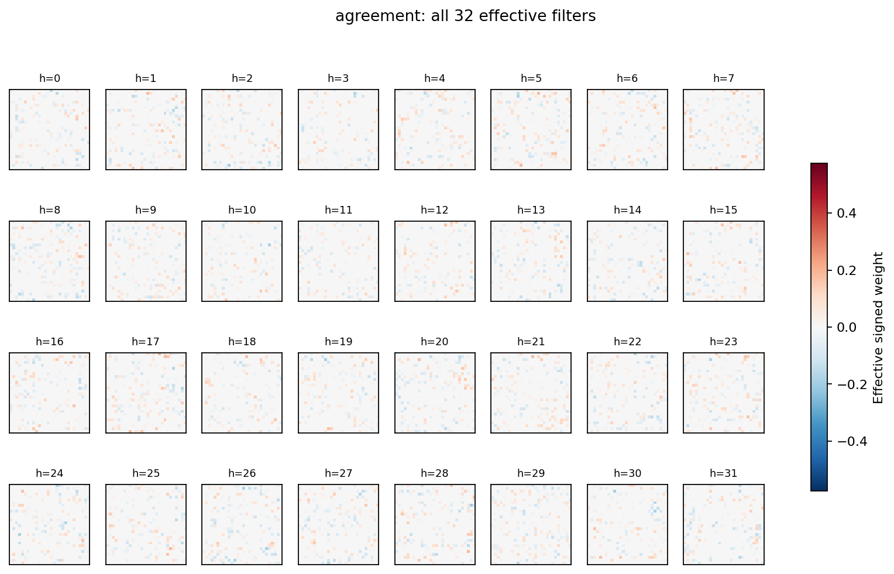
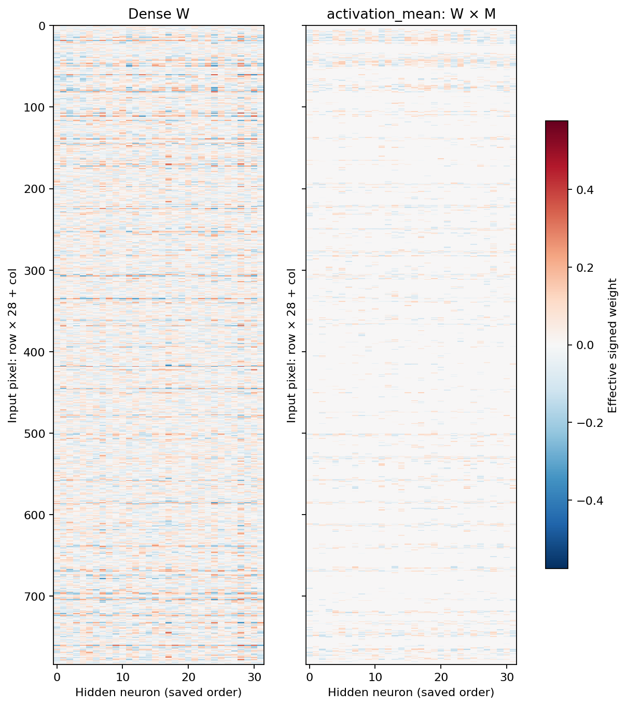
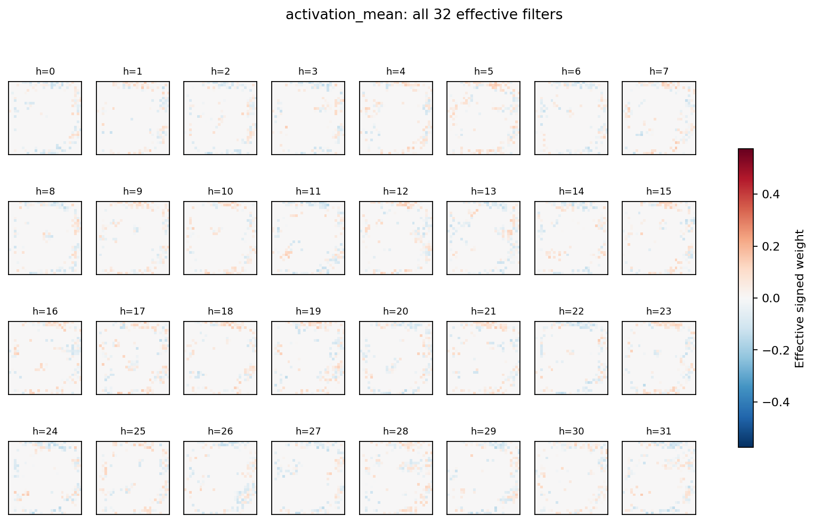
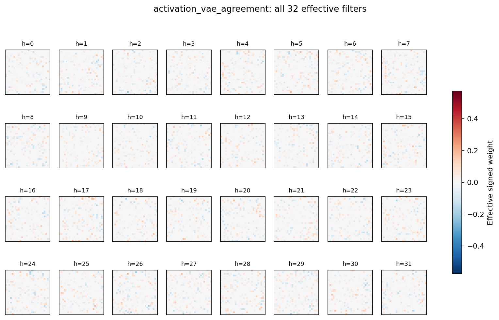
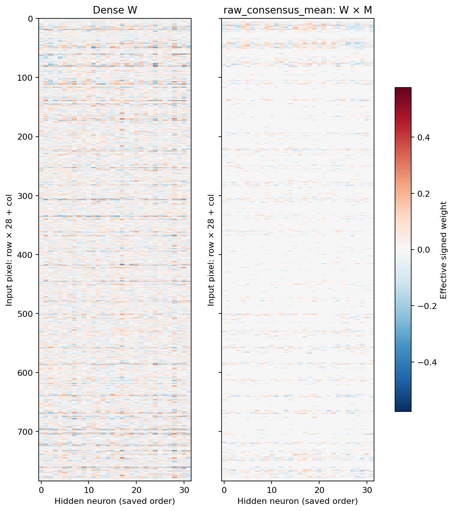
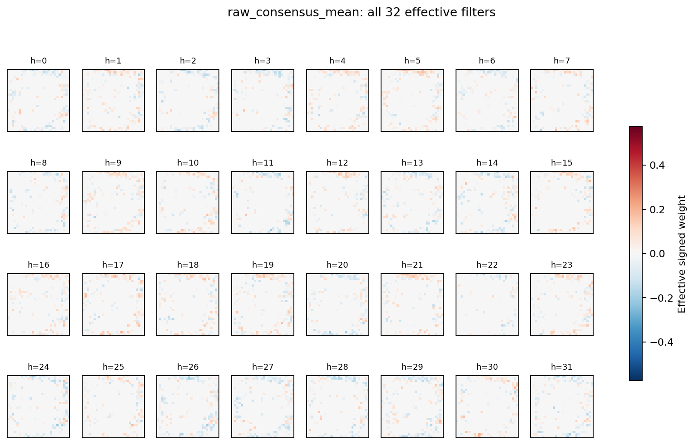

# Heatmaps обученных весов

Пример выбран заранее: seed 4100, target task 0, бюджет 256 наборов, init 0. Цвет — эффективный подписанный вес W×M; неактивные связи равны точно нулю. Колонки сохранены в исходном порядке. Во всех направлениях одна цветовая шкала.

Матрицы 784×32: строки — входные пиксели, колонки — скрытые нейроны. Слева dense, справа dense. Это один парный пример, не средняя карта.

Каждый квадрат — одна колонка в геометрии 28×28. Показывает расположение эффективных связей; без функциональной проверки не доказывает полезность фильтра.

Матрицы 784×32: строки — входные пиксели, колонки — скрытые нейроны. Слева dense, справа agreement. Это один парный пример, не средняя карта.

Каждый квадрат — одна колонка в геометрии 28×28. Показывает расположение эффективных связей; без функциональной проверки не доказывает полезность фильтра.

Матрицы 784×32: строки — входные пиксели, колонки — скрытые нейроны. Слева dense, справа activation_mean. Это один парный пример, не средняя карта.

Каждый квадрат — одна колонка в геометрии 28×28. Показывает расположение эффективных связей; без функциональной проверки не доказывает полезность фильтра.

Матрицы 784×32: строки — входные пиксели, колонки — скрытые нейроны. Слева dense, справа activation_vae_agreement. Это один парный пример, не средняя карта.

Каждый квадрат — одна колонка в геометрии 28×28. Показывает расположение эффективных связей; без функциональной проверки не доказывает полезность фильтра.

Матрицы 784×32: строки — входные пиксели, колонки — скрытые нейроны. Слева dense, справа raw_consensus_mean. Это один парный пример, не средняя карта.

Каждый квадрат — одна колонка в геометрии 28×28. Показывает расположение эффективных связей; без функциональной проверки не доказывает полезность фильтра.
