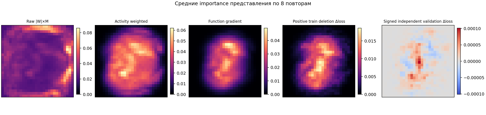
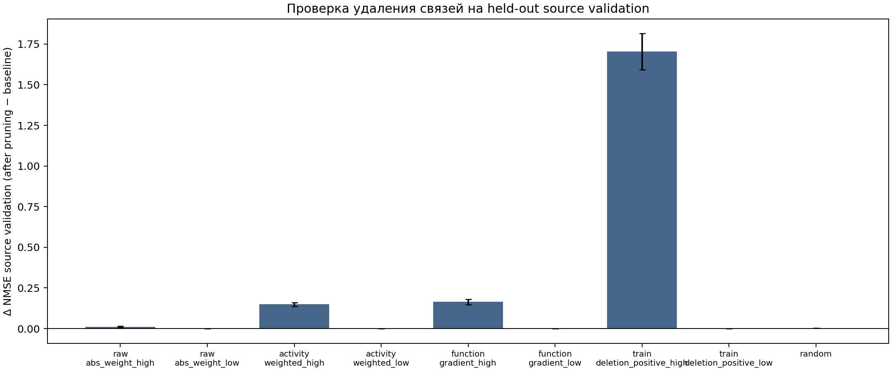
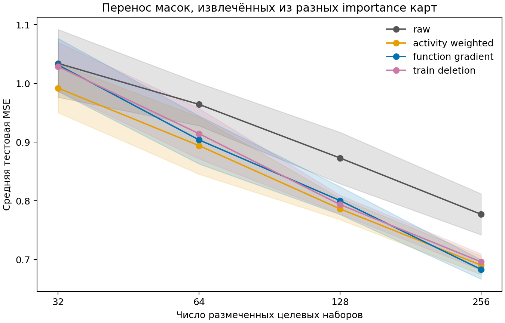

# Проверка представлений importance и функционального вклада

Проверены банки из восьми повторов, по четырём исходным задачам и 32 выбранным моделям в каждой задаче. Сравнены исходные карты `|W|×M`, карты с весом стандартного отклонения пикселя, функциональная оценка через производную `tanh` и точное изменение source-train loss после удаления одной связи.

Для каждого ребра сохранено знаковое `Δloss = loss(после удаления) − loss(до удаления)`. Положительное значение означает, что удаление ухудшило модель; отрицательное — что удаление улучшило loss. Для извлечения бинарной маски использовалась только положительная часть source-train Δloss, отдельно от сохранённого знакового массива. Проверка на source-validation повторно генерирует наборы из отдельного RNG-потока, без совпадений полных наборов с anchors выбора checkpoint. Target labels не использовались для извлечения масок.

## Перенос

Одинаковые четыре consensus-перестановки, вычисленные по train-части исходных raw-карт, применены ко всем вариантам importance. Из среднего согласованного training-набора выбирались ровно 5018 связей. На каждой target-задаче сравнивались одинаковые paired initialization и бюджеты; исходные пять методов повторялись и служили контролем.

Средняя тестовая MSE по 8 повторам (задачи и paired starts усреднены внутри повтора):

| Представление | 32 | 64 | 128 | 256 |
|---|---:|---:|---:|---:|
| Raw `|W|×M` | 1.0343 | 0.9643 | 0.8729 | 0.7770 |
| Activity weighted | 0.9921 | 0.8940 | 0.7862 | 0.6903 |
| Function gradient | 1.0316 | 0.9038 | 0.8003 | 0.6831 |
| Positive train deletion Δloss | 1.0288 | 0.9144 | 0.7936 | 0.6959 |

## Проверка функциональной значимости

График `heldout_pruning_validation.png` показывает изменение source-validation NMSE на свежих наборах после совместного удаления верхних или нижних 2% активных связей по каждому train-derived score, а также случайных 2%. Это прямой пересчёт модели после удаления групп рёбер; он учитывает взаимодействия, которые сумма независимых edge-дельт не отражает. Наборы не совпадают с исходными anchors выбора модели, но используют тот же пул изображений source_validation.

Средняя Spearman-корреляция рангов train score с Δloss на свежих source-validation anchors:

| Train score | Signed heldout Δloss | Positive heldout Δloss |
|---|---:|---:|
| raw_abs_weight | 0.013072392005139705 | 0.0782063825113895 |
| activity_weighted | 0.018086594655612624 | 0.318939664701418 |
| function_gradient | 0.016041274153875785 | 0.3370436971308216 |
| train_deletion_signed | 0.3996077426259905 | 0.3577230494536443 |
| train_deletion_positive | 0.35557916965891256 | 0.43599288749065845 |

**Пояснение.** Первые четыре панели показывают средние нормированные неотрицательные карты. Последняя панель показывает знаковое source-validation Δloss на свежих наборах в diverging шкале: отрицательные значения — связи, удаление которых улучшило loss.

**Пояснение.** Столбец показывает `NMSE после удаления − NMSE исходной модели`; положительное значение означает ухудшение. Ошибки — стандартная ошибка по восьми повторам. Повтор остаётся единицей агрегации.

**Пояснение.** Тестовая MSE усреднена по восьми новым задачам, четырём paired starts и затем по восьми seed-повторам. Полоса — точечный 95%-й интервал по seed-повторам; target labels участвовали только в общих target fit/validation/test оценках.

Ограничение: fixed calibration sets пересэмплируются из source-train пула, использованного при обучении исходного банка. Новые source-validation anchors независимы от выбора на уровне set draws, но тот же source_validation image split использовался для выбора checkpoint и 32 победителей; это не независимый image-level source test. Банки включают только выбранные верхние 32 кандидата из исходных 128. Четыре новых маски-реплики каждого способа совпадают; разброс downstream результата отражает paired target initialization, а не стохастичность извлечения.

Машиночитаемые результаты, исходные signed arrays, provenance, checkpoints целевых моделей и protocol сохранены рядом с этим отчётом.
