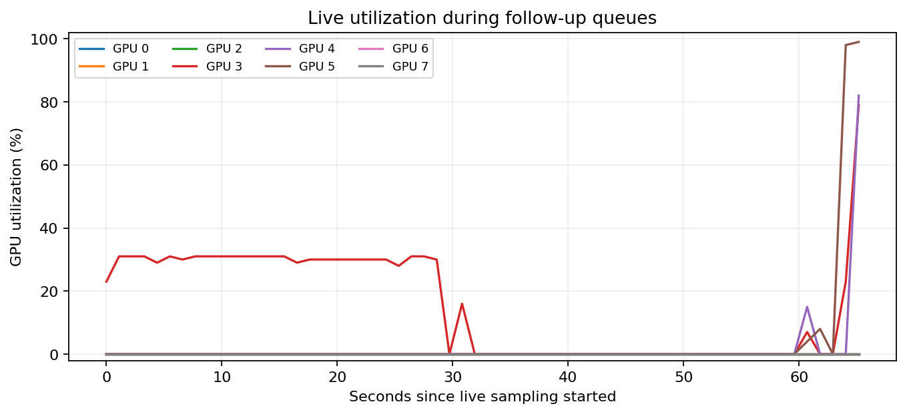

# Ускорение вычислений

Независимые target-задачи и бюджеты объединены по восемь групп. Инициализация, выбор обучающих наборов, Adam и выбор checkpoint остаются отдельными для каждой группы. На каждой выделенной карте очередь допускает два процесса, чтобы перекрывать подготовку данных и вычисления.

Ось Y — время на двух задачах × четырёх бюджетах × 36 моделях, по 800 шагов. Исходный режим: 14.24 с; объединённый: 9.11 с (1.56×). Это один замер скорости, без интервала неопределённости. Все восемь выбранных checkpoints совпали по весам точно; test NMSE и шаг выбора совпали. Небольшое различие служебных train-метрик не превышает 2.4e-7.

Ось X — время наблюдения, Y — загрузка каждой карты. Это короткое наблюдение очереди с разными стадиями, а не парное сравнение старого и нового режима. Направление importance уже закончено; его карты могут простаивать. На этапах matching и подготовки данных загрузка GPU остаётся ниже, чем при обучении target-моделей.

Попытка объединить все матричные произведения в один strided GEMM изменила порядок округления и конечные результаты. Она исключена из итоговых запусков. Рабочий режим сохраняет исходные размеры GEMM и объединяет остальные операции.

[Точные замеры и проверка совпадения](reference_benchmark.json), [сырые наблюдения загрузки](utilization_samples.json).
