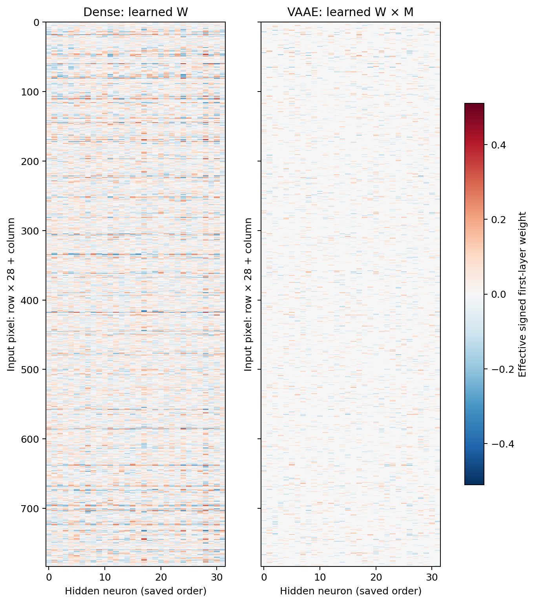
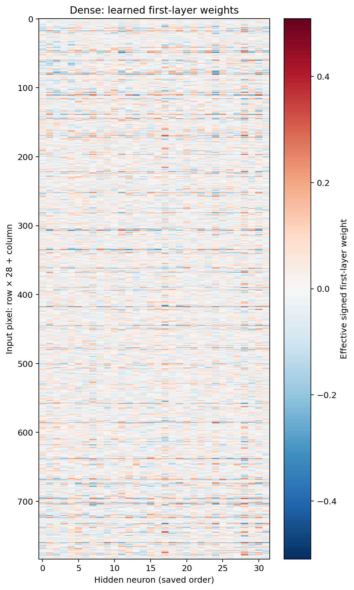
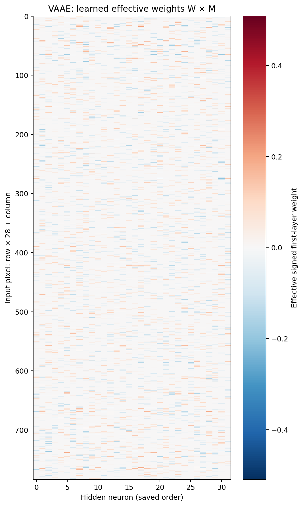
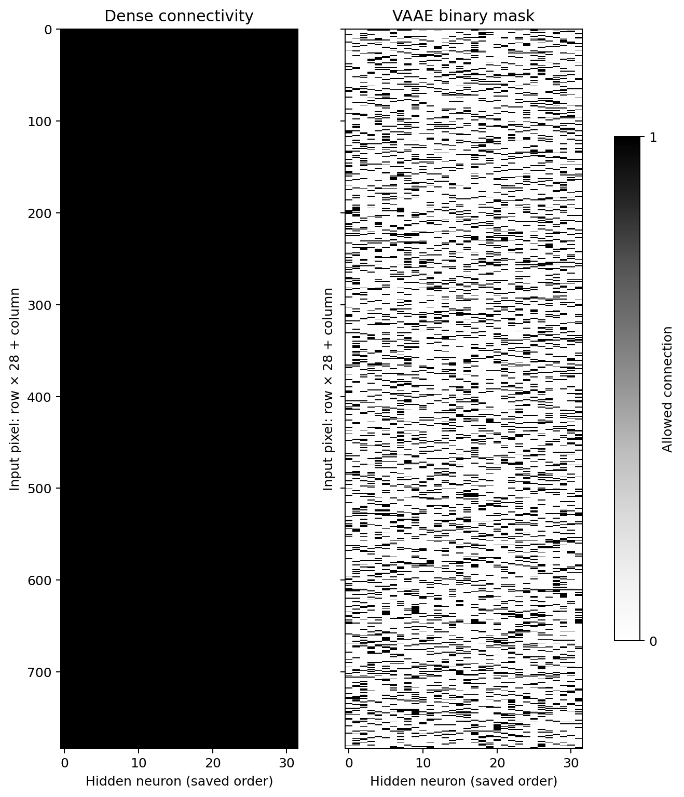
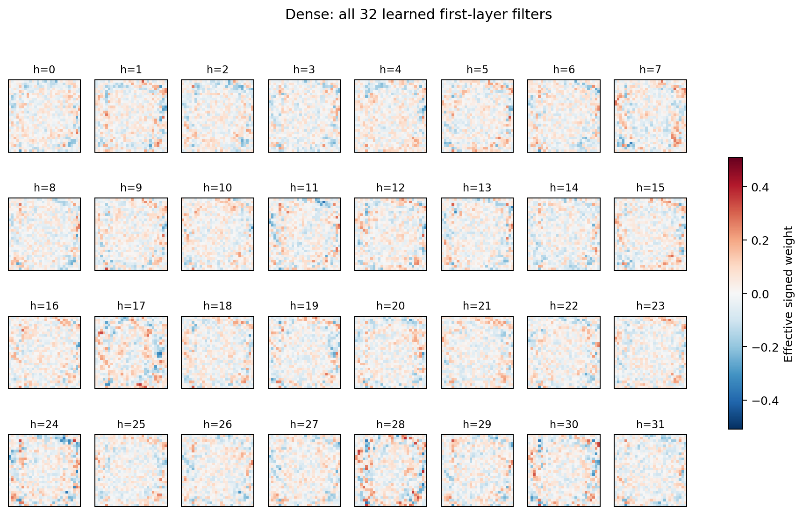
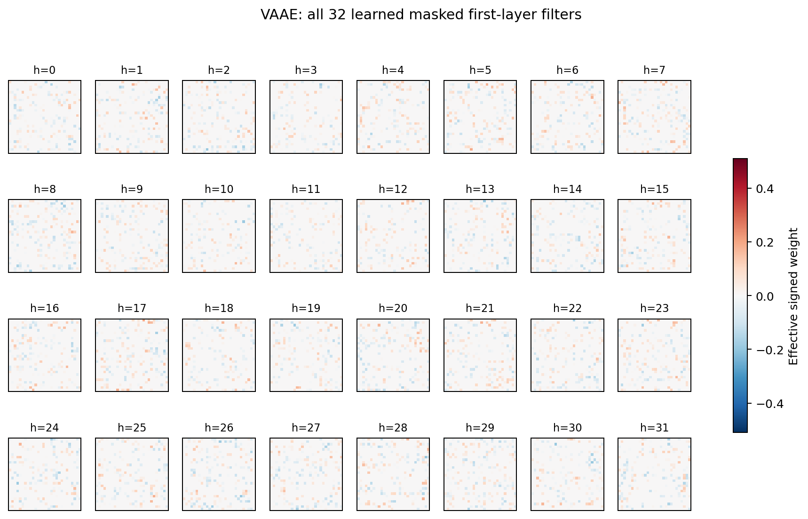

# Heatmap обученных весов: dense и VAAE

Заранее выбранный пример: seed_4100, первая тестовая задача, 256 размеченных наборов, init=0. Это 205 обучающих и 51 validation-набор. Чекпойнт каждого метода выбран только по validation. Для всех методов используются одни и те же данные и парная численная инициализация.

Все веса исходного эксперимента воспроизведены и сохранены отдельно в `weighted_exports/`. Точность воспроизведения проверяется по исходным метрикам; результаты проверки лежат в `weighted_exports/seed_*/export_provenance.json`. Первоначальные результаты не изменены.

## Сопоставление матриц

**Как читать.** По вертикали — 784 пикселя изображения в построчном порядке; по горизонтали — 32 скрытых нейрона. Слева обученная матрица dense W, справа фактические веса нашей сети W⊙M. Красный — положительный вес, синий — отрицательный, белый — около нуля. У масочной сети запрещённые связи строго равны нулю. Общая симметричная цветовая шкала использует максимум абсолютного веса среди всех восьми выбранных пар; значения не обрезаны. Порядок нейронов сохранён, сортировка по качеству или визуальной форме не выполнялась.

**Вывод и границы.** График показывает фактически обученные численные веса, а не только разрешённые связи. Матрица первого слоя не определяет всю функцию сети: biases и readout также сохранены в численных чекпойнтах. Сходство цветов между столбцами разных сетей не означает соответствие функций нейронов.

## Dense отдельно

**Как читать.** Это левая матрица предыдущего графика в отдельном файле, с теми же осями и цветовой шкалой. Все связи разрешены; величина и знак веса обучены на выбранной задаче.

## VAAE отдельно

**Как читать.** Это правая матрица сравнения: W⊙M. Белые запрещённые связи — точные нули; малые обученные активные веса тоже выглядят почти белыми, поэтому для различения разрешённости связи ниже показана сама бинарная маска.

## Бинарные маски

**Как читать.** Те же оси матриц; чёрный означает разрешённую связь, белый — запрещённую. Dense разрешает все 25 088 связей, VAAE — ровно 5 018. Эта картинка показывает поддержку связей независимо от их обученных значений.

## Фильтры dense в геометрии изображения

**Как читать.** Каждый квадрат 28×28 — один столбец dense W, возвращённый в координаты изображения. Показаны все 32 нейрона в сохранённом порядке. Цветовая шкала та же, что на матричных heatmap. Красный и синий обозначают противоположные знаки весов.

## Фильтры VAAE в геометрии изображения

**Как читать.** Каждый квадрат — один столбец W⊙M нашей сети в координатах пикселей. Показаны все 32 нейрона; запрещённые пиксельные связи строго нулевые. Эти фильтры не следует называть обнаруженной свёрткой: веса разных нейронов не разделяются.

Все изображения сохранены в PNG и PDF. Точные массивы выбранного примера — `selected_weight_heatmap_values.npz`; все параметры, включая biases и readout, — в `.pt`-чекпойнтах экспортированных моделей. Для каждого из восьми повторов дополнительно сохранена парная матричная heatmap в его каталоге.
