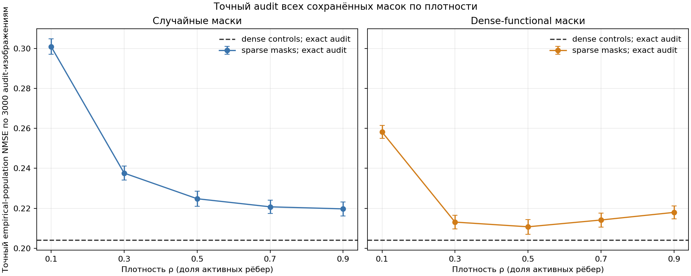
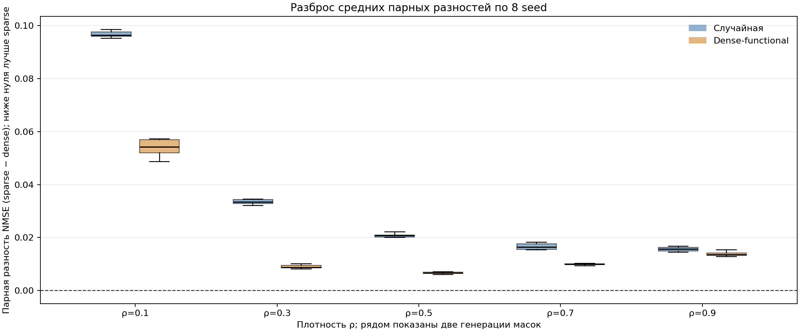
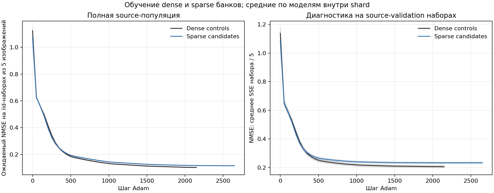
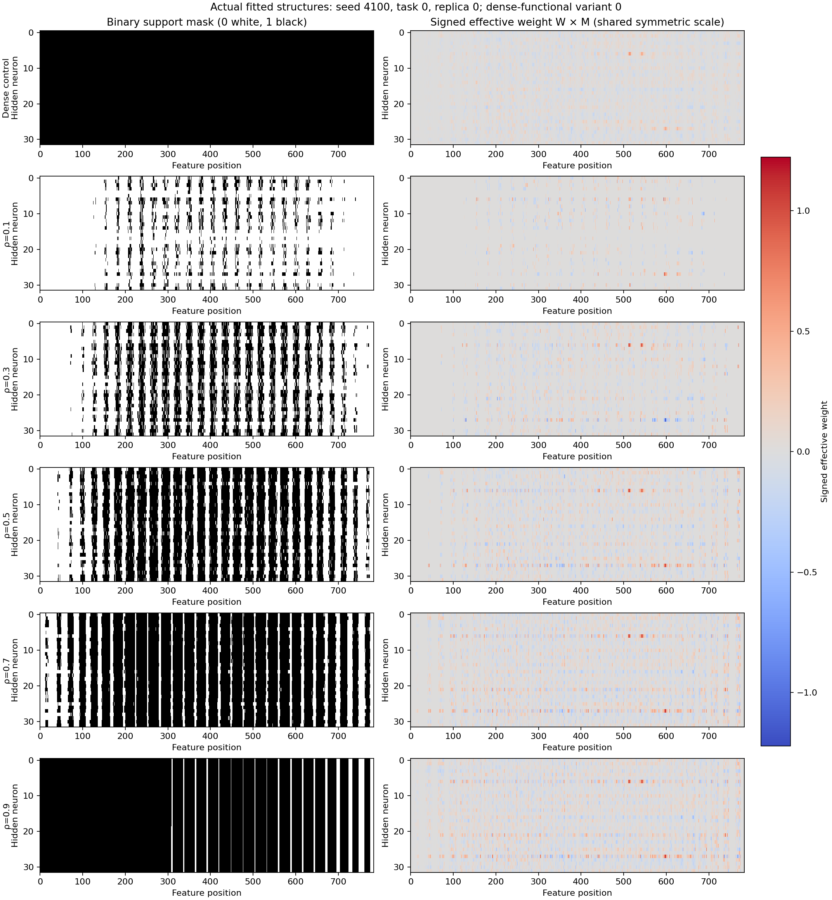
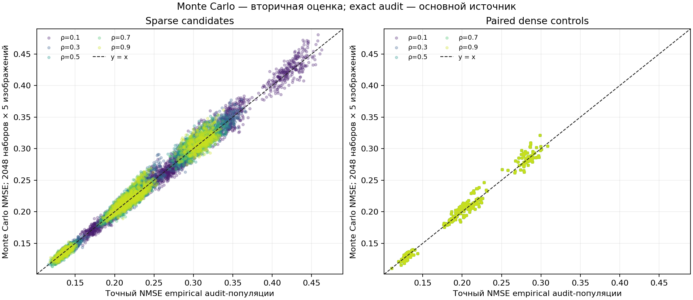
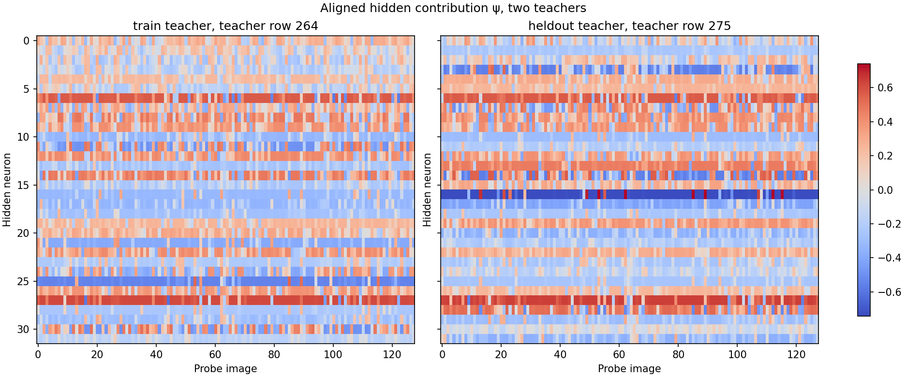
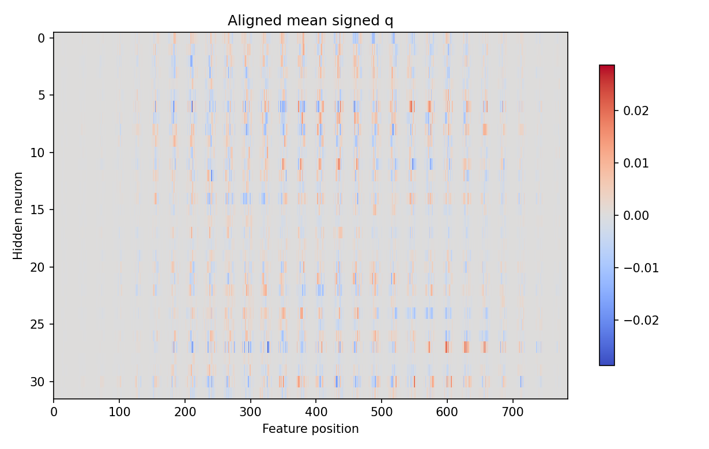
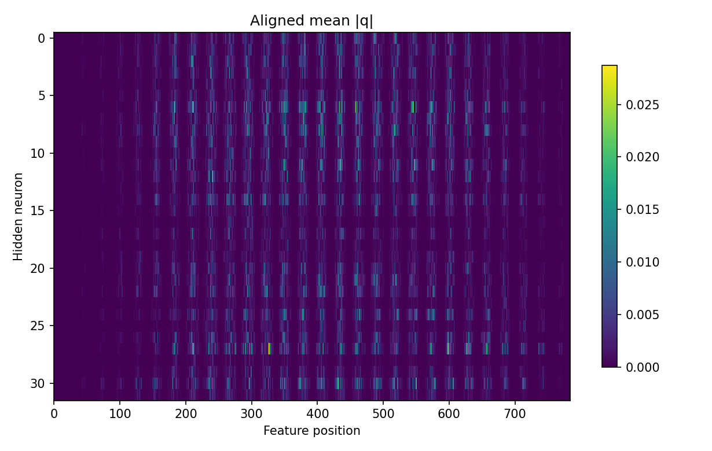

# Перестроенный функциональный банк DeepSets: отчет по source-аудиту

**Статус: полный отчет.** Все ожидаемые seed/task shards и маркеры завершения проверены.

Источник: `/home/udeneev-av/ResearchProject/outputs/deepsets_vaae/20261001_rebuilt_functional_bank`. Ожидались seed 4100–4107 и четыре фиксированных source cost-вектора из одной synthetic task family. Набор содержит **8 seed**, **4 повторяемых cost-векторов** и **10240 sparse fit-решений** плюс **256 dense-control fit-решений**. Четыре вектора — не четыре дополнительных независимых seed или четыре family; часть source-пулов между seed может пересекаться.

## Цель и протокол

Для известной source-функции с индивидуальной целью $c[\mathrm{digit}]$ определим ошибку одного изображения $e(x)=g(x)-c[\mathrm{digit}]$. Для iid-наборов размера пять точная ожидаемая нормированная ошибка равна

$$
\mathbb{E}\left[\frac{(\sum_{i=1}^5 e_i)^2}{5}\right]=\mathbb{E}[e^2]+4\,\mathbb{E}[e]^2.
$$

Эта формула использует привилегию source audit: на этапе построения банка известны индивидуальная целевая метка $c[\mathrm{digit}]$ каждого изображения и полный source image pool. Для будущей target-задачи такие метки отдельных изображений недоступны. DeepSets подгоняются к source-population цели на полном source image pool; градиент получает один packed матричный проход по изображениям и кандидатам. Регуляризатор fit-цели равен

$$
0.5\lambda(\|W\odot M\|_2^2+\|b\|_2^2+\|a\|_2^2+o^2).
$$

Решение о plateau/продлении использует только source population objective. Source-validation query и отдельный audit-набор нужны для диагностики и таблиц; они не управляют градиентом или остановкой.

Sparse shards сохраняют все 320 решений на task: пять плотностей $\rho\in\{0.1,0.3,0.5,0.7,0.9\}$, две recipe (`random`, `dense_functional`), четыре варианта шума и восемь начальных replicas. Dense control сохраняет восемь replicas отдельно. Ни один кандидат не отбирался по audit NMSE. Для каждого sparse-кандидата показано сравнение с dense-моделью той же task и replica; парный разрыв — sparse NMSE минус dense NMSE. Отрицательное значение благоприятствует sparse.

Сначала bank v3 предложил lr=0.002, λ_sparse=0.0001 и λ_dense=0.001 при стохастическом fresh-set обучении. Затем отдельные population pilot и L2 pilot с точной эмпирической population-целью на двух held-out meta-validation cost-задачах при предложенном lr=0.002 варьировали и независимо проверяли L2-регуляризацию. Фактический production снимок использовал этот optimizer при аналитической population-цели, decay=500, cap=4000, minimum=1000. Предварительное предложение, подтверждение и production-run — отдельные этапы; audit NMSE не выбирал кандидаты или настройки. Population fit использовал cap 4000, minimum 1000 и decay каждые 500 шагов; дополнительные шаги задавались plateau-флагом source objective.

Это source-аудит. Он не переносит индивидуальные source-цели $c[\mathrm{digit}]$ на target task: target child по-прежнему получает только наблюдаемые метки 5-image наборов (205 train и 51 диагностический query набор), а не метки отдельных изображений. Истинная карта важности $U$ не строилась.

## Аудитная ошибка и парное сравнение

Основная метрика берется из `exact_audit.pt`: это точное значение iid-ожидаемой нормированной ошибки для эмпирического audit-пула из 3000 изображений, рассчитанное как $\mathbb{E}[e^2]+4\mathbb{E}[e]^2$. «Точное» относится к конечной эмпирической популяции, а не к неизвестному непрерывному распределению изображений. В каждой ячейке таблицы candidate-level means включают все варианты и replicas. Интервалы в средних построены на seed-уровне: сначала кандидаты внутри task×seed ячейки, затем четыре фиксированные задачи усредняются внутри seed, затем считается среднее по восьми seed.

| ρ | Recipe | Кандидатов | Sparse exact NMSE: среднее [95% описат. интервал] | Парный dense exact NMSE | Exact парная разность | Sparse wins / n |
| --- | --- | --- | --- | --- | --- | --- |
| 0.1 | случайная | 1024 | 0.3009 [0.2970, 0.3047] | 0.2041 [0.2003, 0.2080] | 0.0967 [0.0958, 0.0977] | 0/1024 |
| 0.1 | dense-functional | 1024 | 0.2582 [0.2550, 0.2614] | 0.2041 [0.2003, 0.2080] | 0.0541 [0.0514, 0.0567] | 0/1024 |
| 0.3 | случайная | 1024 | 0.2376 [0.2342, 0.2411] | 0.2041 [0.2003, 0.2080] | 0.0335 [0.0328, 0.0342] | 0/1024 |
| 0.3 | dense-functional | 1024 | 0.2131 [0.2097, 0.2166] | 0.2041 [0.2003, 0.2080] | 0.0090 [0.0084, 0.0096] | 84/1024 |
| 0.5 | случайная | 1024 | 0.2248 [0.2210, 0.2287] | 0.2041 [0.2003, 0.2080] | 0.0207 [0.0199, 0.0215] | 19/1024 |
| 0.5 | dense-functional | 1024 | 0.2108 [0.2071, 0.2145] | 0.2041 [0.2003, 0.2080] | 0.0066 [0.0063, 0.0070] | 152/1024 |
| 0.7 | случайная | 1024 | 0.2208 [0.2174, 0.2241] | 0.2041 [0.2003, 0.2080] | 0.0166 [0.0157, 0.0176] | 41/1024 |
| 0.7 | dense-functional | 1024 | 0.2142 [0.2107, 0.2177] | 0.2041 [0.2003, 0.2080] | 0.0100 [0.0096, 0.0105] | 82/1024 |
| 0.9 | случайная | 1024 | 0.2197 [0.2162, 0.2233] | 0.2041 [0.2003, 0.2080] | 0.0156 [0.0149, 0.0163] | 40/1024 |
| 0.9 | dense-functional | 1024 | 0.2180 [0.2147, 0.2213] | 0.2041 [0.2003, 0.2080] | 0.0139 [0.0130, 0.0147] | 30/1024 |

Exact sparse mean: **0.231809**; paired dense mean: **0.204134**; средний парный разрыв sparse − dense: **0.027674**. Sparse выигрывает у matched dense в **448/10240** строках (сравнение той же task/replica). Отдельный dense mean по seed: **0.2041 [0.2003, 0.2080]**.

Сохраненный Monte Carlo audit из 2048 случайных iid-наборов по 5 изображений приведен только как вторичная оценка: среднее sparse **0.233030**, paired dense **0.205468**; средняя абсолютная разница Monte Carlo с exact равна 0.00618978 для sparse и 0.00543445 для dense. Артефакт `audit_replay.pt` повторно вычисляет сохраненные MC-выборки: на 10496 значениях максимум |stored − replay| составляет **0.0**. Это проверка воспроизводимости сэмплирования, а не доказательство равенства Monte Carlo и exact audit.

В прежнем bank-протоколе сообщалось среднее около 0.5832, тогда как новый dense-контроль здесь дает 0.2041. Это только историческое ориентировочное сопоставление: старый банк использовал другой набор данных и обучение примерно на 20% источника, новый банк смешивает плотности и использует population-цель. Значения не являются парным matched-сравнением и не идентифицируют причинный эффект.

## Сходимость

Plateau-флаг относится к population objective, не к audit/query score. Ниже приведены фактические counts по сохраненным child fits; `fit_count / all_plateau` показывает число shard fits и сколько из них имели plateau-флаг у каждого кандидата к terminal checkpoint. `plateau candidates` и `capped candidates` — counts по отдельным решениям.

| Группа | Fits / все plateau | Plateau candidates | Ограничены cap | Индивидуальный stopping step, min–max | Terminal fit step, min–max |
| --- | --- | --- | --- | --- | --- |
| Dense controls | 32/32 | 256/256 | 0/256 | 1700–2200 | 2150–2200 |
| Sparse candidates | 32/32 | 10240/10240 | 0/10240 | 1200–2700 | 2650–2700 |

## Структура кандидатов и повторения

Число fit-строк не равно числу уникальных бинарных масок. В 10240 отдельных sparse fit-решениях найдено 6666 точных бинарных топологий; 3574 строк повторяют уже встреченную маску. Внутри отдельного seed×task bank число уникальных масок варьируется от 313 до 320 при 320 строках. При этом точный hash эффективного состояния $(W\odot M,b,a,o)$ дает 10240 различных обученных состояний: одинаковая support-маска не объединяет разные fit-решения. Для density/recipe разреза по количеству решений и глобальных топологий см. `summary.json`. Dense controls содержат 256 fit-решений, но всего 1 топологию all-on.

Dense controls содержат 256 отдельных fit-решений с одной mask-топологией, но 256 различными эффективными состояниями. Sparse и dense вместе дают 10496 уникальных exact effective-state hashes. Для нового source-банка внешняя статистическая единица — до восьми seed, а не 32 task×seed shard и не тысячи масок. Указанные t-интервалы описательны: source-пулы могут пересекаться, задач всего четыре, поэтому интервал не следует читать как формальное обобщение на популяцию новых задач.

## Графики

**Рисунок 1.** Ось x — плотность маски $\rho$; ось y — точное значение эмпирической iid-популяционной ошибки, рассчитанное по 3000 audit-изображениям. Точки усреднены по seed после усреднения по четырем task-bank ячейкам; интервалы — описательные 95% t-интервалы по 8 seed. Пунктир — exact dense-контроль; все варианты и replicas включены.

**Рисунок 2.** Ось x — плотность и тип генерации, ось y — точная разность sparse minus парный dense NMSE; отрицательная разность означает меньшую ошибку sparse. Каждый box содержит до 8 средних по seed, где четыре фиксированные задачи уже усреднены; это не распределение независимых кандидатов.

**Рисунок 3.** Ось x — шаг Adam; слева y — exact source-population NMSE без L2, справа y — диагностический NMSE на одних и тех же 512 source-validation наборах. Для каждой кривой значения сначала усредняют кандидатов внутри task×seed shard, затем четыре cost-вектора внутри seed; линии — среднее по восьми seed, полоса — межseed стандартное отклонение. Для каждой группы отображены только checkpoint-шаги, присутствующие во всех её shards. Plateau проверяется по отдельной fit-цели с L2.

**Рисунок 4.** По строкам — dense control и sparse-маски пяти плотностей; слева бинарная поддержка (0 белый, 1 черный), справа фактические знаковые эффективные веса $W\odot M$ на общей симметричной шкале с нулем в центре. Ось x — входной признак, y — скрытый нейрон. Это один конкретный пример: seed 4100, task 0, replica 0, dense-functional variant 0; рисунок не является усредненной картой.

**Рисунок 5.** Ось x — exact audit для конечной эмпирической source-популяции из 3000 изображений; ось y — Monte Carlo оценка по 2048 iid-наборам длины 5. Левая панель: каждая точка — sparse fit; правая: парный dense score показан в строках сравнения и поэтому повторяется для кандидатов одного dense replica. Цвет обозначает density sparse-кандидата. Пунктир $y=x$ — совпадение оценивателей. Оценка Monte Carlo вторична и не заменяет exact audit.

**Функциональный профиль.** Два примера для seed 4100, task 0: x — индекс probe-изображения (128 probes), y — aligned hidden neuron; цвет — вклад ψ на общей симметричной шкале. Held-out teacher показан только как teacher-профиль и исключен из pooled context. Это не оценка реконструкции генератора.

**Функциональный профиль.** Ось x — input feature (784), y — hidden neuron (32); цвет — средний по probes signed q-вклад в единицах функции teacher, симметричная шкала центрирована в нуле. Профиль seed 4100, task 0.

**Функциональный профиль.** Ось x — input feature (784), y — hidden neuron (32); цвет — среднее по probes абсолютное значение q-вклада в единицах функции teacher. Профиль seed 4100, task 0; знак вклада опущен.

## Контекст и ограничения

Полные банки содержат 320 sparse-кандидатов на seed/task плюс отдельные dense controls; контекстный extractor использует label-free alignment и pooled train-only функциональные признаки $\psi$ и $q$. По каждому из 32 seed×task teacher-шардов 256 из 320 строк вошли в train context, 64 held-out строки исключены из alignment и pooled context. В 24 из этих разбиений встречаются общие точные mask-топологии: 140 train-строк имеют маску, встречающуюся и в held-out части; точных совпадений эффективного состояния $(W\odot M,b,a,o)$ нет. Это повторение масок, не held-out функциональная реконструкция, и отчет не заявляет такую оценку. Audit NMSE, candidate quality и recipe не входят в context-векторы. Знаки $q$ различают положительный и отрицательный вклад; $|q|$ показывает величину без знака.

Данные охватывают четыре фиксированных source cost-вектора из одной synthetic task family и восемь seed на доступных MNIST8m пулах. Плотность/recipe сравнения полезны как диагностика этого source bank и его генератора, но не устанавливают перенос на произвольные задачи. Результаты для графика реальных масок/весов — только один прозрачно выбранный пример. Выбранная иллюстрация: seed 4100, task 0, replica 0, recipe dense_functional, variant 0 (noise scale 0.0). Парный dense-контроль использует тот же replica ID и исходную инициализацию.

## Артефакты

- [summary.json](summary.json) — агрегаты, интервалы, paired wins и convergence counts.
- [plot_arrays.npz](plot_arrays.npz) — все candidate-level audit значения и seed-level plot arrays.
- [exact_audit.pt, seed 4100](seed_4100/exact_audit.pt) и [audit_replay.pt, seed 4100](seed_4100/audit_replay.pt) — примеры основных per-seed артефактов; аналогичные файлы сохранены во всех восьми seed. [solver_selection_provenance.json](solver_selection_provenance.json) фиксирует цепочку выбора solver.
- [protocol.json](protocol.json) и per-seed [functional_context_manifest.json](seed_4100/functional_context_manifest.json) — протокол, split и определение функциональных признаков.
- Статус готовности: `complete`.

