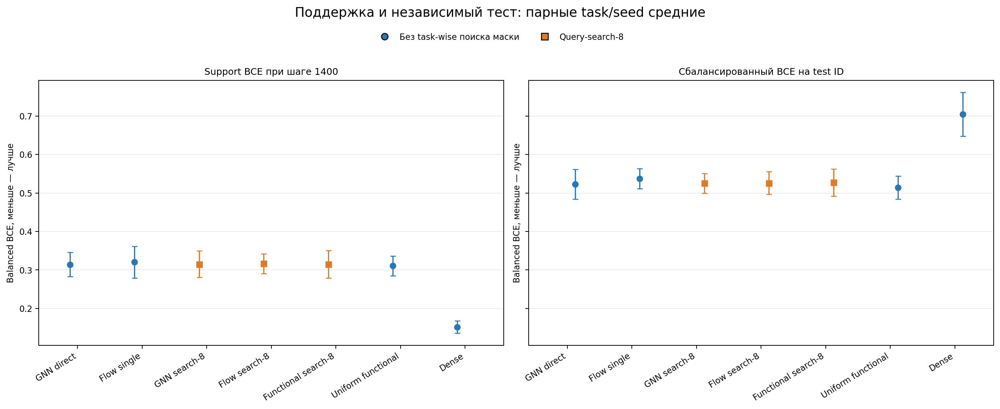
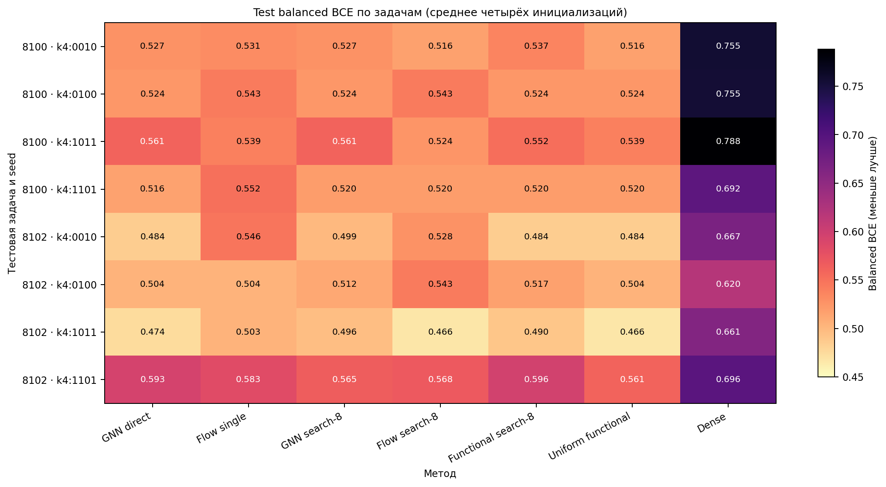
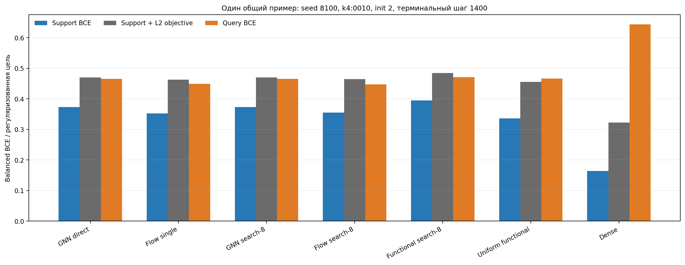
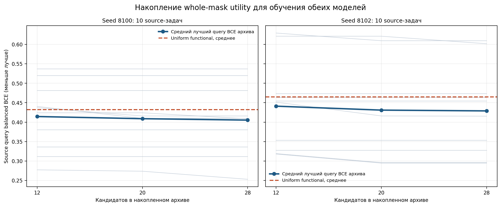
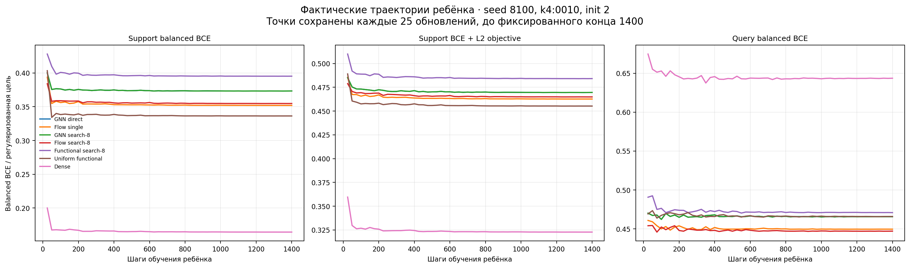
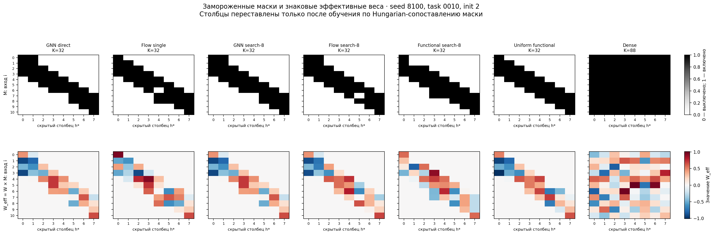
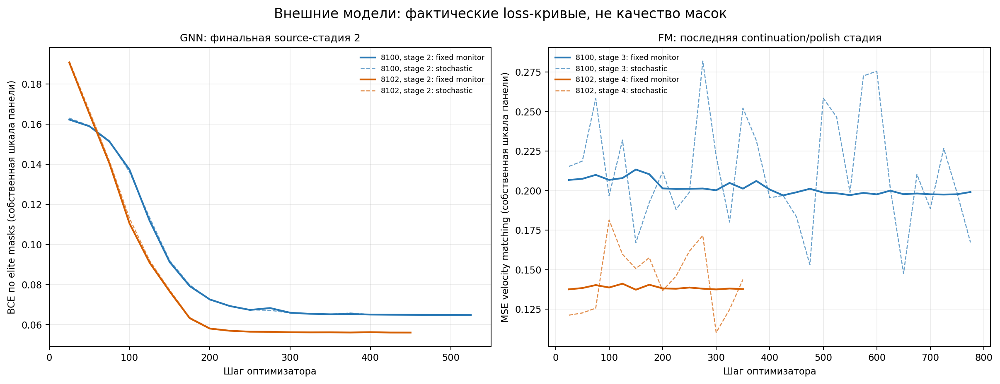

# Графовые маски и flow matching: короткое сравнение

## Результат

На восьми парных единицах «seed × тестовая задача» средний test balanced BCE ниже у **Uniform functional** (0.514); ниже — лучше. При этом преимущество невелико и описательное: двух seed-банков и одной орбиты из четырёх связанных паттернов недостаточно для вывода о переносе на новые орбиты. Ни один GNN/flow вариант не превзошёл среднюю маску `uniform_functional` по среднему test BCE. Flow search-8 улучшил flow single в среднем на 0.012 BCE, но остался выше uniform на 0.012. Сравнение масок показывает почти оконную структуру у графовых предложений, однако это не дало преимущества над уже хорошей функциональной средней.

Первичные числа — среднее сначала по четырём независимым финальным инициализациям ребёнка внутри задачи, затем по четырём test-паттернам и двум seed-банкам. Значения по seed приведены отдельно; статистические тесты не заявляются.

| Метод | Test balanced BCE, среднее | Seed 8100 | Seed 8102 | Категория |
|---|---:|---:|---:|---|
| GNN direct | 0.523 | 0.532 | 0.514 | support-only / fixed baseline |
| Flow single | 0.538 | 0.541 | 0.534 | support-only / fixed baseline |
| GNN search-8 | 0.525 | 0.533 | 0.518 | query-search |
| Flow search-8 | 0.526 | 0.526 | 0.526 | query-search |
| Functional search-8 | 0.527 | 0.533 | 0.522 | query-search |
| Uniform functional | 0.514 | 0.525 | 0.504 | support-only / fixed baseline |
| Dense | 0.704 | 0.747 | 0.661 | support-only / fixed baseline |

**Рис. 1.** По оси X — семь первичных методов; по оси Y — balanced BCE. Слева показан support BCE на терминальном шаге обучения ребёнка 1400, справа — BCE на независимых глобальных test ID. Синие круги обозначают предложения без task-wise query-поиска маски, оранжевые квадраты — search-8. Точка — среднее по задаче и четырём инициализациям; усики — описательное стандартное отклонение восьми task-seed средних, не доверительный интервал. Dense — обучаемый ребёнок со всеми 88 рёбрами.

**Рис. 2.** Строки — четыре test-паттерна для каждого из двух seed; столбцы — первичные методы; цвет и число показывают средний balanced BCE по четырём новым начальным весам ребёнка. Обратная шкала magma делает меньшие потери светлее. Эта разбивка показывает разницу между задачами, но четыре паттерна связаны одним симметрийным орбитальным классом.

## Что обучалось и как оценивалось

Для каждого seed использован существующий банк из 960 функциональных решений. Перед графовой моделью скрытые столбцы выровнены по центроидной функциональной сигнатуре. Узловой контекст содержит среднее и стандартное отклонение полного 187-мерного функционального профиля; учительский канал качества обнулён до pooling. Рёберный контекст собирает среднее/разброс `q_signed`, `q_abs`, `q_variance` и частоту включения ребра. Это явный prior от bank-функциональности. Сами банки ранее формировались с использованием source-query качества, поэтому `uniform_functional` — сильный prior-informed baseline, а не нейтральный нулевой ориентир.

Кандидаты — целые бинарные маски с ровно 32 рёбрами. Для utility каждое предложение оценивалось реальным переобучением свежего ребёнка; GNN и FM получили один и тот же архив из четырёх различных лучших целых масок на source-задачу, взвешенный source-query BCE. GNN учился предсказывать маски через BCE; FM учился velocity matching от независимого гауссовского шума к endpoint со значениями $\{-1,+1\}$. Золотые четырёхрёберные окна используются только в пост-хок структурном аудите; $U$ не участвовала в обучении. Straight-through градиенты не использовались.

FM обучался на прямом независимом гауссовском coupling:

$$
x_t=(1-t)\epsilon+t z,\qquad v^*=z-\epsilon,\qquad
\mathcal{L}_{FM}=\mathbb{E}\left[\|v_\theta(x_t,t,c)-v^*\|_2^2\right],
\quad z\in\{-1,+1\}^{11\times8}.
$$

Для методов с search-8 query BCE выбирал кандидата среди восьми слотов по двум парным seed-и детям с init 0 и 1; слоты не гарантируют восемь различных масок из-за точных дубликатов. На test-задачах число уникальных масок составляло 3–8 для GNN, 4–8 для FM и 5–8 для functional search-8. Выбранную маску заново оценивали четырьмя независимыми весовыми инициализациями init 2–5. В одиночных методах кандидат не выбирался по task query. Финальные дети всех методов оптимизировали одинаково: Adam, $1400$ фиксированных шагов, $\mathrm{lr}=0.1$, $\lambda_{L2}=0.01$, с использованием support. Test BCE вычислялся по отдельным ID; test-метки не участвовали в выборе масок или весовых checkpoint-ов.

На конкретном общем примере различаются support BCE, регуляризованная цель и query BCE при шаге 1400:

**Рис. 5.** По оси X — семь методов; по оси Y — значения loss для seed 8100, задачи `k4:0010`, init 2. Синие, серые и оранжевые столбцы — соответственно balanced BCE на support, objective `support BCE + L2`, и balanced BCE на задаче query. Query здесь относится к разрешённому candidate-selection набору, а не к независимым финальным test ID. Значения сняты с сохранённой истории на шаге 1400; по этому query не выбирался финальный весовой checkpoint.

Архив начинался с 12 масок на source-задачу и пополнялся двумя раундами по 8 цельных предложений, всего 28. На графике ниже сравниваются лучшая накопленная query utility и uniform mask на том же source-query наборе:

**Рис. 6.** По оси X — накопленные префиксы из 12, 20 и 28 whole-mask кандидатов; по оси Y — source-query balanced BCE, усреднённый по двум child-инициализациям. Тонкие серые линии показывают десять source-задач, синяя — средний минимум среди всех кандидатов в префиксе, пунктир — средний uniform-functional кандидат. Архивы вложены, поэтому лучшая source-query utility не может ухудшаться с добавлением кандидатов. Это training/selection objective для elite labels, не оценка обобщения.

- seed 8100: средний лучший source-query BCE после 12/20/28 масок 0.414, 0.409, 0.405; uniform — 0.432.
- seed 8102: средний лучший source-query BCE после 12/20/28 масок 0.441, 0.431, 0.429; uniform — 0.465.

Для того же ребёнка сохранённая история показывает ход оптимизации до фиксированного конца:

**Рис. 7.** Ось X — шаг ребёнка от 25 до 1400; точки истории записывались раз в 25 шагов. Три панели показывают support balanced BCE, сумму support BCE и L2-штрафа и query balanced BCE для seed 8100, `k4:0010`, init 2; цвет обозначает метод. Кривые относятся к одному выбранному ребёнку на метод и описывают его конечный оптимизационный запуск, не распределение по четырём инициализациям и не внешнее обучение GNN/FM. Финальный checkpoint у всех методов взят после 1400 шагов.

## Структура сохранённых масок и веса ребёнка

Визуализация использует ровно сохранённые маски и обученные signed first-layer веса для seed 8100, `k4:0010`, init 2. Показан $W_{eff}=W\odot M$. Чтобы сопоставить столбцы только для анализа, Hungarian-назначение вычислялось по пересечению бинарной маски с каноническими четырёхрёберными окнами; та же перестановка применена к $M$ и $W_{eff}$. Gold-маска не строила ни одной кандидатной маски и не входила в обучение. Подробные записи по всем сохранённым финальным детям находятся в `structure.json`.

**Рис. 3.** Две строки по семь панелей: сверху — бинарная маска, снизу — фактический $W_{eff}$. Ось Y — входная позиция $i=0\dots10$, ось X — постфактум сопоставленный скрытый столбец $h^*$. Верхняя шкала: белый — выключено, чёрный — включено; нижняя RdBu_r: красный — положительный вес, синий — отрицательный, белый около нуля; шкала общая для семи методов этого примера. У шестёрки разреженных методов $K=32$, у dense $K=88$. При полной dense-маске Hungarian-перестановка неоднозначна: все назначения имеют одинаковое пересечение, поэтому порядок её столбцов для сравнения весов условен. Пример иллюстрирует сохранённые параметры, но не является выборкой для оценки среднего качества.

В структурном аудите на четырёх test-контекстах восстановлена почти оконная поддержка: GNN direct имеет средний post-hoc IoU 8100: IoU 0.9545, 1/4 точных, 4 разных масок, 8102: IoU 0.9554, 2/4 точных, 3 разных масок; flow search-8 — 8100: IoU 0.9545, 1/4 точных, 8102: IoU 0.9545, 1/4 точных. Uniform functional даёт 8100: 4/4 точных контекста, 1 уникальная маска, 8102: 4/4 точных контекста, 1 уникальная маска. Для uniform одна bank-маска повторяется по четырём задачам каждого seed: это две независимые bank-маски, а не восемь независимых восстановлений. Оконная структура GNN/flow не даёт выигрыша по child utility относительно функциональной средней.

## Оптимизация внешней модели и результаты дополнительного dense контроля

**Рис. 4.** По оси X — шаг внешнего оптимизатора; по оси Y — сохранённая stochastic loss (пунктир) и loss на одном фиксированном noise/time мониторинге (сплошная). Цвета различают seed 8100 и 8102. Левый panel — GNN stage 2 с BCE; справа последние FM продолжения: stage 3 у seed 8100 и stage 4 у seed 8102 с velocity-MSE. Масштабы panel-ов различны, значения между GNN и FM напрямую не сравниваются. Плато — эмпирический мониторный критерий, а не гарантия глобальной сходимости.

В основном запуске plateau-флаг отмечен у 1120/1120 source candidate fits, 576/576 search-selection fits и 336/336 финальных детей (включая validation и test). Все четыре замороженные финальные GNN/FM-модели также остановились по plateau-критерию. Промежуточные FM-стадии, достигшие cap, сохранены отдельно: начальные FM-стадии были ограничены 600 шагами; финальное продолжение seed 8102 достигло cap 1200 и было дополнено ограниченным polish на 350 шагах. Флаг сообщает только о выполнении заданной эмпирической проверки на фиксированных конечных данных.

Зафиксированное время: seed 8100: source 102.6 с, candidate evaluation 21.4 с; seed 8102: source 100.6 с, candidate evaluation 19.7 с. Эти значения — длительность конкретных CPU/GPU запусков из run summaries, не оценка алгоритмической сложности.

Дополнительный dense strength control был запущен **после просмотра первичных test результатов** и потому помечен exploratory. Для каждого seed на двух meta-validation паттернах сравнивались 12 сочетаний `lr × L2` (4 learning rate × 3 коэффициента). Общий выбранный конфиг — `lr=0.1`, `L2=0.01`; test не использовался при выборе. В сетке из 12 сочетаний plateau достигнут в 175/192 запусков; 17 конфигурационных запусков достигли ограничения по шагам и не оказались выбранными. Финальные dense fits достигли plateau в 32/32 случаях; оба правила выбора checkpoint используют эти же fits. В следующей таблице приведены усреднённые по двум seed meta-validation terminal-query и trajectory-best-query значения, не test scores:

| lr | L2 | Meta-val terminal query BCE | Meta-val trajectory-best query BCE | |
|---:|---:|---:|---:|---|
| 0.003 | 0.0001 | 0.421 | 0.368 |  |
| 0.003 | 0.001 | 0.409 | 0.365 |  |
| 0.003 | 0.01 | 0.367 | 0.362 |  |
| 0.01 | 0.0001 | 0.691 | 0.379 |  |
| 0.01 | 0.001 | 0.487 | 0.375 |  |
| 0.01 | 0.01 | 0.364 | 0.351 |  |
| 0.03 | 0.0001 | 0.806 | 0.431 |  |
| 0.03 | 0.001 | 0.491 | 0.396 |  |
| 0.03 | 0.01 | 0.346 | 0.342 |  |
| 0.1 | 0.0001 | 0.713 | 0.655 |  |
| 0.1 | 0.001 | 0.489 | 0.473 |  |
| 0.1 | 0.01 | 0.330 | 0.317 | **выбран** |

Отдельная test-оценка двух dense протоколов:

| Dense variant | Test balanced BCE, среднее | Seed 8100 | Seed 8102 |
|---|---:|---:|---:|
| dense_tuned_query | 0.693 | 0.727 | 0.659 |
| dense_tuned_support | 0.704 | 0.747 | 0.661 |

`dense_tuned_support` использует terminal support-trained weights; `dense_tuned_query` выбирает trajectory checkpoint по task query и поэтому не сопоставим с фиксированным primary протоколом выбора весов. Оба значения — дополнительная диагностика dense baseline, не доказательство сильного dense решения: всего два однородных meta-validation паттерна, малое число банков, и короткий fixed-1400 протокол отличается от прежнего long/query-best baseline.

В primary test среднем порядок таков: uniform functional — 0.514, GNN direct — 0.523, GNN search-8 — 0.525, flow search-8 — 0.526, functional search-8 — 0.527, flow single — 0.538, dense — 0.704. Flow search-8 ниже flow single, но выше uniform. По task-level среднему flow-search против uniform: k4:0010: Δ=+0.022; k4:0100: Δ=+0.029; k4:1011: Δ=-0.007; k4:1101: Δ=+0.004. Это не подтверждает общее преимущество learned GNN/flow proposal над prior-informed functional baseline.

## Ограничения

- Всего два source seed-банка и четыре test паттерна на seed; тестовые паттерны образуют одну орбиту при обращении и дополнении последовательности. Не измеряется перенос на независимые task-орбиты.
- Не приводятся формальные p-values или доверительные интервалы для обобщения: восемь task-seed средних здесь служат только описанием.
- Functional bank уже query-curated; centroid alignment и функциональные q-признаки — заметный структурный prior. Сравнение не является тестом инвариантности всей предобработки к перестановкам банковских столбцов.
- Dense hyperparameter tuning — отдельная post-hoc exploratory проверка после просмотра первичного результата; её test-показатели следует читать отдельно.
- Успешное воспроизведение окна после post-hoc alignment не означает, что модель обнаружила неизвестную причинную структуру или улучшила результат переобучения ребёнка.

Машиночитаемые данные для построения графиков сохранены в `plot_arrays.npz`; сводка протокола и результатов — в `summary.json`; подробная post-hoc масочная/весовая структура — в `structure.json`.
